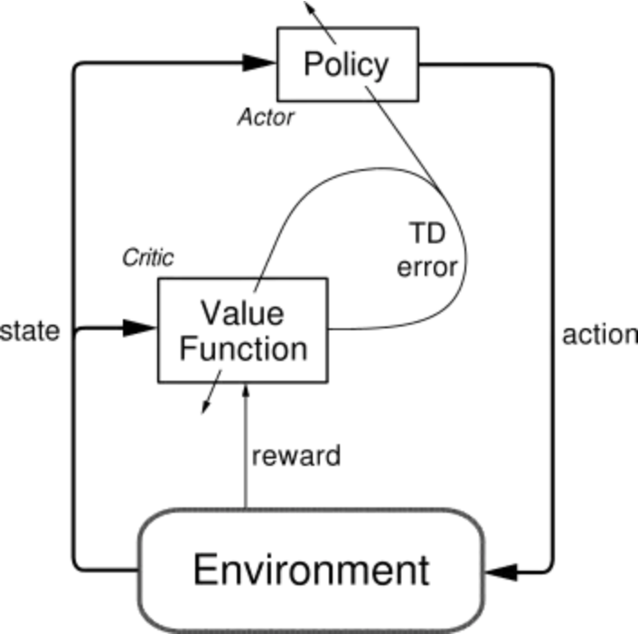
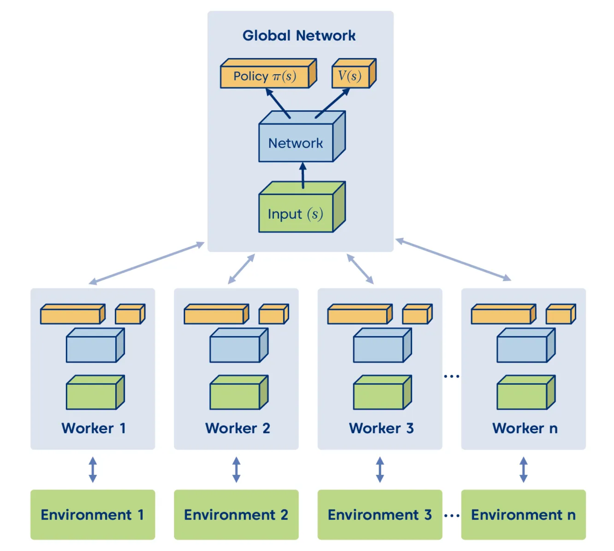
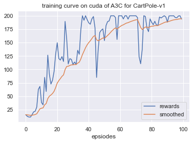

# 第 10 章 Actor-Critic 算法

$\qquad$ 在策略梯度的章节中，实际上我们已经开了一部分 $\text{Actor-Critic}$ 算法的头了，本章我们将继续深入探讨 $\text{Actor-Critic}$ 算法。

## 10.1 策略梯度算法的缺点

$\qquad$ 这里策略梯度算法特指蒙特卡洛策略梯度算法，即 $\text{REINFORCE}$ 算法。 相比于 $\text{DQN}$ 之类的基于价值的算法，策略梯度算法有以下优点。

* **适配连续动作空间**。在将策略函数设计的时候我们已经展开过，这里不再赘述。
* **适配随机策略**。由于策略梯度算法是基于策略函数的，因此可以适配随机策略，而基于价值的算法则需要一个确定的策略。此外其计算出来的策略梯度是无偏的，而基于价值的算法则是有偏的。

$\qquad$ 但同样的，策略梯度算法也有其缺点。

* **采样效率低**。由于使用的是蒙特卡洛估计，与基于价值算法的时序差分估计相比其采样速度必然是要慢很多的，这个问题在前面相关章节中也提到过。
* **高方差**。虽然跟基于价值的算法一样都会导致高方差，但是策略梯度算法通常是在估计梯度时蒙特卡洛采样引起的高方差，这样的方差甚至比基于价值的算法还要高。
* **收敛性差**。容易陷入局部最优，策略梯度方法并不保证全局最优解，因为它们可能会陷入局部最优点。策略空间可能非常复杂，存在多个局部最优点，因此算法可能会在局部最优点附近停滞。
* **难以处理高维离散动作空间**：对于离散动作空间，采样的效率可能会受到限制，因为对每个动作的采样都需要计算一次策略。当动作空间非常大时，这可能会导致计算成本的急剧增加。

$\qquad$ 结合了策略梯度和值函数的 $\text{Actor-Critic}$ 算法则能同时兼顾两者的优点，并且甚至能缓解两种方法都很难解决的高方差问题。可能读者会奇怪为什么各自都有高方差的问题，结合了之后反而缓解了这个问题呢？我们再仔细分析一下两者高方差的根本来源，策略梯度算法是因为直接对策略参数化，相当于既要利用策略去与环境交互采样，又要利用采样去估计策略梯度，而基于价值的算法也是需要与环境交互采样来估计值函数的，因此也会有高方差的问题。

$\qquad$ 而结合之后呢，$\text{Actor}$ 部分还是负责估计策略梯度和采样，但 $\text{Critic}$ 即原来的值函数部分就不需要采样而只负责估计值函数了，并且由于它估计的值函数指的是策略函数的值，相当于带来了一个更稳定的估计，来指导 $\text{Actor}$ 的更新，反而能够缓解策略梯度估计带来的方差。当然尽管 $\text{Actor-Critic}$ 算法能够缓解方差问题，但并不能彻底解决问题，在接下来的章节中我们也会展开介绍一些改进的方法。

## 10.2 Q Actor-Critic 算法

$\qquad$ 在策略梯度章节中，我们其实已经对 $\text{Actor-Critic}$ 算法的目标函数进行过推导了，这里就不详细展开，只是简单回顾一下目标函数，如式 $\text(10.1)$ 所示。

$$
\tag{10.1}
\begin{aligned}
\nabla_\theta J(\theta) \propto \mathbb{E}_{\pi_{\theta}}\left[Q^\pi(s, a) \nabla_\theta \log \pi_\theta(a \mid s)\right]
\end{aligned}
$$

$\qquad$ 在 $\text{REINFORCE}$ 算法中，我们使用蒙特卡洛估计来表示当前状态-动作对 $(s_t,a_t)$ 的价值。而这里其实可以类比于 $Q$ 函数，用 $Q^\pi(s_t, a_t)$ 来估计当前的价值，注意这里的输入是状态和动作，而不单单是状态，输出的是单个值，也可以用 $Q_{\phi}(s_t, a_t)$ 表示，其中 $\phi$ 表示 $\text{Critic}$ 网络的参数。这样我们就可以将目标函数写成如式 $\text(10.2)$ 所示的形式。

$$
\tag{10.2}
\begin{aligned}
\nabla_\theta J(\theta) \propto \mathbb{E}_{\pi_{\theta}}\left[Q_{\phi}(s_t, a_t) \nabla_\theta \log \pi_\theta(a_t \mid s_t)\right]
\end{aligned}
$$

$\qquad$ 这样的算法通常称之为 $\text{Q Actor-Critic}$ 算法，这也是最简单的 $\text{Actor-Critic}$ 算法，现在我们一般都不用这个算法了，但是这个算法的思想是很重要的，因为后面的算法都是在这个算法的基础上进行改进的。

$\qquad$ 如图 $\text{10.1}$ 所示，我们通常将 $\text{Actor}$ 和 $\text{Critic}$ 分别用两个模块来表示，即图中的 策略函数（ $\text{Policy}$ ）和价值函数（ $\text{Value Function}$ ）。$\text{Actor}$ 与环境交互采样，然后将采样的轨迹输入 $\text{Critic}$ 网络，$\text{Critic}$ 网络估计出当前状态-动作对的价值，然后再将这个价值作为 $\text{Actor}$ 网络的梯度更新的依据，这也是所有 $\text{Actor-Critic}$ 算法的基本通用架构。

<div align=center>

</div>
<div align=center>图 $\text{10.1}$ $\text{Actor-Critic}$ 算法架构</div>

## 10.3 A2C 与 A3C 算法

$\qquad$ 我们知道 $\text{Actor-Critic}$ 架构是能够缓解策略梯度算法的高方差问题的，但是并不能彻底解决问题。为了进一步缓解高方差问题，我们引入一个优势函数（ $\text{advantage function}$ ）$A^\pi(s_t, a_t)$，用来表示当前状态-动作对相对于平均水平的优势，即式 $\text(10.3)$ 。

$$
\tag{10.3}
\begin{aligned}
A^\pi(s_t, a_t) = Q^\pi(s_t, a_t) - V^\pi(s_t)
\end{aligned}
$$

$\qquad$ 这里优势函数相当于减去了一个基线，这个基线可以自由设计，但是通常我们会选择状态价值函数 $V^\pi(s_t)$ 作为基线，减去这个基线会让梯度估计更稳定。有读者可能会奇怪，减去基线真的能减少方差吗？比如 $\{1,2,3\}$ 这个数列，都减去均值 $2$ 之后的数列 $\{-1,0,1\}$ 的方差不还是一样约等于 $0.67$ 吗? 这里其实犯了一个错误，就是我们讲的基线是指在同一个状态下的基线，而不是在整个数列上的均值，这里的基线是指 $V^\pi(s_t)$，而不是 $V^\pi(s)$ 的均值。

$\qquad$ 另一方面来讲，优势函数可以理解为在给定状态 $s_t$ 下，选择动作 $a_t$ 相对于平均水平的优势。如果优势为正，则说明选择这个动作比平均水平要好，反之如果为负则说明选择这个动作比平均水平要差。换句话说，原先对于每一个状态-动作对只能以自己为参照物估计，现在可以平均水平为参照物估计了，这样就能减少方差。

$\qquad$ 这就好比我们练习马拉松，原先的做法是我们只关注于每天跑了多少，并不知道之前几天跑了多少，这很容易导致我们盲目追求每天跑动的距离，而忽略了自己的身体状况，导致受伤，也就得到了一个较差的跑步策略。而引入优势函数之后我们就可以知道之前几天的平均跑步距离，这样就能更好的控制自己的身体状况，避免受伤，并且更好地达到马拉松的目标。

$\qquad$ 有了优势函数之后，我们就可以将目标函数写成式 $\text(10.4)$ 的形式。

$$
\tag{10.4}
\begin{aligned}
\nabla_\theta J(\theta) \propto \mathbb{E}_{\pi_{\theta}}\left[A^\pi(s_t, a_t) \nabla_\theta \log \pi_\theta(a_t \mid s_t)\right]
\end{aligned}
$$

$\qquad$ 这就是 $\text{Advantage Actor-Critic}$ 算法，通常简称为 $\text{A2C}$ 算法。然而 $\text{A2C}$ 算法并不是由一篇单独的论文提出来的，而是在异步形式的 $\text{A2C}$ 算法（ $\text{asynchronous advantage actor-critic，A3C}$ ）的论文中提出来的。它在算法原理上跟 $\text{A2C}$ 算法是一模一样的，只是引入了多进程的概念提高了训练效率。

$\qquad$ 如图 $\text{10.2}$ 所示，原先的 $\text{A2C}$ 算法相当于只有一个全局网络并持续与环境交互更新。而 $\text{A3C}$ 算法中增加了多个进程，每一个进程都拥有一个独立的网络和环境以供交互，并且每个进程每隔一段时间都会将自己的参数同步到全局网络中，这样就能提高训练效率。这种训练模式也是比较常见的多进程训练模式，也能用于其他算法中，也包括前面讲到的基于价值的算法。

<div align=center>

</div>
<div align=center>图 $\text{10.2}$ $\text{A3C}$ 算法架构</div>

## 10.4 广义优势估计

$\qquad$ 上一小节中，我们通过引入优势函数来缓解梯度估计带来的高方差问题，但由于优势函数通本质上来说还是使用蒙特卡洛估计，因此尽管减去了基线，有时候还是会产生高方差，从而导致训练过程不稳定。这时候有读者可能会想到一句话，即“知识一般是通过螺旋式的规律来学习的，也是会螺旋式升级的”，这句话的意思是我们在学某些知识时可能不会马上用到，但是会暂时埋下一个种子，等到后面深入使用的时候会回忆起来并且加深相关知识的理解。当然这句话不是某个名人说的，而是笔者自己总结出来，也是想传达给读者的学习思路。

$\qquad$ 回到正题，既然蒙特卡洛估计一定会带来高方差问题，那么读者可能回到想到前面章节中在讲到蒙特卡洛和时序差分方法的差异时，会发现这两个方法是互补的，时序差分能有效解决高方差问题但是是有偏估计，而蒙特卡洛是无偏估计但是会带来高方差问题，因此通常会结合这两个方法形成一种新的估计方式，即 $\text{TD}(\lambda)$ 估计。类似地，在这里我们也可以引入 $\lambda$ ，结合多步（ $\text{n-step}$ ）的折扣回报来改进优势函数，形成一种新的估计方式，我们称之为广义优势估计（ $\text{generalized advantage estimation，GAE}$ ），其形式如式 $\text(10.5)$ 所示。

$$
\tag{10.5}
\begin{aligned}
A^{\mathrm{GAE}(\gamma, \lambda)}(s_t, a_t) &= \sum_{l=0}^{\infty}(\gamma \lambda)^l \delta_{t+l} \\
&= \sum_{l=0}^{\infty}(\gamma \lambda)^l \left(r_{t+l} + \gamma V^\pi(s_{t+l+1}) - V^\pi(s_{t+l})\right)
\end{aligned}
$$

其中 $\delta_{t+l}$ 表示时间步 $t+l$ 时的 $\text{TD}$ 误差，如式 $\text(10.6)$ 所示。

$$
\tag{10.6}
\begin{aligned}
\delta_{t+l} = r_{t+l} + \gamma V^\pi(s_{t+l+1}) - V^\pi(s_{t+l})
\end{aligned}
$$

$\qquad$ 当 $\lambda = 0$ 时，GAE 退化为单步 $\text{TD}$ 误差，如式 $\text(10.7)$ 所示。

$$
\tag{10.7}
\begin{aligned}
A^{\mathrm{GAE}(\gamma, 0)}(s_t, a_t) = \delta_t = r_t + \gamma V^\pi(s_{t+1}) - V^\pi(s_t)
\end{aligned}
$$

$\qquad$ 当 $\lambda = 1$ 时，$\text{GAE}$ 退化为蒙特卡洛估计，如式 $\text(10.8)$ 所示。

$$
\tag{10.8}
\begin{aligned}
A^{\mathrm{GAE}(\gamma, 1)}(s_t, a_t) = \sum_{l=0}^{\infty}(\gamma \lambda)^l \delta_{t+l} = \sum_{l=0}^{\infty}(\gamma)^l \delta_{t+l}
\end{aligned}
$$

$\qquad$ 如何选择合适的 $\lambda$ 还请读者回看前面时序差分的相关章节内容，这里就不再赘述。到这里，我们就将 $\text{Actor-Critic}$ 算法的基本原理讲完了，注意广义优势估计并不是 $\text{Actor-Critic}$ 算法的必要组成部分，只是一种改进的方法。相反地，它更像是一种通用的模块，在实践中可以用在任何需要估计优势函数的地方，比如后面章节要讲的 $\text{PPO}$ 算法中就用到了这种估计方法。

## 10.5 实战：A2C 算法

### 10.5.1 定义模型

$\qquad$ 通常来讲，$\text{Critic}$ 的输入是状态，输出则是一个维度的价值，而 $\text{Actor}$ 输入的也会状态，但输出的是概率分布，因此我们可以定义两个网络，如代码清单 $\text{10-1}$ 所示。

<div style="text-align: center;">
    <figcaption> 代码清单 $\text{10-1}$ 实现 $\text{Actor}$ 和 $\text{Critic}$ </figcaption>
</div>

```python
class Critic(nn.Module):
    def __init__(self,state_dim):
        self.fc1 = nn.Linear(state_dim, 256)
        self.fc2 = nn.Linear(256, 256)
        self.fc3 = nn.Linear(256, 1)
    def forward(self, x):
        x = F.relu(self.fc1(x))
        x = F.relu(self.fc2(x))
        value = self.fc3(x)
        return value

class Actor(nn.Module):
    def __init__(self, state_dim, action_dim):
        self.fc1 = nn.Linear(state_dim, 256)
        self.fc2 = nn.Linear(256, 256)
        self.fc3 = nn.Linear(256, action_dim)
    def forward(self, x):
        x = F.relu(self.fc1(x))
        x = F.relu(self.fc2(x))
        logits_p = F.softmax(self.fc3(x), dim=1)
        return logits_p
```

$\qquad$ 这里由于是离散的动作空间，根据在策略梯度章节中设计的策略函数，我们使用了 $\text{softmax}$ 函数来输出概率分布。另外，实践上来看，由于 $\text{Actor}$ 和 $\text{Critic}$ 的输入是一样的，因此我们可以将两个网络合并成一个网络，以便于加速训练。这有点类似于 $\text{Duelling DQN}$ 算法中的做法，如代码清单 $\text{10-2}$ 所示。

<div style="text-align: center;">
    <figcaption> 代码清单 $\text{10-2}$ 实现合并的 $\text{Actor}$ 和 $\text{Critic}$ </figcaption>
</div>

```python
class ActorCritic(nn.Module):
    def __init__(self, state_dim, action_dim):
        self.fc1 = nn.Linear(state_dim, 256)
        self.fc2 = nn.Linear(256, 256)
        self.action_layer = nn.Linear(256, action_dim)
        self.value_layer = nn.Linear(256, 1)
    def forward(self, x):
        x = F.relu(self.fc1(x))
        x = F.relu(self.fc2(x))
        logits_p = F.softmax(self.action_layer(x), dim=1)
        value = self.value_layer(x)
        return logits_p, value
```

$\qquad$ 注意当我们使用分开的网络时，我们需要在训练时分别更新两个网络的参数，即需要两个优化，而使用合并的网络时则只需要更新一个网络的参数即可。

### 10.5.2 动作采样

$\qquad$ 与 $\text{DQN}$ 算法不同等确定性策略不同，$\text{A2C}$ 的动作输出不再是 $Q$ 值最大对应的动作，而是从概率分布中采样动作，这意味着即使是很小的概率，也有可能被采样到，这样就能保证探索性，如代码清单 $\text{10-3}$ 所示。

<div style="text-align: center;">
    <figcaption> 代码清单 $\text{10-3}$ 采样动作 </figcaption>
</div>

```python
from torch.distributions import Categorical
class Agent:
    def __init__(self):
        self.model = ActorCritic(state_dim, action_dim)
    def sample_action(self,state):
        '''动作采样函数
        '''
        state = torch.tensor(state, device=self.device, dtype=torch.float32)
        logits_p, value = self.model(state)
        dist = Categorical(logits_p) 
        action = dist.sample() 
        return action
```

$\qquad$ 注意这里直接利用了 `PyTorch` 中的 `Categorical` 分布函数，这样就能直接从概率分布中采样动作了。

### 10.5.3 策略更新

$\qquad$ 我们首先需要计算出优势函数，一般先计算出回报，然后减去网络输出的值即可，如代码清单 $\text{10-4}$ 所示。

<div style="text-align: center;">
    <figcaption> 代码清单 $\text{10-4}$ 计算优势函数 </figcaption>
</div>

```python
class Agent:
    def _compute_returns(self, rewards, dones):
        returns = []
        discounted_sum = 0
        for reward, done in zip(reversed(rewards), reversed(dones)):
            if done:
                discounted_sum = 0
            discounted_sum = reward + (self.gamma * discounted_sum)
            returns.insert(0, discounted_sum)
        # 归一化
        returns = torch.tensor(returns, device=self.device, dtype=torch.float32).unsqueeze(dim=1)
        returns = (returns - returns.mean()) / (returns.std() + 1e-5) # 1e-5 to avoid division by zero
        return returns
    def compute_advantage(self):
        '''计算优势函数
        '''
        logits_p, states, rewards, dones = self.memory.sample()
        returns = self._compute_returns(rewards, dones)
        states = torch.tensor(states, device=self.device, dtype=torch.float32)
        logits_p, values = self.model(states)
        advantages = returns - values
        return advantages
```

$\qquad$ 这里我们使用了一个技巧，即将回报归一化，这样可以让优势函数的值域在 $[-1,1]$ 之间，这样可以让优势函数更稳定，从而减少方差。计算优势之后就可以分别计算 $\text{Actor}$ 和 $\text{Critic}$ 的损失函数了，如代码清单 $\text{10-5}$ 所示。

<div style="text-align: center;">
    <figcaption> 代码清单 $\text{10-5}$ 计算损失函数 </figcaption>
</div>

```python
class Agent:
    def compute_loss(self):
        '''计算损失函数
        '''
        logits_p, states, rewards, dones = self.memory.sample()
        returns = self._compute_returns(rewards, dones)
        states = torch.tensor(states, device=self.device, dtype=torch.float32)
        logits_p, values = self.model(states)
        advantages = returns - values
        dist = Categorical(logits_p)
        log_probs = dist.log_prob(actions)
        # 注意这里策略损失反向传播时不需要优化优势函数，因此需要将其 detach 掉
        actor_loss = -(log_probs * advantages.detach()).mean() 
        critic_loss = advantages.pow(2).mean()
        return actor_loss, critic_loss
```

$\qquad$ 到这里，我们就实现了 $\text{A2C}$ 算法的所有核心代码，完整代码请读者参考本书的代码仓库。最后展示一下训练的效果，如图 $\text{10-3}$ 所示。


<div align=center>

</div>
<div align=center>图 $\text{10-3}$ $\text{CartPole}$ 环境 $\text{A2C}$ 算法训练曲线</div>

## 10.5 本章小结

$\qquad$ 本章主要介绍了 $\text{A2C}$ 与 $\text{A3C}$ 算法，相比于前一章讲的 $\text{REINFORCE}$ 算法，主要优化了 $\text{Critic}$ 部分的估计，提高了算法的收敛速度。并且通过引入异步训练的方式来进一步提高这类算法的收敛速度，实践中我们会用 $\text{multiprocessing}$ 等多进程模块来实现。

## 10.6 练习题

1. 相比于 $\text{REINFORCE}$ 算法， $\text{A2C}$ 主要的改进点在哪里，为什么能提高速度？
2. $\text{A2C}$ 算法是 $\text{on-policy}$ 的吗？为什么？