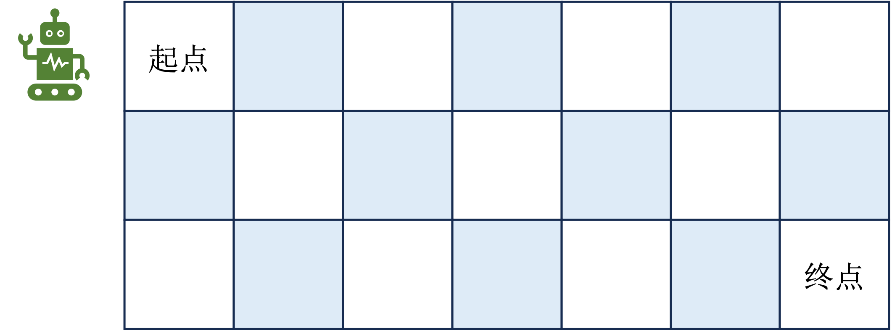

# 第3章 动态规划

$\qquad$ 前面我们讲到马尔可夫决策过程是强化学习中的基本问题模型之一，而解决马尔可夫决策过程的方法我们统称为强化学习算法。本章开始讲强化学习中最基础的算法之一，动态规划（ $\text{dynamic programming, DP}$ ）。动态规划其实并不是强化学习领域中独有的算法，它在数学、管理科学、经济学和生物信息学等其他领域都有广泛的应用。动态规划具体指的是在某些复杂问题中，将问题转化为若干个子问题，并在求解每个子问题的过程中保存已经求解的结果，以便后续使用。实际上动态规划更像是一种通用的思路，而不是具体某个算法。在强化学习中，动态规划被用于求解值函数和最优策略。常见的动态规划算法包括值迭代（$\text{value iteration, VI}$）、策略迭代（$\text{policy iteration, PI}$）和 $\text{Q-learning}$ 算法等。

## 3.1 动态规划的编程思想

$\qquad$ 动态规划其实是一个看起来好懂但实践起来很复杂的概念，为了帮助读者理解，这里会举一道经典的面试编程题<sup>①</sup>作为示例。

<div align=center>

</div>
<div align=center>图 3.1 路径之和</div>

> ① 数据来源，[62. 不同路径](https://leetcode.cn/problems/unique-paths/)

$\qquad$ 如图 $\text{3.1}$ 所示，一个机器人位于一个 $m \times n$ 网格的左上角 （起始点在下图中标记为 “Start” ）。机器人每次只能向下或者向右移动一步。机器人试图达到网格的右下角即终点（在下图中标记为 “Finish” ）。我们需要解决的问题是在这个过程中机器人可以有多少条不同的路径到达终点。

$\qquad$ 这种问题有很多的解法，比如可以直接数出来有多少不同的路径，但当 $m$ 和 $n$ 很大时这种直接计数法就不太适用了。我们讲一讲动态规划的做法，动态规划的解法主要有几个步骤：确定状态，写出状态转移方程和寻找边界条件。

$\qquad$ 在这个例题中我们首先可以定一个 $f(i,j)$ ，表示从左上角即坐标为 $(0,0)$ 到坐标 $(i,j)$ 的路径数量，其中 $i \in [0,m)$ 以及$j \in [0,n)$。由于机器人只能向右或者向下走，所以当机器人处于 $(i,j)$ 的位置时，它的前一个坐标只能是上边一格 $(i,j-1)$ 或者左边一格 $(i-1,j)$ ，这样一来就能建立出一个状态之间的关系，如式 $\text(3.1)$ 所示。

$$
\tag{3.1}
f(i,j) = f(i-1,j) + f(i,j-1)
$$

$\qquad$ 即走到当前位置 $(i,j)$ 的路径数量等于走到前一个位置 $(i,j-1)$ 和 $(i-1,j)$ 的所有路径之和，这个就是状态转移方程。

$\qquad$ 此外我们需要考虑一些边界条件，因为在状态转移方程中 $i$ 和 $j$ 是不能等于 $0$ 的，比如都等于$0$的时候会出现 $f(0,0)+f(-1,0)+f(0,-1)$ ，$f(-1,0)$ 或者 $f(0,-1)$ 在本题中是没有意义的，因此我们需要额外判断 $i$ 和 $j$ 等于 $0$ 的情况。如图 $3.2$ 所示，首先我们考虑 $i=0,j=0$ 的情况，即 $f(0,0)$ ，显然此时机器人在起始点，从起始点到起始点 $(0,0)$ 对应的路径数量必然是 $1$ ，对于 $i\neq0,j=0$ ，此时机器人会一直沿着网格左边沿往下走，这条路径上的所有 $f(i,j)$ 也都会是 $1$ ，$i=0,j\neq0$ 的情况同理。

<div align=center>

</div>
<div align=center>图 $3.2$ 路径之和解析</div>

$\qquad$ 因此我们的状态转移方程可以完善为：

$$
f(i,j)=\left\{\begin{array}{c}
0, i=0, j=0 \\
1, i=0, j \neq 0 \\
1, i \neq 0, i=0 \\
f(i-1,j) + f(i,j-1)
\end{array}\right.
$$

$\qquad$ 这样一来我们可以写出代码如下：

```python
def solve(m,n):
    # 初始化边界条件
    f = [[1] * n] + [[1] + [0] * (n - 1) for _ in range(m - 1)] 
    # 状态转移
    for i in range(1, m):
        for j in range(1, n):
            f[i][j] = f[i - 1][j] + f[i][j - 1]
    return f[m - 1][n - 1]
```

$\qquad$ 最后能解出来当 $m=7,n=3$ 时一共有 $28$ 种不同的路径。

$\qquad$ 讲到这里读者可能对动态规划的思想还是不够深入，但没有关系，只需要有一个大概的认知即可。接下来要说的是为什么动态规划能够用于解决强化学习问题。其实一般**动态规划问题有三个性质，最优化原理、无后效性和有重叠子问题**。其中有重叠子问题不是动态规划问题的必要条件，这里就不展开叙述。无后效性指的是即某阶段状态一旦确定，就不受这个状态以后决策的影响。也就是说，某状态以后的过程不会影响以前的状态，只与当前状态有关，这其实就是前面所说的马尔可夫性质。而最优化原理是指，如果问题的最优解所包含的子问题的解也是最优的，就称该问题具有最优子结构，即满足最优化原理。马尔可夫决策过程的目标是最大化累积回报，回顾上一章讲到的回报公式：

$$
G_{t} = R_{t+1}+\gamma G_{t+1}
$$

$\qquad$ 这个公式表明当前时步的回报跟下一个时步的回报是有关系的，这跟机器人路径之和例题中的状态转移方程很像。换句话说，我们可以在不同时步上通过某种方法最大化对应时步的回报来解决马尔可夫决策问题，我们要解决$G_{t+1}$的问题，可以一次拆分成解决$G_{t}, G_{t-1},\cdots,G_{1}$的问题，这其实就满足动态规划性质中的最优化原理。综合以上两点，我们是可以利用动态规划的思想来解决强化学习问题的，至于具体怎么解决，且看后面讲解的价值迭代和策略迭代算法。

## 3.2 状态价值函数和动作价值函数

$\qquad$ 在讲策略迭代和价值迭代算法之前，我们需要先铺垫一些概念。

$\qquad$ 在马尔可夫决策过程中，每个状态是有一定的价值的，可以定义为：

$$
\begin{aligned}
V_\pi(s) &=\mathbb{E}_{\pi}[R_t+\gamma R_{t+1}+\gamma^2 R_{t+2} + \cdots |S_t=s ] \\
&=\mathbb{E}_{\pi}[G_t|S_t=s ] 
\end{aligned}
$$

$\qquad$ 这就是**状态价值函数（state-value function）**，从特定状态出发，按照某种策略$\pi$进行决策所能得到的回报期望值，注意这里的回报是带有折扣因子$\gamma$的。

$\qquad$ 另外引入动作的元素后会有一个 $Q$ 函数，也叫做 **动作价值函数（action-value function）**，即

$$
Q_\pi(s, a)=\mathbb{E}_\pi\left[G_t \mid s_t=s, a_t=a\right]
$$

$\qquad$ 不难理解动作价值函数和状态价值函数会有一个关系：

$$
V_\pi(s)=\sum_{a \in A} \pi(a \mid s) Q_\pi(s, a)
$$

$\qquad$ 其中$\pi(a|s)$表示策略函数，一般指在状态$s$下执行动作$a$的概率分布。这个公式的意思就是在给定状态$s$的情况下，智能体所有动作的价值期望（所有动作价值函数乘以对应动作的概率之和）就等于该状态的价值，这其实就是利用了数学中的**全期望公式**。

## 3.3 贝尔曼方程

$\qquad$ 类比于回报公式$G_{t} = R_{t+1}+\gamma G_{t+1}$，也可以对状态价值函数和动作价值函数做一个类似的推导，如下：

$$
\begin{aligned}
V_{\pi}(s) & =\mathbb{E}_{\pi}\left[G_t \mid S_t=s\right] \\
& =\mathbb{E}_{\pi}\left[R_{t+1}+\gamma R_{t+2}+\gamma^2 R_{t+3}+\cdots \mid S_t=s\right] \\
& =\mathbb{E}\left[R_{t+1} \mid s_t=s\right]+\gamma \mathbb{E}\left[R_{t+2}+\gamma R_{t+3}+\gamma^2 R_{t+4}+\cdots \mid S_t=s\right] \\
& =R(s)+\gamma \mathbb{E}\left[G_{t+1} \mid S_t=s\right] \\
& =R(s)+\gamma \mathbb{E}\left[V_{\pi}\left(s_{t+1}\right) \mid S_t=s\right] \\
& =R(s)+\gamma \sum_{s^{\prime} \in S} P\left(S_{t+1}=s^{\prime} \mid S_{t}=s\right) V_{\pi}\left(s^{\prime}\right)\\
& =R(s)+\gamma \sum_{s^{\prime} \in S} p\left(s^{\prime} \mid s\right) V_{\pi}\left(s^{\prime}\right)
\end{aligned}
$$

$\qquad$ 其中 $R(s)$ 表示奖励函数，$P(S_{t+1}=s^{\prime} \mid S_{t}=s)$就是前面讲的状态转移概率，习惯简写成$p\left(s^{\prime} \mid s\right)$，这就是**贝尔曼方程（Bellman Equation）**。贝尔曼方程的重要意义就在于前面所说的满足动态规划的最优化原理，即将前后两个状态之间联系起来，以便于递归地解决问题。

$\qquad$ 类似地，动作价值函数贝尔曼方程推导为：

$$
Q_{\pi}(s,a) = R(s,a) + \gamma \sum_{s^{\prime} \in S} p\left(s^{\prime} \mid s,a\right) \sum_{a^{\prime} \in A} \pi\left(a^{\prime} \mid s ^{\prime} \right)Q_{\pi}\left(s^{\prime},a'\right)
$$

$\qquad$ 前面我们提到状态价值函数的定义就是按照某种策略$\pi$进行决策得到的累积奖励(或者说回报)，换句话说，在最优策略下，状态价值函数也是最优的，相应的动作价值函数也最优。我们的目标是使得累积的回报最大化，那么最优策略下的状态价值函数可以表示为：

$$
\begin{aligned}
V^{*}(s)&=\max _a \mathbb{E}\left[R_{t+1}+\gamma V^{*}\left(S_{t+1}\right) \mid S_t=s, A_t=a\right] \\
&=\max_a \sum_{s',r}p(s',r|s,a)[r+\gamma V^{*}(s')] 
\end{aligned}
$$

$\qquad$ 这个公式叫做**贝尔曼最优方程（Bellman optimality equation）**，它对于后面要讲的策略迭代算法具有一定的指导意义。对于动作价值函数也是同理，如下：
$$
\begin{aligned}
Q^{*}(s, a) & =\mathbb{E}\left[R_{t+1}+\gamma \max _{a^{\prime}} Q^{*}\left(S_{t+1}, a^{\prime}\right) \mid S_t=s, A_t=a\right] \\
& =\sum_{s^{\prime}, r} p\left(s^{\prime}, r \mid s, a\right)\left[r+\gamma \max _{a^{\prime}} Q^{*}\left(s^{\prime}, a^{\prime}\right)\right]
\end{aligned}
$$


## 3.4 策略迭代

$\qquad$ 前面提到在最优策略$\pi^{*}$下，对应的状态和动作价值函数也都是最优的，即$V^{*}(s)$和$Q^{*}(s)$。但是实际求解中在优化策略的过程中，同时我们还需要优化状态和动作价值函数，这其实是一个多目标优化的问题。策略迭代算法的思路是分成两个步骤，首先固定策略$\pi$不变，然后估计对应的状态价值函数$V$，这一叫做**策略估计（policy evaluation）**。然后根据估计好的状态价值函数$V$结合策略推算出动作价值函数$Q$，并对 $Q$ 函数优化然后进一步改进策略，**这一步叫策略改进（policy improvement）**。在策略改进的过程中一般是通过贪心策略来优化的，即定义策略函数为：

$$
\pi(a|s) = \max _a Q(s,a)
$$

$\qquad$ 然后在策略改进时选择最大的$Q(s,a)$值来更新。在一轮策略估计和改进之后，又会进入新的一轮策略估计和改进，直到收敛为止。

$\qquad$ 如图 3.3 所示，图（a）描述了上面所说的策略估计和改进持续迭代的过程，图（b）则描述了在迭代过程中策略$\pi$和状态价值函数$V$最后会同时收敛到最优。

<div align=center>

</div>
<div align=center>图 3.3 策略迭代的收敛过程</div>

$\qquad$ 策略迭代算法伪代码如下：

<div align=center>

</div>
<div align=center>图 3.4 策略迭代算法伪代码</div>

## 3.5 价值迭代

$\qquad$ 价值迭代算法相对于策略迭代更加直接，它直接根据以下公式来迭代更新。

$$
V(s) \leftarrow \max _{a \in A}\left(R(s, a)+\gamma \sum_{s^{\prime} \in S} p\left(s^{\prime} \mid s, a\right) V\left(s^{\prime}\right)\right)
$$

$\qquad$ 价值迭代的伪代码如下：

<div align=center>

</div>
<div align=center>图 3.5 价值迭代算法伪代码</div>

$\qquad$ 它首先将所有的状态价值初始化，然后不停地对每个状态迭代，直到收敛到最优价值$V^{*}$，并且根据最优价值推算出最优策略$\pi^{*}$。这样其实更像是一个动态规划本身的思路，而不是强化学习的问题。这种情况下，其实比策略迭代算法要慢得多，尽管两种方法都需要多次遍历。但是在策略迭代算法中考虑了中间每个时步可能遇到的最优策略并及时加以改进，这意味着就算策略在早期并不完美（也许需要改进），策略迭代仍能够更快地接近最优解。

<div align=center>

</div>
<div align=center>图 3.4 策略迭代与价值迭代收敛过程的区别</div>

$\qquad$ 举一个例子，回顾一下策略迭代的收敛过程，如图 3.5 所示，我们知道策略迭代是不停地在$V$和$\pi$这两条线之间“跳变”直到收敛到$V^*$。这种“跳变”是几乎不需要花费时间的，它只是一个$\pi$与$V$互相推算的过程，通过一个公式就能得到，也就是策略估计和策略改进之间的切换过程。而在各自的线上，比如价值函数这条线从$V_1$到$V_2$这个点是需要更多时间的，这其实就是一个策略估计的过程，需要遍历到所有状态，在策略这条线上同理。而实际上$V_1$到$V_2$中间也可能存在更多个点，比如$V_{12}^{\prime},V_{12}^{\prime \prime},V_{12}^{\prime \prime \prime}$，每次在这些点之间移动是需要遍历所有的状态的，只是在策略迭代算法中借助了策略这条线跳过了中间的$V_{12}^{\prime},V_{12}^{\prime \prime},V_{12}^{\prime \prime \prime}$这些点，而在价值迭代算法的时候会经过价值这条线上的所有点，直到最优，从这个角度来看策略迭代算法是要比价值迭代更快的。

## 3.6 本章小结

$\qquad$ 本章主要讲解了动态规划的思想及其在强化学习上应用的两个算法（策略迭代和价值迭代），这两种算法虽然目前很少会用到，但是对于推导更复杂的强化学习算法起到了奠定基础的作用，建议掌握。此外涉及到了一些关键的概念，例如状态价值函数和动作价值函数，初学者很容易将两者混淆，且容易忘记它们与策略函数之间的联系，务必理清。本章最重要的概念还是贝尔曼方程，它对于强化学习算法设计有着非常关键的作用。另外注意，在本章的算法中，其实默认了一个事实，即状态转移概率$\sum_{s^{\prime} \in S} p\left(s^{\prime} \mid s, a\right)$是已知的，但在讲解马尔可夫链时我们提到状态转移概率是环境本身的性质，我们在帮助智能体优化决策的时候大部分情况下是不知道或者说不应该知道的，这也是为什么最基本的策略迭代和价值迭代在今天很少用到的原因，这时候我们通常会对状态转移概率或者状态（动作）价值函数进行预测估计，具体我们下章再展开。

## 3.7 练习题

1. 动态规划问题的主要性质有哪些？
2. 状态价值函数和动作价值函数之间的关系是什么？
3. 策略迭代和价值迭代哪个算法速度会更快？


