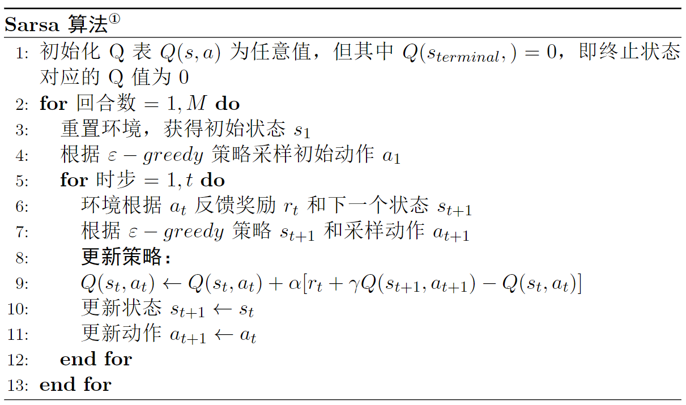
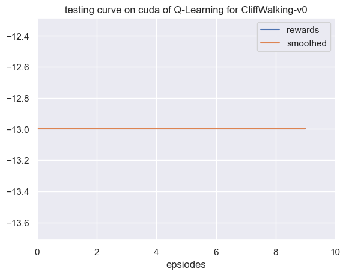

# 第 5 章 免模型控制

$\qquad$ 回顾前面讲的控制，即给定一个马尔可夫决策过程，输出最优策略以及对应的最优价值函数。而免模型则是指不需要知道环境的状态转移概率的一类算法，实际上很多经典的强化学习算法都是免模型控制的。本章会重点介绍两种基础的免模型算法，$\text{Q-learning}$ 和 $\text{Sarsa}$ ，也都是基于时序差分的方法。

## 5.1 Q-learning 算法

$\qquad$ 在时序差分方法的章节中我们讲的是状态价值函数的时序差分，其目的是为了预测每个状态的价值。而在预测与控制的内容中我们提到了控制的方法是需要输出最优策略的同时，也会输出对应的状态价值函数，预测的方法也是为了帮助解决控制问题做一个铺垫。不知道读者还记不记得，策略与状态价值函数之间是存在一个联系的，这个联系就是动作价值函数，如式 $\text(5.1)$ 所示：

$$
\tag{5.1}
V_\pi(s)=\sum_{a \in A} \pi(a \mid s) Q_\pi(s, a)
$$

$\qquad$ 因此，为了解决控制问题，我们只需要直接预测动作价值函数，然后在决策时选择动作价值即 Q 值最大对应的动作即可。这样一来，策略和动作价值函数同时达到最优，相应的状态价值函数也是最优的，这就是 $\text{Q-learning}$ 算法的思路。

$\text{Q-learning}$ 算法更新公式如式 $\text{(5.2)}$ 所示。

$$
\tag{5.2}
Q(s_t,a_t) \leftarrow Q(s_t,a_t)+\alpha[r_t+\gamma\max _{a}Q(s_{t+1},a)-Q(s_t,a_t)]
$$

$\qquad$ 我们再回忆一下时序差分方法中状态价值函数的更新公式，如式 $\text(4.5)$ ：

$$
\tag{5.3}
V(s_t) \leftarrow V(s_t) + \alpha[r_{t+1}+\gamma V(s_{t+1})- V(s_{t})]
$$

$\qquad$ 我们会发现两者的更新方式是一样的，都是基于时序差分的更新方法。不同的是，动作价值函数更新时是直接拿最大的未来动作价值的 $\gamma\max _{a}Q(s_{t+1},a)$ 来估计的，而在状态价值函数更新中相当于是拿对应的平均值来估计的。这就会导致这个估计相当于状态价值函数中的估计更不准确，一般称为 **Q 值的过估计**，当然这个过估计仅仅限于以 $\text{Q-learning}$ 为基础的算法，不同的算法为了优化这个问题使用了不同的估计方式，其中就包括本章后面会讲的 Sarsa 算法，暂时先不详细展开。

### 5.1.1 Q 表格

$\qquad$ 回到 $\text{Q-learning}$ 算法本身，其实到这里我们已经把 $\text{Q-learning}$ 算法的核心内容讲完了，即上面的更新公式 $\text(4.5)$。但是有必要提到几个概念，$\text{Q}$ 表格和探索策略，以便帮助读者加深理解。

$\qquad$ 关于 $\text{Q}$ 表格，其实我们在前面讲蒙特卡洛方法的过程中已经形成了雏形，就是我们所举的价值函数网格分布的例子。我们接着这个例子继续讲，不记得的同学建议再往前回顾一下。如图 $\text{5.1}$ 所示，这个例子是以左上角为起点，右下角为终点，机器人只能向右或者向下走，每次移动后机器人会收到一个 $-1$ 的奖励，即奖励函数 $R(s,a)=1$，然后求出机器人从起点走到终点的最短路径。

<div align=center>

</div>
<div align=center>图 $\text{5.1}$ 迷你网格示例</div>

$\qquad$ 其实这个答案比较简单，机器人要达到终点只能先向右然后向下，或者先向下然后向右走，有且只有两条路径，并且同时也是最短路径。当时出于简化计算的考虑（状态价值的计算实在是太繁琐了！），只考虑了 $2 \times 2$ 的网格。这次我们可以将问题变得更有挑战性一些，如图 $\text{5.2}$ 所示， 我们将网格变成大一点的 $3 \times 3$ 的网格，并且不再限制机器人只能向右或者向下走，它可以向上、向下、向左和向右随意走动，当然每次还是只能走动一格，并且不能出边界，另外奖励函数也不变。

<div align=center>

</div>
<div align=center>图 $\text{5.2}$ 迷你网格进阶</div>

$\qquad$ 我们还是把机器人的位置看作状态，这样一来总共有 $\text{9}$ 个状态，$\text{4}$ 个动作 $a_1,a_2,a_3,a_4$（分别对应上、下、左、右）。我们知道 Q 函数，也就是状态价值函数的输入就是状态和动作，输出就是一个值，由于这里的状态和动作都是离散的，这样一来我们就可以用一个表格来表示，如表 $\text{5.1}$ 所示。

<div style="text-align: center;">
  <div style="display: table; margin: 0 auto;">
    <table>
      <tr>
        <th> $\space$ </th>
        <th>$s_1$</th>
        <th>$s_2$</th>
        <th>$s_3$</th>
        <th>$s_4$</th>
        <th>$s_5$</th>
        <th>$s_6$</th>
        <th>$s_7$</th>
        <th>$s_8$</th>
        <th>$s_9$</th>
      </tr>
      <tr>
        <td>$a_1$</td>
        <td>$\text{0}$</td>
        <td>$\text{0}$</td>
        <td>$\text{0}$</td>
        <td>$\text{0}$</td>
        <td>$\text{0}$</td>
        <td>$\text{0}$</td>
        <td>$\text{0}$</td>
        <td>$\text{0}$</td>
        <td>$\text{0}$</td>
      </tr>
      <tr>
        <td>$a_2$</td>
        <td>$\text{0}$</td>
        <td>$\text{0}$</td>
        <td>$\text{0}$</td>
        <td>$\text{0}$</td>
        <td>$\text{0}$</td>
        <td>$\text{0}$</td>
        <td>$\text{0}$</td>
        <td>$\text{0}$</td>
        <td>$\text{0}$</td>
      </tr>
      <tr>
        <td>$a_3$</td>
        <td>$\text{0}$</td>
        <td>$\text{0}$</td>
        <td>$\text{0}$</td>
        <td>$\text{0}$</td>
        <td>$\text{0}$</td>
        <td>$\text{0}$</td>
        <td>$\text{0}$</td>
        <td>$\text{0}$</td>
        <td>$\text{0}$</td>
      </tr>
      <tr>
        <td>$a_4$</td>
        <td>$\text{0}$</td>
        <td>$\text{0}$</td>
        <td>$\text{0}$</td>
        <td>$\text{0}$</td>
        <td>$\text{0}$</td>
        <td>$\text{0}$</td>
        <td>$\text{0}$</td>
        <td>$\text{0}$</td>
        <td>$\text{0}$</td>
      </tr>
    </table>
  </div>
  <div>表 $\text{5.1}$ ：$\text{Q}$ 表格</div>
</div>

$\qquad$ 表格的横和列对应状态和动作，数值表示对应的 $Q$ 值，比如最左上角的值表示 $Q(s_1,a_1)=0$，这就是 $Q$ 表格。在实践中，我们可以给所有的 $Q$ 预先设一个值，这就是 $Q$ 值的初始化。这些值是可以随机的，这里为了方便全部初始化为 $0$，但除了终止状态对应的值必须为 $\text{0}$ 之外，这点我们在讲时序差分的方法中有提到过，比如这里终止状态 $s_9$ 对应的所有 $Q$ 值，包括 $Q(s_9,a_1),Q(s_9,a_2),Q(s_9,a_3),Q(s_9,a_4)$ 等都必须为 $\text{0}$ ，并且也不参与 $Q$ 值的更新。

$\qquad$ 现在我们讲讲 $Q$ 值的更新过程，其实跟前面讲的状态价值更新是类似的。但不一样的是，前面讲状态价值的更新是蒙特卡洛方法，这次是时序差分方法。具体的做法是，我们会让机器人自行在网格中走动，走到一个状态，就把对应的 $Q$ 值 更新一次，这个过程就叫做 **探索** 。这个探索的过程也是时序差分方法结合了蒙特卡洛方法的体现。当然探索的方式有很多种，很难在读者初学的阶段一次性就全部倒腾出来，这也是为什么在前面讲时序差分方法的时候我们只讲了更新公式而没有讲实际是怎么操作的原因，之后会结合具体情况一一道来，下面我们讲讲 $\text{Q-learning}$ 算法中智能体是怎么探索的。

### 5.1.2 探索策略

$\qquad$ 按理说来，直接根据 $Q$ 函数（即每次选择 $Q$ 值最大对应的动作）来探索是没有问题的。但是由于在探索的过程中 $Q$ 值也是估计出来的，然后还需要利用先前的估计值来更新 $Q$ 值（也就是自举的过程），换句话说，由于自举依赖于先前的估计值，因此这可能会导致估计出的价值函数存在某种程度上的偏差。

$\qquad$ 通俗的理解就是，如果我们一直基于某种思路去工作，工作完之后总结经验（也就是学习的过程）以便提高工作能力和效率，这种方式也许会让我们工作得越来越好，但任何一种思路都不是完美的，都会有一定的瑕疵，也就是说可能会慢慢走偏，此时换一种思路也许就会豁然开朗。实际上人类社会和科学的发展也有着异曲同工之处，举一个古老的例子，很久之前人们认为地球是宇宙的中心（即地心说），并且在公元2世纪将它形成一个体系化的理论，并且以此理论为基础也解决了很多当时难以捉摸的问题。

$\qquad$ 但是随着科学的进一步发展这种理论也开始走到极限，直到后面哥白尼提出日心说的理论，尽管当时哥白尼由于不被坚持地心说的守旧派而为此付出了沉重的代价。守旧派就相当于一直坚持同一个思路去探索学习，这种探索思路总会受限于当时人们的认知，并且迟早会到达极限，除非出现一个偶然的因素让我们切换一种思路探索并且学习到更多的东西。尽管在今天看来，地心说和日心说都不是准确的，但其实诸多类似的历史事件也告诉我们一个道理，我们需要牢牢掌握现有的知识形成自己的理论或者经验体系，同时也要保持好奇心与时俱进，这样才能长久地发展下去，对于强化学习中的智能体也是如此。

$\qquad$ 回到正题，$\text{Q-learning}$ 算法是采用了一个叫做  $\varepsilon-greedy$ 的探索策略，$\varepsilon-greedy$ 是指智能体在探索的过程中，会以 $1-\varepsilon$ 的概率按照 $Q$ 函数来执行动作，然后以剩下 $\varepsilon$ 的概率随机动作。这个 $1-\varepsilon$ 的过程就是前面所说的“守旧派”，即以现有的经验去动作，$\varepsilon$ 就是保持一定的好奇心去探索可能的更优的动作。当然，通常这个 $\varepsilon$ 的值会设置的特别小，比如 $\text{0.1}$ ，毕竟“守旧”并不总是一件坏事，新的东西出现的概率总是特别小的，如果保持过度的好奇心即 $\varepsilon$ 的值设得很大，就很有可能导致智能体既学不到新的东西也丢掉了已经学习到的东西，所谓“捡了芝麻丢了西瓜”。而且一般来说也会随着学到的东西增多而更少，就好比科学知识体系几近完备的现代，能够探索到新的东西的概率是特别特别小的。因此通常在实践中，这个 $\varepsilon$ 的值还会随着时步的增长而衰减，比如从 $\text{0.1}$ 衰减到 $\text{0.01}$ 。 

$\qquad$ 更确切地说，以 $1-\varepsilon$ 的概率按照 $Q$ 函数来执行动作的这个过程在强化学习中我们一般称作利用（ $\text{exploitation}$ ），而以 $\varepsilon$ 的概率随机动作的过程称之为探索（ $\text{exploration}$ ）。什么时候需要探索的更多，什么时候需要利用的更多，其实是很难下定论的，这就是大多数强化学习情景中需要面临的**探索-利用窘境**（ $\text{exploration-exploitation dilemma}$ ）。我们需要在探索和利用之间做一个权衡，这其实跟深度学习中讲的**偏差-方差权衡**（ $\text{Bias-Variance Tradeoff}$ ）是如出一辙的。

$\qquad$ 讲到这里，我们就可以贴出 $\text{Q-learning}$ 算法的伪代码了，如图 $\text{5.3}$ 所示。

<div align=center>

</div>
<div align=center>图 $\text{5.3}$ $\text{Q-learning}$ 算法伪代码</div>


## 5.2 Sarsa 算法

$\qquad$ $\text{Sarsa}$ 算法虽然在刚提出的时候被认为是 $\text{Q-learning}$ 算法的改进，但在今天看来是非常类似，但是模式却不同的两类算法，$\text{Q-learning}$ 算法被认为是 $\text{Off-Policy}$ 算法，而 $\text{Sarsa}$ 算法相对地则是 $\text{On-policy}$ 的，具体我们后面会展开说明。我们先来看 $\text{Sarsa}$ 算法，我们讲到 $\text{Sarsa}$ 算法跟 $\text{Q-learning}$ 算法是非常类似的，这是因为两者之间在形式上只有 $Q$ 值更新公式是不同的，如式 $\text(5.4)$ 所示：

$$
\tag{5.4}
Q(s_t,a_t) \leftarrow Q(s_t,a_t)+\alpha[r_t+\gamma Q(s_{t+1},a_{t+1})-Q(s_t,a_t)]
$$

$\qquad$ 也就是说，$\text{Sarsa}$ 算法是直接用下一个状态和动作对应的 $Q$ 值来作为估计值的，而 $\text{Q-learning}$ 算法则是用下一个状态对应的最大 $Q$ 值。然后我们就可以贴出伪代码了，如图 $\text{5.4}$ 所示。

<div align=center>

</div>
<div align=center>图 $\text{5.4}$ $\text{Sarsa}$ 算法伪代码 </div>

## 5.3 同策略与异策略

$\qquad$ 尽管 $\text{Q-learning}$ 算法和 $\text{Sarsa}$ 算法仅在一行更新公式上有所区别，但这两种算法代表的是截然不同的两类算法。我们注意到，$\text{Sarsa}$ 算法在训练的过程中当前策略来生成数据样本，并在其基础上进行更新。换句话说，策略评估和策略改进过程是基于相同的策略完成的，这就是**同策略算法**。相应地，像 $\text{Q-learning}$ 算法这样从其他策略中获取样本然后利用它们来更新目标策略，我们称作**异策略算法**。也就是说，异策略算法基本上是从经验池或者历史数据中进行学习的。这两类算法有着不同的优缺点，同策略相对来说更加稳定，但是效率较低，如同我们实战中展示的那样。而异策略通常来说更加高效，但是需要让获取样本的策略和更新的策略具备一定的分布匹配条件，以避免偏差。

## 5.4 实战：Q-learning 算法

$\qquad$ 本节开始我们的第一个算法实战，由于是第一个实战，所以会讲得偏详细一些，后面的算法实战部分可能会讲得越来越粗，如果读者们有不明白的地方，欢迎随时交流讨论。实战的思路会跟理论学习有所区别，并且因人而异，因此读者们在学习实战的时候做个参考即可，最重要的是有自己的想法。

$\qquad$ 此外，笔者认为**对于实战来说最重要的一点就是写好伪代码**。如果说理论部分是数学语言，实战部分就是编程语言，而伪代码则是从数学语言到编程语言之间的一个过渡，这也是笔者为什么在讲解每个算法的时候尽可能贴出伪代码的原因。在每个算法实战的内容中，笔者基本会按照定义算法，定义训练，定义环境，设置参数以及开始训练等步骤为读者们展开，这是笔者个人的编程习惯。由于这次我们是第一次讲到实战，所以会先讲一下定义训练，因为其中涉及到一个所有强化学习通用的训练模式。
### 5.4.1 定义训练

$\qquad$ 回顾一下伪代码的第二行到最后一行，我们会发现一个强化学习训练的通用模式，首先我们会迭代很多个（$M$）回合，在每回合中，首先重置环境回到初始化的状态，智能体根据状态选择动作，然后环境反馈中下一个状态和对应的奖励，同时智能体会更新策略，直到回合结束。这其实就是马尔可夫决策过程中智能体与环境互动的过程，写成一段通用的代码如下：

```python
for i_ep in range(train_eps): # 遍历每个回合
    # 重置环境，获取初始状态
    state = env.reset()  # 重置环境,即开始新的回合
    while True: # 对于比较复杂的游戏可以设置每回合最大的步长，例如while ep_step<100，即最大步长为100。
        # 智能体根据策略采样动作
        action = agent.sample_action(state)  # 根据算法采样一个动作
        # 与环境进行一次交互，得到下一个状态和奖励
        next_state, reward, terminated, _ = env.step(action)  # 智能体将样本记录到经验池中
        agent.memory.push(state, action, reward, next_state, terminated) 
        # 智能体更新策略
        agent.update(state, action, reward, next_state, terminated)  
        # 更新状态
        state = next_state  
        # 如果终止则本回合结束
        if terminated:
            break
```

### 5.4.2 定义算法

$\qquad$ 强化学习中有几个要素，智能体、环境、经验池（经回放），在实践中也需要逐一定义这些要素。我们一般首先定义智能体，或者说算法，在 $\text{Python}$ 中一般定义为类即可。再考虑一下智能体在强化学习中主要负责哪些工作。

#### 5.4.2.1 采样动作

$\qquad$ 首先在训练中我需要采样动作与环境交互，于是我们可以定义一个类方法，命名为 `sample_action` ，如下：

```python
class Agent:
    def __init__():
        pass
    def sample_action(self, state):
        ''' 采样动作，训练时用
        '''
        self.sample_count += 1
        # epsilon是会递减的，这里选择指数递减
        self.epsilon = self.epsilon_end + (self.epsilon_start - self.epsilon_end) * math.exp(- self.sample_count / self.epsilon_decay) 
        # e-greedy 策略
        if np.random.uniform(0, 1) > self.epsilon:
            action = np.argmax(self.Q_table[str(state)]) # 选择Q(s,a)最大对应的动作
        else:
            action = np.random.choice(self.n_actions) # 随机选择动作
        return action     
```

$\qquad$ 在这里我们用了 $\varepsilon-greedy$ 策略，其中 $\varepsilon$ 会随着采样的步数指数衰减，感兴趣的读者也可以直接设置固定的 $\varepsilon=0.1$ 试试。
在 $\text{Q-learning}$ 算法中还有一个重要的元素，即 $Q$ 表，$Q$ 表的作用是输入状态和动作，输出一个即可，这样一来我们可以用一个二维的数组来表示，比如 `Q_table[0][1] = 0.1`可以表示 $Q(s_0,a_1)=0.1$ （注意 $\text{Python}$ 中下标是从 $\text{0}$ 开始）。而在我们的示例代码中用了一个默认字典来表示，如下：

```python
self.Q_table  = defaultdict(lambda: np.zeros(n_actions))
```

这样的好处是从数据结构上来说，默认字典是哈希表结构，二维数组是线性表结构，从哈希表拿出数据的速度会比线性表快。

#### 5.4.2.2 预测动作

$\qquad$ 此外对于每个智能体在训练中和在测试中采取动作的方式一般是不一样的，因为在训练中需要增加额外的探索策略，而在测试中只需要输出 $Q$ 值对应最大的动作即可，如下：

```python
class Agent:
    def __init__():
        pass
    def predict_action(self,state):
        ''' 预测或选择动作，测试时用
        '''
        action = np.argmax(self.Q_table[str(state)])
        return action
```

#### 5.4.2.3 更新方法

$\qquad$ 所有强化学习算法的采样动作和预测动作方式几乎是比较固定的，对于每个智能体来说最核心的还是更新网络的方式，在 $\text{Q-learning}$ 算法中的更新方式较为简单，而且不需要经验回放（具体会在 $\text{DQN}$ 算法中展开），如下：

```python
def update(self, state, action, reward, next_state, terminated):
    Q_predict = self.Q_table[str(state)][action] 
    if terminated: # 终止状态
        Q_target = reward  
    else:
        Q_target = reward + self.gamma * np.max(self.Q_table[str(next_state)]) 
    self.Q_table[str(state)][action] += self.lr * (Q_target - Q_predict)
```

其中 `self.lr` 就是更新公式中的 $alpha$（学习率），到这里我们就定义好了智能体，完整的内容可参考附书代码。

### 5.4.3 定义环境

$\qquad$ 在本节中我们选择了一个叫做 $\text{CliffWalking-v0}$ 的环境（中文名叫 “悬崖寻路” ），跟前面动态规划章节中举的机器人最短路径是类似的，只是要更加复杂一些。

如图 $\text{5.5}$ 所示，整个环境中共有 $\text{48}$ 个网格，其中黄色网格（标号为 $\text{36}$ ）为起点，绿色网格（标号为 $\text{47}$ ）为终点，红色的网格表示悬崖，智能体的目标是以最短的路径从起点到终点，并且避开悬崖。由于这个环境比较简单，我们一眼就能看出来最优的策略应当是从起点向上沿着 $\text{24}$ 号网格直线走到 $\text{35}$ 号网格最后到达终点，后面我们看看强化学习智能体能不能学出来。

<div align=center>

</div>
<div align=center>图 $\text{5.5}$ $\text{CliffWalking-v0}$ 环境示意图</div>

此外，我们做强化学习算法的时候更重要的还是要对环境本身的状态、动作和奖励了解，以便指导我们优化算法。在这个环境中，状态比较简单，就是当前智能体所处的网格位置或者说编号，动作就是上右下左（分别是 $0,1,2,3$ ，顺序可能有点奇怪，但官方环境是这么设置的），奖励的话分几种情况，一个是每走一个白色网格（包括起点）是会给一个 $-1$ 的奖励，到达终点的时候得到的奖励为 $0$，走到边沿、悬崖或者终点的时候本回合游戏结束，这些设置在官方源码中都能找到<sup>①</sup>。这里之所以每走一个网格会给一个负的奖励，是因为我们的目标是最短路径，换句话说每走一步都是有代价的，所以需要设置一个负的奖励或者说惩罚，设置正的奖励会容易误导智能体在训练过程中一直走网格，设置 $0$ 的话也是一样的，会让智能体找不到目标。奖励就相当于我们给智能体设置的目标，因此如何合理地设置奖励其实也是一项复杂的工程，具体后面我们会再展开。

> ① CliffWalking-v0 源码链接：https://github.com/openai/gym/blob/master/gym/envs/toy_text/cliffwalking.py


$\qquad$ 我们选择的环境是 $\text{OpenAI Gym}$ 开发的，它提供了一套标准化的环境，包括经典的控制理论问题和游戏，代码封装得也比较好，只需要一行代码就能定义好环境，如下：

```python
env = gym.make('CliffWalking-v0')  
```

当然大多数情况下需要根据需求建立我们自己的环境，这时我们也可以仿照 $\text{Gym}$ 的模式来做，具体教程会在后面的章节中单独讲到。

在 $\text{Gym}$ 中我们可以通过以下方式获取环境的状态数和动作数：

```python
n_states = env.observation_space.n # 状态数
n_actions = env.action_space.n # 动作数
print(f"状态数：{n_states}， 动作数：{n_actions}")
```

打印的结果如下：

```bash
状态数：48， 动作数：4
```

符合我们前面的分析结果。

### 5.4.4 设置参数

智能体、环境和训练的代码都写好之后，就是设置参数了，由于 $\text{Q-learning}$ 算法的超参数（需要人工调整的参数）比较少，其中 $\gamma$ （折扣因子）比较固定，设置在 $0.9$ 到 $0.999$ 之间，一般设置成 $0.99$ 即可。而学习率 $alpha$ 在本章节中设置的比较大，为 $0.1$，实际更复杂的环境和算法中学习率是小于 $0.01$，因为太大很容易发生过拟和的问题，只是本节的环境和算法都比较简单，为了收敛得更快点所以设置得比较大。此外由于我们探索策略中的 $\varepsilon$ 是会随着采样步数衰减的，在实践过程中既不能让它衰减得太快也不能让它衰减得太慢，因此需要合理设置如下参数：

```python
self.epsilon_start = 0.95 #  e-greedy策略中epsilon的初始值
self.epsilon_end = 0.01 #  e-greedy策略中epsilon的最终值
self.epsilon_decay = 200 #  e-greedy策略中epsilon的衰减率
```

### 5.4.5 开始训练

准备工作做好之后，就可以开始训练了，得到的训练曲线如图 $\text{5.6}$ 所示，曲线横坐标表示回合数（$\text{episode}$），纵坐标表示每回合获得的总奖励，可以看出曲线其实从大约 $\text{50}$ 个回合的时候就开始收敛了，也就是我们的智能体学到了一个最优策略。

<div align=center>

</div>
<div align=center>图 $\text{5.6}$ $\text{CliffWalking-v0}$ 环境 $\text{Q-learning}$ 算法训练曲线</div>

$\qquad$ 在训练过程中我们打印出每回合的奖励，总共训练了 $300$ 个回合，结果如下：

```bash
...
回合：200/300，奖励：-22.0，Epsilon：0.010
回合：220/300，奖励：-20.0，Epsilon：0.010
回合：240/300，奖励：-15.0，Epsilon：0.010
回合：260/300，奖励：-20.0，Epsilon：0.010
回合：280/300，奖励：-13.0，Epsilon：0.010
回合：300/300，奖励：-13.0，Epsilon：0.010
```
$\qquad$ 我们发现收敛值约在 $-13$ 左右波动，波动的原因是因为此时还存在 $0.01$ 的概率做随机探索。

$\qquad$ 为了确保我们训练出来的策略是有效的，可以拿训好的策略去测试，测试的过程跟训练的过程差别不大，其一是智能体在测试的时候直接用模型预测的动作输出就行，即在训练中是采样动作（带探索），测试中就是预测动作，其二是训练过程中不需要更新策略，因为已经收敛了。

$\qquad$ 如图 $\text{5.7}$ 所示，我们测试了 $10$ 个回合，发现每回合获得的奖励都是 $-13$ 左右，说明我们学到的策略是比较稳定的。

<div align=center>

</div>
<div align=center>图 $\text{5.7}$ $\text{CliffWalking-v0}$ 环境 $\text{Q-learning}$ 算法测试曲线</div>


### 5.4.6 结果分析

$\qquad$ 那么问题来了,为什么学到的策略每回合的奖励是 $-13$ 呢？回顾一下我们在前面介绍环境的时候讲到，我们一眼就能看出来最优的策略应当是从起点向上沿着 $24$ 号网格直线走到 $35$ 号网格最后到达终点，而这中间要走多少个网格呢？读者们可以数一下，不包括终点（走到终点得到的奖励是 $0$）的话正好就是 $13$ 步，每一步会得到 $-1$ 的奖励，总共加起来正好也是 $-13$ ，这说明智能体学到的策略很有可能就是最优的。具体我们还需要把智能体在测试的时候每回合每步的动作打印出来验证一下，打印结果如下：

```bash
测试的动作列表：[0, 1, 1, 1, 1, 1, 1, 1, 1, 1, 1, 1, 2]
```

$\qquad$ 可以看到智能体学到的策略是先往上（即动作 $0$），然后一直往右（即动作 $1$）走十二格，最后再往下（即动作 $2$），这其实就是我们肉眼就能看出来的最优策略！


### 5.4.7 消融实验

$\qquad$ 为了进一步探究 $\varepsilon$ 是随着采样步数衰减更好些，还是恒定不变更好，我们做了一个消融（ $\text{Ablation}$ ）实验，即将 $\varepsilon$ 设置为恒定的 $0.1$，如下：

```python
# 将初始值和最终值设置为一样，这样 epsilon 就不会衰减
self.epsilon_start = 0.1 #  e-greedy策略中epsilon的初始值
self.epsilon_end = 0.1 #  e-greedy策略中epsilon的最终值
self.epsilon_decay = 200 #  e-greedy策略中epsilon的衰减率
```

$\qquad$ 然后重新训练和测试，得到的训练曲线如图 $\text{5.8}$ 所示：

<div align=center>

</div>
<div align=center>图 $\text{5.8}$ $\text{Q-learning}$ 算法消融实验训练曲线 </div>

$\qquad$ 测试曲线如图 $\text{5.9}$ 所示：

<div align=center>

</div>
<div align=center>图 $\text{5.9}$ $\text{Q-learning}$ 算法消融实验训练曲线 </div>

$\qquad$ 不难发现，虽然最后也能收敛，但是相对来说没有那么稳定，在更复杂的环境中 $\varepsilon$ 随着采样步数衰减的好处会体现得更加明显。
## 实战：Sarsa 算法

$\qquad$ 由于 $\text{Sarsa}$ 算法与 $\text{Q-learning}$ 算法在实现上区别很小，感兴趣的读者可以直接阅读 $\text{JoyRL}$ 上的代码。

$\qquad$ 在相同环境和参数设置下，得到的实验结果如图 $\text{5.10}$ 所示：

<div align=center>

</div>
<div align=center>图 $\text{5.10}$ $\text{Sarsa}$ 算法训练曲线 </div>

$\qquad$ 测试曲线如图 $\text{5.11}$ 所示：

<div align=center>

</div>
<div align=center>图 $\text{5.11}$ $\text{Sarsa}$ 算法测试曲线 </div>

$\qquad$ 我们发现相比于 $\text{Q-learning}$ 算法的 $300$ 回合收敛，$\text{Sarsa}$ 算法需要额外的 $100$ 个回合收敛，但是收敛之后会更稳定，没有一些波动过大的值。

## 5.5 本章小结

$\qquad$ 本章主要介绍了两种经典的传统强化学习算法，即 $\text{Q-learning}$ 和 $\text{Sarsa}$ 算法。同时，这两种算法虽然非常近似，但本质上是两类不同的算法，前者为 $\text{off-policy}$ 算法，后者为 $\text{on-policy}$ 算法。虽然这两种算法在目前强化学习实践中几乎不怎么用到，但却是后面 $\text{DQN}$ 算法的基础，读者需要熟练掌握。

## 5.6 练习题

1. 什么是 $Q$ 值的过估计？有什么缓解的方法吗？
2. $\text{on-policy}$ 与 $\text{off-policy}$ 之间的区别是什么？
3. 为什么需要探索策略？