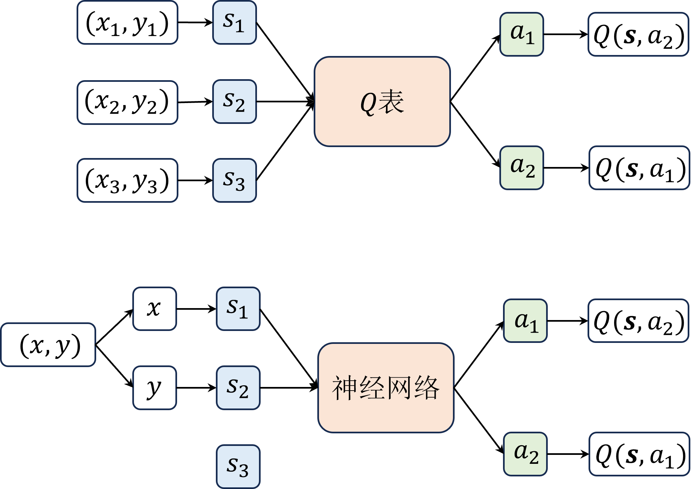
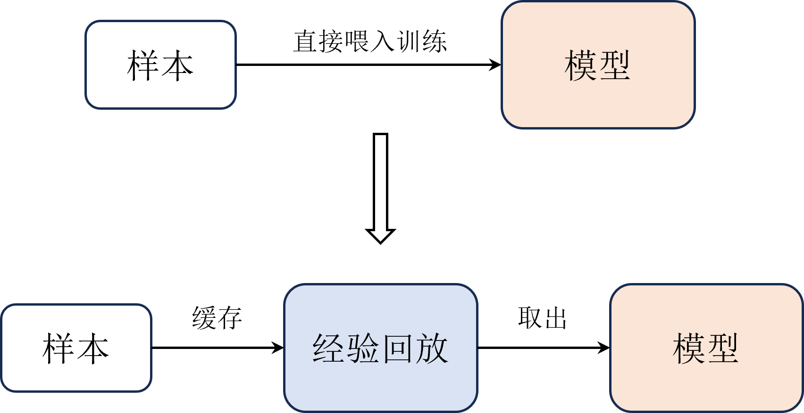
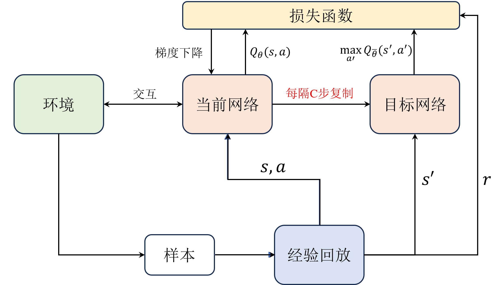
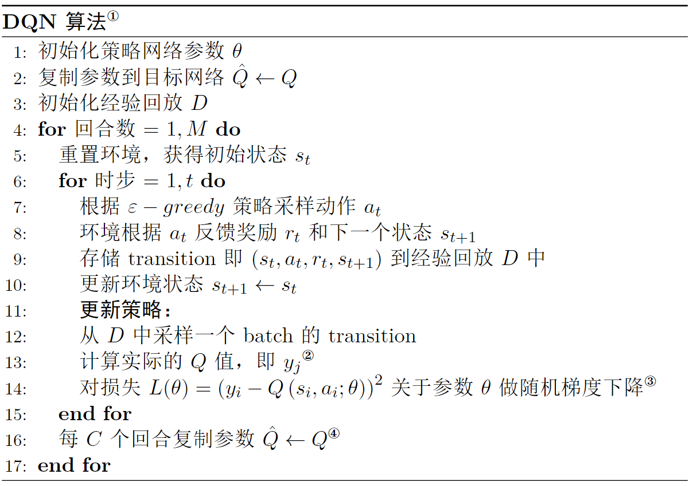
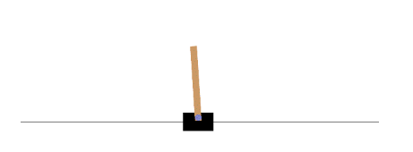

# 第 7 章 DQN 算法

$\qquad$ 本章开始进入深度强化学习的部分，我们首先从 $\text{DQN}$ 算法开始讲起。$\text{DQN}$ 算法，英文全称 $\text{Deep Q-Network}$ , 顾名思义，它的主要贡献就是在 $\text{Q-learning}$ 算法的基础上引入了深度神经网络来近似动作价值函数 $Q(\boldsymbol{s},\boldsymbol{a})$，从而能够处理高维的状态空间。$\text{DQN}$ 算法主要由 $\text{DeepMind}$ 公司于 $\text{2013}$ 年<sup>①</sup>和 $\text{2015}$ 年<sup>②</sup>分别提出的两篇论文来实现，其中后者是比较成熟的版本，也是本章讲解的重点。除了用深度网络代替 $Q$ 表之外，$\text{DQN}$ 算法还引入了一些技巧，如经验回放和目标网络，我们将逐一介绍。

> ① Mnih V , Kavukcuoglu K , Silver D ,et al.Playing Atari with Deep Reinforcement Learning[J].Computer Science, 2013.DOI:10.48550/arXiv.1312.5602.

> ② Human-level control through deep reinforcement learning[J].Nature, 2015.

## 7.1 深度网络

$\qquad$ 在深度学习基础的章节中，我们知道一个神经网络能够将输入向量 $\boldsymbol{x}$ 映射到输出向量 $\boldsymbol{y}$，这个映射过程可以用式 $\text(7.1)$ 表示。

$$
\tag{7.1}
\boldsymbol{y} = f_{\theta}(\boldsymbol{x})
$$

$\qquad$ 某种意义上来说，神经网络就是一个函数，只不过不同于一般的数值函数，它的输入输出都是向量，并且拥有可以学习的参数 $\theta$，这些参数可以通过梯度下降的方式来优化，从而使得神经网络能够逼近任意函数。类似于 $Q$ 表，它也可以用来近似动作价值函数 $Q(\boldsymbol{s},\boldsymbol{a})$，即将状态向量 $\boldsymbol{s}$ 作为输入，并输出所有动作 $\boldsymbol{a} = (a_1,a_2,...,a_n)$ 对应的价值，如式 $\text(7.2)$ 所示。

$$
\tag{7.2}
\boldsymbol{y} = Q_{\theta}(\boldsymbol{s},\boldsymbol{a})
$$

$\qquad$ 尽管神经网络和 $Q$ 表都可以用来近似动作价值函数 $Q(\boldsymbol{s},\boldsymbol{a})$，但是它们的形式是不一样的，$Q$ 表是一个二维表格，而神经网络是一个实实在在的函数。因此，$Q$ 表的局限性会更大一些，它只能处理离散的状态和动作空间，而神经网络则可以处理连续的状态和动作空间。以走迷宫为例，把迷宫的每个位置当作一个状态，用坐标来表示的话，就是 $s_1 = (x_1,y_1)=(0,0)，s_2=(x_2,y_2)=(1,1)$ 等。如图 $\text{7-1}$ 所示，如果用 $Q$ 表来表示的话，就需要把每个坐标看作不同的状态，比如要表示一些更精细的位置，就需要增加新的状态，例如 $s_3=(x_3,y_3)=(0.1,0.2)$ 。然而我们知道，实际上位置或者说坐标点的个数是无穷无尽的，尤其是更高维的情况处理起来特别麻烦。


<div align=center>

</div>
<div align=center>图 $\text{7-1}$ $\text{DQN}$ 网络结构</div>

$\qquad$ 但是神经网络就不一样，它的输入可以是连续的值，因此只需要把每个维度的坐标看作一个输入，就可以处理高维的状态空间了。换句话说，神经网络只用了两个维度的输入就表示了原来 $Q$ 表中无穷多个状态，这就是神经网络的优势所在。因此，在 $Q$ 表中我们**描述状态空间的时候一般用的是状态个数，而在神经网络中我们用的是状态维度**。另外注意，无论是 $Q$ 表还是 $\text{DQN}$ 中的神经网络，它们输出的都是每个动作对应的 $Q$ 值，即预测，而不是直接输出动作。要想输出动作，就需要额外做一些处理，例如结合贪心算法选择 $Q$ 值最大对应的动作等，这就是我们一直强调的控制过程。

$\qquad$ 虽然用神经网络替代 $Q$ 表看起来很容易，但是实际上也多了一项额外的参数，即神经网络的参数 $\theta$，此时就需要我们用梯度下降的方法来求解。具体该怎么结合梯度下降来更新 $Q$ 函数的参数呢？我们首先回顾一下 $\text{Q-learning}$ 算法的更新公式，如式 $\text(7.3)$ 所示。

$$
\tag{7.3}
Q(s_t,a_t) \leftarrow Q(s_t,a_t)+\alpha[r_t+\gamma\max _{a}Q^{\prime}(s_{t+1},a)-Q(s_t,a_t)]
$$

$\qquad$ 其中 $y_t = r_t+\gamma\max _{a}Q^{\prime}(s_{t+1},a)$ 表示期望的 $Q$ 值，$Q(s_t,a_t)$ 表示实际的 $Q$ 值，$\alpha$ 是学习率。在 $\text{Q-learning}$ 算法中，由于没有额外的参数，因此只需要直接一步步迭代更新 $Q$ 值即可。而在 $\text{DQN}$ 中，我们用神经网络来近似 $Q$ 函数，引入了额外的网络参数 $\theta$，如式 $\text(7.4)$ 所示。

$$
\tag{7.4}
Q\left(s_{i}, a_{i} ; \theta\right) \leftarrow Q\left(s_{i}, a_{i} ; \theta\right)+\alpha[y_i-Q\left(s_{i}, a_{i} ; \theta\right)]
$$

$\qquad$ 其中 $Q\left(s_{i}, a_{i} ; \theta\right)$ 根据习惯不同也可以写成 $Q_{\theta}(s_{i}, a_{i})$，注意到，在理想的收敛情况下，实际的 $Q$ 值应该接近于期望的 $Q$ 值，即我们希望最小化 $r_t+\gamma\max _{a}Q^{\prime}(s_{t+1},a)$ 和 $Q(s_t,a_t)$ 之间的绝对差值。这个差值也就是 $TD$ 误差，也可以写成损失函数的形式并用梯度下降的方式来求解参数 $\theta$，如式 $\text(7.5)$ 所示。

$$
\tag{7.5}
\begin{aligned}
L(\theta)=\left(y_{i}-Q\left(s_{i}, a_{i} ; \theta\right)\right)^{2} \\
\theta_i \leftarrow \theta_i - \alpha \nabla_{\theta_{i}} L_{i}\left(\theta_{i}\right)
\end{aligned}
$$

$\qquad$ 由于 $\text{DQN}$ 算法也是基于 $TD$ 更新的，因此依然需要判断终止状态，在 $\text{Q-learning}$ 算法中也有同样的操作，如式 $\text(7.6)$ 所示。

$$
\tag{7.6}
y_i = \begin{cases}r_i & \text {对于终止状态} s_{i} \\ r_{i}+\gamma \max _{a^{\prime}} Q\left(s_{i+1}, a^{\prime} ; \theta\right) & \text {对于非终止状态} s_{i}\end{cases}
$$

$\qquad$ 从这个角度上来看，强化学习跟深度学习的训练方式其实是一样的，都是将样本喂入网络中，然后通过梯度下降的方式来更新网络参数，使得损失函数最小，即能够逼近真实的 $Q$ 值。而不同的地方在于，强化学习用于训练的样本（包括状态、动作和奖励等等）是与环境实时交互得到的，而深度学习则是事先准备好的。当然即便训练方式类似，这也并不代表强化学习和深度学习之间的区别就很小，本质上来讲强化学习和深度学习所要解决的问题是完全不同的，前者用于解决序列决策问题，后者用于解决静态问题例如回归、分类、识别等等。

$\qquad$ 到这里我们已经讲完了 $\text{DQN}$ 算法的核心部分，即如何用神经网络来近似 $Q$ 函数，以及如何用梯度下降的方式来更新网络参数。但仅仅依靠这些还不能完全实现 $\text{DQN}$ 算法的训练过程，我们还需要引入一些技巧来提高训练的稳定性，在接下来的部分我们将会逐一介绍。

## 7.2 经验回放

$\qquad$ 先来看一下经验回放，它实际上是所有 $\text{off-policy}$ 算法中都会用到的一个技巧。在介绍经验回放之前，我们先回顾强化学习的训练机制。我们知道，强化学习是与环境实时交互得到样本然后进行训练的，这个样本一般包括当前的状态 $s_t$ 、当前动作 $a_t$ 、下一时刻的状态 $s_{t+1}$ 、奖励 $r_{t+1}$ 以及终止状态的标志 $done$ (通常不呈现在公式中)，也叫做一个状态转移（ $\text{transition}$ ），即 $(s_t,a_t,s_{t+1},r_{t+1})$。在 $\text{Q-learning}$ 算法中，每次交互得到一个样本之后，就立马拿去更新模型了。

$\qquad$ 这样的方式用在神经网络中会有一些问题，这跟梯度下降有关。首先每次用单个样本去迭代网络参数很容易导致训练的不稳定，从而影响模型的收敛，在深度学习基础的章节中我们也讲过小批量梯度下降是目前比较成熟的方式。其次，每次迭代的样本都是从环境中实时交互得到的，这样的样本是有关联的，而梯度下降法是基于一个假设的，即训练集中的样本是独立同分布的。

$\qquad$ 在深度学习中其实是没有这样的问题的。因为训练集是事先准备好的，每次迭代的样本都是从训练集中随机抽取的，因此每次迭代的样本都是独立同分布的。但是这样的假设在强化学习中是不成立的，因为每次迭代的样本都是从环境中实时交互得到的，因此每次迭代的样本都是相互关联的。

$\qquad$ 换句话说，直接将 $\text{Q-learning}$ 算法训练的方式来更新 $\text{DQN}$ 的模型相当于是最原始的梯度下降方式，距离目前最成熟的小批量梯度下降方式还有一定的差距，因此我们需要进行一些处理来达到相同的效果，这就是经验回放的实现初衷。

$\qquad$ 如图 $\text{7-2}$ 所示，$\text{Q-learning}$ 算法训练的方式就是把每次通过与环境交互一次的样本直接喂入网络中训练。而在 $\text{DQN}$ 中，我们会把每次与环境交互得到的样本都存储在一个经验回放中，然后每次从经验池中随机抽取一批样本来训练网络。

$\qquad$ 这样做的好处是，首先每次迭代的样本都是从经验池中随机抽取的，因此每次迭代的样本都是近似独立同分布的，这样就满足了梯度下降法的假设。其次，经验池中的样本是从环境中实时交互得到的，因此每次迭代的样本都是相互关联的，这样的方式相当于是把每次迭代的样本都进行了一个打乱的操作，这样也能够有效地避免训练的不稳定性。

<div align=center>

</div>
<div align=center>图 $\text{7-2}$ 经验回放示例</div>

$\qquad$ 当然，与深度学习不同的是，经验回放的容量是需要有一定的容量限制的。本质上是因为在深度学习中我们拿到的样本都是事先准备好的，即都是很好的样本，但是在强化学习中样本是由智能体生成的，在训练初期智能体生成的样本虽然能够帮助它朝着更好的方向收敛，但是在训练后期这些前期产生的样本相对来说质量就不是很好了，此时把这些样本喂入智能体的深度网络中更新反而影响其稳定。这就好比我们在小学时积累到的经验，会随着我们逐渐长大之后很有可能就变得不是很适用了，所以经验回放的容量不能太小，太小了会导致收集到的样本具有一定的局限性，也不能太大，太大了会失去经验本身的意义。
## 7.3 目标网络

$\qquad$ 在 $\text{DQN}$ 算法中还有一个重要的技巧，即使用了一个每隔若干步才更新的目标网络。这个技巧其实借鉴了 $\text{Double DQN}$ 算法中的思路，具体会在下一章展开。如图 $\text{7-3}$ 所示，目标网络和当前网络结构都是相同的，都用于近似 $Q$ 值，在实践中每隔若干步才把每步更新的当前网络参数复制给目标网络，这样做的好处是保证训练的稳定，避免 $Q$ 值的估计发散。

<div align=center>

</div>
<div align=center>图 $\text{7-3}$ 目标网络示例</div>

$\qquad$ 同时在计算损失函数的时候，使用的是目标网络来计算 $Q$ 的期望值，如式 $\text(7.3)$ 所示。

$$
\tag{7.3}
Q_{期望} = [r_t+\gamma\max _{a^{\prime}}Q_{\bar{\theta}}(s^{\prime},a^{\prime})]
$$

$\qquad$ 对于目标网络的作用，这里举一个典型的例子，这里的目标网络好比皇帝，而当前网络相当于皇帝手下的太监，每次皇帝在做一些行政决策时往往不急着下定论，会让太监们去收集一圈情报，然后集思广益再做决策。这样做的好处是显而易见的，比如皇帝要处决一个可能受冤的犯人时，如果一个太监收集到一个情报说这个犯人就是真凶的时候。

$\qquad$ 如果皇帝是一个急性子可能就当初处决了，但如果这时候另外一个太监收集了一个更有力的证据证明刚才那个太监收集到的情报不可靠并能够证明该犯人无罪时，那么此时皇帝就已经犯下了一个无法挽回的过错。换句话说，如果当前有个小批量样本导致模型对 $Q$ 值进行了较差的过估计，如果接下来从经验回放中提取到的样本正好连续几个都这样的，很有可能导致 $Q$ 值的发散。

$\qquad$ 再打个比方，我们玩 $\text{RPG}$ 或者闯关类游戏，有些人为了破纪录经常存档（ $\text{Save}$ ）和回档（ $\text{Load}$ ），简称 “$\text{SL}$” 大法。只要我出了错，我不满意我就加载之前的存档，假设不允许加载呢，就像 $\text{DQN}$ 算法一样训练过程中会退不了，这时候是不是搞两个档，一个档每帧都存一下，另外一个档打了不错的结果再存，也就是若干个间隔再存一下，到最后用间隔若干步数再存的档一般都比每帧都存的档好些呢。当然我们也可以再搞更多个档，也就是 $\text{DQN}$ 增加多个目标网络，但是对于 $\text{DQN}$ 算法来说没有多大必要，因为多几个网络效果不见得会好很多。

$\qquad$ 到这里我们基本讲完了 $\text{DQN}$ 算法的内容，接下来就可以进入实战内容了。

## 7.4 实战：DQN 算法

$\qquad$ 请读者再次注意，本书中所有的实战仅提供核心内容的代码以及说明，完整的代码请读者参考本书对应的 $\text{GitHub}$ 仓库。并且正如所有代码实战那样，读者须养成先写出伪代码再编程的习惯，这样更有助于提高对算法的理解。

### 7.4.1 伪代码

$\qquad$ 伪代码如图 $\text{7-4}$ 所示，如大多数强化学习算法那样，$\text{DQN}$ 算法的训练过程分为交互采样和模型更新两个步骤，这两个步骤其实我们在深度学习基础那章讲强化学习与深度学习的关系的时候就已经给出示例了。其中交互采样的目的就是与环境交互并产生样本，模型更新则是利用得到的样本来更新相关的网络参数，更新方式涉及每个强化学习算法的核心。

<div align=center>

</div>
<div align=center>图 $\text{7-4}$ $\text{DQN}$ 算法伪代码</div>

与 $\text{Q-learning}$ 算法不同的是，这里由于用的是神经网络，因此会多一个计算损失函数并进行反向传播的步骤，即梯度下降。在 $\text{DQN}$ 算法中，我们需要定义当前网络、目标网络和经验回放等元素，这些都可以看做算法的一个模块，因此接下来我们分别用一个 $\text{Python}$ 类来定义。
### 7.4.2 定义模型

$\qquad$ 首先是定义模型，就是定义两个神经网路，即当前网络和目标网络，由于这两个网络结构相同，这里我们只用一个 $\text{Python}$ 类来定义，如代码清单 $\text{7-1}$ 所示。

<div style="text-align: center;">
    <figcaption> 代码清单 $\text{7-1}$ 定义一个全连接网络</figcaption>
</div>

```python
class MLP(nn.Module): # 所有网络必须继承 nn.Module 类，这是 PyTorch 的特性
    def __init__(self, input_dim,output_dim,hidden_dim=128):
        super(MLP, self).__init__() 
        # 定义网络的层，这里都是线性层
        self.fc1 = nn.Linear(input_dim, hidden_dim) # 输入层
        self.fc2 = nn.Linear(hidden_dim,hidden_dim) # 隐藏层
        self.fc3 = nn.Linear(hidden_dim, output_dim) # 输出层
        
    def forward(self, x):
        # 各层对应的激活函数
        x = F.relu(self.fc1(x)) 
        x = F.relu(self.fc2(x))
        return self.fc3(x) # 输出层不需要激活函数
```

$\qquad$ 这里我们定义了一个三层的全连接网络，输入维度就是状态数，输出维度就是动作数，中间的隐藏层采用最常用的 $\text{ReLU}$ 激活函数。这里我们用 $\text{PyTorch}$ 的 $\text{Module}$ 类来定义网络，这是 $\text{PyTorch}$ 的特性，所有网络都必须继承这个类。在 $\text{PyTorch}$ 中，我们只需要定义网络的前向传播，即 $\text{forward}$ 函数，反向传播的过程 $\text{PyTorch}$ 会自动完成，这也是 $\text{PyTorch}$ 的特性。注意，由于我们在本次实战中要解决的问题并不复杂，因此定义的网络模型也比较简单，读者可以根据自己的需求定义更复杂的网络结构，例如增加网络的层数和隐藏层的维度等。

### 7.4.3 经验回放

$\qquad$ 经验回放的功能比较简单，主要实现缓存样本和取出样本等两个功能，如代码清单 $\text{7-2}$ 所示。

<div style="text-align: center;">
    <figcaption> 代码清单 $\text{7-2}$ 定义经验回放</figcaption>
</div>

```python
class ReplayBuffer:
    def __init__(self, capacity):
        self.capacity = capacity # 经验回放的容量
        self.buffer = [] # 用列表存放样本
        self.position = 0 # 样本下标，便于覆盖旧样本
    
    def push(self, state, action, reward, next_state, done):
        ''' 缓存样本
        '''
        if len(self.buffer) < self.capacity: # 如果样本数小于容量
            self.buffer.append(None)
        self.buffer[self.position] = (state, action, reward, next_state, done)
        self.position = (self.position + 1) % self.capacity 
    
    def sample(self, batch_size):
        ''' 取出样本，即采样
        '''
        batch = random.sample(self.buffer, batch_size) # 随机采出小批量转移
        state, action, reward, next_state, done =  zip(*batch) # 解压成状态，动作等
        return state, action, reward, next_state, done
    
    def __len__(self):
        ''' 返回当前样本数
        '''
        return len(self.buffer)
```

$\qquad$ 当然，经验回放的实现方式其实有很多，这里只是一个参考。在 $\text{JoyRL}$ 中，我们也提供了一个使用 $\text{Python}$ 队列实现的经验回放，读者可以参考相关源码。

### 7.4.5 定义智能体

$\qquad$ 智能体即策略的载体，因此有的时候也会称为策略。智能体的主要功能就是根据当前状态输出动作和更新策略，分别跟伪代码中的交互采样和模型更新过程相对应。我们会把所有的模块比如网络模型等都封装到智能体中，这样更符合伪代码的逻辑。而在 $\text{JoyRL}$ 线上代码中，会有更泛用的代码架构，感兴趣的读者可以参考相关源码。

$\qquad$ 如代码清单 $\text{7-3}$ 所示，两个网络就是前面所定义的全连接网络，输入为状态维度，输出则是动作维度。这里我们还定义了一个优化器，用来更新网络参数。在 $\text{DQN}$ 算法中采样动作和预测动作跟 $\text{Q-learning}$ 是一样的，其中采样动作使用的是 $\varepsilon-\text{greedy}$ 策略，便于在训练过程中探索，而测试只需要检验模型的性能，因此不需要探索，只需要单纯的进行 $\text{argmax}$ 预测即可，即选择最大值对应的动作。

<div style="text-align: center;">
    <figcaption> 代码清单 $\text{7-3}$ 定义智能体</figcaption>
</div>

```python
class Agent:
    def __init__(self):
        # 定义当前网络
        self.policy_net = MLP(state_dim,action_dim).to(device) 
        # 定义目标网络
        self.target_net = MLP(state_dim,action_dim).to(device)
        # 将当前网络参数复制到目标网络中
        self.target_net.load_state_dict(self.policy_net.state_dict())
        # 定义优化器
        self.optimizer = optim.Adam(self.policy_net.parameters(), lr=learning_rate) 
        # 经验回放
        self.memory = ReplayBuffer(buffer_size)
        self.sample_count = 0  # 记录采样步数
    def sample_action(self,state):
        ''' 采样动作，主要用于训练
        '''
        self.sample_count += 1
        # epsilon 随着采样步数衰减
        self.epsilon = self.epsilon_end + (self.epsilon_start - self.epsilon_end) * math.exp(-1. * self.sample_count / self.epsilon_decay) 
        if random.random() > self.epsilon:
            with torch.no_grad(): # 不使用梯度
                state = torch.tensor(np.array(state), device=self.device, dtype=torch.float32).unsqueeze(dim=0)
                q_values = self.policy_net(state)
                action = q_values.max(1)[1].item() # choose action corresponding to the maximum q value
        else:
            action = random.randrange(self.action_dim)
    def predict_action(self,state):
        ''' 预测动作，主要用于测试
        '''
        with torch.no_grad():
            state = torch.tensor(np.array(state), device=self.device, dtype=torch.float32).unsqueeze(dim=0)
            q_values = self.policy_net(state)
            action = q_values.max(1)[1].item() # choose action corresponding to the maximum q value
        return action
    def update(self):
        pass
```

$\qquad$ $\text{DQN}$ 算法更新本质上跟 $\text{Q-learning}$ 区别不大，但由于读者可能第一次接触深度学习的实现方式，这里单独拎出来分析 $\text{DQN}$ 算法的更新方式，如代码清单 $\text{7-4}$ 所示。

<div style="text-align: center;">
    <figcaption> 代码清单 $\text{7-4}$ $\text{DQN}$ 算法更新</figcaption>
</div>

```python
def update(self, share_agent=None):
    # 当经验回放中样本数小于更新的批大小时，不更新算法
    if len(self.memory) < self.batch_size: # when transitions in memory donot meet a batch, not update
        return
    # 从经验回放中采样
    state_batch, action_batch, reward_batch, next_state_batch, done_batch = self.memory.sample(
        self.batch_size)
    # 转换成张量（便于GPU计算）
    state_batch = torch.tensor(np.array(state_batch), device=self.device, dtype=torch.float) 
    action_batch = torch.tensor(action_batch, device=self.device).unsqueeze(1) 
    reward_batch = torch.tensor(reward_batch, device=self.device, dtype=torch.float).unsqueeze(1) 
    next_state_batch = torch.tensor(np.array(next_state_batch), device=self.device, dtype=torch.float) 
    done_batch = torch.tensor(np.float32(done_batch), device=self.device).unsqueeze(1) 
    # 计算 Q 的实际值
    q_value_batch = self.policy_net(state_batch).gather(dim=1, index=action_batch) # shape(batchsize,1),requires_grad=True
    # 计算 Q 的估计值，即 r+\gamma Q_max
    next_max_q_value_batch = self.target_net(next_state_batch).max(1)[0].detach().unsqueeze(1) 
    expected_q_value_batch = reward_batch + self.gamma * next_max_q_value_batch* (1-done_batch)
    # 计算损失
    loss = nn.MSELoss()(q_value_batch, expected_q_value_batch)  
    # 梯度清零，避免在下一次反向传播时重复累加梯度而出现错误。
    self.optimizer.zero_grad()  
    # 反向传播
    loss.backward()
    # clip避免梯度爆炸
    for param in self.policy_net.parameters():  
        param.grad.data.clamp_(-1, 1)
    # 更新优化器
    self.optimizer.step() 
    # 每C(target_update)步更新目标网络
    if self.sample_count % self.target_update == 0: 
        self.target_net.load_state_dict(self.policy_net.state_dict())   
```

$\qquad$ 首先由于我们是小批量随机梯度下降，所以当经验回放不满足批大小时选择不更新，这实际上是工程性问题。然后在更新时我们取出样本，并转换成 $\text{Torch}$ 的张量，便于我们用 $\text{GPU}$ 计算。接着计算 $Q$ 值的估计值和实际值，并得到损失函数。在得到损失函数并更新参数时，我们在代码上会有一个固定的写法，即梯度清零，反向传播和更新优化器的过程，跟在深度学习中的写法是一样的，最后我们需要定期更新一下目标网络，即每隔 $\text{C}$ 步复制参数到目标网络。

### 7.4.6 定义环境

$\qquad$ 由于我们在 $\text{Q-learning}$ 算法中已经讲过怎么定义训练和测试过程了，所有强化学习算法的训练过程基本上都是通用的，因此我们在这里及之后的章节中不再赘述。但由于我们在 $\text{DQN}$ 算法中使用了跟 $\text{Q-learning}$ 算法 中不一样的环境，但都是 $\text{OpenAI Gym}$ 平台的，所以我们简单介绍一下该环境。环境名称叫做 $\text{Cart Pole}$ <sup>①</sup> ，中文译为推车杆游戏。如图 $\text{7-5}$ 所示，我们的目标是持续左右推动保持倒立的杆一直不倒。

<div align=center>

</div>
<div align=center>图 $\text{7-5}$ $\text{Cart-Pole}$ 游戏</div>

>① 官网环境介绍：https://gymnasium.farama.org/environments/classic_control/cart_pole/

$\qquad$ 环境的状态数是 $4$, 动作数是 $2$。有读者可能会奇怪，这不是比 $\text{Q-learning}$ 算法中的 `CliffWalking-v0` 环境（状态数是 $48$, 动作数是 $2$）更简单吗，应该直接用 $\text{Q-learning}$ 算法就能解决？实际上是不能的，因为 `Cart Pole` 的状态包括推车的位置（范围是 $-4.8$ 到 $4.8$ ）、速度（范围是负无穷大到正无穷大）、杆的角度（范围是 $-24$ 度 到 $24$ 度）和角速度（范围是负无穷大到正无穷大）,这几个状态都是连续的值，也就是前面所说的连续状态空间，因此用 $\text{Q-learning}$ 算法是很难解出来的。

$\qquad$ 环境的奖励设置是每个时步下能维持杆不到就给一个 $+1$ 的奖励，因此理论上在最优策略下这个环境是没有终止状态的，因为最优策略下可以一直保持杆不倒。回忆前面讲到基于 $\text{TD}$ 的算法都必须要求环境有一个终止状态，所以在这里我们可以设置一个环境的最大步数，比如我们认为如果能在两百个时步以内坚持杆不到就近似说明学到了一个不错的策略。

### 7.4.7 设置参数

$\qquad$ 定义好智能体和环境之后就可以开始设置参数了，如代码清单 $\text{7-5}$ 所示。

<div style="text-align: center;">
    <figcaption> 代码清单 $\text{7-5}$ 参数设置</figcaption>
</div>

```python
self.epsilon_start = 0.95  # epsilon 起始值
self.epsilon_end = 0.01  # epsilon 终止值
self.epsilon_decay = 500  # epsilon 衰减率
self.gamma = 0.95  # 折扣因子
self.lr = 0.0001  # 学习率
self.buffer_size = 100000  # 经验回放容量
self.batch_size = 64  # 批大小
self.target_update = 4  # 目标网络更新频率
```

$\qquad$ 与 $\text{Q-learning}$ 算法相比，除了 $varepsilon$, 折扣因子以及学习率之外多了三个超参数，即经验回放的容量、批大小和目标网络更新频率。注意这里学习率在更复杂的环境中一般会设置得比较小，经验回放的容量是一个比较经验性的参数，根据实际情况适当调大即可，不需要额外花太多时间调。批大小也比较固定，一般都在 $64$，$128$，$256$，$512$ 中间取值，目标网络更新频率会影响智能体学得快慢，但一般不会导致学不出来。总之，DQN 算法相对来说是深度强化学习的一个稳定且基础的算法，只要适当调整学习率都能让智能体学出一定的策略。

$\qquad$ 最后展示一下我们的训练曲线和测试曲线，分别如图 $\text{7-6}$ 和 $\text{7-7}$ 所示。

<div align=center>

</div>
<div align=center>图 $\text{7-6}$ $\text{CartPole-v1}$ 环境 $\text{DQN}$ 算法训练曲线</div>

<div align=center>

</div>
<div align=center>图 $\text{7-7}$ $\text{CartPole-v1}$ 环境 $\text{DQN}$ 算法测试曲线</div>

$\qquad$ 其中我们该环境每回合的最大步数是 $200$，对应的最大奖励也为 $200$，从图中可以看出，智能体确实学到了一个最优的策略，即达到收敛。

## 7.5 本章小结

$\qquad$ 本章讲了深度强化学习最为基础的 $\text{DQN}$ 算法，相比于 $\text{Q-learning}$ 算法，除了用神经网络来替代 $Q$ 表这项改进之外，还提出了目标网络、经验回放等技巧，主要优化引入神经网络带来的局部最小值问题。最后，我们利用 $\text{PyTorch}$ 框架实现了 $\text{DQN}$ 算法并取得了不错的效果。由于从本章开始所有的强化学习算法都是基于深度网络的，对于深度学习基础不够的读者来说，还需要先学习相关基础。

## 7.6 练习题

1. 相比于$\text{Q-learning}$ 算法，$\text{DQN}$ 算法做了哪些改进？
2. 为什么要在 $\text{DQN}$ 算法中引入 $\varepsilon-\text{greedy}$ 策略？
3. $\text{DQN}$ 算法为什么要多加一个目标网络？
4. 经验回放的作用是什么？