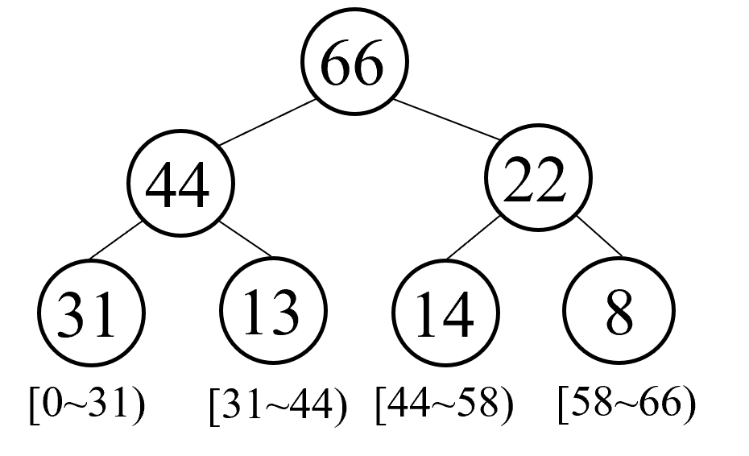
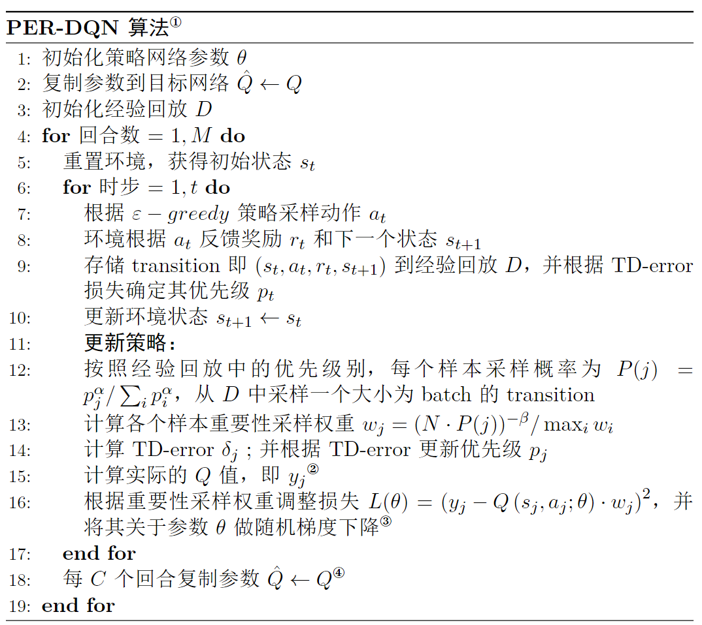

# 第 8 章 DQN算法进阶

$\qquad$ 本章将介绍一些基于 $\text{DQN}$ 改进的一些算法。这些算法改进的角度各有不同，例如， $\text{Double DQN}$ 以及 $\text{Dueling DQN}$ 等算法主要从网络模型层面改进，而 $\text{PER DQN}$ 则从经验回放的角度来改进。尽管这些算法看起来各有不同，但是本质上都是通过提高预测的精度和控制过程中的探索度来改善 $\text{DQN}$ 算法的性能。并且这些算法用到的技巧也都是比较通用的，读者可以根据自己的需求进行灵活的组合。

## 8.1 Double DQN 算法

$\qquad$ $\text{Double DQN}$ 算法<sup>①</sup>是谷歌 $\text{DeepMind}$ 于 $\text{2015}$ 年 $\text{12}$ 月提出的一篇论文，主要贡献是通过引入两个网络用于解决 $Q$ 值过估计（ $\text{overestimate}$ ）的问题。顺便说一句，这里两个网络其实跟前面 $\text{DQN}$ 算法讲的目标网络是类似的，读者可能会产生混淆。

$\qquad$ 实际上它们之间的关系是这样的，我们知道 $\text{DQN}$ 分别于 $\text{2013}$ 和 $\text{2015}$ 年提出了两个版本，后者就是目前较为成熟的 $\text{Nature DQN}$ 版本，前者就是单纯在 $\text{Q-learning}$ 算法基础上引入了深度网络而没有额外的技巧。而在中间的过程中 $\text{Double DQN}$ 算法被提出，因此 $\text{Nature DQN}$ 在发表的时候也借鉴了 $\text{Double DQN}$ 的思想，所以才会有目标网络的概念。尽管如此， $\text{Double DQN}$ 算法仍然有其独特的地方，因此我们还是将其单独拿出来讲。

> ① Hasselt H V , Guez A , Silver D .Deep Reinforcement Learning with Double Q-learning[J].Computer ence, 2015.DOI:10.48550/arXiv.1509.06461.


$\qquad$ 先回顾一下 $\text{DQN}$ 算法的更新公式，如式 $\text{(8.1)}$ 所示。

$$
\tag{8.1}
Q_{\theta}(s_t,a_t) \leftarrow Q_{\theta}(s_t,a_t)+\alpha[r_t+\gamma\max _{a}Q_{\hat{\theta}}(s_{t+1},a_{t+1})-Q_{\theta}(s_t,a_t)]
$$

$\qquad$ 其中 $y_t = r_t+\gamma\max _{a}Q_{\hat{\theta}}(s_{t+1},a_{t+1})$ 是估计值，注意这里的 $Q_{\hat{\theta}}$ 指的是目标网络。这个意思就是直接拿目标网络中各个动作对应的最大的 $Q$ 值来当作估计值，这样一来就会存在过估计的问题。为了解决这个问题， $\text{Double DQN}$ 算法提出了一个很简单的思路，就是现在当前网络中找出最大 $Q$ 值对应的动作，然后再将这个动作代入到目标网络中去计算 $Q$ 值，如式 $\text{(8.2)}$ 所示。

$$
\tag{8.2}
a^{max}_{\theta}(s_{t+1}) = \arg \max _{a}Q_{\theta}(s_{t+1},a)
$$

然后将这个找出来的动作代入到目标网络里面去计算目标的 $Q$ 值，进而计算估计值，如式 $\text{(8.3)}$ 所示。

$$
\tag{8.3}
y_t = r_t+\gamma\max _{a}Q_{\hat{\theta}}(s_{t+1},a^{max}_{\theta}(s_{t+1}))
$$

$\qquad$ 这样做相当于是把动作选择和动作评估这两个过程分离开来，从而减轻了过估计问题。为了方便读者理解，我们接着用皇帝与大臣的例子来举例说明为什么 $\text{Double DQN}$ 算法能够估计得更准确。我们知道在 $\text{Nature DQN}$ 算法中策略网络直接与环境交互相当于大臣们搜集情报，然后定期更新到目标网络的过程相当于大臣向皇帝汇报然后皇帝做出最优决策。

$\qquad$ 在 $\text{Nature DQN}$ 算法中，大臣是不管好的还是坏的情报都会汇报给皇帝的，而在 $\text{Double DQN}$ 算法中大臣会根据自己的判断将自己认为最优的情报汇报给皇帝，即先在策略网络中找出最大 $Q$ 值对应的动作。这样一来皇帝这边得到的情报就更加精简并且质量更高了，以便于皇帝做出更好的判断和决策，也就是估计得更准确了。

$\qquad$ 注意，虽然 $\text{Double DQN}$ 算法和  $\text{Nature DQN}$ 算法都用了两个网络，但实际上 $\text{Double DQN}$ 算法训练方式是略有不同的。$\text{Double DQN}$ 并不是每隔 $C$ 步复制参数到目标网络，而是每次随机选择其中一个网络选择动作进行更新。假设两个网络分别为 $Q^A$ 和 $Q^B$ ，那么在更新 $Q_A$ 的时候就用把 $Q^B$ 当作目标网络估计动作值，同时 $Q_A$ 也是用来选择动作的，如式 $\text{(8.4)}$ 所示，反之亦然。

$$
\tag{8.4}
\begin{split}
a^* = \arg \max _{a}Q^A(s_{t},a) \\
Q^A(s_{t},a) \leftarrow Q^A(s_{t},a)+\alpha[r_t+\gamma Q^B(s_{t+1},a^*)-Q^A(s_{t},a)]
\end{split}
$$

$\qquad$ 但其实这种训练方式的效果跟单纯每隔 $C$ 步复制参数到目标网络的方式差不多，而且后者更加简单，所以实践中一般都是采用后者。

## 8.2 Dueling DQN 算法

$\qquad$ 在 $\text{Double DQN}$ 算法中我们是通过改进目标 $Q$ 值的计算来优化算法的，而在 $\text{Dueling DQN}$ 算法<sup>②</sup>中则是通过优化神经网络的结构来优化算法的。

> ② Wang, Z., Schaul, T., Hessel, M., van Hasselt, H., Lanctot, M. & de Freitas, N. (2015). Dueling Network Architectures for Deep Reinforcement Learning.s


$\qquad$ 回顾我们在 $\text{DQN}$ 算法所使用的最基础的网络结构，如图 $\text{8-1}$ 所示，它是一个全连接网络，包含一个输入层、一个隐藏层和输出层。输入层的维度为状态的维度，输出层的维度为动作的维度。

<div align=center>

</div>
<div align=center>图 $\text{8-1}$ $\text{DQN}$ 网络结构</div>

$\qquad$ 而 $\text{Dueling DQN}$ 算法中则是在输出层之前分流（ $\text{dueling}$ ）出了两个层，如图 $\text{8-2}$ 所示，一个是优势层（$\text{advantage layer}$），用于估计每个动作带来的优势，输出维度为动作数一个是价值层（$\text{value layer}$），用于估计每个状态的价值，输出维度为 $1$ 。

<div align=center>

</div>
<div align=center>图 $\text{8-2}$ $\text{Dueling DQN}$ 网络结构</div>

$\qquad$ 在 $\text{DQN}$ 算法中我们用 $Q_{\theta}(\boldsymbol{s},\boldsymbol{a})$ 表示 一个 $Q$ 网络，而在这里优势层可以表示为 $A_{\theta,\alpha}(\boldsymbol{s},\boldsymbol{a})$，这里 $\theta$ 表示共享隐藏层的参数，$\alpha$ 表示优势层自己这部分的参数，相应地价值层可以表示为 $V_{\theta,\beta}(\boldsymbol{s})$。这样 $\text{Dueling DQN}$ 算法中网络结构可表示为式 $\text{(8.5)}$ 。

$$
\tag{8.5}
Q_{\theta,\alpha,\beta}(\boldsymbol{s},\boldsymbol{a}) = A_{\theta,\alpha}(\boldsymbol{s},\boldsymbol{a}) + V_{\theta,\beta}(\boldsymbol{s})
$$

$\qquad$ 去掉这里的价值层即优势层就是普通的 $Q$ 网络了，另外我们会对优势层做一个中心化处理，即减掉均值，如式 $\text{(8.6)}$ 所示。

$$
\tag{8.6}
Q_{\theta,\alpha,\beta}(\boldsymbol{s},\boldsymbol{a}) = (A_{\theta,\alpha}(\boldsymbol{s},\boldsymbol{a})-\frac{1}{\mathcal{A}} \sum_{a \in \mathcal{A}} A_{\theta,\alpha}\left(\boldsymbol{s}, a\right)) - + V_{\theta,\beta}(\boldsymbol{s})
$$

$\qquad$ 其实 $\text{Dueling DQN}$ 的网络结构跟我们后面要讲的 $\text{Actor-Critic}$ 算法是类似的，这里优势层相当于 $\text{Actor}$ ，价值层相当于 $\text{Critic}$ ，不同的是在  $\text{Actor-Critic}$ 算法中 $\text{Actor}$ 和 $\text{Critic}$ 是独立的两个网络，而在这里是合在一起的，在计算量以及拓展性方面都完全不同，具体我们会在后面的  $\text{Actor-Critic}$ 算法对应章节中展开。

$\qquad$ 总的来讲，$\text{Dueling DQN}$ 算法在某些情况下相对于 $\text{DQN}$ 是有好处的，因为它分开评估每个状态的价值以及某个状态下采取某个动作的 $Q$ 值。当某个状态下采取一些动作对最终的回报都没有多大影响时，这个时候 $\text{Dueling DQN}$ 这种结构的优越性就体现出来了。或者说，它使得目标值更容易计算，因为通过使用两个单独的网络，我们可以隔离每个网络输出上的影响，并且只更新适当的子网络，这有助于降低方差并提高学习鲁棒性。

## 8.3 Noisy DQN 算法

$\qquad$ $\text{Noisy DQN}$ 算法<sup>③</sup> 也是通过优化网络结构的方法来提升 $\text{DQN}$ 算法的性能，但与 $\text{Dueling DQN}$ 算法不同的是，它的目的并不是为了提高 $Q$ 值的估计，而是增强网络的探索能力。

> ③ Fortunato M , Azar M G , Piot B ,et al.Noisy Networks for Exploration[J].  2017.DOI:10.48550/arXiv.1706.10295.

$\qquad$ 从 $\text{Q-learning}$ 算法开始，我们就讲到了探索-利用平衡的问题，常见的 $\varepsilon-\text{greedy}$ 策略是从智能体与环境的交互过程改善探索能力，以避免陷入局部最优解。而在深度强化学习中，由于引入了深度学习，深度学习本身也会因为网络模型限制或者梯度下降方法陷入局部最优解问题。也就是说，深度强化学习既要考虑与环境交互过程中的探索能力，也要考虑深度模型本身的探索能力，从而尽量避免陷入局部最优解的困境之中，这也是为什么经常有人会说强化学习比深度学习更难“炼丹”的原因之一。

$\qquad$ 回归正题，$\text{Noisy DQN}$ 算法其实是在 $\text{DQN}$ 算法基础上在神经网络中引入了噪声层来提高网络性能的，即将随机性应用到神经网络中的参数或者说权重，增加了 $Q$ 网络对于状态和动作空间的探索能力，从而提高收敛速度和稳定性。在实践上也比较简单，就是通过添加随机性参数到神经网络的线性层，对应的 $Q$ 值则可以表示为 $Q_{\theta+\epsilon}$，注意不要把这里的 $\text{epsilon}$ 跟 $\varepsilon-greedy$ 策略中的 $\varepsilon$ 混淆了。虽然都叫做 $\epsilon$ ，但这里 $\epsilon$ 是由高斯分布生成的总体分类噪声参数。

$\qquad$ 其实在网络模型中增加噪声层是一种比较泛用的做法，而不只是用在 $\text{DQN}$ 算法中，具体做法读者可以参考后面的实战内容。

## 8.4 PER DQN 算法

$\qquad$ 在 $\text{DQN}$ 算法章节中我们了解到，$\text{DQN}$ 算法通常使用经验回放（$\text{experience replay}$）来提高算法的性能，即通过存储智能体与环境交互的经验，然后从中随机采样一批样本用于训练。这样做的好处是可以减少样本之间的相关性，从而提高训练的效率和稳定性。然而，这样的经验回放也会存在一个问题，即它采用的是均匀采样和批量更新的方法，这就导致一些特别少但是价值可能特别高的经验或者样本没有被高效地利用到，从而影响算法的收敛性。

$\qquad$ 为了解决这个问题，$\text{PER DQN}$ 算法<sup>④</sup> 提出了一种新的经验回放，即优先经验回放（$\text{prioritized experience replay}$），通过引入优先级采样的方法，使得经验回放中的样本可以根据其重要性来进行采样，这样不仅能提升算法的效果，还可以加快学习速度。那么具体要用什么衡量标准来被采样数据的优先级呢？答案通常是 $\text{TD}$ 误差。我们最开始是在时序差分方法章节中提到 $\text{TD}$ 误差这个概念的，它指的是当前 $Q$ 值和目标 $Q$ 值的差值，**这个差值越大表示该样本对网络参数的更新越有帮助**。也就是说，如果我们每次贪婪地采样 $\text{TD}$ 误差最大的样本，那么理论上我们的算法会更快地收敛，这也是 $\text{PER DQN}$ 算法的核心思想。但随之而来也会面临一些问题，比如采样偏差问题，这个问题我们会在后面讲到。

> ④ Schaul T , Quan J , Antonoglou I ,et al.Prioritized Experience Replay[J].Computer Science, 2015.DOI:10.48550/arXiv.1511.05952.

$\qquad$ 我们先讲讲具体如何实现优先经验回放。在实践中，我们通常用 $\text{SumTree}$ 这样的二叉树结构来实现。这里建议没有了解过数据结构或的读者先快速了解一下相关的基本概念，比如根节点、叶节点、父节点与子节点等等。

$\qquad$ 如图 $\text{8-3}$ 所示，每个父节点的值等于左右两个子节点值之和。在强化学习中，所有的样本只保存在最下面的叶子节点中，并且除了保存样本数据之外，还会保存对应的优先级，即对应叶子节点中的值（例如图中的 $\text{31,13,14}$ 以及 $8$ 等，也对应样本的 $\text{TD}$ 误差）。并且根据叶子节点的值，我们从 $0$ 开始依次划分采样区间。然后在采样中，例如这里根节点值为 $66$ ，那么我们就可以在 $[0,66)$ 这个区间均匀采样，采样到的值落在哪个区间中，就说明对应的样本就是我们要采样的样本。例如我们采样到了 $25$ 这个值，即对应区间 $[0,31)$，那么我们就采样到了第一个叶子节点对应的样本。

$\qquad$ 注意到，第一个样本对应的区间也是最长的，这意味着第一个样本的优先级最高，也就是 $\text{TD}$ 误差最大，反之第四个样本的区间最短，优先级也最低。这样一来，我们就可以通过采样来实现优先经验回放的功能。

<div align=center>

</div>
<div align=center>图 $\text{8-3}$ $\text{SumTree}$ 结构</div>

$\qquad$ 每个叶节点的值就是对应样本的 $\text{TD}$ 误差（例如途中的）。我们可以通过根节点的值来计算出每个样本的 $\text{TD}$ 误差占所有样本 $\text{TD}$ 误差的比例，这样就可以根据比例来采样样本。在实际的实现中，我们可以将每个叶节点的值设置为一个元组，其中包含样本的 $\text{TD}$ 误差和样本的索引，这样就可以通过索引来找到对应的样本。具体如何用 $\text{Python}$ 类来实现 $\text{SumTree}$ 结构，读者可以参考后面的实战内容。

$\qquad$ 尽管 $\text{SumTree}$ 结构可以实现优先经验回放的功能。然而直接使用 $\text{TD}$ 误差作为优先级存在一些问题。首先，考虑到算法效率问题，我们在每次更新时不会把经验回放中的所有样本都计算 $\text{TD}$ 误差并更新对应的优先级，而是只更新当前取到的一定批量的样本。这样一来，每次计算的 $\text{TD}$ 误差是对应之前的网络，而不是当前待更新的网络。

$\qquad$ 换句话说，如果某批量样本的 $\text{TD}$ 误差较低，只能说明它们对于之前的网络来说“信息量”不大，但不能说明对当前的网络“信息量”不大，因此单纯根据 $\text{TD}$ 误差进行优先采样有可能会错过对当前网络“信息量”更大的样本。其次，被选中样本的 $\text{TD}$ 误差会在当前更新后下降，然后优先级会排到后面去，下次这些样本就不会被选中，这样来来回回都是那几个样本，很容易出现“旱的旱死，涝的涝死”的情况，导致过拟合。

$\qquad$ 为了解决上面提到的两个问题，我们首先引入**随机优先级采样**（ $\text{stochastic prioritization}$ ）的技巧。即在每次更新时，我们不再是直接采样 $\text{TD}$ 误差最大的样本，而是定义一个采样概率，如式 $\text{(8.7)}$ 所示。

$$
\tag{8.7}
P(i) = \frac{p_i^\alpha}{\sum_k p_k^\alpha}
$$

$\qquad$ 其中，$p_i$ 是样本 $i$ 的优先级，$\alpha$ 是一个超参数，用于调节优先采样的程序，通常在 $(0,1)$ 的区间内。当 $\alpha=0$ 时，采样概率为均匀分布；当 $\alpha =1$ 时，采样概率为优先级的线性分布。同时，即使对于最低优先级的样本，我们也不希望它们的采样概率为 $0$ ，因此我们可以在优先级上加上一个常数 $\epsilon$，即式 $\text{(8.8)}$ 。

$$
\tag{8.8}
p_i = |\delta_i| + \epsilon
$$

$\qquad$ 其中，$|\delta_i|$ 是样本 $i$ 的 $\text{TD}$ 误差。当然，我们也可以使用其他的优先级计算方式，如式 $\text{(8.9)}$ 所示。

$$
\tag{8.9}
p_i = \frac{1}{rank(i)}
$$

$\qquad$ 其中 $rank(i)$ 是样本 $i$ 的优先级排名，这种方式也能保证每个样本的采样概率都不为 $0$ ，但在实践中，我们更倾向于直接增加一个常数 $\epsilon$ 的方式。

$\qquad$ 除了随机优先级采样之外，我们还引入了另外一个技巧，在讲解该技巧之前，我们需要简单了解一下**重要性采样**，这个概念在后面的 $\text{PPO}$ 算法也会用到，读者需要重点掌握。重要性采样（$\text{importance sampling}$ ）是一种用于估计某一分布性质的方法，它的基本思想是，我们可以通过与待估计分布不同的另一个分布中采样，然后通过采样样本的权重来估计待估计分布的性质，数学表达式如式 $\text{(8.10)}$ 所示。

$$
\tag{8.10}
\begin{aligned}
\mathbb{E}_{x \sim p(x)}[f(x)] &= \int f(x) p(x) dx \\
&= \int f(x) \frac{p(x)}{q(x)} q(x) dx \\
&= \int f(x) \frac{p(x)}{q(x)} \frac{q(x)}{p(x)} p(x) dx \\
&= \mathbb{E}_{x \sim q(x)}\left[\frac{p(x)}{q(x)} f(x)\right]
\end{aligned}
$$

$\qquad$ 其中 $p(x)$ 是待估计分布，$q(x)$ 是采样分布，$f(x)$ 是待估计分布的性质。在前面我们讲到，每次计算的 $\text{TD}$ 误差是对应之前的网络，而不是当前待更新的网络。也就是说，我们已经从之前的网络中采样了一批样本，也就是 $q(x)$ 已知，然后只要找到之前网络分布与当前网络分布之前的权重 $\frac{p(x)}{q(x)}$，就可以利用重要性采样来估计出当前网络的性质。我们可以定义权重为式 $\text{(8.11)}$ 。

$$
\tag{8.11}
w_i = \left(\frac{1}{N} \frac{1}{P(i)}\right)^\beta
$$

其中，$N$ 是经验回放中的样本数量，$P(i)$ 是样本 $i$ 的采样概率。同时，为了避免出现权重过大或过小的情况，我们可以对权重进行归一化处理，如式 $\text{(8.12)}$ 所示。

$$
\tag{8.12}
w_i = \frac{\left(N*P(i)\right)^{-\beta}}{\max_j (w_j)}
$$

$\qquad$ 注意到，我们引入了一个超参数 $\beta$，用于调节重要性采样的程度。当 $\beta = 0$ 时，重要性采样的权重为 1，即不考虑重要性采样；当 $\beta = 1$ 时，重要性采样的权重为 $w_i$，即完全考虑重要性采样。在实践中，我们希望 $\beta$ 从 0 开始，随着训练步数的增加而逐渐增加，以便更好地利用重要性采样，这就是热偏置（$\text{annealing the bias}$）的思想。数学表达式如式 $\text{(8.13)}$ 所示。

$$
\tag{8.13}
\beta = \min(1, \beta + \beta_{\text{step}})
$$

$\qquad$ 其中，$\beta_{\text{step}}$ 是每个训练步数对应的 $\beta$ 的增量。在实践中，我们可以将 $\beta_{\text{step}}$ 设置为一个很小的常数，如 $0.0001$。这样一来，我们就可以在训练刚开始时，使用随机优先级采样，以便更快地收敛；在训练后期，使用重要性采样，以便更好地利用经验回放中的样本。

## 8.5 C51 算法

$\text{C51}$ 算法，又称 $\text{Categorical DQN}$，是一种值分布强化学习($\text{Distributed RL}$)算法。经典基于值的强化学习算法如 $\text{DQN}$ 等使用期望值对累计回报进行建模，表示为状态价值函数 $V(s)$ 或 动作价值函数 $Q(s,a)$。 然而，这种建模方式丢失了完整的分布信息，**降低了价值估计的精度和稳定性**。为了解决这个问题，$\text{C51}$ 的使用值分布 $Z(x,a)$ 来替代原有的值函数 $Q(s,a)$，这样就能更好地处理值函数估计不准确以及离散动作空间的问题。

> ⑤ 论文链接：https://arxiv.org/abs/1707.06887

在之前讲到的经典强化学习算法中我们优化的其实是值分布的均值，也就是 $Q$ 函数，但实际上由于状态转移的随机性、函数近似等原因，智能体与环境之间也存在着随机性，这也导致了最终累积的回报也会是一个随机变量，使用一个确定的均值会忽略整个分布所提供的信息。。因此，我们可以将值函数 $Q$ 看成是一个随机变量，它的期望值就是 $Q$ 函数，而它的方差就是 $Q$ 函数的不确定性，公式表示如下：

$$
Q^\pi(x, a):=\mathbb{E} Z^\pi(x, a)=\mathbb{E}\left[\sum_{t=0}^{\infty} \gamma^t R\left(x_t, a_t\right)\right]
$$

其中状态分布 $x_t \sim P\left(\cdot \mid x_{t-1}, a_{t-1}\right), a_t \sim \pi\left(\cdot \mid x_t\right), x_0=x, a_0=a \text {. }$

### 8.5.1 优缺点

$\text{C51}$ 算法的主要优点是：

* **提高价值估计的准确性**：通过建模值函数的分布而非单一 $Q$ 值，能够捕捉回报的波动性和不确定性，从而提高估计的精度
* **提高算法的鲁棒性**：值分布建模能够让算法对噪声和环境变化更具鲁棒性，有助于减少过拟合和提高泛化能力。

$\text{C51}$ 算法的主要缺点是：
* **计算复杂度增加**：由于需要维护和更新每个状态-动作对的完整概率分布，因此增加了算法的计算复杂度和内存开销。
* **参数调优困难**：原子分布的数量 $N$ 需要事先确定，这个数量的选择对算法的性能有很大影响，但很难事先确定一个合适的值。
* **实践性困难**：理论上值分布是能够有效学习回报分布，但实际上由于环境的复杂性和神经网络的局限性，值分布的学习往往并不理想。

## Rainbow DQN 算法
 
## 实战：Double DQN 算法

$\qquad$ 由于本章都是基于 $\text{DQN}$ 改进的算法，整体训练方式跟 $\text{DQN}$ 是一样的，也就是说伪代码基本都是一致的，因此不再赘述，只讲算法的改进部分。而 $\text{Double DQN}$ 算法跟 $\text{DQN}$ 算法的区别在于目标值的计算方式，如代码清单 $\text{8-1}$ 所示。

<div style="text-align: center;">
    <figcaption> 代码清单 $\text{8-1}$ $\text{Double DQN}$目标值的计算 </figcaption>
</div>

```python
# 计算当前网络的Q值，即Q(s_t+1|a)
next_q_value_batch = self.policy_net(next_state_batch)
# 计算目标网络的Q值，即Q'(s_t+1|a)
next_target_value_batch = self.target_net(next_state_batch)
# 计算 Q'(s_t+1|a=argmax Q(s_t+1|a))
next_target_q_value_batch = next_target_value_batch.gather(1, torch.max(next_q_value_batch, 1)[1].unsqueeze(1)) 
```

$\qquad$ 最后与 $\text{DQN}$ 算法相同，可以得到 $\text{Double DQN}$ 算法在 $\text{CartPole}$ 环境下的训练结果，如图 $\text{8-5}$ 所示，完整的代码可以参考本书的代码仓库。

<div align=center>

</div>
<div align=center>图 $\text{8-5}$ $\text{CartPole}$ 环境 $\text{Double DQN}$ 算法训练曲线</div>

$\qquad$ 与 $\text{DQN}$ 算法的训练曲线对比可以看出，在实践上 $\text{Double DQN}$ 算法的效果并不一定比 $\text{DQN}$ 算法好，比如在这个环境下其收敛速度反而更慢了，因此读者需要多多实践才能摸索并体会到这些算法适合的场景。

## 实战：Dueling DQN 算法

$\qquad$ $\text{Dueling DQN}$ 算法主要是改了网络结构，其他地方跟 $\text{DQN}$ 是一模一样的，如代码清单 $\text{8-2}$ 所示。

<div style="text-align: center;">
    <figcaption> 代码清单 $\text{8-2}$ $\text{Dueling DQN}$ 网络结构 </figcaption>
</div>

```python
class DuelingQNetwork(nn.Module):
    def __init__(self, state_dim, action_dim,hidden_dim=128):
        super(DuelingQNetwork, self).__init__()
        # 隐藏层
        self.hidden_layer = nn.Sequential(
            nn.Linear(state_dim, hidden_dim),
            nn.ReLU()
        )
        #  优势层
        self.advantage_layer = nn.Sequential(
            nn.Linear(hidden_dim, hidden_dim),
            nn.ReLU(),
            nn.Linear(hidden_dim, action_dim)
        )
        # 价值层
        self.value_layer = nn.Sequential(
            nn.Linear(hidden_dim, hidden_dim),
            nn.ReLU(),
            nn.Linear(hidden_dim, 1)
        )
        
    def forward(self, state):
        x = self.hidden_layer(state)
        advantage = self.advantage_layer(x)
        value     = self.value_layer(x)
        return value + advantage - advantage.mean() # Q(s,a) = V(s) + A(s,a) - mean(A(s,a))
```

$\qquad$ 最后我们展示一下它在 $\text{CartPole}$ 环境下的训练结果，如图 $\text{8-6}$ 所示，完整的代码同样可以参考本书的代码仓库。

<div align=center>

</div>
<div align=center>图 $\text{8-5}$ $\text{CartPole}$ 环境 $\text{Dueling DQN}$ 算法训练曲线</div>

$\qquad$ 由于环境比较简单，暂时还看不出来 $\text{Dueling DQN}$ 算法的优势，但是在复杂的环境下，比如 $\text{Atari}$ 游戏中，$\text{Dueling DQN}$ 算法的效果就会比 $\text{DQN}$ 算法好很多，读者可以在 $\text{JoyRL}$ 仓库中找到更复杂环境下的训练结果便于更好地进行对比。

## 实战：Noisy DQN 算法

$\qquad$ $\text{Noisy DQN}$ 算法的核心思想是将 $\text{DQN}$ 算法中的线性层替换成带有噪声的线性层，如代码清单 $\text{8-3}$ 所示。

<div style="text-align: center;">
    <figcaption> 代码清单 $\text{8-3}$ 带有噪声的线性层网络 </figcaption>
</div>

```python
class NoisyLinear(nn.Module):
    '''在Noisy DQN中用NoisyLinear层替换普通的nn.Linear层
    '''
    def __init__(self, input_dim, output_dim, std_init=0.4):
        super(NoisyLinear, self).__init__()
        self.input_dim  = input_dim
        self.output_dim = output_dim
        self.std_init  = std_init
        self.weight_mu    = nn.Parameter(torch.empty(output_dim, input_dim))
        self.weight_sigma = nn.Parameter(torch.empty(output_dim, input_dim))
        # 将一个 tensor 注册成 buffer，使得这个 tensor 不被当做模型参数进行优化。
        self.register_buffer('weight_epsilon', torch.empty(output_dim, input_dim)) 
        
        self.bias_mu    = nn.Parameter(torch.empty(output_dim))
        self.bias_sigma = nn.Parameter(torch.empty(output_dim))
        self.register_buffer('bias_epsilon', torch.empty(output_dim))
        
        self.reset_parameters() # 初始化参数
        self.reset_noise()  # 重置噪声
    
    def forward(self, x):
        if self.training: 
            weight = self.weight_mu + self.weight_sigma * self.weight_epsilon
            bias   = self.bias_mu + self.bias_sigma * self.bias_epsilon
        else:
            weight = self.weight_mu
            bias   = self.bias_mu
        return F.linear(x, weight, bias)
    
    def reset_parameters(self):
        mu_range = 1 / self.input_dim ** 0.5
        self.weight_mu.data.uniform_(-mu_range, mu_range)
        self.weight_sigma.data.fill_(self.std_init / self.input_dim ** 0.5)
        self.bias_mu.data.uniform_(-mu_range, mu_range)
        self.bias_sigma.data.fill_(self.std_init / self.output_dim ** 0.5)
    
    def reset_noise(self):
        epsilon_in  = self._scale_noise(self.input_dim)
        epsilon_out = self._scale_noise(self.output_dim)
        self.weight_epsilon.copy_(epsilon_out.ger(epsilon_in))
        self.bias_epsilon.copy_(self._scale_noise(self.output_dim))
    
    def _scale_noise(self, size):
        x = torch.randn(size)
        x = x.sign().mul(x.abs().sqrt())
        return x
```

$\qquad$ 根据写好的 $\text{NoisyLinear}$ 层，我们可以在 $\text{DQN}$ 算法中将普通的线性层替换为 $\text{NoisyLinear}$ 层，如代码清单 $\text{8-4}$ 所示。

<div style="text-align: center;">
    <figcaption> 代码清单 $\text{8-4}$ 带噪声层的全连接网络 </figcaption>
</div>

```python
class NoisyQNetwork(nn.Module):
    def __init__(self, state_dim, action_dim, hidden_dim=128):
        super(NoisyQNetwork, self).__init__()
        self.fc1 =  nn.Linear(state_dim, hidden_dim)
        self.noisy_fc2 = NoisyLinear(hidden_dim, hidden_dim)
        self.noisy_fc3 = NoisyLinear(hidden_dim, action_dim)
        
    def forward(self, x):
        x = F.relu(self.fc1(x))
        x = F.relu(self.noisy_fc2(x))
        x = self.noisy_fc3(x)
        return x

    def reset_noise(self):
        self.noisy_fc2.reset_noise()
        self.noisy_fc3.reset_noise()
```

$\qquad$ 注意在训练过程中，我们需要在每次更新后重置噪声，这样有助于提高训练的稳定性，更多细节请参考 $\text{JoyRL}$ 源码。另外，我们也可以直接利用 $\text{torchrl}$ 模块中中封装好的 $\text{NoisyLinear}$ 层来构建 $\text{Noisy Q}$ 网络，跟我们自己定义的功能是一样的，如代码清单 $\text{8-5}$ 所示。

<div style="text-align: center;">
    <figcaption> 代码清单 $\text{8-5}$ 使用 $\text{torchrl}$ 模块构造的 $\text{Noisy Q}$ 网络 </figcaption>
</div>

```python
import torchrl
class NoisyQNetwork(nn.Module):
    def __init__(self, state_dim, action_dim, hidden_dim=128):
        super(NoisyQNetwork, self).__init__()
        self.fc1 =  nn.Linear(state_dim, hidden_dim)
        self.noisy_fc2 = torchrl.NoisyLinear(hidden_dim, hidden_dim,std_init=0.1)
        self.noisy_fc3 = torchrl.NoisyLinear(hidden_dim, action_dim,std_init=0.1)
        
    def forward(self, x):
        x = F.relu(self.fc1(x))
        x = F.relu(self.noisy_fc2(x))
        x = self.noisy_fc3(x)
        return x

    def reset_noise(self):
        self.noisy_fc2.reset_noise()
        self.noisy_fc3.reset_noise()
```

$\qquad$ 同样我们展示一下它在 $\text{CartPole}$ 环境下的训练结果，如图 $\text{8-6}$ 所示。

<div align=center>

</div>
<div align=center>图 $\text{8-6}$ $\text{CartPole}$ 环境 $\text{Noisy DQN}$ 算法训练曲线</div>

## 实战：PER DQN 算法

### 伪代码

$\qquad$ $\text{PER DQN}$ 算法的核心看起来简单，就是把普通的经验回放改进成了优先级经验回放，但是实现起来却比较复杂，因为我们需要实现一个 $\text{SumTree}$ 结构，并且在模型更新的时候也需要一些额外的操作，因此我们先从伪代码开始，如图 $\text{8-7}$ 所示。


<div align=center>

</div>
<div align=center>图 $\text{8-7}$ $\text{PER DQN}$ 伪代码</div>

### SumTree 结构

$\qquad$ 如代码清单 $\text{8-6}$ 所示，我们可以先实现 $\text{SumTree}$ 结构。

<div style="text-align: center;">
    <figcaption> 代码清单 $\text{8-6}$ $\text{SumTree}$ 结构 </figcaption>
</div>

```python
class SumTree:
    def __init__(self, capacity):
        self.capacity = capacity
        self.tree = np.zeros(2 * capacity - 1) # 树的大小，叶节点数等于capacity
        self.data = np.zeros(capacity, dtype=object)
        self.data_pointer = 0

    def add(self, priority, data):
        '''向树中添加数据
        '''
        tree_idx = self.data_pointer + self.capacity - 1
        self.data[self.data_pointer] = data
        self.update(tree_idx, priority)
        self.data_pointer += 1
        if self.data_pointer >= self.capacity:
            self.data_pointer = 0

    def update(self, tree_idx, priority):
        '''更新树中节点的优先级
        '''
        change = priority - self.tree[tree_idx]
        self.tree[tree_idx] = priority
        while tree_idx != 0:
            tree_idx = (tree_idx - 1) // 2
            self.tree[tree_idx] += change

    def get_leaf(self, v):
        '''根据给定的值v，找到对应的叶节点
        '''
        parent_idx = 0
        while True:
            left_child_idx = 2 * parent_idx + 1
            right_child_idx = left_child_idx + 1
            if left_child_idx >= len(self.tree):
                leaf_idx = parent_idx
                break
            else:
                if v <= self.tree[left_child_idx]:
                    parent_idx = left_child_idx
                else:
                    v -= self.tree[left_child_idx]
                    parent_idx = right_child_idx
        data_idx = leaf_idx - self.capacity + 1
        return leaf_idx, self.tree[leaf_idx], self.data[data_idx]
    
    @property
    def max_priority(self):
        '''获取当前树中最大的优先级
        '''
        return self.tree[-self.capacity:].max()
        
    @property
    def total_priority(self):
        '''获取当前树中所有优先级的和
        '''
        return self.tree[0]

```
$\qquad$ 其中，除了需要存放各个节点的值`tree`之外，我们需要定义要给`data`来存放叶子节点的样本。此外，`add`函数用于添加一个样本到叶子节点，并更新其父节点的优先级；`update`函数用于更新叶子节点的优先级，并更新其父节点的优先级；`get_leaf`函数用于根据优先级的值采样对应区间的叶子节点样本；`get_data`函数用于根据索引获取对应的样本。

### 优先级经验回放

$\qquad$ 基于 $\text{SumTree}$ 结构，并结合优先级采样和重要性采样的技巧，如代码清单 $\text{8-7}$ 所示。

<div style="text-align: center;">
    <figcaption> 代码清单 $\text{8-7}$ 优先级经验回放结构 </figcaption>
</div>

```python
class ReplayBuffer:
    def __init__(self, cfg):
        self.capacity = cfg.buffer_size
        self.alpha = cfg.per_alpha
        self.beta = cfg.per_beta
        self.beta_increment_per_sampling = cfg.per_beta_increment_per_sampling
        self.epsilon = cfg.per_epsilon
        self.tree = SumTree(self.capacity)
        
    def push(self, transition):
        # max_prio = self.tree.tree[-self.tree.capacity:].max()
        max_prio = self.tree.max_priority
        if max_prio == 0:
            max_prio = 1.0
        self.tree.add(max_prio, transition)

    def sample(self, batch_size):
        self.beta = min(1.0, self.beta + self.beta_increment_per_sampling)
        minibatch = []
        idxs = []
        segment = self.tree.total_priority / batch_size
        priorities = []

        for i in range(batch_size):
            a = segment * i
            b = segment * (i + 1)
            s = np.random.uniform(a, b)
            idx, p, data = self.tree.get_leaf(s)
            minibatch.append(data)
            idxs.append(idx)
            priorities.append(p)

        sampling_probabilities = priorities / self.tree.total_priority
        is_weight = np.power(self.tree.capacity * sampling_probabilities, -self.beta)
        is_weight /= is_weight.max()

        batch = list(zip(*minibatch))
        return tuple(map(lambda x: np.array(x), batch)), idxs, is_weight

    def update_priorities(self, idxs, priorities):
        for idx, priority in zip(idxs, priorities):
            self.tree.update(idx, (np.abs(priority) + self.epsilon) ** self.alpha)

    def __len__(self):
        return len(self.tree.data)
```

$\qquad$ 我们可以看到，优先级经验回放的核心是 SumTree，它可以在 $O(\log N)$ 的时间复杂度内完成添加、更新和采样操作。在实践中，我们可以将经验回放的容量设置为 $10^6$，并将 $\alpha$ 设置为 $0.6$，$\epsilon$ 设置为 $0.01$，$\beta$ 设置为 $0.4$，$\beta_{\text{step}}$ 设置为 $0.0001$。 当然我们也可以利用 Python 队列的方式实现优先级经验回放，形式上会更加简洁，并且在采样的时候减少了 for 循环的操作，会更加高效，如代码清单 $\text{8-8}$ 所示。

<div style="text-align: center;">
    <figcaption> 代码清单 $\text{8-8}$ 基于队列实现优先级经验回放 </figcaption>
</div>

```python
class PrioritizedReplayBufferQue:
    def __init__(self, cfg):
        self.capacity = cfg.buffer_size
        self.alpha = cfg.per_alpha # 优先级的指数参数，越大越重要，越小越不重要
        self.epsilon = cfg.per_epsilon # 优先级的最小值，防止优先级为0
        self.beta = cfg.per_beta # importance sampling的参数
        self.beta_annealing = cfg.per_beta_annealing # beta的增长率
        self.buffer = deque(maxlen=self.capacity)
        self.priorities = deque(maxlen=self.capacity)
        self.count = 0 # 当前存储的样本数量
        self.max_priority = 1.0
    def push(self,exps):
        self.buffer.append(exps)
        self.priorities.append(max(self.priorities, default=self.max_priority))
        self.count += 1
    def sample(self, batch_size):
        priorities = np.array(self.priorities)
        probs = priorities/sum(priorities)
        indices = np.random.choice(len(self.buffer), batch_size, p=probs)
        weights = (self.count*probs[indices])**(-self.beta)
        weights /= weights.max()
        exps = [self.buffer[i] for i in indices]
        return zip(*exps), indices, weights
    def update_priorities(self, indices, priorities):
        priorities = np.abs(priorities)
        priorities = (priorities + self.epsilon) ** self.alpha
        priorities = np.minimum(priorities, self.max_priority).flatten()
        for idx, priority in zip(indices, priorities):
            self.priorities[idx] = priority
    def __len__(self):
        return self.count
```
$\qquad$ 最后，我们可以将优先级经验回放和 $\text{DQN}$ 结合起来，实现一个带有优先级的 $\text{DQN}$ 算法，并展示它在 $\text{CartPole}$ 环境下的训练结果，如图 $\text{8-8}$ 所示。

<div align=center>

</div>
<div align=center>图 $\text{8-8}$ $\text{CartPole}$ 环境 $\text{PER DQN}$ 算法训练曲线</div>

## 本章小结

$\qquad$ 本章主要讲解了 $\text{DQN}$ 的一些改进算法，主要解决 $Q$ 值过估计、探索策略差等问题，其中有些技巧是比较通用的，例如 $\text{Noisy DQN}$ 算法中再神经网络引入噪声来提高探索策略。读者在学习的过程中，一定要注意技巧本身的使用方式与泛用性，而不是作为单独的算法来看待。

## 练习题

1. $\text{DQN}$ 算法为什么会产生 $Q$ 值的过估计问题？
2. 同样是提高探索，$\text{Noisy DQN}$ 和  $\varepsilon-\text{greedy}$ 策略 有什么区别？