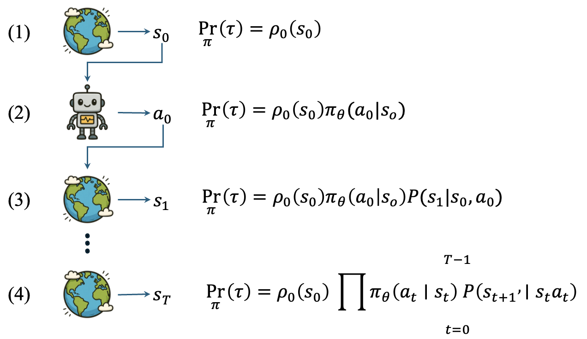
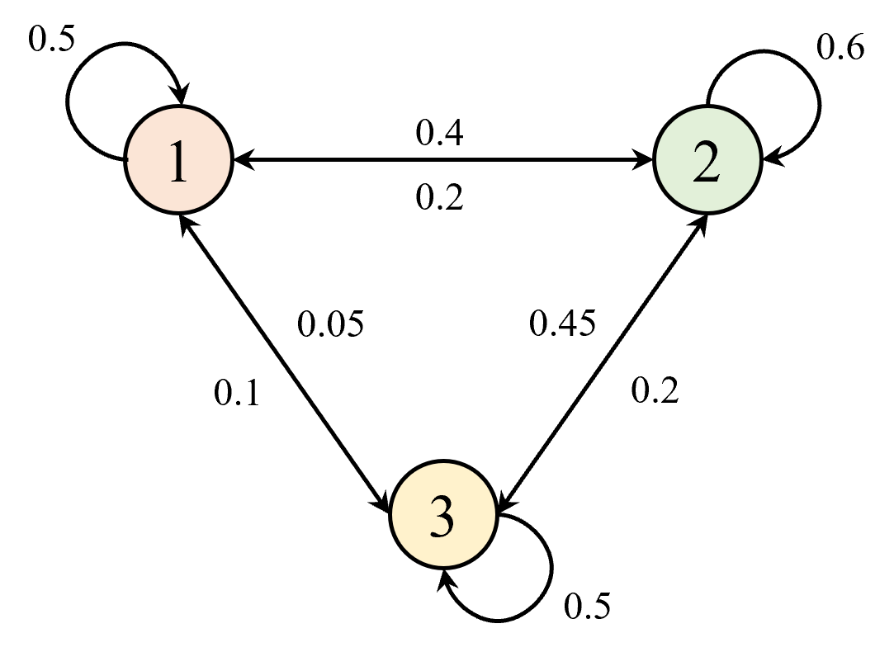
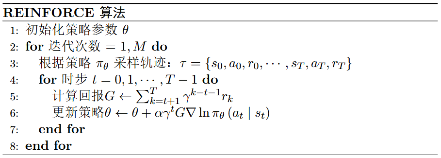

## 基础概念

一些帮助理解文章的关键符号或名词说明，见表 1 。

<div style="text-align: center;">
    <figcaption style="font-size: 14px;"> <b>表 1 符号说明</b> </figcaption>
</div>

|     符号      | 说明 |
| :-----------: | :------: |
| $S_t,A_t,R_t$ | 强调一段轨迹中第 $t$ 步的状态、动作、奖励，有时也写作$s_t,a_t,r_t$，大写更强调随机变量 |
| $Pr$ | 某个事件的概率，以区分与状态转移矩阵 $P$ |
| $G_t$ | 回报（ $\text{Return}$ ），指从时间步 $t$ 开始的未来（折扣）奖励和 |
| $\text{rollout}$ | 从某个初始状态出发，根据当前策略与环境交互，采样出一整条轨迹的过程。 |


## 策略参数化

基于策略梯度的方法首先需要将策略参数化，即直接将策略 $\pi$ 参数化为 $\pi_\theta(a|s)$，其中 $\theta$ 是策略的参数，表示在状态 $s$ 下选择动作 $a$ 的概率，并且处处可微。简而言之，**参数化策略是一个处处可微的概率分布**。

然后，目标函数就可表示为 $J(\pi_\theta)$ ，即是一个关于参数 $\theta$ 的函数。为了最大化目标函数 $J(\pi_\theta)$ ，可以使用梯度上升法，即通过计算目标函数关于参数 $\theta$ 的梯度 $\nabla_\theta J(\pi_\theta)$ 来更新参数 $\theta$ ，如式 $\eqref{eq:grad_ascent}$ 所示。
$$
\begin{equation}
\label{eq:grad_ascent}
\theta \leftarrow \theta + \alpha \nabla_\theta J(\pi_\theta)
\end{equation}
$$

通常为了方便，会将梯度上升法转化为梯度下降法，即通过最小化目标函数的负值来更新参数 $\theta$ ，如式 $\eqref{eq:grad_descent}$ 所示。

$$
\begin{equation}
\label{eq:grad_descent}
\theta \leftarrow \theta - \alpha \nabla_\theta (-J(\pi_\theta))
\end{equation}
$$

也就是说，只要能定义出目标函数 $J(\pi_\theta)$ 并求出其梯度 $\nabla_\theta J(\pi_\theta)$ ，就能利用梯度下降法来更新参数 $\theta$ ，从而使得策略 $\pi_\theta$ 逐步逼近最优策略 $\pi^{*}$ 。

怎么定义关于策略的目标函数 $J(\pi_\theta)$ 呢？可以围绕**最大化长期回报**这一核心思想来展开。具体地，可以从两个角度来定义，一是基于轨迹概率密度的方式，二是基于平稳分布或状态访问分布的方式，也叫做占用测度（ $\text{occupancy measure}$ ）推导，下面将分别介绍这两种推导方式。

## 基于轨迹推导

### 轨迹概率密度

智能体与环境交互过程中，首先环境会返回一个初始状态 $s_0$ , 然后智能体观测到当前状态并执行动作 $a_0$ 。与此同时，环境会反馈一个奖励 $r_0$，并返回下一个状态 $s_1$，智能体再相应地执行动作 $a_1$，环境返回奖励 $r_1$ 和下一个状态 $s_2$，如此反复进行下去，直至终止状态 $s_T$ 。注意，这里通常假设是有终止状态的，即有限马尔可夫决策过程（ $\text{Finite MDP}$ ）。

这样完整的有限步数的交互过程，称为一个 **回合**（ $\text{episode}$ ），回合最大步数用 $T$ 表示 (也叫作 $\text{Horizon}$ <sup>②</sup>)。把所有状态、动作和奖励组合起来的一个序列，称为 **轨迹**（ $\text{trajectory}$ ），如式 $\eqref{eq:7}$ 所示。

$$
\begin{equation}\label{eq:7}
\tau=\left\{s_{0}, a_{0}, r_{0}, s_{1}, a_{1}, r_{1}, \cdots, s_{T}, a_{T}, r_{T}\right\}
\end{equation}
$$

> ② 参考自CS234，该词出现频率不算高，了解即可


为了计算轨迹产生的概率，我们可以先具体展开轨迹产生的路径。如图 1 所示，首先环境会从初始状态分布中采样出一个初始状态 $s_0$ ，对应的概率为 $\rho_0(s_0)$ 。然后智能体在状态 $s_0$ 下根据策略 $\pi_\theta(a|s)$ 采样出一个动作 $a_0$ ，对应的概率就是策略函数对应的值，即 $\pi_\theta(a_0|s_0)$ ，接着环境根据状态转移概率 $P(s^{\prime}|s, a)$ 采样出下一个状态 $s_1$ ，对应的概率为 $P(s_1|s_0, a_0)$ 。此时对应的轨迹序列为 $\tau = \{s_0, a_0, s_1\}$ ，根据条件概率可知，该轨迹产生的概率为 $\Pr(\tau) = \rho_0(s_0) \pi_\theta(a_0|s_0) P(s_1|s_0, a_0)$ 。 

<div align=center>

<figcaption style="font-size: 14px;">图 1 轨迹概率的计算</figcaption>
</div>

以此类推，可得完整轨迹的概率计算如式 $\eqref{eq:8}$ 所示。

$$
\begin{equation}\label{eq:8}
\Pr_{\pi}(\tau) = \rho_0(s_0) \prod_{t=0}^{T-1} \pi_\theta(a_t|s_t) P(s_{t+1}|s_t, a_t)
\end{equation}
$$

可以看出，轨迹概率确实可以写成关于策略 $\pi_\theta(a|s)$ 或者策略参数 $\theta$ 的函数，如式 $\eqref{eq:9}$ 所示。

$$
\begin{equation}\label{eq:9}
\Pr_{\pi}(\tau) = p_\theta(\tau)
\end{equation}
$$

给定策略 $\pi_\theta$ ，产生的轨迹可能会有很多种，因此对于式 $\eqref{eq:9}$ 更准确的表述是轨迹概率的分布，即轨迹概率密度。记每条的轨迹对应的回报为 $R(\tau)$ ，根据全概率公式可知，目标函数 $J(\pi_\theta)$ 可以表示为轨迹概率密度与对应回报的乘积在所有轨迹上的积分，如式 $\eqref{eq:10}$ 所示。

$$
\begin{equation}\label{eq:10}
J(\pi_\theta)=\int_{\tau} p_\theta(\tau) R(\tau) d \tau = \mathbb{E}_{\tau \sim p_\theta(\tau)}[R(\tau)]
\end{equation}
$$

### 对数导数技巧

为了最大化目标函数 $J(\pi_\theta)$ ，可以使用梯度上升法，即通过计算目标函数关于参数 $\theta$ 的梯度 $\nabla_\theta J(\pi_\theta)$ 来更新参数 $\theta$ ，如式 $\eqref{eq:11}$ 所示。

$$
\begin{equation}\label{eq:11}
\theta \leftarrow \theta + \alpha \nabla_\theta J(\pi_\theta)
\end{equation}
$$

实际运用中为了方便，会将梯度上升法转化为梯度下降法，即通过最小化目标函数的负值来更新参数 $\theta$ ，如式 $\eqref{eq:12}$ 所示。

$$
\begin{equation}\label{eq:12}
\theta \leftarrow \theta - \alpha \nabla_\theta (-J(\pi_\theta))
\end{equation}
$$

但无论哪种方式，关键都是要计算梯度 $\nabla_\theta J(\pi_\theta)$ 。根据式 $\eqref{eq:10}$ 可知，梯度 $\nabla_\theta J(\pi_\theta)$ 的计算如式 $\eqref{eq:13}$ 所示。

$$
\begin{equation}\label{eq:13}
\nabla_\theta J(\pi_\theta) = \nabla_\theta \int_{\tau} p_\theta(\tau) R(\tau) d \tau = \int_{\tau} \nabla_\theta p_\theta(\tau) R(\tau) d \tau
\end{equation}
$$

其中 $R(\tau)$ 一般不会是参数 $\theta$ 的函数，因此可以直接提到积分号外面。接下来，关键是要计算 $\nabla_\theta p_\theta(\tau)$ 。然而，根据式 $\eqref{eq:9}$ 可知，轨迹概率密度 $p_\theta(\tau)$ 是一个连乘积项，直接对其求导会比较复杂。为此，可以使用 **对数导数技巧**（ $\text{log-derivative trick}$ ）来简化计算过程。该技巧的核心思想是通过对数函数的链式法则来将导数从概率密度函数 $p_\theta(\tau)$ 转移到对数概率密度函数 $\log p_\theta(\tau)$ 上，从而简化计算。具体来说，利用对数函数的导数性质，有式 $\eqref{eq:14}$ 。

$$
\begin{equation}\label{eq:14}
\begin{aligned}
\nabla_\theta \log p_\theta(\tau) &= \frac{\nabla_\theta p_\theta(\tau)}{p_\theta(\tau)} \\
\implies \nabla_\theta p_\theta(\tau) &= p_\theta(\tau) \nabla_\theta \log p_\theta(\tau)
\end{aligned}
\end{equation}
$$

将式 $\eqref{eq:14}$ 代入式 $\eqref{eq:13}$ 中，可得梯度 $\nabla_\theta J(\pi_\theta)$ 的计算如式 $\eqref{eq:15}$ 所示。

$$
\begin{equation}\label{eq:15}
\begin{aligned}
\nabla_\theta J(\pi_\theta) = \int_{\tau} p_\theta
(\tau) \nabla_\theta \log p_\theta(\tau) R(\tau) d \tau \\
= \mathbb{E}_{\tau \sim p_\theta(\tau)}[\nabla_\theta \log p_\theta(\tau) R(\tau)]
\end{aligned}
\end{equation}
$$

根据式 $\eqref{eq:8}$ 可知，轨迹概率密度 $p_\theta(\tau)$ 中唯一与参数 $\theta$ 相关的项是策略 $\pi_\theta(a|s)$ ，因此可以将对数概率密度函数 $\log p_\theta(\tau)$ 展开，如式 $\eqref{eq:16}$ 所示。

$$
\begin{equation}\label{eq:16}
\log p_\theta(\tau) = \sum_{t=0}^{T-1} \log \pi_\theta(a_t|s_t) + \log P(s_{t+1}|s_t, a_t)
\end{equation}
$$

由于环境的状态转移概率 $P(s^{\prime}|s, a)$ 与参数 $\theta$ 无关，因此对其求导结果为零，即 $\nabla_\theta \log P(s_{t+1}|s_t, a_t) = 0$ 。这样一来，式 $\eqref{eq:16}$ 可简化为式 $\eqref{eq:17}$ 所示。

$$
\begin{equation}\label{eq:17}
\log p_\theta(\tau) = \sum_{t=0}^{T-1} \log \pi_\theta(a_t|s_t)
\end{equation}
$$

将式 $\eqref{eq:17}$ 代入式 $\eqref{eq:15}$ 中，可得梯度 $\nabla_\theta J(\pi_\theta)$ 的计算如式 $\eqref{eq:18}$ 所示。

$$
\begin{equation}\label{eq:18}
\color{red}
\nabla_\theta J(\pi_\theta) = \mathbb{E}_{\tau \sim p_\theta(\tau)}\left[\left(\sum_{t=0}^{T-1
} \nabla_\theta \log \pi_\theta(a_t|s_t)\right) R(\tau)\right]
\end{equation}
$$

其中回报 $R(\tau)$ 的表示方式实际上可以有多种选择，最简单的表示是轨迹中所有步数奖励的和，如式 $\eqref{eq:19}$ 所示。

$$
\begin{equation}\label{eq:19}
R(\tau) = \sum_{t=0}^{T-1} r_t
\end{equation}
$$

将式 $\eqref{eq:19}$ 代入式 $\eqref{eq:18}$ 中，并交换求和次序，可得梯度 $\nabla_\theta J(\pi_\theta)$ 的计算如式 $\eqref{eq:4}$ 所示。

$$
\begin{equation}\label{eq:4}
\begin{aligned}
\nabla_\theta J(\pi_\theta) = \mathbb{E}_{\tau \sim p_\theta(\tau)}\left[\sum_{t=0}^{T-1} \nabla_\theta \log \pi_\theta(a_t|s_t) \sum_{t=0}^{T-1} r_{t}\right]
= \mathbb{E}_{\tau \sim p_\theta(\tau)}\left[\sum_{t=0}^{T-1} \nabla_\theta \log \pi_\theta(a_t|s_t) R_t\right]
\end{aligned}
\end{equation}
$$

## 占用测度推导

回顾状态价值相关部分，设环境初始状态为 $s_0$ ，那么目标函数 $J(\pi)$ 可以表示为初始状态分布 $\rho_0$ 与对应状态价值 $V^{\pi}(s_0)$ 的乘积在所有初始状态上的积分，如式 $\eqref{eq:1}$ 所示。

$$
\begin{equation}
\label{eq:1}
J(\pi)=\int_{s_{0}} \rho_{0}\left(s_{0}\right) V^{\pi}\left(s_{0}\right) d s_{0} = \mathbb{E}_{s_{0} \sim \rho_{0}} \left[V^{\pi}\left(s_{0}\right)\right]
\end{equation}
$$


其中 $\rho_{0}$ 是初始状态分布，$V^{\pi}(s)$ 是状态价值。状态价值指从状态 $s$ 开始，智能体在策略 $\pi$ 指导下所能获得的未来（折扣）回报的期望，定义如式 $\eqref{eq:2}$ 所示。

$$
\begin{equation}
\label{eq:2}
V^{\pi}(s)=\mathbb{E}_{\pi}\left[\sum_{t=0}^{\infty} \gamma^{t} r_{t} \mid s_{0}=s\right]
\end{equation}
$$

根据贝尔曼期望方程（ $\text{Bellman Expectation Equation}$ ）可知，状态价值 $V^{\pi}(s)$ 还可以通过动作价值函数表示，如式 $\eqref{eq:3}$ 所示。

$$
\begin{equation}
\label{eq:3}
V^{\pi}(s)=\mathbb{E}_{a \sim \pi(a|s)}\left[Q^{\pi}(s, a)\right] = \sum_{a} \pi(a|s) Q^{\pi}(s, a)
\end{equation}
$$

这样一来，目标函数 $J(\pi)$ 就可以写成关于策略 $\pi(a|s)$ 或者策略参数 $\theta$ 的函数，如式 $\eqref{eq:20}$ 所示。

$$
\begin{equation}
\label{eq:20}
J(\pi_\theta)=\int_{s_{0}} \rho_{0}\left(s_{0}\right) \sum_{a} \pi_\theta(a|s_0) Q^{\pi_\theta}\left(s_{0}, a\right) d s_{0}
\end{equation}
$$

乍看初始状态分布 $\rho_0$ 似乎与策略参数 $\theta$ 无关，因此在计算梯度 $\nabla_\theta J(\pi_\theta)$ 时可以将其视为常数项直接提到积分号外面。然而，实际上初始状态分布 $\rho_0$ 会影响智能体后续的状态访问分布（ $\text{state visitation distribution}$ ），进而影响目标函数 $J(\pi_\theta)$ 的值。

因此，在计算梯度 $\nabla_\theta J(\pi_\theta)$ 时，不能简单地将初始状态分布 $\rho_0$ 视为常数项。为此，需要引入 **平稳分布**（ $\text{stationary distribution}$ ） 的概念来更好地理解状态访问分布与策略参数 $\theta$ 之间的关系。

### 平稳分布

在引入平稳分布概念之前，先来看一个例子。如图 2 所示，假设有一个简单的马尔可夫过程（ $\text{Markov Process}$ ） ，包含三个状态 $s_1, s_2, s_3$ ，每个状态之间的转移概率如图中所示。

<div align=center>

<figcaption>图 2 马尔可夫过程示例</figcaption>
</div>

从图中可以该马尔可夫过程的状态转移矩阵 $P$ 如式 $\eqref{eq:21}$ 所示。

$$
\begin{equation}
\label{eq:21}
P=\left[\begin{array}{lll}
0.5 & 0.4 & 0.1 \\
0.2 & 0.6 & 0.2 \\
0.05 & 0.45 & 0.5
\end{array}\right]
\end{equation}
$$

设初始状态分布为 $\rho_0 = [0.15,0.62,0.23]$ ，表示初始时刻状态 $s_1$ 的概率为 $0.15$ ，状态 $s_2$ 的概率为 $0.62$ ，状态 $s_3$ 的概率为 $0.23$ 。那么经过一步状态转移或者说一次状态迭代后，新的状态分布 $\rho_1$ 可通过初始状态分布 $\rho_0$ 与状态转移矩阵 $P$ 相乘得到，如式 $\eqref{eq:22}$ 所示。

$$
\begin{equation}
\label{eq:22}
\begin{aligned}
\rho_1 = \rho_0 P &= [0.15,0.62,0.23] \left[\begin{array}{lll}
0.5 & 0.4 & 0.1 \\
0.2 & 0.6 & 0.2 \\
0.05 & 0.45 & 0.5
\end{array}\right] \\
&= [0.21, 0.536, 0.254]
\end{aligned}
\end{equation}
$$

同理，经过两次状态转移或者说两次状态迭代后，新的状态分布 $\rho_2$ 可通过 $\rho_1$ 与状态转移矩阵 $P$ 相乘得到，如式 $\eqref{eq:23}$ 所示。

$$
\begin{equation}
\label{eq:23}
\begin{aligned}
\rho_2 = \rho_1 P &= [0.21, 0.536, 0.254] \left[\begin{array}{lll}
0.5 &
0.4 & 0.1 \\
0.2 & 0.6 & 0.2 \\
0.05 & 0.45 & 0.5
\end{array}\right] \\
&= [0.225, 0.52, 0.255]
\end{aligned}
\end{equation}
$$

那么经过多次状态转移或者说多次状态迭代后，状态分布会发生什么变化呢？我们可以通过编程来模拟一下，如代码 1 所示。

<div style="text-align: center;">
    <figcaption style="font-size: 14px;"> <b>代码 1 状态分布迭代模拟</b> </figcaption>
</div>

```python
import numpy as np
pi_0 = np.array([[0.15,0.62,0.23]])
P = np.array([[0.5,0.4,0.1],[0.2,0.6,0.2],[0.05,0.45,0.5]])
for i in range(1,10+1):
    pi_0 = pi_0.dot(P)
    print(f"第{i}次迭代后状态分布为：{np.around(pi_0,3)}")
```

运行结果如代码 2 所示。

<div style="text-align: center;">
    <figcaption style="font-size: 14px;"> <b>代码 2 状态分布迭代结果1</b> </figcaption>
</div>

```python
第1次迭代后状态分布为：[[0.21  0.536 0.254]]
第2次迭代后状态分布为：[[0.225 0.52  0.255]]
第3次迭代后状态分布为：[[0.229 0.517 0.254]]
第4次迭代后状态分布为：[[0.231 0.516 0.253]]
第5次迭代后状态分布为：[[0.231 0.516 0.253]]
第6次迭代后状态分布为：[[0.231 0.516 0.253]]
第7次迭代后状态分布为：[[0.232 0.516 0.253]]
第8次迭代后状态分布为：[[0.232 0.516 0.253]]
第9次迭代后状态分布为：[[0.232 0.516 0.253]]
第10次迭代后状态分布为：[[0.232 0.516 0.253]]
```

可以看出，经过多次迭代后，**状态分布逐渐趋于稳定，并最终收敛到一个固定的分布**，即 $\rho = [0.232, 0.516, 0.253]$ 。 把初始状态分布改成其他的任意值，例如 $\rho_0 = [0.9,0.05,0.05]$ ，再运行代码 1 ，结果如代码 3 所示，状态分布依然会收敛到同一个固定的分布 $\rho = [0.232, 0.516, 0.253]$ 。

<div style="text-align: center;">
    <figcaption style="font-size: 14px;">  <b>代码 3 状态分布迭代结果1 </b> </figcaption>
</div>

```python
第1次迭代后状态分布为：[[0.462 0.413 0.125]]
第2次迭代后状态分布为：[[0.32  0.489 0.191]]
第3次迭代后状态分布为：[[0.267 0.507 0.225]]
第4次迭代后状态分布为：[[0.246 0.513 0.241]]
第5次迭代后状态分布为：[[0.238 0.515 0.248]]
第6次迭代后状态分布为：[[0.234 0.515 0.251]]
第7次迭代后状态分布为：[[0.233 0.516 0.252]]
第8次迭代后状态分布为：[[0.232 0.516 0.252]]
第9次迭代后状态分布为：[[0.232 0.516 0.252]]
第10次迭代后状态分布为：[[0.232 0.516 0.253]]
```

也就是说，无论初始状态分布如何变化，经过多次迭代后，状态分布最终都会收敛到同一个固定的分布 $\rho = [0.232, 0.516, 0.253]$ 。 这个固定的分布就称为 **平稳分布**（ $\text{stationary distribution}$ ），通常用  $d^{\pi}(s)$ 表示，表示在策略 $\pi$ 指导下，从任意初始状态 $s_0$ 开始，经过足够长时间后，系统处于状态 $s$ 的概率，如式 $\eqref{eq:24}$ 所示。

$$
\begin{equation}
\label{eq:24}
d^\pi(s)=\lim _{t \rightarrow \infty} Pr\left(s_t=s \mid s_0, \pi_\theta\right)
\end{equation}
$$

简单来说，它描述了系统在长期运行后，处于各状态的概率分布。需要注意的是，平稳分布的存在是有前提条件的，必须是遍历（ $\text{ergodic}$ ）的马尔可夫过程，遍历包含两个性质：不可约（ $\text{irreducible}$ ）和非周期（ $\text{aperiodic}$ ）。不可约表示从任意状态出发，都有可能到达其他任意状态，有时也叫作连通性（ $\text{communicative}$ ）；非周期表示系统不会陷入某种固定的循环模式。而通常情况下，**强化学习中的马尔可夫过程都是遍历的，因此平稳分布是存在的**。

### 平稳分布的存在性推导

本节内容主要从数学上来推导说明为什么平稳分布是存在的，换句话说为什么马尔可夫过程在长期运行后会收敛到一个固定的分布，即“不动点”， 如式 $\eqref{eq:25}$ 所示。

$$
\begin{equation}
\label{eq:25}
d_{t+1}^\pi(s) = \sum_{s'} d_t^\pi(s') P(s|s', \pi_\theta), \text{且当} d_t^\pi(s) = d^{\star}(s) \text{时，} d_{t+1}^\pi(s) = d^{\star}(s) 
\end{equation}
$$

用矩阵的语言来表示，就是转移算子 $P$ 存在一个不动点，如式 $\eqref{eq:26}$ 所示。

$$
\begin{equation}\label{eq:26}
d^{T} = d^{T} P
\end{equation}
$$

两边转置，并结合矩阵转置的性质 $(AB)^{T} = B^{T} A^{T}$ ，可得式 $\eqref{eq:27}$ 。

$$
\begin{equation}\label{eq:27}
d = P^{T} d
\end{equation}
$$

由于状态转移矩阵本身就是一个特殊的矩阵，即随机矩阵（$\text{stochastic matrix}$ ），即满足式 $\eqref{eq:28}$  。

$$
\begin{equation}\label{eq:28}
\sum_{i} P(s_i|s_j, a) = 1, \forall j, a, \text{其中} P(s_i|s_j, a) \geq 0
\end{equation}
$$

有时也写作式 $\eqref{eq:29}$ 。

$$
\begin{equation}\label{eq:29}
\sum_{s^\prime} P(s^\prime|s, a) = 1, \forall s, a, \text{其中} P(s^\prime|s, a) \geq 0
\end{equation}
$$

用矩阵语言来表示，就是每一列的元素和为1，且每个元素都非负，如式 $\eqref{eq:30}$ 所示。

$$
\begin{equation}\label{eq:30}
P^T \mathbf{1} = \mathbf{1}
\end{equation}
$$

回顾线性代数相关知识，对于方阵 $A$ ，如果存在一个非零向量 $v$ 和一个标量 $\lambda$ ，使得 $Av = \lambda v$ ，那么就称 $\lambda$ 是矩阵 $A$ 的一个特征值，$v$ 是对应的右特征向量。同时，也会有左特征向量的概念，即如果存在一个非零向量 $u$ 和一个标量 $\lambda$ ，使得 $u^T A = \lambda u^T$ ，$u$ 是对应的左特征向量。左特征向量和右特征向量表达的其实是同一个概念，只是左特征向量是行向量，右特征向量是列向量。

回到式 $\text{(30)}$ ，可以看出，向量 $\mathbf{1}$ 是矩阵 $P^T$ 的右特征向量，且对应的特征值为1。因此，**矩阵 $P$ 也必然存在对应的左特征向量 $d$** ，即如式 $\text{(26)}$ 和式 $\text{(27)}$ 所示，也就是我们要找的平稳分布。

### 目标函数梯度

回顾式 $\eqref{eq:20}$，虽然初始状态分布 $\rho_0$ 会影响状态访问分布，但经过多次迭代后，状态访问分布会逐渐趋于平稳分布 $d^{\pi}(s)$ 。因此，可以将目标函数 $J(\pi_\theta)$ 中的初始状态分布 $\rho_0$ 替换为平稳分布 $d^{\pi}(s)$ ，即表示为平稳分布与对应状态价值的乘积和，如式 $\eqref{eq:32}$ 所示。

$$
\begin{equation}\label{eq:32}
J(\pi_\theta)= \sum_{s} d^{\pi}(s) V^{\pi}(s) = \sum_{s} d^{\pi}(s) \pi_\theta(a|s) Q^{\pi}(s, a)
\end{equation}
$$

写成期望的形式，如式 $\eqref{eq:33}$ 所示。

$$
\begin{equation}\label{eq:33}
J(\pi_\theta) = \mathbb{E}_{s \sim d^{\pi}(s)}[V^{\pi}(s)] = \mathbb{E}_{s \sim d^{\pi}(s), a \sim \pi_\theta(a|s)}[Q^{\pi}(s, a)]
\end{equation}
$$

同样地，只要能求出目标函数的梯度，就能利用梯度上升法来更新参数 $\theta$ ，从而使得策略 $\pi_\theta$ 逐步逼近最优，即使得目标函数的值最大化。梯度 $\nabla_\theta J(\pi_\theta)$ 的计算如式 $\eqref{eq:34}$ 所示，详细推导见下节内容。

$$
\begin{equation}\label{eq:34}
\begin{aligned}
\nabla_\theta J(\pi_\theta) &= \nabla_\theta \sum_{s} d^{\pi}(s) \pi_\theta(a|s) Q^{\pi}(s, a) \\
&\approx \sum_{s} d^{\pi}(s) \nabla_\theta \pi_\theta(a|s) Q^{\pi}(s, a) \\
&= \sum_{s} d^{\pi}(s) \pi_\theta(a|s) \frac{\nabla_\theta \pi_\theta(a|s)}{\pi_\theta(a|s)} Q^{\pi}(s, a) \\
\color{red}
&= \mathbb{E}_{s \sim d^{\pi}(s), a \sim \pi_\theta(a|s)}[\nabla_\theta \log \pi_\theta(a|s) Q^{\pi}(s, a)]
\end{aligned}
\end{equation}
$$

其中近似符号 $\approx$ 表示忽略了平稳分布 $d^{\pi}(s)$ 关于参数 $\theta$ 的导数项，即 $\nabla_\theta d^{\pi}(s)$ 。这种近似在实际应用中是合理的，因为平稳分布通常变化较慢，对梯度的影响较小，因此可以忽略不计。

此外，对比基于轨迹概率密度推导出的目标函数（式 $\eqref{eq:18}$）, 会发现两者形式上是类似的，区别在于一个是从时间步 $t$ 的角度来表示，另一个是从状态 $s$ 的角度来表示。

### 目标函数梯度的推导

先看价值函数部分，如式 $\eqref{eq:35}$ 所示。

$$
\begin{equation}\label{eq:35}
\begin{aligned}
\nabla_\theta V^{\pi}(s)
&= \nabla_\theta \left( \sum_{a \in \mathcal{A}} \pi_\theta(a|s) Q^{\pi}(s,a) \right)  \\
&= \sum_{a \in \mathcal{A}} 
\left( 
\nabla_\theta \pi_\theta(a|s) Q^{\pi}(s,a) 
+\pi_\theta(a|s) \nabla_\theta Q^{\pi}(s,a)
\right) \:\text{分部积分法} \\
 &= \sum_{a \in \mathcal{A}} 
\left( 
\nabla_\theta \pi_\theta(a|s) Q^{\pi}(s,a) 
+\pi_\theta(a|s) \nabla_\theta 
\sum_{s',r} P(s',r|s,a)(r + V^{\pi}(s'))
\right) \:\text{贝尔曼方程} \\
 &= \sum_{a \in \mathcal{A}} 
\left( 
\nabla_\theta \pi_\theta(a|s) Q^{\pi}(s,a) 
+\pi_\theta(a|s) 
\sum_{s',r} P(s',r|s,a)\nabla_\theta V^{\pi}(s')
\right) \:\text{消去无关项} \\
 &= \sum_{a \in \mathcal{A}} 
\left( 
\nabla_\theta \pi_\theta(a|s) Q^{\pi}(s,a) 
+\pi_\theta(a|s) 
\sum_{s'} P(s'|s,a)\nabla_\theta V^{\pi}(s')
\right) \:\text{转移矩阵等价}
\end{aligned}
\end{equation}
$$

这样就得到了一个迭代公式，如式 $\eqref{eq:36}$ 所示。

$$
\begin{equation}\label{eq:36}   
\color{red}
\nabla_\theta V^{\pi}(s) = \sum_{a \in \mathcal{A}} 
\left( 
\nabla_\theta \pi_\theta(a|s) Q^{\pi}(s,a) 
+\pi_\theta(a|s) 
\sum_{s'} P(s'|s,a)\nabla_\theta V^{\pi}(s')
\right)
\end{equation}
$$

其中 $ V^{\pi}(s')$ 可以看作是下一个状态 $s'$ 的价值函数，因此 $\nabla_\theta V^{\pi}(s')$ 也是一个类似的迭代公式。定义一个从状态 $s$ 出发，经过 $k$ 步转移后到达状态 $x$ 的概率为 $\rho ^{\pi}(s \rightarrow x, k)$ 的量，通常叫做状态访问序列的概率。对应的访问序列（$\text{state visitation sequence}$）表示如式 $\eqref{eq:37}$ 。

$$
\begin{equation}\label{eq:37}
\mathbf{s}
\xrightarrow{\; a \sim \pi_\theta(\cdot \mid s) \;}
\mathbf{s}'
\xrightarrow{\; a \sim \pi_\theta(\cdot \mid s') \;}
\mathbf{s}''
\xrightarrow{\; a \sim \pi_\theta(\cdot \mid s'') \;}
\cdots
\end{equation}
$$

其中：

* 当 $k=0$ 时， $\rho^{\pi}(s \rightarrow x, 0) = 1$ 
* 当 $k=1$ 时， $\rho^{\pi}(s \rightarrow s^{\prime}, 1) = \sum_{a} \pi_\theta(a|s) P(s^{\prime}|s,a)$
* 以此类推，可得 $\rho^{\pi}(s \rightarrow x, k + 1) = \sum_{s'} \rho^{\pi}(s \rightarrow s', k) \rho^{\pi}(s' \rightarrow x, 1)$

为了简化，设 $\phi(s) = \sum_{a} \nabla_\theta \pi_\theta(a|s) Q^{\pi}(s,a)$ ，那么根据式 $\eqref{eq:36}$ 可知， $\nabla_\theta V^{\pi}(s)$ 可展开为式 $\eqref{eq:38}$ 所示。

$$
\begin{equation}\label{eq:38}
\begin{aligned}
\nabla_\theta V^{\pi}(s)
&= \phi(s) + \sum_{a} \pi_\theta(a|s) \sum_{s'} P(s'|s,a) \nabla_\theta V^{\pi}(s') \\
&= \phi(s) + \sum_{s'} \rho^{\pi}(s \rightarrow s', 1) \nabla_\theta V^{\pi}(s') \\
&= \phi(s) + \sum_{s'} \rho^{\pi}(s \rightarrow s', 1) \left( \phi(s') + \sum_{s''} \rho^{\pi}(s' \rightarrow s'', 1) \nabla_\theta V^{\pi}(s'') \right) \\
&= \phi(s) + \sum_{s'} \rho^{\pi}(s \rightarrow s', 1) \phi(s') + \sum_{s'} \rho^{\pi}(s \rightarrow s', 1) \sum_{s''} \rho^{\pi}(s' \rightarrow s'', 1) \nabla_\theta V^{\pi}(s'') \\
&= \phi(s) + \sum_{s'} \rho^{\pi}(s \rightarrow s', 1) \phi(s') + \sum_{s''} \rho^{\pi}(s \rightarrow s'', 2) \nabla_\theta V^{\pi}(s'') \\
&= \phi(s) + \sum_{s'} \rho^{\pi}(s \rightarrow s', 1) \phi(s') + \sum_{s''} \rho^{\pi}(s \rightarrow s'', 2) \left( \phi(s'') + \sum_{s'''} \rho^{\pi}(s'' \rightarrow s''', 1) \nabla_\theta V^{\pi}(s''') \right) \\
&= \phi(s) + \sum_{s'} \rho^{\pi}(s \rightarrow s', 1) \phi(s') + \sum_{s''} \rho^{\pi}(s \rightarrow s'', 2) \phi(s'') + \sum_{s'''} \rho^{\pi}(s \rightarrow s''', 3) \nabla_\theta V^{\pi}(s''') \\
&= \cdots \\
&= \sum_{x \in \mathcal{S}} \sum_{k=0}^{\infty} \rho^{\pi}(s \rightarrow x, k) \phi(x)
\end{aligned}
\end{equation}
$$

接下来，回到目标函数梯度 $\nabla_\theta J(\pi_\theta)$ 的计算，如式 $\eqref{eq:39}$ 所示。

$$
\begin{equation}\label{eq:39}
\begin{aligned}
\nabla_\theta J(\pi_\theta)
&= \nabla_\theta \sum_{s} d^{\pi}(s)
V^{\pi}(s) \\
&= \sum_{s} \left( \nabla_\theta d^{\pi}(s) V^{\pi}(s) + d^{\pi}(s) \nabla_\theta V^{\pi}(s) \right) \\
&\approx \sum_{s} d^{\pi}(s) \nabla_\theta V^{\pi}(s) \quad \text{忽略} \nabla_\theta d^{\pi}(s) \text{项} \\
&= \sum_{s} d^{\pi}(s) \sum_{x \in \mathcal{S}} \sum_{k=0}^{\infty} \rho^{\pi}(s \rightarrow x, k) \phi(x) \\
&= \sum_{x \in \mathcal{S}} \sum_{k=0}^{\infty} \phi(x) \sum_{s} d^{\pi}(s) \rho^{\pi}(s \rightarrow x, k) \\
&= \sum_{x \in \mathcal{S}} d^{\pi}(x) \phi(x) \quad \text{平稳分布定义} \\
&= \sum_{s} d^{\pi}(s) \sum_{a} \nabla_\theta \pi_\theta(a|s) Q^{\pi}(s,a) \\
&= \sum_{s} d^{\pi}(s) \sum_{a} \pi_\theta(a|s) \frac{\nabla_\theta \pi_\theta(a|s)}{\pi_\theta(a|s)} Q^{\pi}(s,a) \\
\color{red}
&= \mathbb{E}_{s \sim d^{\pi}(s), a \sim \pi_\theta(a|s)}[\nabla_\theta \log \pi_\theta(a|s) Q^{\pi}(s, a)]
\end{aligned}
\end{equation}
$$

至此，目标函数梯度 $\nabla_\theta J(\pi_\theta)$ 的推导完毕。

## 策略函数建模

前面讲到，在策略梯度方法中，策略函数 $\pi_\theta(a|s)$ 是直接对策略进行参数化的函数，参数为 $\theta$ ，并且必须是一个概率分布。如何对策略函数进行建模呢？对于不同类型的动作空间(离散和连续)，策略函数的建模方式也有所不同。对于离散动作空间，可以用多项式分布（$\text{Categorical Distribution}$）进行建模，而对于连续动作空间，则可以用高斯分布（$\text{Gaussian Distribution}$）。下面将分别展开说明。

### 离散动作空间

对于离散动作空间，例如动作集合 $\mathcal{A} = \{a_0, a_1, a_2, \ldots, a_{n-1}\}$ ，通常使用多项式分布（$\text{Categorical Distribution}$）进行建模，而多项式分布需要一个概率向量 $p_\theta(s) = \{p_0, p_1, \ldots, p_{n-1}\}$ 作为参数，其中每个元素 $p_i$ 表示在状态 $s$ 下选择动作 $a_i$ 的概率，且满足 $\sum_{i=0}^{n-1} p_i = 1$ 。从多项式分布采样动作的过程如式 $\eqref{eq:cat_action}$ 

$$
\begin{equation}\label{eq:cat_action}
a \sim \text{Categorical}(p_\theta(s))
\end{equation}
$$

然而，神经网络一般不能直接输出满足概率分布要求的向量，因此需要对神经网络的输出进行转换，转换的方式必须是可微分的，以便能够计算梯度并进行优化。为此，可以采用软最大化（ $\text{Softmax}$ ）函数来实现这一转换，如式 $\eqref{eq:softmax}$ 所示。

$$
\begin{equation}\label{eq:softmax}
\pi_\theta(a|s) = \frac{\exp(f_\theta(s,a))}{\sum_{a'} \exp(f_\theta(s,a'))} = \frac{ e^{z_a} }{ \sum_{a'} e^{z_{a'}} }
\end{equation}
$$

其中 $z = f_\theta(s,a)$ 通常是神经网络的输出，表示在状态 $s$ 下选择动作 $a$ 的偏好值（ $\text{preference}$ ），也写作 `logits` 。

对应的梯度计算如式 $\eqref{eq:softmax_grad}$ 所示。

$$
\begin{equation}\label{eq:softmax_grad}
\begin{aligned}
\nabla_\theta \log \pi_\theta(a|s) &= \nabla_\theta f_\theta(s,a) - \sum_{a'} \pi_\theta(a'|s) \nabla_\theta f_\theta(s,a') \\
&= \nabla_\theta z_a - \sum_{a'} \pi_\theta(a'|s) \nabla_\theta z_{a'}
\end{aligned}
\end{equation}
$$

再代入到前面推导出的目标函数梯度（例如式 $\eqref{eq:34}$）中，即可得到完整的梯度计算公式。另外，$\text{Softmax}$ 的梯度也可以通过链式法则和雅可比矩阵来计算，如式 $\eqref{eq:softmax_jacobian}$ 所示，感兴趣的读者可自行了解。

$$
\begin{equation}\label{eq:softmax_jacobian}
\begin{aligned}
\frac{\partial \pi_\theta(a|s)}{\partial z_{a'}} = \frac{\partial y_a}{\partial z_{a'}} &= y_a (\delta_{aa'} -y_{a'}) \\
&= \begin{cases}
y_a (1 - y_a), & \text{if } a' = a \\
-y_a y_{a'}, & \text{if } a' \neq a
\end{cases}
\end{aligned}
\end{equation}
$$

注意到，由于使用了指数函数，如果某个动作的得分 $z_i$ 较高，对应的 $\exp(z_i)$ 就会成倍增加，换句话说，这会让策略更倾向于“高分动作”。然而，如果得分 $z$ 过大，可能会导致指数函数的输出超出计算机的表示范围，从而导致数值不稳定的问题。

为了解决这个问题，通常会在计算 $\text{Softmax}$ 函数时，对所有的得分 $z$ 减去一个常数 $\max(z)$ ，这样可以避免指数函数的输入过大，同时不会改变概率分布的相对关系，如式 $\eqref{eq:softmax_stable}$ 所示。
$$
\begin{equation}\label{eq:softmax_stable}
\pi_\theta(a|s) = \frac{\exp(f_\theta(s,a) - \max_{a'} f_\theta(s,a'))}{\sum_{a'} \exp(f_\theta(s,a') - \max_{a''} f_\theta(s,a''))}
\end{equation}
$$


为帮助理解，我们使用`Numpy`模块实现一个 $\text{Softmax}$ 函数并从中采样动作，如代码 4 所示。

<div style="text-align: center;">
    <figcaption style="font-size: 14px;"> <b>代码 4 Softmax 函数 Numpy 实现</b> </figcaption>
</div>

```python
import numpy as np

# softmax 函数
def softmax(z):
    z = np.array(z)
    e = np.exp(z - np.max(z))
    return e / e.sum()

# softmax 函数 梯度
def softmax_grad(y):
    # 输入 y 是 softmax 输出向量
    return np.diag(y) - np.outer(y, y)

# logits -> 概率
logits = [2.0, 1.0, 0.1]
probs = softmax(logits)

# 从 Categorical 分布中采样动作
action = np.random.choice(len(probs), p=probs)

# 对数概率
log_prob = np.log(probs[action])

print(f"动作索引: {action}")
print(f"动作概率: {probs[action]:.3f}")
print(f"log π(a|s): {log_prob:.3f}")
```

运行结果如代码 5 所示。

<div style="text-align: center;">
    <figcaption style="font-size: 14px;"> <b>代码 5 Softmax 函数运行结果</b> </figcaption>
</div>

```python
动作索引: 0
动作概率: 0.659
log π(a|s): -0.417
```

接下来，我们使用`PyTorch`模块实现一个基于 $\text{Softmax}$ 函数的策略网络，并计算对应的梯度，如代码 6 所示。

<div style="text-align: center;">
    <figcaption style="font-size: 14px;"> <b>代码 6 Softmax 策略网络 PyTorch 实现</b> </figcaption>
</div>

```python
import torch
import torch.nn as nn
import torch.nn.functional as F
import torch.optim as optim
# 定义策略网络
class PolicyNetwork(nn.Module):
    def __init__(self, state_dim, action_dim):
        super(PolicyNetwork, self).__init__()
        self.fc = nn.Linear(state_dim, action_dim)

    def forward(self, x):
        return F.softmax(self.fc(x), dim=-1)
# 创建策略网络实例
state_dim = 4  # 状态维度
action_dim = 3  # 动作维度
policy_net = PolicyNetwork(state_dim, action_dim)
optimizer = optim.Adam(policy_net.parameters(), lr=0.01)
# 示例状态输入
state = torch.FloatTensor([1.0, 0.5, -0.5, 2.0])
# 前向传播计算动作概率
action_probs = policy_net(state)
# 从动作概率中采样动作
action_dist = torch.distributions.Categorical(action_probs)
action = action_dist.sample()
log_prob = action_dist.log_prob(action)
# 假设一个示例回报
reward = torch.FloatTensor([1.0])
# 计算损失（负的策略梯度）
loss = -log_prob * reward
# 反向传播计算梯度
optimizer.zero_grad()
loss.backward()
optimizer.step()
print(f"动作索引: {action.item()}")
print(f"动作概率: {action_probs[action].item():.3f}")
print(f"log π(a|s): {log_prob.item():.3f}")
```
运行结果如代码 7 所示。
<div style="text-align: center;">
    <figcaption style="font-size: 14px;"> <b>代码 7 Softmax 策略网络运行结果</b> </figcaption>
</div>

```python
动作索引: 2
动作概率: 0.123
log π(a|s): -2.095
```

### 连续动作空间

连续动作空间的策略建模通常使用高斯分布（$\text{Gaussian Distribution}$）。根据动作维度的不同，高斯分布可以分为标量高斯分布和向量高斯分布两种情况。 具体来讲，当动作维度为 1 维，即 $ a \in \mathbb{R}$ 时，表示一个连续动作，例如机器人推力大小，此时用标量高斯分布建模。当动作维度为多维，即动作集合 $\mathcal{A} \subseteq \mathbb{R}^n$ 时，表示多个动作同时输出，例如控制多个电机，此时用向量高斯分布。两种高斯分布最后推导出的形式是类似的，初学者可以先理解标量高斯分布，再类比理解向量高斯分布，下面分别进行说明。

#### 标量高斯分布

在标量高斯分布中，需要将均值 $\mu_\theta(s)$ 和 协方差 $\sigma_\theta(s)$ 作为参数，其中均值表示在状态 $s$ 下动作的期望值，协方差表示动作的分布范围和形状。从高斯分布采样动作的过程如式 $\eqref{eq:scalar_gaussian_action}$ 所示。

$$
\begin{equation}\label{eq:scalar_gaussian_action}
a \sim \mathcal{N}(\mu_\theta(s), \sigma_\theta(s)) 
\end{equation}
$$

对应的策略函数如式 $\eqref{eq:scalar_gaussian_pi}$ 所示, 注意这里为了展示方便，隐去了等式右边的参数 $\theta$ 和状态 $s$ 。

$$
\begin{equation}\label{eq:scalar_gaussian_pi}
\pi_\theta (a|s) =  \frac{1}{\sqrt{2 \pi \sigma^2}} \exp \left( -\frac{(a - \mu)^2}{2 \sigma^2} \right)
\end{equation}
$$

对应的概率公式，如式 $\eqref{eq:scalar_gaussian_prob}$ 所示。

$$
\begin{equation}\label{eq:scalar_gaussian_prob}
\log \pi_\theta(a|s) = -\frac{1}{2} \left( \frac{(a - \mu(s))^2}{\sigma^2(s)} + \log \sigma^2(s) + \log (2\pi) \right)
\end{equation}
$$

利用偏微分，分别求出对 $\mu$ 和 $\sigma$ 的梯度，如式 $\eqref{eq:scalar_gaussian_grad}$ 所示。

$$
\begin{equation}\label{eq:scalar_gaussian_grad}
\frac{\partial \log \pi_\theta(a|s)}{\partial \mu} = \frac{(a - \mu)}{\sigma^2}, \quad
\frac{\partial \log \pi_\theta(a|s)}{\partial \sigma} = \frac{(a - \mu)^2}{\sigma^3} - \frac{1}{\sigma}
\end{equation}
$$

对于 $\sigma$ 的梯度计算，通常使用 $ \omega = \log \sigma $ 进行参数化(简单理解就是将协方差转成带 $\log$ 的形式)，这样可以确保 $\sigma$ 始终为正值。根据链式法则，有式 $\eqref{eq:scalar_gaussian_log_std_chain_grad}$ 。

$$
\begin{equation}\label{eq:scalar_gaussian_log_std_chain_grad}
\begin{aligned}
\nabla \theta \log \pi _\theta(a|s) &= \frac{\partial \log \pi_\theta(a|s)}{\partial \mu} \nabla_\theta \mu_\theta(s) + \frac{\partial \log \pi_\theta(a|s)}{\partial \omega}  \nabla_\theta \omega_\theta(s)
\end{aligned}
\end{equation}
$$

其中由于 $ \frac{\partial \sigma}{\partial \omega} = \sigma $，，结合式 $\eqref{eq:scalar_gaussian_grad}$， 可得式 $\eqref{eq:scalar_gaussian_log_std_grad}$ 。

$$
\begin{equation}\label{eq:scalar_gaussian_log_std_grad}
\begin{aligned}
\frac{\partial \log \pi_\theta(a|s)}{\partial \omega} &= \frac{\partial \log \pi_\theta(a|s)}{\partial \sigma} \frac{\partial \sigma}{\partial \omega} \\
&= \frac{\partial \log \pi_\theta(a|s)}{\partial \sigma} \sigma \\
&= \left( \frac{(a - \mu)^2}{\sigma^2} - 1 \right)
\end{aligned}
\end{equation}
$$

#### 向量高斯分布

对于多维连续动作空间，例如 $\boldsymbol{a} \in \mathbb{R}^d$ ，通常使用向量高斯分布进行建模。与标量高斯分布类似，需要将均值向量 $\boldsymbol{\mu}_\theta(s) \in \mathbb{R}^d$ 和 协方差矩阵 $\boldsymbol{\sigma}_\theta(s) \in \mathbb{R}^{d \times d}$ 作为参数，其中均值向量表示在状态 $s$ 下每个动作维度的期望值，协方差矩阵表示动作各维度之间的相关性和分布范围。从高斯分布采样动作的过程如式 $\eqref{eq:vector_gaussian_action}$ 所示。

$$
\begin{equation}\label{eq:vector_gaussian_action}
\boldsymbol{a} \sim \mathcal{N}(\boldsymbol{\mu}_\theta(s), \boldsymbol{\sigma}_\theta(s))
\end{equation}
$$

相应地，策略函数如式 $\eqref{eq:vector_gaussian_pi}$ 所示。

$$
\begin{equation}\label{eq:vector_gaussian_pi}
\begin{aligned}
\pi_\theta (\boldsymbol{a}|s) &=  \frac{1}{
(2 \pi)^{d/2} |\boldsymbol{\sigma}|^{1/2}} \exp \left( -\frac{1}{2} (\boldsymbol{a} - \boldsymbol{\mu})^T \boldsymbol{\sigma}^{-1} (\boldsymbol{a} - \boldsymbol{\mu}) \right)\\
&= \prod_{i=1}^{d} \frac{1}{\sqrt{2 \pi \sigma_i^2}} \exp \left( -\frac{(a_i - \mu_i)^2}{2 \sigma_i^2} \right) \quad \text{展开成标量形式}
\end{aligned}
\end{equation}
$$

其中 $|\boldsymbol{\sigma}|$ 表示协方差矩阵的行列式。此时策略对应的概率密度公式，如式 $\eqref{eq:vector_gaussian_prob_density}$ 所示。

$$
\begin{equation}\label{eq:vector_gaussian_prob_density}
\begin{aligned}
\log \pi_\theta(\boldsymbol{a}|s) &= -\frac{1}{2} \left( (\boldsymbol{a} - \boldsymbol{\mu}(s))^T \boldsymbol{\sigma}^{-1}(s) (\boldsymbol{a} - \boldsymbol{\mu}(s)) + \log |\boldsymbol{\sigma}(s)| + d \log (2\pi) \right)  \\
&= \sum_{i=1}^{d} \log \mathcal{N} (a_i | \mu_i(s), \sigma_i^2(s)) \\
&= -\frac{1}{2} \sum_{i=1}^{d} \left( \frac{(a_i - \mu_i(s))^2}{\sigma_i^2(s)} + \log \sigma_i^2(s) + \log (2\pi) \right) \quad \text{展开成标量形式}
\end{aligned}
\end{equation}
$$

再求梯度，如式 $\eqref{eq:gaussian_log_prob}$ 所示。

$$
\begin{equation}\label{eq:gaussian_log_prob}
\begin{aligned}
\nabla_\theta \log \pi_\theta(a|s)
&= \sum_{i=1}^{n} \left( \frac{(a_i - \mu_{\theta,i}(s))}{\sigma_{\theta,i}^2(s)} \nabla_\theta \mu_{\theta,i}(s) + \left( \frac{(a_i - \mu_{\theta,i}(s))^2}{\sigma_{\theta,i}^3(s)} - \frac{1}{\sigma_{\theta,i}(s)}
    \right) \nabla_\theta \sigma_{\theta,i}(s) \right)
\end{aligned}
\end{equation}
$$

可以看出，式 $\eqref{eq:gaussian_log_prob}$ 与标量高斯分布的梯度计算（式 $\eqref{eq:scalar_gaussian_log_std_chain_grad}$ ）是类似的，只不过是对每个动作维度分别计算梯度，然后求和。

为帮助理解，同样使用 `Numpy` 模块来实现高斯分布的采样和梯度求解，如代码 8 所示。

<div style="text-align: center;">
    <figcaption style="font-size: 14px;"> <b>代码 8 高斯分布 Numpy 实现</b> </figcaption>
</div>

```python
import numpy as np

def gaussian_policy_and_grads(mu, log_std):
    """
    mu, log_std: np.ndarray, 形状 [B, d] 或 [d] 或标量。
    返回:
      a: 采样动作 a ~ N(mu, σ²)
      logp: [B] 或标量，log π(a|s)
      dmu: ∂logπ/∂μ
      dlogstd: ∂logπ/∂logσ
    """
    mu = np.asarray(mu)
    log_std = np.asarray(log_std)
    std = np.exp(log_std)

    # 1️⃣ 采样动作 (重参数化技巧)
    eps = np.random.randn(*mu.shape)     # ε ~ N(0, I)
    a = mu + std * eps                   # a = μ + σ·ε

    # 2️⃣ 计算 log π(a|s)
    quad = ((a - mu) / std) ** 2
    logp_dims = -0.5 * (quad + 2 * log_std + np.log(2 * np.pi))
    logp = np.sum(logp_dims, axis=-1) if logp_dims.ndim > 0 else logp_dims

    # 3️⃣ 计算梯度
    var = std ** 2
    dmu = (a - mu) / var                       # ∂logπ/∂μ
    dlogstd = ((a - mu) ** 2 / var) - 1.0      # ∂logπ/∂logσ

    return a, logp, dmu, dlogstd


# ==== 示例 ====
# 批量 = 3, 动作维度 = 2
mu = np.array([[0.3, -0.1],
               [0.8,  0.1],
               [0.1, -0.1]])

log_std = np.array([[-0.7, -0.7],
                    [-0.7, -0.7],
                    [-0.7, -0.7]])   # log σ ≈ -0.7 → σ ≈ 0.496

a, logp, dmu, dlogstd = gaussian_policy_and_grads(mu, log_std)

print("采样动作 a:\n", np.round(a, 3))
print("log π(a|s):\n", np.round(logp, 4))
print("∂logπ/∂μ:\n", np.round(dmu, 3))
print("∂logπ/∂logσ:\n", np.round(dlogstd, 3))
```

运行结果如代码 9 所示。

<div style="text-align: center;">
    <figcaption style="font-size: 14px;"> <b>代码 9 高斯分布运行结果</b> </figcaption>
</div>

```python
采样动作 a:
 [[ 0.231 -0.317]
 [ 0.991  0.122]
 [ 0.067  0.118]]
log π(a|s):
 [-1.1136 -1.0822 -1.1314]
∂logπ/∂μ:
 [[ 0.278  1.111]
 [-0.786 -0.183]
 [ 0.134 -0.914]]
∂logπ/∂logσ:
 [[-0.923 -0.198]
 [-0.382 -0.932]
 [-0.928 -0.507]]
```

接下来，我们使用 `PyTorch` 模块来实现一个基于高斯分布的策略网络，并计算对应的梯度，如代码 10 所示。

<div style="text-align: center;">
    <figcaption style="font-size: 14px;"> <b>代码 10 高斯分布策略网络 PyTorch 实现</b> </figcaption>
</div>

```python
import torch
import torch.nn as nn
import torch.nn.functional as F

class GaussianPolicy(nn.Module):
    def __init__(self, state_dim, action_dim):
        super().__init__()
        self.fc1 = nn.Linear(state_dim, 128)
        self.fc_mu = nn.Linear(128, action_dim)
        self.fc_logstd = nn.Linear(128, action_dim)

    def forward(self, state):
        x = F.relu(self.fc1(state))
        mu = self.fc_mu(x)
        log_std = self.fc_logstd(x).clamp(-20, 2)  # 避免数值不稳定
        std = log_std.exp()
        return mu, std

    def get_action(self, state):
        mu, std = self.forward(state)
        dist = torch.distributions.Normal(mu, std)
        action = dist.sample()  # 采样动作
        log_prob = dist.log_prob(action).sum(dim=-1)
        return action, log_prob
```

## REINFORCE 算法

$\text{REINFORCE}$ 算法，又称为蒙特卡洛策略梯度（ $\text{Monte Carlo Policy Gradient}$ ）算法，是最早提出的一种策略梯度方法。它的核心思想是通过采样轨迹来估计策略梯度，从而更新策略参数 $\theta$ 。回顾基于轨迹概率密度推导出的目标函数梯度（式 $\eqref{eq:18}$），在$\text{REINFORCE}$ 算法中，通常会使用回报 $G_t$ (带折扣的未来奖励和) 来替代轨迹回报 $R(\tau)$ ，如式 $\eqref{eq:40}$ 所示。

$$
\begin{equation}\label{eq:40}
\nabla_\theta J(\pi_\theta) = \mathbb{E}_{\tau \sim p_\theta(\tau)} \left[ \sum_{t=0}^{T} \nabla_\theta \log \pi_\theta(a_t|s_t) G_t \right]
\end{equation}
$$

使用蒙特卡洛方法来估计梯度，即通过多次采样轨迹 $\tau^{(i)}$ 来计算梯度的近似值，如式 $\eqref{eq:41}$ 所示。

$$
\begin{equation}\label{eq:41}
\color{red}
\nabla_\theta J(\pi_\theta) \approx \frac{1}{N} \sum_{i=1}^{N} \sum_{t=0}^{T} \nabla_\theta \log \pi_\theta(a_t^{(i)}|s_t^{(i)}) G_t^{(i)}
\end{equation}
$$

在实际应用中，$\text{REINFORCE}$ 算法的流程如图 3 所示。首先，初始化策略参数 $\theta$ ，然后在每个迭代周期中，采样 $N$ 条轨迹 $\{\tau^{(i)}\}_{i=1}^{N}$ （这个过程称为 $\text{rollout}$，出于简便图中只展示了一条轨迹的采样 ），计算每条轨迹的回报 $G_t^{(i)}$ ，最后根据式 $\eqref{eq:41}$ 计算梯度并更新策略参数 $\theta$ 。

<div align=center>

<figcaption style="font-size: 14px;">图 3 REINFORCE 算法流程</figcaption>
</div>


## 小结


## 思考

**为什么使用 Softmax 函数来建模离散动作空间的策略？**

主要考虑以下因素：
* 该函数是可微分的，这是计算梯度的必要条件
* 一方面可以确保概率为正数，即对于任意神经网络的输出 $z_i$ ，$\exp(z_i) > 0$，另一方面可以将任意实数映射到 $[0, 1]$ 之间，并且所有动作的概率之和为 1，符合概率分布的要求
* 指数函数能够放大差距，如果某个动作的得分 $z_i$ 较高，对应的 $\exp(z_i)$ 就会成倍增加，从而让策略更倾向于“高分动作”。这样一来，策略能够更有效地利用当前的知识，选择更优的动作，降低无意义的探索，让回报更加稳定。然而这一点并非总是好事，过度放大差距可能导致探索不足，容易收敛到局部最优。因此实际运用时需要辩证看待。

**REINFORCE 算法是无偏的吗？为什么？**

REINFORCE 算法是无偏的，因为它使用了蒙特卡洛方法来估计策略梯度，所得到的梯度估计是对真实梯度的无偏估计。然而，由于使用了采样方法，估计的方差可能较大，这可能会影响学习的稳定性和效率。核心思想是直接对策略进行参数化，并通过梯度上升法来优化策略参数，从而最大化预期回报。

**如何改进 REINFORCE 算法以提高样本效率？**

可以通过以下几种方法来改进 REINFORCE 算法以提高样本效率: 1) 使用基线函数来减少梯度估计的方差；2) 采用时间差分（TD）方法来替代蒙特卡洛估计，从而减少对完整轨迹的依赖；3) 使用经验回放（Experience Replay）技术来重用过去的经验数据；4) 结合价值函数近似方法，如 Actor-Critic 方法，以同时学习策略和价值函数。基本思想是通过参数化策略，并利用梯度上升法来优化策略参数，从而最大化预期回报。核心思想是通过参数化策略，并利用梯度上升法来优化策略参数，从而最大化预期回报。

**确定性策略与随机性策略的区别？**

**马尔可夫平稳分布需要满足什么条件？**

**$\text{REINFORCE}$ 算法会比 $\text{Q-learning}$ 算法训练速度更快吗？为什么？**
