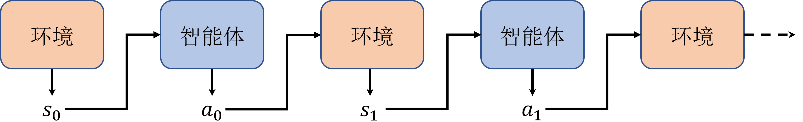
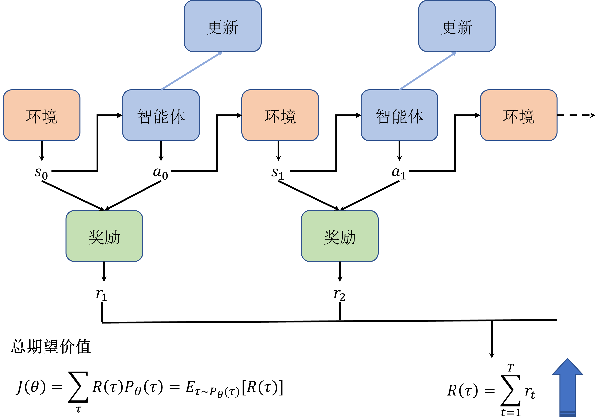

# 第 9 章 策略梯度

$\qquad$ 本章开始介绍基于策略梯度（ $\text{policy-based}$ ）的算法，与前面介绍的基于价值（ $\text{value-based}$ ）的算法（包括 $\text{DQN}$ 等算法）不同，这类算法直接对策略本身进行近似优化。在这种情况下，我们可以将策略描述成一个带有参数$\theta$的连续函数，该函数将某个状态作为输入，输出的不再是某个确定性（ $\text{deterministic}$ ）的离散动作，而是对应的动作概率分布，通常用 $\pi_{\theta}(a|s)$ 表示，称作随机性（ $\text{stochastic}$ ）策略。

## 9.1 基于价值算法的缺点

$\qquad$ 尽管以 $\text{DQN}$ 算法为代表的基于价值的算法在很多任务上都取得了不错的效果，并且具备较好的收敛性，但是这类算法也存在一些缺点。

* **无法表示连续动作**。由于 $\text{DQN}$ 等算法是通过学习状态和动作的价值函数来间接指导策略的，因此它们只能处理离散动作空间的问题，无法表示连续动作空间的问题。而在一些问题中，比如机器人的运动控制问题，连续动作空间是非常常见的，比如要控制机器人的运动速度、角度等等，这些都是连续的量。

* **高方差**。基于价值的方法通常都是通过采样的方式来估计价值函数，这样会导致估计的方差很高，从而影响算法的收敛性。尽管一些 $\text{DQN}$ 改进算法，通过改善经验回放、目标网络等方式，可以在一定程度上减小方差，但是这些方法并不能完全解决这个问题。

* **探索与利用的平衡问题**。$\text{DQN}$ 等算法在实现时通常选择贪心的确定性策略，而很多问题的最优策略是随机策略，即需要以不同的概率选择不同的动作。虽然可以通过 $\epsilon\text{-greedy}$ 策略等方式来实现一定程度的随机策略，但是实际上这种方式并不是很理想，因为它并不能很好地平衡探索与利用的关系。

## 9.2 策略梯度算法

$\qquad$ 策略梯度算法是一类直接对策略进行优化的算法，但它的优化目标与基于价值的算法是一样的，都是累积的价值期望 $V^{*}(s)$ 。我们通常用 $\pi_{\theta}(a|s)$ 来表示策略，即在状态 $s$ 下采取动作 $a$ 的概率分布 $ p(a|s)$，其中 $\theta$ 是我们要去求出来的模型参数。

$\qquad$ 如图 $\text{9-1}$ 所示，我们知道智能体在与环境交互的过程时，首先环境会产生一个初始状态 $s_0$，然后智能体相应地执行动作 $a_0$ , 然后环境会转移到下一个状态 $s_1$ 并反馈一个奖励 $r_1$，智能体再根据当前状态 $s_1$ 选择动作 $a_1$，以此类推，直到环境转移到终止状态。

<div align=center>

</div>
<div align=center>图 $\text{9-1}$ 轨迹的形成</div>

$\qquad$ 我们将这个过程称为一个**回合**（ $\text{episode}$ ），然后把所有的状态和动作按顺序组合起来，记作 $\tau$ ，称为**轨迹**（ $\text{trajectory}$ ），如式 $\text{(9.1)}$ 所示。

$$
\tag{9.1}
\tau=\left\{s_{0}, a_{0}, s_{1}, a_{1}, \cdots, s_{T}, a_{T}\right\}
$$

$\qquad$ 其中 $T$ 表示回合的终止时刻。由于环境初始化是随机的，我们假设产生初始状态 $s_0$ 的概率为 $p(s_0)$ ，那么给定策略函数 $\pi_{\theta}(a|s)$ 的情况下，其实是很容易计算出轨迹 $\tau$ 产生的概率的，用 $P_{\theta}(\tau)$ 表示。为了方便读者理解，我们假设有一个很短的轨迹 $\tau_0 = \{s_0,a_0,s_1\}$ ，即智能体执行一个动作之后就终止本回合了。

$\qquad$ 要计算该轨迹产生的概率，我们可以拆分一下在这条轨迹产生的过程中出现了那些概率事件，首先是环境初始化产生状态 $s_0$ ，接着是智能体采取动作  $a_0$ ，然后环境转移到状态 $s_1$，即整个过程有三个概率事件，那么根据条件概率的乘法公式，该轨迹出现的概率应该为 环境初始化产生状态 $s_0$ 的概率 $p(s_0)$ 乘以智能体采取动作 $a_0$ 的概率 $\pi_{\theta}(a_0|s_0)$ 乘以环境转移到状态 $s_1$ 的概率 $p(s_1|s_0,a_0)$，即 $P_{\theta}(\tau_0) = \pi_{\theta}(a_0|s_0)p(s_1|s_0,a_0)$ 。依此类推，对于任意轨迹 $\tau$ ，其产生的概率如式 $\text(9.2)$ 所示。

$$
\tag{9.2}
\begin{aligned}
P_{\theta}(\tau)
&=p(s_{0}) \pi_{\theta}(a_{0} | s_{0}) p(s_{1} | s_{0}, a_{0}) \pi_{\theta}(a_{1} | s_{1}) p(s_{2} | s_{1}, a_{1}) \cdots \\
&=p(s_{0}) \prod_{t=0}^{T} \pi_{\theta}\left(a_{t} | s_{t}\right) p\left(s_{t+1} | s_{t}, a_{t}\right)
\end{aligned}
$$

$\qquad$ 注意式 $\text(9.2)$ 中所有的概率都是大于 $0$ 的，否则也不会产生这条轨迹了。前面提到，同基于价值的算法一样，策略梯度算法的优化目标也基本是每回合的累积奖励期望，即我们通常讲的回报 $G$（return）。 我们将环境在每一步状态和动作下产生的奖励记作一个函数 $r_{t+1}=r(s_t,a_t),t=0,1,\cdots$，那么对于一条轨迹 $\tau$ 来说，对应的累积奖励就可以计算为 $R(\tau)=\sum_{t=0}^T r\left(s_t, a_t\right)$，注意这里出于简化考虑我们忽略了折扣因子 $\gamma$，如图 $\text{9-2}$ 所示。

<div align=center>

</div>
<div align=center>图 $\text{9-2}$ 轨迹价值的计算</div>

$\qquad$ 那么在给定的策略下，即参数 $\theta$ 固定，对于不同的初始状态，会形成不同的轨迹 $\tau_{1},\tau_{2},\cdots$，对应轨迹的出现概率前面已经推导出来为 $P_{\theta}(\tau_{1}),P_{\theta}(\tau_{2}),\cdots$，累积奖励则为 $R(\tau_{1}),R(\tau_{2}),\cdots$。结合概率论中的全期望公式，我们可以得到策略的价值期望公式，即式 $\text(9.3)$ 。

$$
\tag{9.3}
\begin{aligned}
J(\pi_{\theta}) = \underset{\tau \sim \pi_\theta}{E}[R(\tau)] 
& = P_{\theta}(\tau_{1})R(\tau_{1})+P_{\theta}(\tau_{2})R(\tau_{2})+\cdots \\
&=\int_\tau P_{\theta}(\tau) R(\tau) \\ 
&=E_{\tau \sim P_\theta(\tau)}[\sum_t r(s_t, a_t)] 
\end{aligned}
$$

$\qquad$ 换句话说，我们的目标就是最大化策略的价值期望 $J(\pi_{\theta})$，因此 $J(\pi_{\theta})$ 又称作目标函数。有了目标函数之后，只要能求出梯度，就可以使用万能的梯度上升或下降的方法来求解对应的最优参数 $\theta^*$了，这里由于我们的目标是最大化目标函数，因此我们使用梯度上升的方法。那么问题来了，我们发现策略梯度的目标函数过于复杂，这种情况下要怎么求梯度呢？这就是策略梯度算法的核心问题。

$\qquad$ 乍一看，这个策略梯度公式是很复杂，但是仔细观察之后，首先会发现我们的目标是求关于参数 $\theta$ 的梯度，而公式中的$R(\tau)$跟$\theta$其实是没有关联的，因此在求解梯度的时候可以将这一项看作常数，这样一来问题就稍稍简化成了如何求解 $P_{\theta}(\tau)$ 的梯度了。

$\qquad$ 这个时候我们就需要回忆起中学就用过的一个对数微分技巧，即 $\log x$ 的导数是 $1/x$。注意，有同学可能会奇怪不是 $ \ln x$ 的导数才是 $ 1/x$ 吗，这其实涉及到一个国际的沿用标准问题，国际上通常使用 $\log x$ 表示以 $e$ 为底的对数，国内数学教材基本沿用了早期的 ISO 标准，即使用 $\ln x$ 表示以 $e$ 为底的对数，读者们只需要记住在算法领域默认使用 $\log x$ 表示以 $e$ 为底的对数即可。回到我们的问题，使用这个对数微分技巧，我们就可以将目标函数的梯度做一个转化，即式 $\text(9.4)$ 。

$$
\tag{9.4}
\nabla_\theta P_{\theta}(\tau)= P_{\theta}(\tau) \frac{\nabla_\theta P_{\theta}(\tau)}{P_{\theta}(\tau) }= P_{\theta}(\tau) \nabla_\theta \log P_{\theta}(\tau)
$$

$\qquad$ 现在的问题就从求$P_{\theta}(\tau)$的梯度变成了求$\log P_{\theta}(\tau)$的梯度了，即求$\nabla_\theta \log P_{\theta}(\tau)$。我们先求出$\log P_{\theta}(\tau)$，根据 $P_{\theta}(\tau)=p(s_{0}) \prod_{t=0}^{T} \pi_{\theta}\left(a_{t} | s_{t}\right) p\left(s_{t+1}  s_{t}, a_{t}\right)$，再根据对数公式$log (ab) = log a + log b$，即可求出式 $\text(9.5)$ 。

$$
\tag{9.5}
\log P_{\theta}(\tau)= \log p(s_{0})  +  \sum_{t=0}^T(\log \pi_{\theta}(a_t \mid s_t)+\log p(s_{t+1} \mid s_t,a_t))
$$

$\qquad$ 我们会惊奇地发现$\log P_{\theta}(\tau)$展开之后只有中间的项$\log \pi_{\theta}(a_t \mid s_t)$跟参数$\theta$有关，也就是说其他项关于$\theta$的梯度为 $0$ ，即式 $\text(9.6)$ 。

$$
\tag{9.6}
\begin{aligned}
\nabla_\theta \log P_{\theta}(\tau) &=\nabla_\theta \log \rho_0\left(s_0\right)+\sum_{t=0}^T\left(\nabla_\theta \log \pi_\theta\left(a_t \mid s_t\right)+\nabla_\theta \log p\left(s_{t+1} \mid s_t, a_t\right)\right) \\
&=0+\sum_{t=0}^T\left(\nabla_\theta \log \pi_\theta\left(a_t \mid s_t\right)+0\right) \\
&=\sum_{t=0}^T \nabla_\theta \log \pi_\theta\left(a_t \mid s_t\right)
\end{aligned}
$$


$\qquad$ 现在我们就可以很方便地求出目标函数的梯度了，如式 $\text(9.7)$ 所示。

$$
\tag{9.7}
\begin{aligned}
\nabla_\theta J\left(\pi_\theta\right) &=\nabla_\theta \underset{\tau \sim \pi_\theta}{\mathrm{E}}[R(\tau)] \\
&=\nabla_\theta \int_\tau P_{\theta}(\tau) R(\tau) \\
&=\int_\tau \nabla_\theta P_{\theta}(\tau) R(\tau) \\
&=\int_\tau P_{\theta}(\tau) \nabla_\theta \log P_{\theta}(\tau) R(\tau) \\
&=\underset{\tau \sim \pi_\theta}{\mathrm{E}}\left[\nabla_\theta \log P_{\theta}(\tau) R(\tau)\right]\\
&= \underset{\tau \sim \pi_\theta}{\mathrm{E}}\left[\sum_{t=0}^T \nabla_\theta \log \pi_\theta\left(a_t \mid s_t\right) R(\tau)\right]
\end{aligned}
$$

$\qquad$ 这里简单解释一下上述公式中的步骤，首先第一行就是目标函数的表达形式，到第二行就是全期望展开式，到第三行就是利用了积分的梯度性质，即梯度可以放到积分号的里面也就是被积函数中，第四行到最后就是对数微分技巧了。回过头来看下，我们为什么要用到对数微分技巧呢？这其实是一个常见的数学技巧：当我们看到公式中出现累乘的项时，我们通常都会取对数简化，因为根据对数公式的性质可以将累乘的项转换成累加的项，这样一来问题会更加便于处理。

$\qquad$ 我们再总结回顾一下基于价值和基于策略算法的区别，以便于加深理解。我们知道，基于价值的算法是通过学习价值函数来指导策略的，而基于策略的算法则是对策略进行优化，并且通过计算轨迹的价值期望来指导策略的更新。举例来说，如图 $\text{9-3}$ 所示，基于价值的算法相当于是在学一个地图导航工具，它会告诉并指导驾驶员从当前位置到目的地的最佳路径。但是这样会出现一个问题，就是当地图导航工具在学习过程中产生偏差时会容易一步错步步错，也就是估计价值的方差会很高，从而影响算法的收敛性。

$\qquad$ 而基于策略的算法则是直接训练驾驶员自身，并且同时也在学地图导航，只是这个时候地图导航只会告诉驾驶员当前驾驶的方向是不是对的，而不会直接让驾驶员去做什么。换句话说，这个过程，驾驶员和地图导航工具的训练是相互独立的，地图导航工具并不会干涉驾驶员的决策，只是会给出建议。这样的好处就是驾驶员可以结合经验自己去探索，当导航工具出现偏差的时候也可以及时纠正，反过来当驾驶员决策错误的时候，导航工具也可以及时矫正错误。

<div align=center>

</div>
<div align=center>图 $\text{9-3}$ 基于价值与基于策略的区别示例</div>

## 9.3 REINFORCE算法

$\qquad$ 虽然在前面一节中我们推导并简化了策略梯度公式，但细心的读者可能会发现，实际操作起来是很困难的。我们知道轨迹是由状态和动作组合而成的序列，实际上一方面环境的初始状态是随机的，另一方面智能体每次采取的动作是随机的，从而导致每条轨迹的长度都可能不一样，这样组合起来的轨迹几乎是无限多条的，这样一来求解目标函数的梯度就变得非常困难了。那么这个时候我们就需要利用蒙特卡洛的方法来近似求解了，即我们可以不必采样所有的轨迹，而是采样一部分且数量足够多的轨迹，然后利用这些轨迹的平均值来近似求解目标函数的梯度。这种方法就是蒙特卡洛策略梯度算法，也称作 $\text{REINFORCE}$ 算法。

$\qquad$ 其实这种方法在前面的章节中也已经使用过了，我们会发现蒙特卡洛方法虽然听起来很高级，但它实际上就是一种“省懒”的方法，即有时候理论上需要去找无限个数据来支撑我们去求解某个数据，但实际上我们可以只找有限个数据来近似求解。在生活中我们也经常用到这个方法，比如我们想要知道当代大学生都有哪些爱好，理论上我们需要去调查所有的大学生，但实际上我们只需要去抽查一部分大学生就可以了，只要抽查的大学生具有足够的代表性，比如覆盖的学历范围足够广泛等等，那么我们就可以认为这部分大学生的爱好代表了所有大学生的爱好了。

$\qquad$ 回到我们的问题，我们现在需要求解的是目标函数的梯度，$\text{REINFORCE}$ 算法的做法是每次采样 $N$ 条轨迹，然后对这 $N$ 条轨迹的梯度求平均，即式 $\text(9.8)$ 。

$$
\tag{9.8}
\nabla J_{\theta} \approx \frac{1}{N} \sum_{n=1}^{N} \sum_{t=1}^{T_{n}} G_{t}^{n} \nabla \log \pi_{\theta}\left(a_{t}^{n} \mid s_{t}^{n}\right)
$$

$\qquad$ 其中 $N$ 理论上越大越好，但实际上我们可能只采样几个回合的轨迹就能近似求解梯度了。此外，注意这里我们把奖励函数换成了带有折扣因子的回报 $G_{t}^{n}=\sum_{k=t}^{T_{n}} \gamma^{k-t} r_{k}^{n}$，其中 $T_n$ 表示第 $n$ 条轨迹的长度，$\gamma$ 表示折扣因子，$r_{k}^{n}$ 表示第 $n$ 条轨迹在第 $k$ 步的奖励。尽管回报计算起来麻烦，但可以结合前面章节讲到的贝尔曼公式将当前时刻和下一时刻的回报联系起来，从而在一定程度上简化计算，即式 $\text(9.9)$ 。

$$
\tag{9.9}
\begin{aligned}
G_{t} &=\sum_{k=t+1}^{T} \gamma^{k-t-1} r_{k} \\
&=r_{t+1}+\gamma G_{t+1}
\end{aligned}
$$

## 9.4 策略梯度推导进阶

$\qquad$ 到这里我们已经讲完了 $\text{REINFORCE}$ 算法的理论部分，在后面小节中我们会展开实战部分，在此之前我们先看看一个进阶版的策略梯度公式推导。在前面的小节中我们展开的策略梯度推导过程本质上是沿用 $\text{REINFORCE}$ 算法或者蒙特卡洛的思路推导的，这种推导思路的优点是简单易懂，但在推导过程中我们也发现了其中的缺点，即最后推导出来的公式实际上不可求，因为理论上有无限条轨迹，所以只能用近似的方法。其次，我们假定了目标是使得每回合的累积价值最大，因此用对应的总奖励 $R(\tau)$ 或回报 $G(\tau)$ 来求解或者说评估价值。

$\qquad$ 但实际使用过程中我们会发现这种价值的评估方法并不是很稳定，因为每回合的累积奖励或回报会受到很多因素的影响，比如回合的长度、奖励的稀疏性等等，后面章节中我们还会发现用一种叫做优势 （$\text{Advantage}$）的量去评估价值会更加有效。因此，我们需要一个更泛化更通用的策略梯度公式，这也是为什么笔者称之为进阶版的原因。

### 9.4.1 平稳分布

$\qquad$ 在展开进阶版策略梯度推导之前，我们需要先铺垫一些概念，首先是马尔可夫链的平稳分布（$\text{stationary distribution}$）。平稳分布，顾名思义就是指在无外界干扰的情况下，系统长期运行之后其状态分布会趋于一个固定的分布，不再随时间变化。已经跑过一些强化学习实战的读者们也会发现，每次成功跑一个算法，奖励曲线都会收敛到一个相对稳定的值，只要环境本身不变，哪怕换一种算法，奖励曲线也会收敛到一个相对稳定的值，除非我们改动了环境的一些参数比如调奖励等，这就是平稳分布的概念。

$\qquad$ 平稳分布本质上也是熵增原理的一种体现，比如初中化学中我们知道，当我们把一块金属钠放到水中，会发生化学反应变成氢氧化钠，在反应的过程中是比较剧烈的，但在一段时间之后它总能稳定生成氢氧化钠，即在我们预测范围之内，而不会某几次实验之后突然生成氯化钠之类的物质。

$\qquad$ 回到马尔科夫链本身，在处于平稳分布下，我们会发现一些规律，一个是任意两个状态之间都是互相连通的，即任意两个状态之间都可以通过一定的步骤到达，这个性质称为**连通性**（$\text{connectedness}$）。例如在学校里通常会有几种状态：上课、放学、吃饭、睡觉等，这些状态我们都是可以随意切换的，比如上课之后可以放学，放学之后可以吃饭，吃饭之后可以睡觉，睡觉之后可以上课等，这就是连通性的体现。

$\qquad$ 有读者可能会说，我睡觉的时候能一直睡，就是不想切换到其他状态，也就是说到了睡觉这个状态，切换到其他状态的概率就变成 $0$ 了，这个时候连通性就不成立了，我们把这个状态也叫做吸收状态。其实这个问题是因为我们的状态定义不够细致，我们可以把睡觉这个状态细分成睡觉、睡觉中、睡醒等状态，这样一来就可以保证任意两个状态之间都是互相连通的了。

$\qquad$ 可能读者又会想到马尔可夫过程的终止状态不也算是吸收状态吗？其实不是的，这里的终止状态其实在时序差分方法中有提到过，只是为了方便计算，我们把终止状态的价值函数定义为 $0$ ，但实际上终止状态也是可以切换到其他状态的，典型的例子就是在游戏中，当我们的智能体死亡之后，游戏并不会立即结束，而是会重新开始，这就是一个终止状态，但它并不是吸收状态，因为它又回到了初始状态。

$\qquad$ 另一个是任意状态在平稳分布下的概率都是一样的，即任意状态的概率都是相等的，这个性质称为**细致平稳**（$\text{detailed balance}$）。这两个性质在马尔科夫链中是等价的，即如果一个马尔科夫链满足连通性，那么它一定满足细致平稳性，反之亦然。这里我们不再展开证明，有兴趣的读者可以自行查阅相关资料。

$\qquad$ 为了加深读者对于平稳分布的具体理解，我们举一个经典的计算实例。这个例子是这样的，社会学家在他们的研究中通常会把人按照经济状况分成三类：上层，中层和下层，这三层就代表着三种状态，我们分别用 $1，2，3$ 来表示。并且社会学家还发现决定一个人经济阶层的最重要因素就是其父母的收入阶层，即如果一个人的经济阶层为上层，那么他的孩子会有 $0.5$ 的概率继续处于上层，也会有 $0.4$ 的概率变成中层，更有 $0.1$ 的概率降到下层，当然这些概率数值只是笔者拍脑袋想出来以便于后面的计算的，并没有一定的统计依据。这些概率其实就是我们所说的马尔可夫链中的转移概率，同样对于其他经济阶层的人他们的孩子也会有一定的概率变成上、中、下的任一经济阶层，如图 $\text{9-4}$ 所示。

<div align=center>

</div>
<div align=center>图 $\text{9-4}$ 经济阶层转换示例</div>

$\qquad$ 这样我们就可以列出转移概率矩阵，如式 $\text(9.10)$ 所示。

$$
\tag{9.10}
P=\left[\begin{array}{lll}
0.5 & 0.4 & 0.1 \\
0.2 & 0.6 & 0.2 \\
0.05 & 0.45 & 0.5
\end{array}\right]
$$

$\qquad$ 我们假设有这么一批数量足够的人，称之为第 $1$ 代人，他们的经济阶层比例为$\pi_0=[0.15,0.62,0.23]$，那么根据上面的转移概率矩阵我们就可以求出第二代的阶层比例。怎么求呢？首先求出第二代上层的比例，我们知道第一代人中有 $0.15$ 的比例是上层，这 $0.15$ 比例的人中子代为上层的概率是 0.5， 而第一代人中 0.62 比例的中层会有 0.2 的概率流入上层，0.23 比例的下层中其子代也会有 0.05 的概率流入上层，那么最后第二代上层的比例就为 $0.15 \times 0.5 + 0.62 \times 0.2 + 0.23 \times 0.05 = 0.2105 \approx 0.210$，依次类推，第二代中层的比例为$0.15 \times 0.4 + 0.62 \times 0.6 + 0.23 \times 0.45 \approx 0.536$，第二代下层的比例为$0.254$，这样我们就能得出第二代的阶层比例为$\pi_1=[0.210,0.536,0.254]$。

$\qquad$ 这里细心的读者会发现不需要这么麻烦的计算过程，只要学过线性代数利用矩阵向量相乘就能得到，即$\pi_1 = \pi_0 P = [0.210,0.536,0.254]$。同理，第二代人的比例也可以求出，即 $\pi_2 = \pi_1 P = \pi_0 P^2$，依次类推，第n代人的比例为$\pi_n = \pi_0 P^n$。既然这本书同时也是教大家如何代码实战的，这里我们 $\text{Python}$ 代码来求出前 $10$ 代人的比例，如代码清单 $\text{9-1}$ 所示。

<div style="text-align: center;">
    <figcaption> 代码清单 $\text{9-1}$ 求解第$n$代人的比例 </figcaption>
</div>

```python
import numpy as np
pi_0 = np.array([[0.15,0.62,0.23]])
P = np.array([[0.5,0.4,0.1],[0.2,0.6,0.2],[0.05,0.45,0.5]])
for i in range(1,10+1):
    pi_0 = pi_0.dot(P)
    print(f"第{i}代人的比例为：")
    print(np.around(pi_0,3))
```

$\qquad$ 我们可以很快获得计算的结果，如代码清单 $\text{9-2}$ 所示。

<div style="text-align: center;">
    <figcaption> 代码清单 $\text{9-2}$ 求解第$n$代人比例的计算结果 </figcaption>
</div>

```bash
第1代人的比例为：
[[0.211 0.536 0.254]]
第2代人的比例为：
[[0.225 0.52  0.255]]
第3代人的比例为：
[[0.229 0.517 0.254]]
第4代人的比例为：
[[0.231 0.516 0.253]]
第5代人的比例为：
[[0.231 0.516 0.253]]
第6代人的比例为：
[[0.231 0.516 0.253]]
第7代人的比例为：
[[0.232 0.516 0.253]]
第8代人的比例为：
[[0.232 0.516 0.253]]
第9代人的比例为：
[[0.232 0.516 0.253]]
第10代人的比例为：
[[0.232 0.516 0.253]]
```

$\qquad$ 从上面的结果中，我们发现从第5代开始经济阶层的比例开始神奇地固定了下来。换句话说，无论初始状态是什么，经过多次概率转移之后都会存在一个稳定的状态分布。其次我们只需要知道这个稳定的分布并乘以对应的价值，就可以计算所谓的长期收益了。

$\qquad$ 现在我们可以正式地总结一下马尔可夫链的平稳分布了，对于任意马尔可夫链，如果满足以下两个条件：

* 非周期性：由于马尔可夫链需要收敛，那么就一定不能是周期性的，实际上我们处理的问题基本上都是非周期性的，这点不需要做过多的考虑。
* 状态连通性：即存在概率转移矩阵$P$，能够使得任意状态$s_0$经过有限次转移到达状态$s$，反之亦然。

$\qquad$ 这样我们就可以得出结论，即该马氏链一定存在一个平稳分布，我们用$d^{\pi}(s)$表示，可得到式 $\text(9.11)$ 。

$$
\tag{9.11}
d^\pi(s)=\lim _{t \rightarrow \infty} P\left(s_t=s \mid s_0, \pi_\theta\right)
$$

$\qquad$ 换句话说，对于一个特定的环境，$d^{\pi}(s)$ 相当于一个环境本身常量，类似于状态转移概率矩阵，只是我们在求解马尔可夫过程的时候无法获得，只能通过其他的方法近似，例如在前面章节讲到的基于价值的算法中，我们就是通过贝尔曼公式来绕过状态转移概率矩阵进而通过迭代的方式求解状态价值函数的。

### 9.4.2 基于平稳分布的策略梯度推导

$\qquad$ 我们回顾前面小节中计算轨迹概率的公式$P_{\theta}(\tau)$，可以发现如果轨迹$\tau$的初始状态是$s_0$并且终止状态是$s$的话，轨迹概率公式$P_{\theta}(\tau)$跟平稳分布的$d^\pi(s)$是等效的，当然前提是该条轨迹必须“无限长”，即$t \rightarrow \infty$。但是平稳分布与轨迹概率公式相比，它的好处就是只涉及一个定量即初始状态$s_0$和一个变量$s$。对于每个状态$s$，我们用$V^{\pi}(s)$表示策略$\pi$下对应的价值。读者们现在可以往前回顾，为什么笔者说策略梯度算法跟基于价值函数的算法都是在计算累积状态的价值期望了，此时策略梯度算法目标函数就可以表示为式 $\text(9.12)$ 。

$$
\tag{9.12}
J(\theta)=\sum_{s \in \mathcal{S}} d^\pi(s) V^\pi(s)=\sum_{s \in \mathcal{S}} d^\pi(s) \sum_{a \in \mathcal{A}} \pi_\theta(a \mid s) Q^\pi(s, a)
$$

$\qquad$ 同样可以利用对数微分技巧求得对应的梯度，如式 $\text(9.13)$ 所示。

$$
\tag{9.13}
\begin{aligned}
\nabla_\theta J(\theta) & \propto \sum_{s \in \mathcal{S}} d^\pi(s) \sum_{a \in \mathcal{A}} Q^\pi(s, a) \nabla_\theta \pi_\theta(a \mid s) \\
&=\sum_{s \in \mathcal{S}} d^\pi(s) \sum_{a \in \mathcal{A}} \pi_\theta(a \mid s) Q^\pi(s, a) \frac{\nabla_\theta \pi_\theta(a \mid s)}{\pi_\theta(a \mid s)} \\
&=\mathbb{E}_{\pi_{\theta}}\left[Q^\pi(s, a) \nabla_\theta \log \pi_\theta(a \mid s)\right]
\end{aligned}
$$

$\qquad$ 到这里我们会发现，$\text{REINFORCE}$ 算法只是利用蒙特卡洛的方式将公式中的 $Q^\pi(s, a)$ 替换成了 $G(\tau)$。实际上读者们在学习了结合深度学习的 DQN 算法之后，$Q^\pi(s, a)$ 也是可以用神经网络模型来近似的，只是略有不同的是这里的 $Q^\pi(s, a)$ 相比于 $\text{DQN}$ 算法中的 $Q$ 函数多了一个策略 $\pi$ 作为输入，并且输出的不再是所有动作对应的 $Q$ 值，而是针对当前状态和动作 $(s_t,a_t)$ 的单个值，因此更多的像是在评判策略的价值而不是状态的价值，而用来近似 $Q^\pi(s, a)$ 的模型我们一般称作 $\text{Critic}$ 。

$\qquad$ 相应地，另外只包含策略梯度的一部分 $\nabla_\theta \log \pi_\theta(a \mid s)$ 的模型我们一般称作 $\text{Actor}$ 。这样一来已经不是单纯的策略梯度算法了，而是同时结合了基于价值和策略梯度的算法，我们一般把这类算法称之为 $\text{Actor-Critic}$ 算法，具体会在后面的章节中展开。

## 9.5 策略函数的设计

### 9.5.1 离散动作的策略函数

$\qquad$ 我们先回顾一下在 $\text{DQN}$ 算法中是如何设计网络模型来近似 $Q$ 函数的，通常是包含一个输入层、一个隐藏层和一个输出层，其中输入层一般是维度等于状态数的线性层，输出层则是维度等于动作数的线性层，对于更复杂的情况读者可以根据实际需要自行设计，比如中间多增加几层隐藏层或者改成 $\text{CNN}$ 网络，只需要保证模型能够接收状态作为输入，并且能够输出等于每个动作的 $Q$ 值即可。

$\qquad$ 对于策略函数来说，我们也可以采用类似的设计，只不过我们输出的不是 $Q$ 值，而是各个动作的概率分布。其实动作概率分布在实现上跟 $Q$ 值的唯一区别就是必须都大于 $0$ 且和为 $1$ ，最简单的做法是在 $Q$ 网络模型的最后一层增加处理层，一般称作为动作层 （action layer）。由于原来 Q 网络模型输出的值是有正有负的，怎么把它们转换成动作概率分布呢？

$\qquad$ 读者可能想到一个最简单的方式就是用最大值减去最小值得到一个范围值，然后原来的最小值变成0，其他原来的值则各自减去原来的最小值然后除以范围值，例如对于 $[-0.5,0,0.5]$，用最大值减去最小值得到 $1$ ，然后原来的最小值变成 $0$ ，其他原来的值则各自减去原来的最小值然后除以 1，最后得到的就是 $[0,0.5,0.5]$，这样一来就满足了概率分布的要求了，这就是最原始的 min-max 归一化思路。但是这种方法会有一些缺点，感兴趣的读者可自行查阅相关资料，这里就不详细展开了。我们通常采取目前比较流行的方式，即用 Softmax 函数来处理，定义如式 $\text(9.14)$ 所示。

$$
\tag{9.14}
    \pi_\theta(s, a)=\frac{e^{\phi(s, a)^T \theta}}{\sum_b e^{\phi(s, b)^T \theta}}
$$

$\qquad$ 其中 $\phi(s, a)$ 就是模型前面一层的输出。对应的梯度也可方便求得，如式 $\text(9.15)$ 所示。

$$
\tag{9.15}

    \nabla_\theta \log \pi_\theta(s \mid a)=\phi(s, a)-\mathbb{E}_{\pi_\theta}[\phi(s, .)]
$$

$\qquad$ 由于右边一项 $\mathbb{E}_{\pi_\theta}[\phi(s, .)]$ 表示的是模型前一层所有输出的加权和，不受$\theta$影响，因此我们可以将其去掉，这样一来就可以得到更简单的梯度表达式，如式 $\text(9.16)$ 所示。

$$
\tag{9.16}
    \nabla_\theta \log \pi_\theta(s \mid a)= \phi(s, a)
$$

$\qquad$ 在实战中 $\phi(s, a)$ 和 $\text{Softmax}$ 函数层 一般是合并在一起的，即直接在模型最后一层输出 $\text{Softmax}$ 函数的结果，即概率分布 $p_\theta(s, a)$，这样就得到了最终的策略梯度，即式 $\text(9.17)$ 。

$$
\tag{9.17}
    \nabla_\theta \log \pi_\theta(s \mid a)= \log p_\theta(s, a)
$$

$\qquad$ 在很多代码实践中，一般都把它写作 $\text{logits_p}$，对应的 $p_\theta(s, a)$ 叫做 $\text{probs}$， 这个在后面实战中我们会看到。在实践中，我们算出 $\text{probs}$ 之后，还会根据 $\text{probs}$ 形成一个 $\text{Categorical}$ 分布，然后再采样，这个在后面章节的实战中我们也会看到。

### 9.5.2 连续动作的策略函数


$\qquad$ 对于连续动作空间，通常策略对应的动作可以从高斯分布${\mathbb{N}}\left(\phi(s)^{\mathbb{T}} \theta, \sigma^2\right)$，对应的梯度也可求得，如式 $\text(9.18)$ 所示。
$$
\tag{9.18}
    \nabla_\theta \log \pi_\theta(s, a)=\frac{\left(a-\phi(s)^T \theta\right) \phi(s)}{\sigma^2}
$$

$\qquad$ 这个公式虽然看起来很复杂，但实现起来其实很简单，只需要在模型最后一层输出两个值，一个是均值，一个是方差，然后再用这两个值来构建一个高斯分布，然后采样即可，具体同样在后面的章节中展开。

## 9.6 本章小结

$\qquad$ 本章开始介绍强化学习另一大类的算法，即基于策略梯度的算法，并且分别从两种不同的角度推导了策略梯度的目标函数公式。此外，简要介绍了一个最基础的策略梯度算法，即 $\text{REINFORCE}$ 算法。最后介绍了常见策略函数的设计方法，为后面 $Actor-Critic$ 算法章节做铺垫。

## 9.7 练习题

1. 基于价值和基于策略的算法各有什么优缺点？
2. 马尔可夫平稳分布需要满足什么条件？
3. $\text{REINFORCE}$ 算法会比 $\text{Q-learning}$ 算法训练速度更快吗？为什么？
4. 确定性策略与随机性策略的区别？
