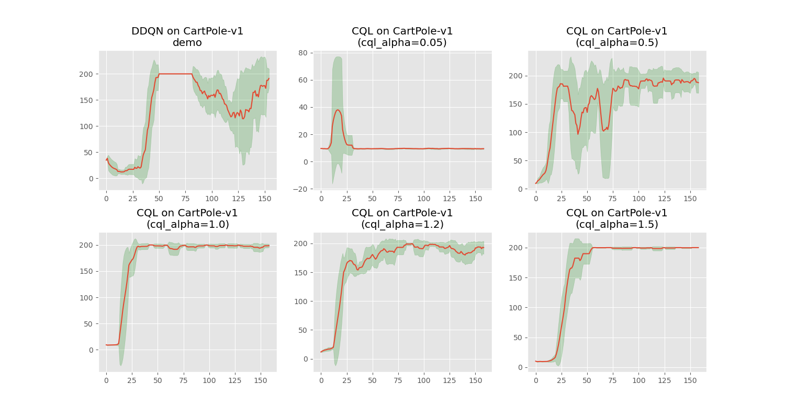

# CQL（Conservative Q-Learning）

我们已经知道离线 RL 算法，都是在”无法在线验证策略性能“的前提下，用不同手段保证”策略评估+改进“仍可靠。CQL也不例外，在本节，我们将详细介绍CQL是如何保证”策略评估+改进“的可靠性的。


## OOD（Out-of Distribution） Q 值高估问题


离线场景里，策略一旦部署便无法与环境交互，也就永远没机会“打脸”那些过度乐观的 Q 值；误差遂在每次 Bellman 备份中层层叠加，最终让结果一落千丈。

Kumar 等人（2019）用 SAC 在 HalfCheetah-v2 上做了经典演示：

<div align=center>

<figcaption style="font-size: 14px;">图 1 增加样本数并未普遍抑制“反学习”现象图示。</figcaption>
</div>
 
左图中横轴是 Q 网络梯度步数，纵轴是贪婪策略的实际回报。回报先上升，随后随训练持续而急剧下降，形似过拟合，却随样本倍增而依旧出现——说明问题并非传统过拟合，而是 OOD 误差在目标 Q 中持续发酵，最终把整个价值函数拖垮（见右图）。

Conservative Q-Learning（CQL）对症下药：迫使学到的 Q 函数对任意策略都保持“保守”，其期望价值天然低于真实回报。由此，策略即便贪婪，也不会被虚假的 OOD 峰值引入歧途。实现仅需在标准 Bellman 损失外增添一项 **Q 值正则**，几行代码即可嵌入现有 DQN 或 actor-critic 框架。离散与连续任务实验表明，CQL 最终回报普遍高出先前最佳离线算法 2–5 倍，在复杂多模态数据集上优势尤为显著

## CQL 的正则化机制

CQL 在标准的 Bellman 误差损失基础上，添加了两个正则化项：

$$
\begin{equation}\label{eq:CQLBase}\ \  
J = \argmin_Q \alpha \cdot \left(\mathbb{E}_{s \sim \mathcal{D}, a \sim \mu(⋅∣s)}[Q(s,a)] - \mathbb{E}_{s∼D, a\sim \pi_\beta(a|s)}[Q(s,a)]\right) + \frac{1}{2}\mathbb{E}_{s, a, s^\prime \sim \mathcal{D}}\left[\left(Q(s, a) - \hat{\mathcal{B}}^{\pi_k}\hat{Q}^k(s, a)\right)^2\right] 
\end{equation}
$$

1. 最小化策略动作（包括 OOD）的 Q 值（如下），其中 $\mu$ 是策略或**某种探索分布**(uniform distribution)，**用于生成 OOD 动作**。
$$\min_Q \mathbb{E}_{s \sim D, a \sim \mu(⋅∣s)}[Q(s,a)]$$
2. 最大化数据集中动作的 Q 值：
$$\mathbb{E}_{s∼D, a\sim \pi_\beta(a|s)}[Q(s,a)]$$

这两个项的组合，**使得 Q 函数在数据分布内的动作上保持高值，而在 OOD 动作上被压低**，从而防止策略被 OOD 动作吸引。从而确保学习到的 Q 函数是真实 Q 值的下界估计。这意味着：1) OOD 动作的 Q 值被压低，不会被策略误选；2) 数据分布内的动作 Q 值保持较高，策略更稳定。


接下来我们需要考虑策略优化的问题，最直接的想法是：在每一次策略迭代 $\hat{\pi}_k$ 上，先完整地做一遍离策略评估，再执行一步策略改进。另一种思路是：由于策略 $\hat{\pi}_k$ 通常由当前 Q 函数导出，我们可直接令 $\mu(a|s)$ 近似“最大化当前 Q 函数”的策略，从而得到一个**在线算法**。为形式化描述这类在线算法，我们在 $\eqref{eq:CQLBase}$ 的基础上定义一族关于$\mu(a|s)$ 的优化问题，下方给出通用模板:

$$
\begin{equation}\label{eq:CQL(\mathcal{R})}\ \  
J = \min_Q \max_\mu \alpha \cdot \left(\mathbb{E}_{s \sim \mathcal{D}, a \sim \mu(⋅∣s)}[Q(s,a)] - \mathbb{E}_{s∼D, a\sim \pi_\beta(a|s)}[Q(s,a)]\right) + \frac{1}{2}\mathbb{E}_{s, a, s^\prime \sim \mathcal{D}}\left[\left(Q(s, a) - \hat{\mathcal{B}}^{\pi_k}\hat{Q}^k(s, a)\right)^2\right] + \mathcal{R}(\mu)
\end{equation}
$$

当我们将 $\mathcal{R}(\mu)$ 选为与先验分布 $\rho(a|s)$ 的 KL 散度，即$\mathcal{R}(\mu)=−D_{KL}(\mu, \rho)$，则可得到 $\mu(a|s) \propto \rho(a|s) \cdot e^{Q(s, a)}$（推导见附录:推导A）。特别地，当 $\rho = \text{Unif}(a)$ 时，$\eqref{eq:CQL(\mathcal{R})}$ 的首项对应于状态 s 处 Q 值的软最大化，由此得到$\eqref{eq:CQL(\mathcal{R})}$ 的一个变体，记为 $CQL(\mathcal{H})$:

$$
\begin{equation}\label{eq:CQL(\mathcal{H})}\ \  
J = \min_Q \alpha \cdot \mathbb{E}_{s \sim \mathcal{D}}\left[log\sum_a e^{Q(s, a)}- \mathbb{E}_{a\sim \pi_\beta(a|s)}[Q(s,a)]\right] + \frac{1}{2}\mathbb{E}_{s, a, s^\prime \sim \mathcal{D}}\left[\left(Q(s, a) - \hat{\mathcal{B}}^{\pi_k}\hat{Q}^k(s, a)\right)^2\right]
\end{equation}
$$

从上式可以看出，我们在实现上是非常便捷的

```python
# 离散动作环境
q_sa = self.critic(obs)
loss = loss + self.cql_alpha * (
   torch.logsumexp(q_sa/self.cql_temperature, dim=1) 
   - q_sa.gather(1, actions.long().view(-1, 1))/ self.cql_temperature
).mean() * self.cql_temperature
```

## CQL算法实现

--- 
**Algorithm 1** Conservative Q-Learning
--- 
1. 初始化 Q 函数 $Q_\theta$，可选地初始化策略函数 $\pi_\phi$。  
2. 对于步数 $t = 1,\dots ,N$ 执行：  
   1. 用 $G_Q$ 梯度步训练 Q 函数，最小化式$\eqref{eq:CQL(\mathcal{H})}$ 的 CQL 目标  
      &nbsp;&nbsp;&nbsp;&nbsp;$\theta_t \leftarrow \theta_{t-1} - \lambda_Q \nabla_\theta \mathcal{L}_{\text{CQL}(\mathcal{H})}(\theta)$  
      （Q-learning 版本用算子 $\mathcal{B}^*$；actor-critic 版本用 $\mathcal{B}^{\pi_{\phi_t}}$）  
   2. **（仅 actor-critic 版本）** 用 $G_\pi$ 梯度步改进策略 $\pi_\phi$，采用 SAC 式的熵正则化：  
      &nbsp;&nbsp;&nbsp;&nbsp;$\phi_t \leftarrow \phi_{t-1} + \lambda_\pi \mathbb{E}_{s\sim\mathcal{D},a\sim\pi_\phi} \left[\nabla_\phi \left(Q_\theta(s,a)-\log\pi_\phi(a|s) \right)\right]$  
3. 结束循环
---

具体实现详见[CQL-DQN-CartPole-v2 Notebook](../../notebooks/algos/CQL/CQL_CartPole-v1.ipynb)


## 训练及效果展示

当正则化强度趋近于零时，Q 值虽持续攀升，但 episode return 并未同步增长，表明策略质量未获实质改善。在 CartPole-v1 上，将 CQL 保守系数 $\alpha$ 设为 1.0 左右即可稳定取得最优性能。


<div align=center>

<figcaption style="font-size: 14px;">图 2 不同 α 下策略学习情况。</figcaption>
</div>

<div align=center>

<figcaption style="font-size: 14px;">图 3 不同 α 下q Value情况。</figcaption>
</div>


## 附录

### 推导A

把正则项选成 KL 散度
$$R(\mu)=−D_{KL}\left(\mu(\cdot|s) \parallel \rho(\cdot|s)\right)=− \int \mu(a|s)log \frac{\mu(a|s)}{\rho(a|s)} da$$


带正则的 policy-optimization 目标
$$\max_{\mu \ge 0}  \mathbb{E}_{a \sim \mu }[Q(s,a)] − \tau D_{KL}(\mu \parallel \rho)$$


- 约束 s.t.  $\int \mu(a|s)da = 1$

把 KL 展开并写成 Lagrangian

$$L(\mu, \lambda)=\int \mu(a|s)\left[Q(s,a)− \tau log \frac{\mu(a|s)}{\rho(a|s)} \right]da + \lambda(1− \int \mu(a|s)da)$$


对 $\mu(a|s)$ 做函数求导（变分）  
$$\frac{\delta L}{\delta \mu} = Q(s,a) − \tau (log \frac{\mu(a|s)}{\rho(a|s)} + 1)  - \lambda = 0$$
- 线性项: $\frac{\delta}{\delta \mu(a)} \int \mu(a^\prime) f(a^\prime)da^\prime = f(a)$
- 熵项: $\frac{\delta}{\delta \mu(a)} \int \mu(a^\prime) log \frac{\mu(a^\prime)}{\rho(a^\prime)}da^\prime = log \frac{\mu(a)}{\rho(a)} + 1$  


解出  
$$log \frac{\mu(a|s)}{\rho(a|s)} = \left(Q(s,a) - \lambda −\tau \right)/\tau$$
$$\Rightarrow \mu(a|s) = \rho(a|s) \cdot e^{(Q(s,a) - \lambda −\tau)/\tau}=\rho(a|s) \cdot e^{Q(s,a)/\tau} \cdot e^{-\lambda/\tau - 1}$$ 

所以可以得出

$$\mu(a|s) \propto ρ(a|s) · e^{Q(s,a)}; \tau=1$$


