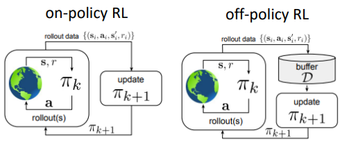
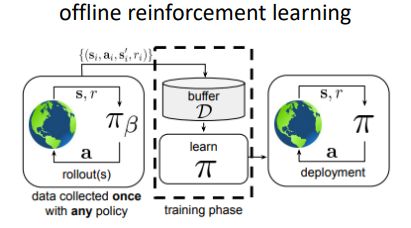
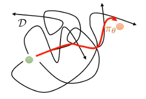
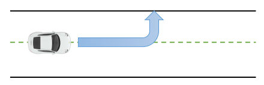

# 离线强化学习

在正式展开具体离线强化学习（ $\text{offline RL}$）算法之前，本章将首先回答两个核心问题：什么是离线强化学习，它与经典强化学习有何本质差异？其关键难点何在？厘清这两点，读者可迅速把握离线强化学习的全貌，并为研究者针对实际场景选择或设计新算法提供思路与新路径。

## 什么是离线强化学习

经典强化学习本质是在线闭环：不论是同策略（on-policy）算法还是异策略（off-policy）算法，皆需在环境中持续采样、即时更新。该“边交互边学习”范式与现代大规模深度学习“离线超大规模数据预训练”路线存在结构性错位。
此外，RL 要求环境封闭、规则完全可描述且可重置，导致采样分布即性能上限；智能体的泛化边界被严格圈定在“可交互区域”，难以跨越未见状态空间。

<figcaption style="font-size: 14px;">图 1 同策略-异策略RL算法流程图示</figcaption>

于是人们自然发问：能否像监督学习那样，用海量历史数据先训一遍，即用数据驱动的方式进行RL训练，然后再上线？

<figcaption style="font-size: 14px;">图 2 离线强化学习算法流程图示</figcaption>

 
离线强化学习（offline RL）正是这一思路的产物：
其目标是在不与环境交互的情况下，仅通过历史策略（$\pi_\beta$可以是任意策略，甚至是随机策略）收集的静态数据集，学出一个最好的策略$\pi$， 然后部署上线，一但部署，就不再进行训练。

不过在实际应用中，我们可以先用历史静态数据训练离线强化学习，部署后线上也是可以用同策略（on-policy）算法更新策略$\pi$。同时我们也可以间隔一定周期，利用回流的数据和离线强化学习算法继续更新迭代策略$\pi$。

这与人类做事方式如出一辙：面对新任务，我们先调用全部历史经验，形成初步方案；随后通过实践、试错、反馈，持续迭代想法与计划。

离线强化学习（Offline RL）将“用旧经验，做新决策”的能力固化到算法层面。进一步看，诸多真实系统因在线探索成本过高而被禁用：高风险的医疗诊疗、直接影响营收的线上策略、以及电网、物流等关键基础设施。在这些场景下，离线强化学习提供了“零在线交互”的策略迭代途径，使基于学习的控制方法真正可用。

## 离线强化关键难点

我们已经理清了离线强化学习是什么，来看下离线强化学习的一般形式。  基于历史静态数据$\mathcal{D} = \{ (s_i, a_i, s_i^\prime, r_i) \}$（ $s \sim d^{\pi_\beta}, a\sim \pi_\beta(a|s), s^\prime \sim p(s^\prime|s, a), r \leftarrow r(s, a)$ 其中$\pi_\beta$一般为未知), 优化目标函数(与一般强化学习目标一致)：

$$\max_\pi \sum_0^T \mathbb{E}_{s_t \sim d^\pi, a_t\sim \pi(a|s)}[\gamma^t r(s_t, a_t)]$$

在固定数据集$\mathcal{D}$和该目标，我们希望学习出“最优”策略$\pi$。但 $\mathcal{D}$ 就是策略的天花板：在自动驾驶场景，如果它只覆盖了“标准”城市场景，$\pi$永远无法在非标道路上安全行驶——未见状态-动作对永远学不出来。

<figcaption style="font-size: 14px;">图 3 离线强化学习“缝合策略“图示</figcaption>

我们希望离线强化学习可以从混乱中获得秩序，超越数据集中的最佳策略，“
缝合”各种次优策略产出新的更优策略$\pi$。

可缝线处全是盲区：**数据集没出现过的状态-动作对，价值估计全靠猜**。
在线 RL 能当场试一把，错了立刻改；离线 RL 却可能把“没见过的左转”当成高价值捷径，一头撞墙才后知后觉（如图4）。

<figcaption style="font-size: 14px;">图 4 离线强化学习-未见过Action错误估计图示</figcaption>

于是，离线强化学习的命门浮出水面：如何安全评估数据集之外的动作（out of distribution），而不被外推幻觉引入歧途。所有离线 RL 算法，归根结底都是在”无法在线验证策略性能“的前提下，用不同手段保证”策略评估+改进“仍可靠。
