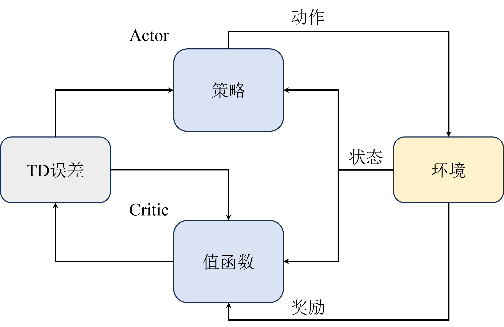
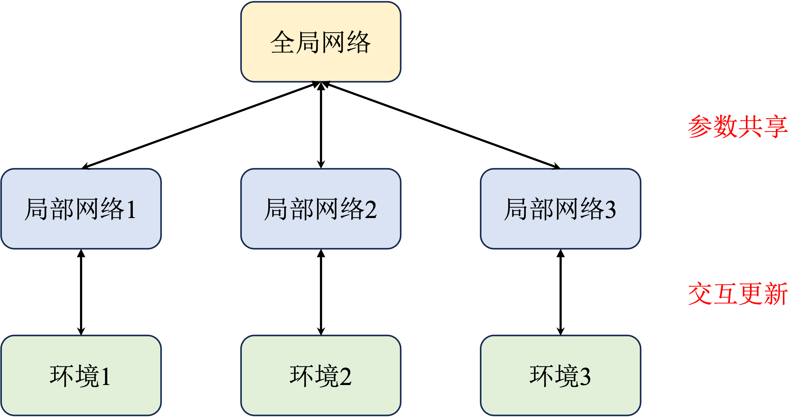

# Actor-Critic 算法

基于价值的算法如 $\text{DQN}$ 系列算法虽然在很多任务中取得了不错的效果，但由于其只能处理确定性策略，且难以适配连续动作空间，因此在某些复杂任务中表现不佳。而纯策略梯度算法如 $\text{REINFORCE}$ 算法虽然在一定程度上解决了这些问题，但其高方差和低采样效率的问题，往往难以在复杂环境中取得良好的效果。为了解决这些问题，研究人员提出了结合策略梯度和值函数的方法，即 $\text{Actor-Critic}$ 算法，即不仅将策略函数进行参数化，同时也将值函数进行参数化，从而兼顾两者的优点。

## 纯策略梯度算法的缺点

纯策略梯度算法虽然通过直接对策略进行参数化，解决了基于价值算法难以适配连续动作空间和随机策略的问题，但也带来了新的挑战。回顾策略梯度算法通用的目标函数，如式 $\eqref{eq:10.0}$ 所示。

$$
\begin{equation}\label{eq:10.0}
\nabla_\theta J(\theta) \propto \mathbb{E}_{\pi_{\theta}}\left[\Psi_t \nabla_\theta \log \pi_\theta(a_t \mid s_t)\right]
\end{equation}
$$

其中 $\Psi_t$ 是某种形式的回报估计，在纯策略梯度算法中通常使用蒙特卡洛估计，即 $\Psi_t = G_t$ ，用来评价策略产生的轨迹或状态-动作对的好坏。

然而，由于蒙特卡洛估计本身的高方差特性，导致策略梯度估计也会具有较高的方差，从而影响训练的稳定性和收敛速度。而且，每次更新策略参数时都需要采样完整的轨迹，这进一步降低了采样效率，尤其是在复杂环境中，可能需要大量的样本才能获得可靠的梯度估计。此外，奖励稀疏的环境中，蒙特卡洛估计可能会导致梯度估计不准确，从而影响策略的改进。

为此，结合了策略梯度和值函数的 $\text{Actor-Critic}$ 算法应运而生，即将值估计的这部分工作交给一个独立的网络（ $\text{Critic}$ ），而策略部分（ $\text{Actor}$ ）则专注于策略的优化。这样不仅可以利用值函数来提供更稳定的梯度估计，还能提高采样效率，从而在复杂任务中取得更好的效果。

如式 $\eqref{eq:10.01}$ 所示，$\text{Actor-Critic}$ 算法通过引入一个值函数 $V_\omega(s_t)$ 来估计当前状态的价值，从而替代了蒙特卡洛估计。
$$
\begin{equation}\label{eq:10.01}
\nabla_\theta J(\theta) \propto \mathbb{E}_{\pi_{\theta}}\left[V_\omega(s_t) \nabla_\theta \log \pi_\theta(a_t \mid s_t)\right]
\end{equation}
$$

其中 $\omega$ 表示值函数的参数，即 $\text{Critic}$ 网络的参数，可以通过时序差分方法来更新，如式 $\eqref{eq:10.02}$ 所示。

$$
\begin{equation}\label{eq:10.02}
\begin{aligned}
\nabla_\omega L(\omega) = (r_i + \gamma V_\omega(s_{i+1}) - V_\omega(s_i))^2 \\
\omega \leftarrow \omega - \alpha \nabla_\omega L(\omega)
\end{aligned}
\end{equation}
$$

在此基础上，策略网络（ $\text{Actor}$ ）则利用值函数的估计来指导策略的更新，如式 $\eqref{eq:10.03}$ 所示。

$$
\begin{equation}\label{eq:10.03}
\begin{aligned}
y_i = r_i + \gamma V_\omega(s_{i+1}) - V_\omega(s_i) \\
\theta \leftarrow \theta + \alpha y_i \nabla_\theta \log \pi_\theta(a_i \mid s_i)
\end{aligned}
\end{equation}
$$

##  Q Actor-Critic 算法

怎么表达 $\text{Actor-Critic}$ 算法的值函数呢？最简单直接的方式就是使用状态-动作值函数 $Q^\pi(s_t, a_t)$ 来表示当前状态-动作对的价值。这样我们就可以将 $\text{REINFORCE}$ 算法中的蒙特卡洛估计替换为 $Q$ 函数的估计，从而形成一种新的策略梯度估计方式，如式 $\eqref{eq:10.1}$ 所示。

$$
\begin{equation}\label{eq:10.1}
\nabla_\theta J(\theta) \propto \mathbb{E}_{\pi_{\theta}}\left[Q_\omega(s, a) \nabla_\theta \log \pi_\theta(a \mid s)\right]
\end{equation}
$$

其中 $\omega$ 表示 $Q$ 函数的参数，也就是 $\text{Critic}$ 网络的参数，可以通过时序差分方法来更新，如式 $\eqref{eq:10.2}$ 所示。

$$
\begin{equation}\label{eq:10.2}
\nabla_\omega L(\omega) = \mathbb{E}_{\pi_{\theta}}\left[\left(r_t + \gamma Q_\omega(s_{t+1}, a_{t+1}) - Q_\omega(s_t, a_t)\right) \nabla_\omega Q_\omega(s_t, a_t)\right]
\end{equation}
$$

如图 $\text{1}$ 所示，通常将 $\text{Actor}$ 和 $\text{Critic}$ 分别用两个模块来表示，即图中的 策略函数（ $\text{Policy}$ ）和价值函数（ $\text{Value Function}$ ）。$\text{Actor}$ 与环境交互采样，然后将采样的轨迹输入 $\text{Critic}$ 网络，$\text{Critic}$ 网络估计出当前状态-动作对的价值，然后再将这个价值作为 $\text{Actor}$ 网络的梯度更新的依据，这也是所有 $\text{Actor-Critic}$ 算法的基本通用架构。

图 $\text{1}$ $\:$ $\text{Actor-Critic}$ 算法架构

##  A2C 与 A3C 算法

我们知道 $\text{Actor-Critic}$ 架构是能够缓解策略梯度算法的高方差问题的，但是并不能彻底解决问题。为了进一步缓解高方差问题，我们引入一个优势函数（ $\text{advantage function}$ ）$A^\pi(s_t, a_t)$，用来表示当前状态-动作对相对于平均水平的优势，即式 $\eqref{10.3}$ 所示。

$$
\begin{equation}\label{10.3}
\begin{aligned}
A^\pi(s_t, a_t) = Q^\pi(s_t, a_t) - V^\pi(s_t)
\end{aligned}
\end{equation}
$$

这里优势函数相当于减去了一个基线，这个基线可以自由设计，但是通常我们会选择状态价值函数 $V^\pi(s_t)$ 作为基线，减去这个基线会让梯度估计更稳定。有读者可能会奇怪，减去基线真的能减少方差吗？比如 $\{1,2,3\}$ 这个数列，都减去均值 $2$ 之后的数列 $\{-1,0,1\}$ 的方差不还是一样约等于 $0.67$ 吗? 这里其实犯了一个错误，就是我们讲的基线是指在同一个状态下的基线，而不是在整个数列上的均值，这里的基线是指 $V^\pi(s_t)$，而不是 $V^\pi(s)$ 的均值。

另一方面来讲，优势函数可以理解为在给定状态 $s_t$ 下，选择动作 $a_t$ 相对于平均水平的优势。如果优势为正，则说明选择这个动作比平均水平要好，反之如果为负则说明选择这个动作比平均水平要差。换句话说，原先对于每一个状态-动作对只能以自己为参照物估计，现在可以平均水平为参照物估计了，这样就能减少方差。

这就好比我们练习马拉松，原先的做法是我们只关注于每天跑了多少，并不知道之前几天跑了多少，这很容易导致我们盲目追求每天跑动的距离，而忽略了自己的身体状况，导致受伤，也就得到了一个较差的跑步策略。而引入优势函数之后我们就可以知道之前几天的平均跑步距离，这样就能更好的控制自己的身体状况，避免受伤，并且更好地达到马拉松的目标。

有了优势函数之后，我们就可以将目标函数写成式 $\eqref{10.4}$ 所示。

$$
\begin{equation}\label{10.4}
\begin{aligned}
\nabla_\theta J(\theta) \propto \mathbb{E}_{\pi_{\theta}}\left[A^\pi(s_t, a_t) \nabla_\theta \log \pi_\theta(a_t \mid s_t)\right]
\end{aligned}
\end{equation}
$$

这就是 $\text{Advantage Actor-Critic}$ 算法，通常简称为 $\text{A2C}$ 算法。然而 $\text{A2C}$ 算法并不是由一篇单独的论文提出来的，而是在异步形式的 $\text{A2C}$ 算法（ $\text{asynchronous advantage actor-critic，A3C}$ ）的论文中提出来的。它在算法原理上跟 $\text{A2C}$ 算法是一模一样的，只是引入了多进程的概念提高了训练效率。

如图 $\text{2}$ 所示，原先的 $\text{A2C}$ 算法相当于只有一个全局网络并持续与环境交互更新。而 $\text{A3C}$ 算法中增加了多个进程，每一个进程都拥有一个独立的网络和环境以供交互，并且每个进程每隔一段时间都会将自己的参数同步到全局网络中，这样就能提高训练效率。这种训练模式也是比较常见的多进程训练模式，也能用于其他算法中，也包括前面讲到的基于价值的算法。

图 $\text{2}$ $\:$ $\text{A3C}$ 算法架构

## 广义优势估计

上一小节中，我们通过引入优势函数来缓解梯度估计带来的高方差问题，但由于优势函数通本质上来说还是使用蒙特卡洛估计，因此尽管减去了基线，有时候还是会产生高方差，从而导致训练过程不稳定。这时候有读者可能会想到一句话，即“知识一般是通过螺旋式的规律来学习的，也是会螺旋式升级的”，这句话的意思是我们在学某些知识时可能不会马上用到，但是会暂时埋下一个种子，等到后面深入使用的时候会回忆起来并且加深相关知识的理解。当然这句话不是某个名人说的，而是笔者自己总结出来，也是想传达给读者的学习思路。

回到正题，既然蒙特卡洛估计一定会带来高方差问题，那么读者可能回到想到前面章节中在讲到蒙特卡洛和时序差分方法的差异时，会发现这两个方法是互补的，时序差分能有效解决高方差问题但是是有偏估计，而蒙特卡洛是无偏估计但是会带来高方差问题，因此通常会结合这两个方法形成一种新的估计方式，即 $\text{TD}(\lambda)$ 估计。类似地，在这里我们也可以引入 $\lambda$ ，结合多步（ $\text{n-step}$ ）的折扣回报来改进优势函数，形成一种新的估计方式，我们称之为广义优势估计（ $\text{generalized advantage estimation，GAE}$ ），其形式如式 $\eqref{10.5}$ 所示。

$$
\begin{equation}\label{10.5}
\begin{aligned}
A^{\mathrm{GAE}(\gamma, \lambda)}(s_t, a_t) &= \sum_{l=0}^{\infty}(\gamma \lambda)^l \delta_{t+l} \\
&= \sum_{l=0}^{\infty}(\gamma \lambda)^l \left(r_{t+l} + \gamma V^\pi(s_{t+l+1}) - V^\pi(s_{t+l})\right)
\end{aligned}
\end{equation}
$$

其中 $\delta_{t+l}$ 表示时间步 $t+l$ 时的 $\text{TD}$ 误差，如式 $\eqref{10.6}$ 所示。

$$
\begin{equation}\label{10.6}
\begin{aligned}
\delta_{t+l} = r_{t+l} + \gamma V^\pi(s_{t+l+1}) - V^\pi(s_{t+l})
\end{aligned}
\end{equation}
$$

当 $\lambda = 0$ 时，GAE 退化为单步 $\text{TD}$ 误差，如式 $\eqref{10.7}$ 所示。

$$
\begin{equation}\label{10.7}
\begin{aligned}
A^{\mathrm{GAE}(\gamma, 0)}(s_t, a_t) = \delta_t = r_t + \gamma V^\pi(s_{t+1}) - V^\pi(s_t)
\end{aligned}
\end{equation}
$$

当 $\lambda = 1$ 时，$\text{GAE}$ 退化为蒙特卡洛估计，如式 $\eqref{10.8}$ 所示。

$$
\begin{equation}\label{10.8}
\begin{aligned}
A^{\mathrm{GAE}(\gamma, 1)}(s_t, a_t) = \sum_{l=0}^{\infty}(\gamma \lambda)^l \delta_{t+l} = \sum_{l=0}^{\infty}(\gamma)^l \delta_{t+l}
\end{aligned}
\end{equation}
$$

如何选择合适的 $\lambda$ 还请读者回看前面时序差分的相关章节内容，这里就不再赘述。到这里，我们就将 $\text{Actor-Critic}$ 算法的基本原理讲完了，注意广义优势估计并不是 $\text{Actor-Critic}$ 算法的必要组成部分，只是一种改进的方法。相反地，它更像是一种通用的模块，在实践中可以用在任何需要估计优势函数的地方，比如后面章节要讲的 $\text{PPO}$ 算法中就用到了这种估计方法。

## 思考

**相比于 $\text{REINFORCE}$ 算法， $\text{A2C}$ 主要的改进点在哪里，为什么能提高速度？**

改进点主要有：**优势估计**：可以更好地区分好的动作和坏的动作，同时减小优化中的方差，从而提高了梯度的精确性，使得策略更新更有效率；**使用 $\text{Critic}$** ： $\text{REINFORCE}$ 通常只使用 $\text{Actor}$ 网络，没有 $\text{Critic}$ 来辅助估计动作的价值，效率更低；**并行化**：即 $\text{A3C}$ ，允许在不同的环境中并行运行多个 $\text{Agent}$，每个 $\text{Agent}$ 收集数据并进行策略更新，这样训练速度也会更快。

**$\text{A2C}$ 算法是 $\text{on-policy}$ 的吗？为什么？**

$\text{A2C}$ 在原理上是一个 $\text{on-policy}$ 算法，首先它使用当前策略的样本数据来更新策略，然后它的优势估计也依赖于当前策略的动作价值估计，并且使用的也是策略梯度方法进行更新，因此是 $\text{on-policy}$ 的。但它可以被扩展为支持 $\text{off-policy}$ 学习，比如引入经验回放，但注意这可能需要更多的调整，以确保算法的稳定性和性能。