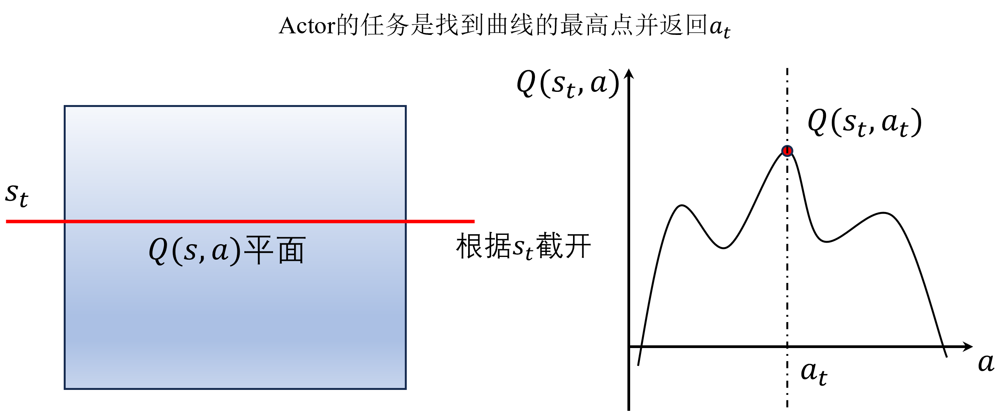
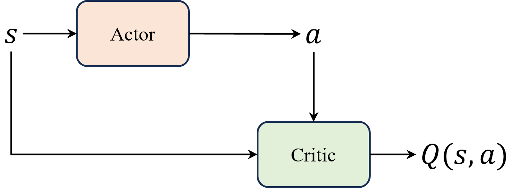

# DDPG 算法

本章讲 $\text{DDPG}$ 算法和 $\text{TD3}$ 算法，其中后者是在前者的基础上做了一些优化。严格来说，$\text{DDPG}$ 算法被提出的初衷其实是 $\text{DQN}$ 算法的一个连续动作空间版本扩展。当时 $\text{Actor-Critic}$ 架构还没有广泛流行，因为 $\text{A3C}$ 算法是在 $\text{2016}$ 年发表的，比 $\text{DDPG}$ 算法晚了一年。只是我们回看 $\text{DDPG}$ 算法的时候发现其在形式上更像 $\text{Actor-Critic}$ 的架构，因此将其归为 $\text{Actor-Critic}$ 算法的一种。

## DPG 方法

深度确定性策略梯度算法（ $\text{deep deterministic policy gradient，DDPG}$），是一种确定性的策略梯度算法。为了让读者更好地理解 $\text{DDPG}$ 算法，我们先把 “深度” 二字去掉，即先介绍一下 $\text{DPG}$ 算法，也是 $\text{DDPG}$ 算法的核心所在。

有了前面 $\text{Actor-Critic}$ 算法的铺垫之后，从策略梯度的角度来理解 $\text{DPG}$ 算法是比较容易的。首先我们知道 $\text{DQN}$ 算法的一个主要缺点就是不能用于连续动作空间，这是因为在 $\text{DQN}$ 算法中动作是通过贪心策略或者说 $\text{argmax}$ 的方式来从 $Q$ 函数间接得到，这里 $Q$ 函数就相当于 $\text{DDPG}$ 算法中的 $\text{Critic}$。

而要想适配连续动作空间，我们干脆就将选择动作的过程变成一个直接从状态映射到具体动作的函数 $\mu_\theta (s)$，其中 $\theta$ 表示模型的参数，这样一来就把求解 $Q$ 函数、贪心选择动作这两个过程合并成了一个函数，也就是我们常说的 $\text{Actor}$ 。注意，这里的 $\mu_\theta (s)$ 输出的是一个动作值，而不是像 $\text{Actor-Critic}$ 章节中提到的概率分布 $\pi_{\theta}(a|s)$。

我们知道 $Q(s,a)$ 函数实际上是有两个变量的，相当于一个曲线平面，如图 $\text{1}$ 所示。当我们输入某个状态到 $\text{Actor}$ 时，即固定 $s=s_t$ 时，则相当于把曲线平面截断成一条曲线。而 $\text{Actor}$ 的任务就是寻找这条曲线的最高点，并返回对应的横坐标，即最大 $Q$ 值对应的动作。

图 $\text{1}$ $\:$ $\text{DDPG}$ 算法中 $\text{Actor}$ 的作用

所以，$\text{DDPG}$ 算法并没有做真正意义上的梯度更新，只是在寻找最大值，本质上还是 $\text{DQN}$ 算法的思路。因此 $\text{DDPG}$ 算法中 $\text{Critic}$ 结构会同时包含状态和动作输入，而不是 $\text{Actor-Critic}$ 算法中那样只包含状态，因为它本质上就是 $Q(s,a)$ 函数，如图 $\text{2}$ 所示。

图 $\text{2}$ $\:$ $\text{DDPG}$ 网络结构

这里相当于是把 $\text{DQN}$ 算法中 $\varepsilon-\text{greedy}$ 策略函数部分换成了 $\text{Actor}$ 。注意 $\text{Actor}$ 网络 $\mu_\theta (s)$ 与输出概率分布的随机性策略（ $\text{stochastic policy}$ ）不同，输出的是一个值，因此也叫做确定性策略（ $\text{deterministic policy}$ ）。效仿策略梯度的推导，我们也可以推导出 $\text{DPG}$ 算法的目标函数，如式 $\eqref{eq:11.1}$ 所示。

$$
\begin{equation}\label{eq:11.1}
\nabla_\theta J(\theta) \approx \mathbb{E}_{s_t \sim \rho^\beta}\left[\left.\nabla_a Q\left(s_t, a\right)\right|_{a=\mu_\theta\left(s_t\right)} \nabla_\theta \mu_\theta\left(s_t\right)\right]
\end{equation}
$$

其中 $\rho^\beta$ 是策略的初始分布，用于探索状态空间，在实际应用中相当于网络模型的初始参数。注意这里的 $Q(s_t, a)$ 相当于一个 $\text{Critic}$ 网络，将状态和动作作为输入，并且输出一个值。

## DDPG 算法

在 $\text{DPG}$ 算法 的基础上，再结合一些技巧，就是  $\text{DDPG}$ 算法了，这些技巧既包括 $\text{DQN}$ 算法中也用到的目标网络、经验回放等，也包括引入噪声来增加策略的探索性。

不知道读者有没有发现，在强化学习基础算法的研究改进当中，基本无外乎几个亘古不变的主题：首先是**如何提高对值函数的估计**，保证其准确性，即尽量无偏且低方差，例如最开始的用深度神经网络替代简单的 $Q$ 表、结合蒙特卡洛和时序差分的 $\text{TD}(\lambda)$ 、引入目标网络以及广义优势估计等等；其次是**如何提高探索以及平衡探索-利用的问题**，尤其在探索性比较差的确定性策略中，例如 $\text{DQN}$ 和 $\text{DDPG}$ 算法都会利用各种技巧来提高探索，例如经验回放、$\varepsilon-\text{greedy}$ 策略、噪声网络等等。这两个问题是强化学习算法的基础核心问题，希望能够给读者在学习和研究的过程中带来一定的启发。

回到正题，由于目标网络、经验回放前面章节都讲过了，这里就略过。我们讲讲 $\text{DDPG}$ 引入的噪声。其实引入噪声的方法在前面 $\text{Noisy DQN}$ 算法中就讲到了，只是 $\text{Noisy DQN}$ 算法是在网络中引入噪声，而 $\text{DDPG}$ 算法是在输出动作上引入噪声，同 $\varepsilon-\text{greedy}$ 策略类似。本质上来讲，引入噪声的作用就是为了在不破坏系统的前提下，提高系统运行的抗干扰性。

这其实跟我们生活中打疫苗是类似的，通常我们会将灭活的病毒也就是疫苗注入到体内，引发免疫系统的警觉，从而提高免疫系统的抗干扰性，即提高我们身体的免疫力。这里疫苗就相当于轻微的噪声，如果免疫系统一直没见过这种噪声，那么一旦遇到真正的病毒之后是很有可能崩溃的，反之如果经常接触这种轻微的噪声，那么免疫系统就会逐渐适应，从而提高抗干扰性。又好比我们平时做的消防演练，虽然平时的演练都不是真正意义上的灾害，但经过熟练的演练之后一旦遇到真正的灾害不说从容应对，至少也不会过于慌乱了。

$\text{DDPG}$ 算法中 $\mu_\theta (s)$ 输出的是单个值，而引入噪声最简单的方式就是在输出的值上加上一个随机数，这个随机数可以是正态分布的（即高斯噪声），也可以是均匀分布的，只要能够保证这个随机数的值不要过大就行。

当然简单的噪声引入除了简便这一个优点之外，可能剩下的全都是缺点了，因此在 $\text{DDPG}$ 算法中使用的其实是一种叫做 $\text{Ornstein-Uhlenbeck}$ 的噪声，简称 $\text{OU}$ 噪声。$\text{OU}$ 噪声是一种具有回归特性的随机过程，其与高斯噪声相比的优点在于：

* **探索性**：$\text{OU}$ 噪声具有持续的、自相关的特性。相比于独立的高斯噪声，$\text{OU}$ 噪声更加平滑，并且在训练过程中更加稳定。这种平滑特性使得OU噪声有助于探索更广泛的动作空间，并且更容易找到更好的策略。
* **控制幅度**：$\text{OU}$ 噪声可以通过调整其参数来控制噪声的幅度。在 $\text{DDPG}$ 算法中，可以通过调整 $\text{OU}$ 噪声的方差来控制噪声的大小，从而平衡探索性和利用性。较大的方差会增加探索性，而较小的方差会增加利用性。
* **稳定性**：$\text{OU}$ 噪声的回归特性使得噪声在训练过程中具有一定的稳定性。相比于纯粹的随机噪声，在 $\text{DDPG}$ 算法中使用$\text{OU}$ 噪声可以更好地保持动作的连续性，避免剧烈的抖动，从而使得训练过程更加平滑和稳定。
* **可控性**：由于$\text{OU}$ 噪声具有回归特性，它在训练过程中逐渐回归到均值，因此可以控制策略的探索性逐渐减小。这种可控性使得在训练的早期增加探索性，然后逐渐减小探索性，有助于更有效地进行训练。

总的来说，$\text{OU}$ 噪声作为 $\text{DDPG}$ 算法中的一种探索策略，具有平滑、可控、稳定等优点，使得算法能够更好地在连续动作空间中进行训练，探索更广泛的动作空间，并找到更优的策略。它是 $\text{DDPG}$ 算法成功应用于连续动作空间问题的重要因素之一。

虽然它有这么多的优点，实际上在简单的环境中，它跟使用简单的高斯噪声甚至不用噪声的效果是差不多的，只有在复杂的环境中才会体现出来区别。因此，如果读者在实际应用中面临的问题比较简单，可以不用OU噪声，而是使用高斯噪声或者不用噪声即可，这样可以减少算法的复杂度，加快算法的收敛速度，正所谓 “杀鸡焉用牛刀”。

$\text{OU}$ 噪声主要由两个部分组成：随机高斯噪声和回归项，其数学定义如式 $\eqref{eq:11.2}$ 所示。

$$
\begin{equation}\label{eq:11.2}
d x_t=\theta\left(\mu-x_t\right) d t+\sigma d W_t
\end{equation}
$$

其中 $x_t$ 是 $\text{OU}$ 过程在时间 $t$ 的值，即当前的噪声值，这个 $t$ 也是强化学习中的时步（ $\text{time step}$ ）。$\mu$ 是回归到的均值，表示噪声在长时间尺度上的平均值。$\theta$ 是 $\text{OU}$ 过程的回归速率，表示噪声向均值回归的速率。$\sigma$ 是 $\text{OU}$ 过程的扰动项，表示随机高斯噪声的标准差。$dW_t$ 是布朗运动（ $\text{Brownian motion}$ ）或者维纳过程（ $\text{Wiener process}$ ），是一个随机项，表示随机高斯噪声的微小变化。

在实际应用中，我们只需要调整 $\mu$ 和 $\sigma$ 就可以了，$\theta$ 通常是固定的，而 $dW_t$ 是随机项，我们也不需要关注。尽管如此，需要调整的参数还是有点多，这也是为什么 $\text{DDPG}$ 算法的调参比较麻烦的原因之一.

## DDPG 算法的优缺点

总的来说，$\text{DDPG}$ 算法的优点主要有：

* **适用于连续动作空间**：$\text{DDPG}$ 算法采用了确定性策略来选择动作，这使得它能够直接处理连续动作空间的问题。相比于传统的随机策略，确定性策略更容易优化和学习，因为它不需要进行动作采样，缓解了在连续动作空间中的高方差问题。
* **高效的梯度优化**：$\text{DDPG}$ 算法使用策略梯度方法进行优化，其梯度更新相对高效，并且能够处理高维度的状态空间和动作空间。同时，通过 $\text{Actor-Critic}$ 结构，算法可以利用值函数来辅助策略的优化，提高算法的收敛速度和稳定性。
* **经验回放和目标网络**：这是老生常谈的内容了，经验回放机制可以减少样本之间的相关性，提高样本的有效利用率，并且增加训练的稳定性。目标网络可以稳定训练过程，避免值函数估计和目标值之间的相关性问题，从而提高算法的稳定性和收敛性。

而缺点在于：

* **只适用于连续动作空间**：这既是优点，也是缺点。

* **高度依赖超参数**：$\text{DDPG}$ 算法中有许多超参数需要进行调整，除了一些 $\text{DQN}$的算法参数例如学习率、批量大小、目标网络的更新频率等，还需要调整一些 $\text{OU}$ 噪声的参数
调整这些超参数并找到最优的取值通常是一个挑战性的任务，可能需要大量的实验和经验。

* **高度敏感的初始条件**：$\text{DDPG}$ 算法对初始条件非常敏感。初始策略和值函数的参数设置可能会影响算法的收敛性和性能，需要仔细选择和调整。

* 容易陷入局部最优：由于采用了确定性策略，可能会导致算法陷入局部最优，难以找到全局最优策略。为了增加探索性，需要采取一些措施，如加入噪声策略或使用其他的探索方法。

可以看到，$\text{DDPG}$ 算法的优点可能掩盖不了它众多的缺点，尤其对于初学者来说，调参是一个非常头疼的问题，因此在实际应用中，同样情况下可能会选择更加简单的 $\text{PPO}$ 算法会来得更加容易一些。当然，对于一些熟练的调参大侠来说，$\text{DDPG}$ 算法以及相关改进版本的算法也是值得尝试的，毕竟它们在实际应用中的效果还是非常不错的。

## TD3 算法

我们知道 $\text{DDPG}$ 算法的缺点太多明显，因此后来有人对其进行了改进，这就是我们接下来要介绍的 $\text{TD3}$ 算法。$\text{TD3}$ 算法，英文全称为 $\text{twin delayed DDPG}$，中文全称为双延迟确定性策略梯度算法。相对于 $\text{DDPG}$ 算法，$\text{TD3}$ 算法的改进主要做了三点重要的改进，一是 双 $Q$ 网络，体现在名字中的 $\text{twin}$，二是 延迟更新，体现在名字中的 $\text{delayed}$，三是 噪声正则（ $\text{noise regularisation}$ ），下面我们分别来看一下。

### 10.4.1 双 Q 网络

双 $Q$ 网络的思想其实很简单，就是在 $\text{DDPG}$ 算法中的 $\text{Critic}$ 网络上再加一层，这样就形成了两个 $\text{Critic}$ 网络，分别记为 $Q_{\omega_1}$ 和 $Q_{\omega_2}$，其中 $\omega_1$ 和 $\omega_2$ 分别表示两个网络的参数。这样一来，我们就可以得到两个 $Q$ 值，分别记为 $Q_{\omega_1}(s_t, a_t)$ 和 $Q_{\omega_2}(s_t, a_t)$。然后我们在计算 $\text{TD}$ 误差的时候，就可以取两个 $Q$ 值中较小的那个，如式 $\eqref{eq:11.3}$ 所示。

$$
\begin{equation}\label{eq:11.3}
\begin{aligned}
L(\omega_1) &= \mathbb{E}_{s_t, a_t, r_{t+1}, s_{t+1} \sim D}\left[\left(Q_{\omega_1}(s_t, a_t) - y_t\right)^2\right] \\
y_t &= r_{t+1} + \gamma \min_{i=1,2} Q_{\omega_i}(s_{t+1}, \mu_{\theta}(s_{t+1})) \\
\end{aligned}
\end{equation}
$$

其中 $L$ 表示损失函数，同理，我们也可以得到另一个 $\text{Critic}$ 网络的损失函数 $L(\omega_2)$，如式 $\eqref{eq:11.4}$ 所示。

$$
\begin{equation}\label{eq:11.4}
\begin{aligned}
L(\omega_2) &= \mathbb{E}_{s_t, a_t, r_{t+1}, s_{t+1} \sim D}\left[\left(Q_{\omega_2}(s_t, a_t) - y_t\right)^2\right] \\
y_t &= r_{t+1} + \gamma \min_{i=1,2} Q_{\omega_i}(s_{t+1}, \mu_{\theta}(s_{t+1})) \\
\end{aligned}
\end{equation}
$$

细心的读者会发现，这跟 $\text{Double DQN}$ 的原理本质上是一样的，这样做的好处是可以减少 $Q$ 值的过估计，从而提高算法的稳定性和收敛性。

### 延迟更新

延迟更新更像是一种实验技巧，即在训练中 $\text{Actor}$ 的更新频率要低于 $\text{Critic}$ 的更新频率。在学习过程中，$\text{Critic}$ 是不断更新的，可以想象一下，假设在某个时刻 $\text{Actor}$ 好不容易达到一个最高点，这个时候 $\text{Critic}$ 又更新了，那么 $\text{Actor}$ 的最高点就被打破了，这样一来 $\text{Actor}$ 就会不断地追逐 $\text{Critic}$，这样就会造成误差的过分累积，进而导致 $\text{Actor}$ 的训练不稳定，甚至可能会发散。

因此，为了避免这种情况，我们就可以在训练中让 $\text{Actor}$ 的更新频率低于 $\text{Critic}$ 的更新频率，这样一来 $\text{Actor}$ 的更新就会比较稳定，不会受到 $\text{Critic}$ 的影响，从而提高算法的稳定性和收敛性。

举个不太恰当的例子，$\text{Critic}$ 就好比领导，$\text{Actor}$ 则好比员工，领导不断给员工下达目标，员工不断地去完成目标，如果领导的决策经常失误，那么员工就很容易像无头苍蝇一样不知道该完成哪些目标。

因此，一个好的解决方式就是让领导学得比员工更快，领导学得更快了之后下达目标的失误率就会更低，这样员工就能够更好地完成目标了，从而提高整个团队的效率。在实践中，$\text{Actor}$ 的更新频率一般要比 $\text{Critic}$ 的更新频率低一个数量级，例如 $\text{Critic}$ 每更新 $\text{10}$ 次，$\text{Actor}$ 只更新 $\text{1}$ 次。

### 噪声正则

更准确地说，在原论文中不叫噪声正则，而是目标策略平滑正则化（ $\text{Target Policy Smoothing Regularization}$ ），意思都是一样的，只是笔者在表述的时候做了简化。在延迟更新中，我们的主要思想是通过提高 $\text{Critic}$ 的更新频率来减少值函数的估计误差，也就是“降低领导决策的失误率”。但是这样其实是治标不治本的做法，因为它只是让 $\text{Critic}$ 带来的误差不要过分地影响到了 $\text{Actor}$，而没有考虑改进 $\text{Critic}$ 本身的稳定性。

因此，我们也可以给 $\text{Critic}$ 引入一个噪声提高其抗干扰性，这样一来就可以在一定程度上提高 $\text{Critic}$ 的稳定性，从而进一步提高算法的稳定性和收敛性。注意，这里的噪声是在 $\text{Critic}$ 网络上引入的，而不是在输出动作上引入的，因此它跟 $\text{DDPG}$ 算法中的噪声是不一样的。具体来说，我们可以在计算 $\text{TD}$ 误差的时候，给目标值 $y$ 加上一个噪声，并且为了让噪声不至于过大，还增加了一个裁剪（ $\text{clip}$ ），如式 $\eqref{eq:11.5}$ 所示。

$$
\begin{equation}\label{eq:11.5}
y=r+\gamma Q_{\theta^{\prime}}\left(s^{\prime}, \pi_{\phi^{\prime}}\left(s^{\prime}\right)+\epsilon\right) \epsilon \sim \operatorname{clip}(N(0, \sigma),-c, c)
\end{equation}
$$

其中 $N(0, \sigma)$ 表示均值为 $\text{0}$，方差为 $\sigma$ 的高斯噪声，$\epsilon$ 表示噪声，$\operatorname{clip}$ 表示裁剪函数，即将噪声裁剪到 $[-c, c]$ 的范围内，$c$ 是一个超参数，用于控制噪声的大小。可以看到，这里噪声更像是一种正则化的方式，使得值函数更新更加平滑，因此笔者称之为噪声正则。

## 思考

1. $\text{DDPG}$ 算法是 $\text{off-policy}$ 算法吗？为什么？

答：跟 $\text{DQN}$ 一样，$\text{DDPG}$ 算法，主要结合了经验回放、目标网络和确定性策略，是典型的 $\text{off-policy}$ 算法。

2. 软更新相比于硬更新的好处是什么？为什么不是所有的算法都用软更新？

答：好处：**平滑目标更新**：软更新通过逐渐调整目标网络的参数，使其向主网络的参数靠近，而不是直接复制主网络的参数。这样做可以降低目标的变化幅度，减少了训练中的不稳定性；**降低方差**；**避免振荡**：软更新可以减少目标网络和主网络之间的振荡，这有助于更稳定地收敛到良好的策略。缺点：**速度**：软更新会使目标网络变得更加缓慢；**探索和稳定性权衡**：一些算法可能更倾向于使用硬更新，因为它们可能需要更频繁地探索新的策略，而不依赖于过去的经验。硬更新允许在每次更新时完全用新策略替代旧策略；**算法需求**：某些算法可能对硬更新更敏感，而且硬更新可能是这些算法的关键组成部分。综上，软更新和硬更新都有其用途，选择哪种方式取决于具体的问题和算法要求。

3. 相比于 $\text{DDPG}$ 算法，$\text{TD3}$ 算法做了哪些改进？请简要归纳。

答：**双Q网络**： $\text{TD3}$ 使用了两个独立的 $\text{Q}$ 网络，分别用于估计动作的价值。这两个Q网络有不同的参数，这有助于减少估计误差，并提高了训练的稳定性；**目标策略噪声**：与 $\text{DDPG}$ 不同，$\text{TD3}$ 将噪声添加到目标策略，而不是主策略。这有助于减小动作值的过估计误差；**目标策略平滑化**：$\text{TD3}$ 使用目标策略平滑化技术，通过对目标策略的参数进行软更新来减小目标策略的变化幅度。这有助于提高稳定性和训练的收敛性。**延迟策略更新**：$\text{TD3}$ 引入了延迟策略更新，意味着每隔一定数量的时间步才更新主策略网络。这可以减小策略更新的频率，有助于减少过度优化的风险，提高稳定性。

4. $\text{TD3}$ 算法中 $\text{Critic}$ 的更新频率一般要比 $\text{Actor}$ 是更快还是更慢？为什么？

答：$\text{Critic}$ 网络的更新频率要比 $\text{Actor}$ 网络更快，即延迟策略更新。延迟策略更新的目的是减小策略更新的频率，以避免过度优化和提高训练的稳定性。因为 $\text{Critic}$ 网络的更新频率更高，它可以更快地适应环境的变化，提供更准确的动作价值估计，从而帮助 $\text{Actor}$ 网络生成更好的策略。