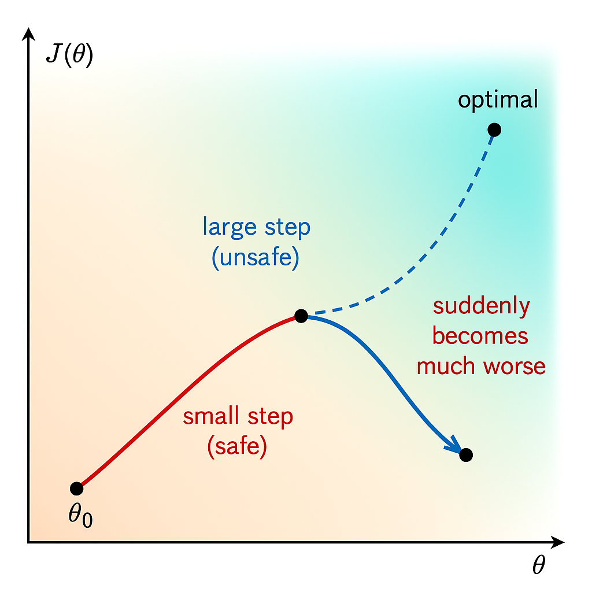
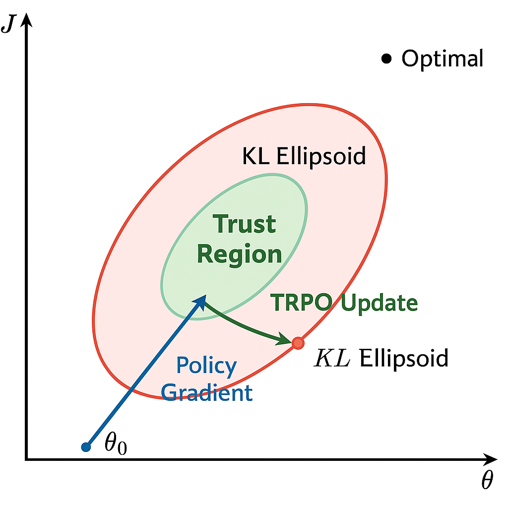
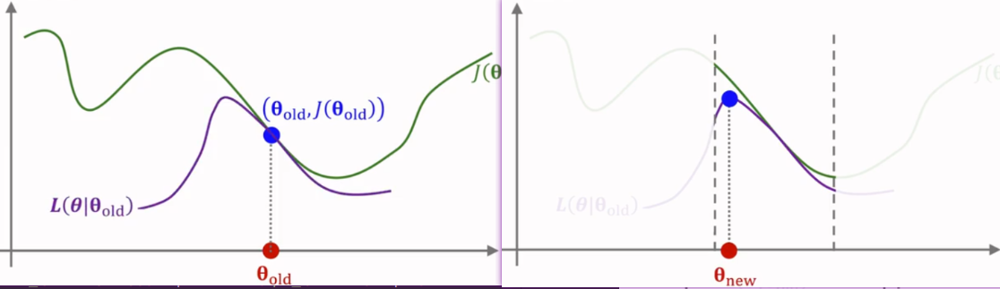
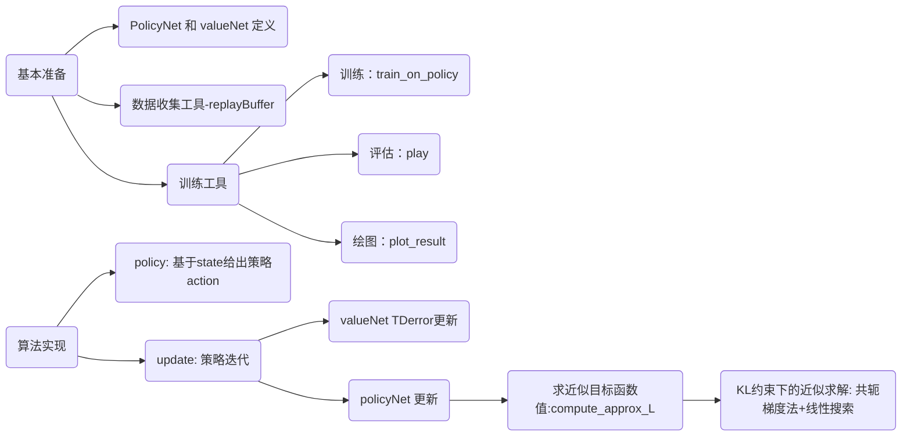
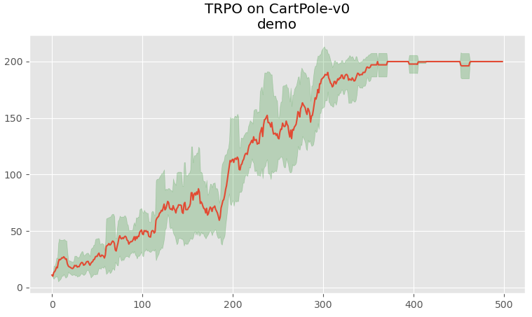

# TRPO 算法

## 简介

$\text{REINFORCE}$ 和 $\text{Actor-Critic}$ 等策略梯度方法虽然简单直观，但是在实际应用中会遇到训练不稳定的情况。具体来说，基于策略的方法主要沿着策略梯度 $\nabla_\theta J(\theta)$ 更新策略参数 $\theta$，但是如果每次更新的步长过大，可能会导致策略发生剧烈变化，从而使得训练过程不稳定，甚至发散。 为了解决这个问题，TRPO（Trust Region Policy Optimization，信赖域策略优化）算法考虑在更新时引入一个约束，也叫做置信域（$\text{Trust Region}$，用于限制每次更新后新旧策略之间的差异，从而保证策略更新的稳定性。

## 置信域

如图 1 所示，$\text{REINFORCE}$ 等策略梯度算法在更新参数时，从初始值 $\theta_0$ 出发，沿着梯度方向更新参数，由于没有对更新步长进行限制，可能会导致参数更新过大，进而使得策略发生剧烈变化，偏离了最优的参数区域，导致训练不稳定。

<div align=center>

<figcaption style="font-size: 14px;">图 1 策略梯度更新不稳定问题</figcaption>
</div>

为了避免这种情况，TRPO 引入了置信域的概念，如图 2 所示，置信域定义了一个允许策略更新的区域，限制了新旧策略之间的差异，从而确保每次更新后的策略不会偏离旧策略太远。

<div align=center>

<figcaption style="font-size: 14px;">图 2 置信域</figcaption>
</div>

换句话说，在更新策略时，保证新策略 $\pi_{\theta_{\text{new}}}$ 和旧策略 $\pi_{\theta_{\text{old}}}$ 之间的差异不会太大，“一步一个脚印” 地优化策略，从而提高训练的稳定性。

## 置信域算法 & TRPO

### 置信域算法

> 一句话： 先画一个可信圈，只在圈内找最优步，走完再决定圈大小  
> 扩充一句话：找到更新参数 $\theta$ 和 $\theta_{\text{old}}$ 相关的近似目标函数，在邻域$N(\theta_{\text{old}})$内寻找最大值

在进入TRPO算法之前，我们来看下经典的置信域算法的简要步骤：

1） 给定初始参数$\theta$， 确定约束邻域范围$N(\theta_{\text{old}})$；    
2） 寻找近似目标函数(approximation): $L(\theta | \theta_{\text{old}})$;    
3） 最大化近似的目标函数(Maximation): $\argmax_{\theta \in N(\theta_{\text{old}})} L(\theta | \theta_{\text{old}})$


图 3 简单展示了置信域算法的3个核心步骤

<div align=center>

<figcaption style="font-size: 14px;">图 3 置信域算法图示</figcaption>
</div>

### TRPO

我们对照置信域算法来看TRPO

1） 给定初始参数$\theta$， 确定约束邻域范围$N(\theta_{\text{old}})$。TRPO用KL散度来衡量新策略 $\pi_{\theta_{\text{new}}}$ 和旧策略 $\pi_{\theta_{\text{old}}}$ 之间的差异， 并做范围约束；    
2） 寻找近似目标函数(approximation): $L(\theta | \theta_{\text{old}})$。一般强化学习都是对agent任务建模成奖励最大化问题（reward maximization）
$$\mathbb{E}_\pi [  \tau(r) ]=\sum_{a}^A \pi_{\theta}(a|s)Q(s, a)$$
我们直接等价的加入旧策略
$$\sum_{a}^A \pi_{\theta_{\text{old}}}(a|s) \frac{\pi_{\theta}(a|s)}{\pi_{\theta_{\text{old}}}(a|s)} Q(s, a)=\mathbb{E}_{a \sim \pi_{\theta_{\text{old}}}}[\frac{\pi_{\theta}(a|s)}{\pi_{\theta_{\text{old}}}(a|s)} Q(s, a)]$$
可以直接用这个目标函数作为近似目标函数，即 $L(\theta | \theta_{\text{old}})=\mathbb{E}_{a \sim \pi_{\theta_{\text{old}}}}[\frac{\pi_{\theta}(a|s)}{\pi_{\theta_{\text{old}}}(a|s)} Q(s, a)]$

3） 约束范围内最大化(Maximation)
$$\argmax_{\theta \in N(\theta_{\text{old}})} L(\theta | \theta_{\text{old}})$$


但是，我们按上述方法构建近似目标函数后会存在一个问题——**无法保证每次迭代都朝着优化方向前进**。为了达到迭代时保证策略性能单调递增， 我们可以用baseline的方法将$Q(s, a)$替成优势函数 $A(s, a)$ （见证明1）。所以最后的近似目标函数可以变成如下：
$$L(\theta | \theta_{\text{old}})=\mathbb{E}_{a \sim \pi_{\theta_{\text{old}}}}[\frac{\pi_{\theta}(a|s)}{\pi_{\theta_{\text{old}}}(a|s)} A(s, a)]$$

## KL 散度

具体用什么来衡量新旧策略之间的差异呢？由于策略本质上是一个概率分布，因此可以使用概率分布之间的距离度量来衡量新旧策略的差异。在 $\text{TRPO}$ 算法中，我们使用 $\text{KL}$ 散度（$\text{Kullback-Leibler Divergence}$）来度量两个概率分布之间的差异，如式 $\eqref{eq:kl_divergence}$ 所示。

$$
\begin{equation}\label{eq:kl_divergence}
D_{\text{KL}}(P || Q) = \sum_{x} P(x) \log \frac{P(x)}{Q(x)}
\end{equation}
$$

其中，$P$ 是真实分布，$Q$ 是理论（拟合）分布。衡量的目标是使得 $Q$ 尽可能接近 $P$， $\text{KL}$ 散度的值越大，表示两个分布之间的差异越大；反之，值越小，表示两个分布越相似。代入到策略中，我们可以定义新旧策略之间的 $\text{KL}$ 散度，如式 $\eqref{eq:kl_policy}$ 所示。

$$
\begin{equation}\label{eq:kl_policy}
D_{\text{KL}}(\pi_{\theta_{\text{old}}} || \pi_{\theta_{\text{new}}}) = \mathbb{E}_{s \sim \rho_{\pi_{\theta_{\text{old}}}}} \left[ \sum_{a} \pi_{\theta_{\text{old}}}(a|s) \log \frac{\pi_{\theta_{\text{old}}}(a|s)}{\pi_{\theta_{\text{new}}}(a|s)} \right]
\end{equation}
$$

其中，$\rho_{\pi_{\theta_{\text{old}}}}$ 表示在旧策略下状态的分布，$\pi_{\theta_{\text{old}}}(a|s)$ 和 $\pi_{\theta_{\text{new}}}(a|s)$ 分别表示旧策略和新策略在状态 $s$ 下选择动作 $a$ 的概率。

为方便理解，使用 `Numpy` 模块来实现计算两个离散概率分布之间的 $\text{KL}$ 散度，如代码 1 所示。
<div style="text-align: center;">
    <figcaption style="font-size: 14px;"> <b>代码 1 KL 散度 Numpy 实现</b> </figcaption>
</div>

```python
import numpy as np
def kl_divergence(p, q):
    """
    计算两个离散概率分布之间的 KL 散度
    参数:
        p: 旧策略的概率分布 (numpy 数组)
        q: 新策略的概率分布 (numpy 数组)
    返回:
        KL 散度值
    """
    return np.sum(p * np.log(p / q))

# 示例
old_policy = np.array([0.2, 0.5, 0.3])  # 旧策略的概率分布
new_policy = np.array([0.3, 0.4, 0.3])  # 新策略的概率分布
kl_value = kl_divergence(old_policy, new_policy)
print(f"KL 散度: {kl_value}")
```

在代码实战中，可以使用 `PyTorch` 或 `TensorFlow` 等深度学习框架来计算 $\text{KL}$ 散度，如代码 2 所示。

<div style="text-align: center;">
    <figcaption style="font-size: 14px;"> <b>代码 2 KL 散度 PyTorch 实现</b> </figcaption>
</div>

```python
import torch
import torch.nn as nn
from torch.distributions import Categorical

class Policy(nn.Module):
    ''' 简单的离散动作策略网络
    '''
    def __init__(self, state_dim, action_dim):
        super(Policy, self).__init__()
        self.fc = nn.Linear(state_dim, action_dim)

    def forward(self, state):
        logits = self.fc(state)
        return Categorical(logits=logits)

def kl_divergence(policy_old, policy_new, state):
    dist_old = policy_old(state)
    dist_new = policy_new(state)
    return torch.distributions.kl.kl_divergence(dist_old, dist_new).mean()

# 示例
state_dim = 4
action_dim = 2
policy_old = Policy(state_dim, action_dim)
policy_new = Policy(state_dim, action_dim)
state = torch.randn(1, state_dim)
kl_value = kl_divergence(policy_old, policy_new, state)
print(f"KL 散度: {kl_value.item()}")
```

## TRPO算法-Demo实现

> 吐槽： TRPO骚操作太多，可以直接移步PPO-Penalty： 用拉格朗日乘数法直接将 KL 散度的限制放进了目标函数中——简单明了有效



### 基本准备
定义简单的`PolicyNet`和`valueNet`， `PolicyNet`基于但前环境给出agent的策略action, 即$\pi_\theta(a|s)$, valueNet基于TDerror更新，同时也用于计算Advantage

<div style="text-align: center;">
    <figcaption style="font-size: 14px;"> <b>代码 3 TRPO-PolicyNet & ValueNet PyTorch 实现</b> </figcaption>
</div>

```python

class PolicyNet(nn.Module):
    ''' 简单的离散动作策略网络
    '''
    def __init__(self, state_dim, hidden_dim, action_dim):
        super(PolicyNet, self).__init__()
        self.fc1 = torch.nn.Linear(state_dim, hidden_dim)
        self.fc2 = torch.nn.Linear(hidden_dim, action_dim)

    def forward(self, state, detach_flag=False):
        logits = self.fc2(F.relu(self.fc1(state)))
        # 截断极端值，数值稳，梯度安
        logits = torch.clamp(logits, min=-20, max=20) 
        return Categorical(logits=logits.detach() if detach_flag else logits)


class ValueNet(nn.Module):
    """简单value Net"""
    def __init__(self, state_dim, hidden_dim):
        super(ValueNet, self).__init__()
        self.fc1 = torch.nn.Linear(state_dim, hidden_dim)
        self.fc2 = torch.nn.Linear(hidden_dim, 1)

    def forward(self, x):
        x = F.relu(self.fc1(x))
        return self.fc2(x)
```

我们需要收集n步的数据进行策略更新， 我们简单实现就直接收集一轮游戏的全部数据，`replayBuffer`就是数据收集工具。

<div style="text-align: center;">
    <figcaption style="font-size: 14px;"> <b>代码 4 TRPO-数据收集工具replayBuffer PyTorch 实现</b> </figcaption>
</div>

```python
import random 
import numpy as np 
from collections import deque


class replayBuffer:
    def __init__(self, capacity: int, np_save: bool=False):
        self.buffer = deque(maxlen=capacity)
        self.np_save = np_save
    
    def add(self, state, action, reward, next_state, done):
        if self.np_save:
            self.buffer.append( (np.array(state), np.array(action), np.array(reward), np.array(next_state), np.array(done)) )
        else:
            self.buffer.append( (state, action, reward, next_state, done) )

    def add_more(self, *args):
        self.buffer.append( args )

    def __len__(self):
        return len(self.buffer)
    
    def sample(self, batch_size: int) -> deque:
        samples = random.sample(self.buffer, batch_size)
        return samples

```

on-policy训练一般就是当前策略执行n步收集样本后（样本都是同一个策略产生的），再用这部分样本进行策略更新。这个基本步骤我们会在`train_on_policy`中实现。 同时，在训练了x轮之后我们需要评估一下训练的效果，所以我们实现`play`来评估，截止到当前策略的表现。最后`plot_result`就是对训练过程的reward返回做平滑绘制。

<div style="text-align: center;">
    <figcaption style="font-size: 14px;"> <b>代码 5 TRPO-训练工具包（train_on_policy、 play、 plot_result） PyTorch 实现</b> </figcaption>
</div>

```python
import matplotlib.pyplot as plt

def train_on_policy(
        env, agent, cfg, 
        train_without_seed=False,
        test_episode_count=3
    ):
    tq_bar = tqdm(range(cfg.num_episodes))
    rewards_list = []
    now_reward = 0
    recent_best_reward = -np.inf
    best_ep_reward = -np.inf
    for i in tq_bar:
        buffer_ = replayBuffer(cfg.off_buffer_size) # on-policy 清空Buffer, 只收集当前策略轨迹
        tq_bar.set_description(f'Episode [ {i+1} / {cfg.num_episodes} ]')    
        rand_seed = np.random.randint(0, 999999)
        final_seed = rand_seed if train_without_seed else cfg.seed
        s, _ = env.reset(seed=final_seed)
        done = False
        episode_rewards = 0
        steps = 0
        for stp in range(cfg.max_episode_steps):
            a = agent.policy(s)
            n_s, r, terminated, truncated, _ = env.step(a)
            done = terminated or truncated
            steps += 1
            buffer_.add(s, a, r, n_s, done)
            s = n_s
            episode_rewards += r
            if done:
                break
        
        rewards_list.append(episode_rewards)
        now_reward = np.mean(rewards_list[-10:])
        if (now_reward > recent_best_reward) and (i >= 10):
            test_ep_reward = play(env, agent, cfg, episode_count=test_episode_count, play_without_seed=train_without_seed, render=False)
            if test_ep_reward > best_ep_reward:
                best_ep_reward = test_ep_reward
                # TODO: 可以扩充模型保存

            recent_best_reward = now_reward

        agent.update(buffer_.buffer)
        tq_bar.set_postfix({
            "steps": steps,
            'lastMeanRewards': f'{now_reward:.2f}', 
            'BEST': f'{recent_best_reward:.2f}',
            "bestTestReward": f'{best_ep_reward:.2f}'
        })
        
    env.close()
    return agent


@torch.no_grad()
def play(env_in, env_agent, cfg, episode_count=2, play_without_seed=False, render=True):
    """
    对训练完成的Agent进行游戏
    """
    max_steps = cfg.max_episode_steps
    env = copy.deepcopy(env_in)
    ep_reward_record = []
    for e in range(episode_count):
        final_seed = np.random.randint(0, 999999) if play_without_seed else cfg.seed
        s, _ = env.reset(seed=final_seed)
        done = False
        episode_reward = 0
        episode_cnt = 0
        for i in range(max_steps):
            if render:
                env.render()
            
            a = env_agent.policy(s)
            n_state, reward, terminated, truncated, info = env.step(a)
            done = terminated or truncated 
            episode_reward += reward
            episode_cnt += 1
            s = n_state
            if done:
                break

        ep_reward_record.append(episode_reward)
        add_str = ''
        print(f'[ {add_str}seed={final_seed} ] Get reward {episode_reward:.2f}. Last {episode_cnt} times')
    
    if render:
        env.close()

    print(f'[ {add_str}PLAY ] Get reward {np.mean(ep_reward_record):.2f}.')
    return np.mean(ep_reward_record) 


def plot_result(return_list, n_smooth=10, title=None):
    plt.style.use('ggplot')
    smooth_avg = np.array([np.mean(return_list[max(0, e-n_smooth):e]) for e in range(1, len(return_list))])
    smooth_std = np.array([np.std(return_list[max(0, e-n_smooth):e]) for e in range(1, len(return_list))])

    plt.plot(smooth_avg)
    plt.fill_between(
        list(range(len(smooth_avg))), 
        y1=smooth_avg - smooth_std*1.2, 
        y2=smooth_avg + smooth_std*1.2,  
        color='green',
        alpha=0.2
    )
    if title is not None:
        plt.title(title)
    plt.show()


plot_result(return_list, title=f'TRPO on {env_name}\ndemo')
```

### 算法实现

大家可以主要关注`update`就行： 1）ValueNet就是用TDerror 进行更新； 2）PolicyNet中Adavantage就是用上述推导的简单形式 $A = r + \gamma V_{t+1} - V_t$，`policy_learn`中重点关注近似目标函数（$L(\theta|\theta_{old})$）的计算（`compute_approx_L`），后面的近似求解大家可以自己深入的再去探究。


<div style="text-align: center;">
    <figcaption style="font-size: 14px;"> <b>代码 6 TRPO-算法 PyTorch 实现</b> </figcaption>
</div>

```python
class TRPO:
    """ TRPO算法 """
    def __init__(self, cfg, state_space, action_space):
        state_dim = state_space.shape[0]
        action_dim = action_space.n
        # 策略网络参数不需要优化器更新
        self.actor = PolicyNet(state_dim, cfg.hidden_dim, action_dim).to(cfg.device)
        self.critic = ValueNet(state_dim, cfg.hidden_dim).to(cfg.device)
        self.critic_optimizer = torch.optim.Adam(self.critic.parameters(), lr=cfg.critic_lr)

        self.gamma = cfg.gamma
        self.kl_constraint = cfg.kl_constraint  # KL距离最大限制
        self.alpha = cfg.alpha  # 线性搜索参数
        self.device = cfg.device

    @torch.no_grad()
    def policy(self, state):
        """
        \pi(a|s)
        """
        state = torch.tensor([state], dtype=torch.float).to(self.device)
        action_dist = self.actor(state)
        action = action_dist.sample()
        return action.item()
    
    def update(self, samples: deque):
        # sample -> tensor
        states, actions, rewards, next_states, done = zip(*samples)
        states = torch.FloatTensor(np.array(states)).to(self.device)
        actions = torch.Tensor(np.array(actions)).view(-1, 1).to(self.device)
        rewards = torch.Tensor(np.array(rewards)).view(-1, 1).to(self.device)
        next_states = torch.FloatTensor(np.array(next_states)).to(self.device)
        dones = torch.Tensor(np.array(done)).view(-1, 1).to(self.device)

        # 1- 更新valueNet
        td_target = rewards + self.gamma * self.critic(next_states) * (1 - dones)
        critic_loss = torch.mean(F.mse_loss(self.critic(states), td_target.detach()))
        self.critic_optimizer.zero_grad()
        critic_loss.backward()
        self.critic_optimizer.step()
        
        # 2- 更新policyNet
        old_action_dists = self.actor(states, detach_flag=True)
        old_log_probs = torch.log(old_action_dists.probs.gather(1, actions.long())).detach()
        # A = r + \gamma V_t+1 - V_t
        advantage = td_target - self.critic(states)
        self.policy_learn(states, actions, old_action_dists, old_log_probs, advantage.detach())

    def policy_learn(self, states, actions, old_action_dists, old_log_probs, advantage):
        approx_obj = self.compute_approx_L(states, actions, advantage, old_log_probs, self.actor)
        # 1) 梯度g 
        grads = torch.autograd.grad(approx_obj, self.actor.parameters())
        obj_grad = torch.cat([grad.view(-1) for grad in grads]).detach()

        # 2) 用共轭梯度法计算 x = H^(-1)g
        descent_direction = self.conjugate_gradient(obj_grad, states, old_action_dists)
        Hd = self.hessian_matrix_vector_product(states, old_action_dists, descent_direction)
        # 3) 线性搜索
        max_coef = torch.sqrt(2 * self.kl_constraint / (torch.dot(descent_direction, Hd) + 1e-8))
        new_para = self.line_search(states, actions, advantage, old_log_probs,
                                    old_action_dists,
                                    descent_direction * max_coef) 
        # 用线性搜索后的参数更新策略
        torch.nn.utils.convert_parameters.vector_to_parameters(new_para, self.actor.parameters()) 
    
    def compute_approx_L(self, states, actions, advantage, old_log_probs, actor):
        """ 
        计算近似目标函数
        L(\theta | \theta_{\text{old}})
        """
        dist = actor(states)
        log_probs = torch.log(dist.probs.gather(1, actions.long()))
        ratio = torch.exp(log_probs - old_log_probs) # \pi / \pi_{old}
        return torch.mean(ratio * advantage) 

    def hessian_matrix_vector_product(self, states, old_action_dists, vector):
        """
        Matrix-free Hessian-vector product  H · v
        H = ∇² KL(π_old || π_θ) ,  v ∈ ℝ^n
        """
        new_action_dists = self.actor(states) 
        kl_dis = kl.kl_divergence(old_action_dists, new_action_dists).mean()
        kl_grad = torch.autograd.grad(kl_dis, self.actor.parameters(), create_graph=True)
        # KL距离的梯度先和向量进行点积运算
        kl_grad_vector = torch.cat([grad.view(-1) for grad in kl_grad])
        kl_grad_vector_product = torch.dot(kl_grad_vector, vector)

        grad2 = torch.autograd.grad(kl_grad_vector_product, self.actor.parameters())
        grad2_vector = torch.cat([grad.view(-1) for grad in grad2])
        return grad2_vector

    def conjugate_gradient(self, grad, states, old_action_dists): 
        """共轭梯度法求解方程"""
        x = torch.zeros_like(grad)
        r = grad.clone()
        p = grad.clone()
        rdotr = torch.dot(r, r)
        for i in range(10):  # 共轭梯度主循环
            Hp = self.hessian_matrix_vector_product(states, old_action_dists, p)
            alpha = rdotr / torch.dot(p, Hp)
            x += alpha * p
            r -= alpha * Hp
            new_rdotr = torch.dot(r, r)
            if new_rdotr < 1e-10:
                break
            beta = new_rdotr / rdotr
            p = r + beta * p
            rdotr = new_rdotr
        return x

    def line_search(self, states, actions, advantage, old_log_probs, old_action_dists, max_vec):  # 线性搜索
        """
        矩阵-free 线性搜索：寻找满足 KL ≤ ε 的最大步长 α
        返回：α ∈ [0, 1] 及新参数向量
        """
        old_para = torch.nn.utils.parameters_to_vector(self.actor.parameters())
        obj_old = self.compute_approx_L(states, actions, advantage, old_log_probs, self.actor)

        for i in range(15): 
            coef = self.alpha**i
            new_para = old_para + coef * max_vec
            new_actor = copy.deepcopy(self.actor)
            torch.nn.utils.convert_parameters.vector_to_parameters(
                new_para, new_actor.parameters())

            # 4.1 计算新 KL 与近似目标
            new_dists = new_actor(states)

            kl_new = kl.kl_divergence(old_action_dists, new_dists).mean()
            obj_new = self.compute_approx_L(states, actions, advantage, old_log_probs, new_actor)

            # 4.2 接受条件
            if obj_new > obj_old and kl_new < self.kl_constraint:
                return new_para 
        return old_para

```

### 训练及效果展示

```python
import gymnasium as gym
import torch 
import copy 
import random 
import numpy as np 
from torch import nn 
from torch.nn import functional as F
from torch.distributions import Categorical, kl
from collections import deque
from tqdm.auto import tqdm
from argparse import Namespace


config = Namespace(
    num_episodes = 500
    ,hidden_dim = 128
    ,gamma = 0.98
    ,critic_lr = 4.5e-2
    ,kl_constraint = 0.0005
    ,alpha = 0.5
    ,max_episode_steps=220
    ,off_buffer_size=500
    ,seed=202511
)

config.device = torch.device("cuda") if torch.cuda.is_available() else torch.device("cpu")
env_name = 'CartPole-v0'
env = gym.make(env_name)
agent = TRPO(config, env.observation_space, env.action_space)
return_list =  train_on_policy(
        env, agent, config, 
        train_without_seed=False,
        test_episode_count=5
)
```
TRPO 在`CartPole-v0`环境中收敛较好，展现了十分优秀的性能效果。

<div align=center>

<figcaption style="font-size: 14px;">图 4 TRPO CartPole-v0训练效果图</figcaption>
</div>


## 证明

### 1- $L(\theta|\theta_{old})$ 中 baseline方法简要证明


$$\nabla_\theta \mathbb{E}_{a \sim \pi_{\theta_{\text{old}}}}[\frac{\pi_{\theta}(a|s)}{\pi_{\theta_{\text{old}}}(a|s)} b]$$
$$= \mathbb{E}_{a \sim \pi_{\theta_{\text{old}}}}[b \frac{1}{\pi_{\theta_{\text{old}}}(a|s)} \nabla_\theta \pi_{\theta}(a|s)]$$
这里我们约束了新旧策略差异较小，即$(\pi_\theta \approx \pi_{\theta_{\text{old}}})$
$$\Rightarrow \mathbb{E}_{a \sim \pi_{\theta}}[\nabla_\theta ln (\pi_{\theta}(a|s))]b=b \sum_a \pi_\theta(a|s) \frac{1}{\pi_\theta(a|s)}\frac{\partial \pi_\theta(s|a)}{\partial \theta}$$

$$=b \sum_a \frac{\partial \pi_\theta(s|a)}{\partial \theta} = b  \frac{\partial \sum_a \pi_\theta(s|a)}{\partial \theta} = b \frac{\partial 1}{\partial \theta}=0$$

近似函数中加入b  
$$L(\theta | \theta_{\text{old}})=\mathbb{E}_{a \sim \pi_{\theta_{\text{old}}}}[\frac{\pi_{\theta}(a|s)}{\pi_{\theta_{\text{old}}}(a|s)} (Q(s, a) + b)]$$

令$b=-V(s_t)$, 且$Q(s_t, a_t) = r + \gamma V(s_{t+1})$

$$L(\theta | \theta_{\text{old}})=\mathbb{E}_{a \sim \pi_{\theta_{\text{old}}}}[\frac{\pi_{\theta}(a|s)}{\pi_{\theta_{\text{old}}}(a|s)} (r + \gamma V(s_{t+1}) - V(s_t))]$$

- $A(s, a) = r + \gamma V(s_{t+1}) - V(s_t)$

