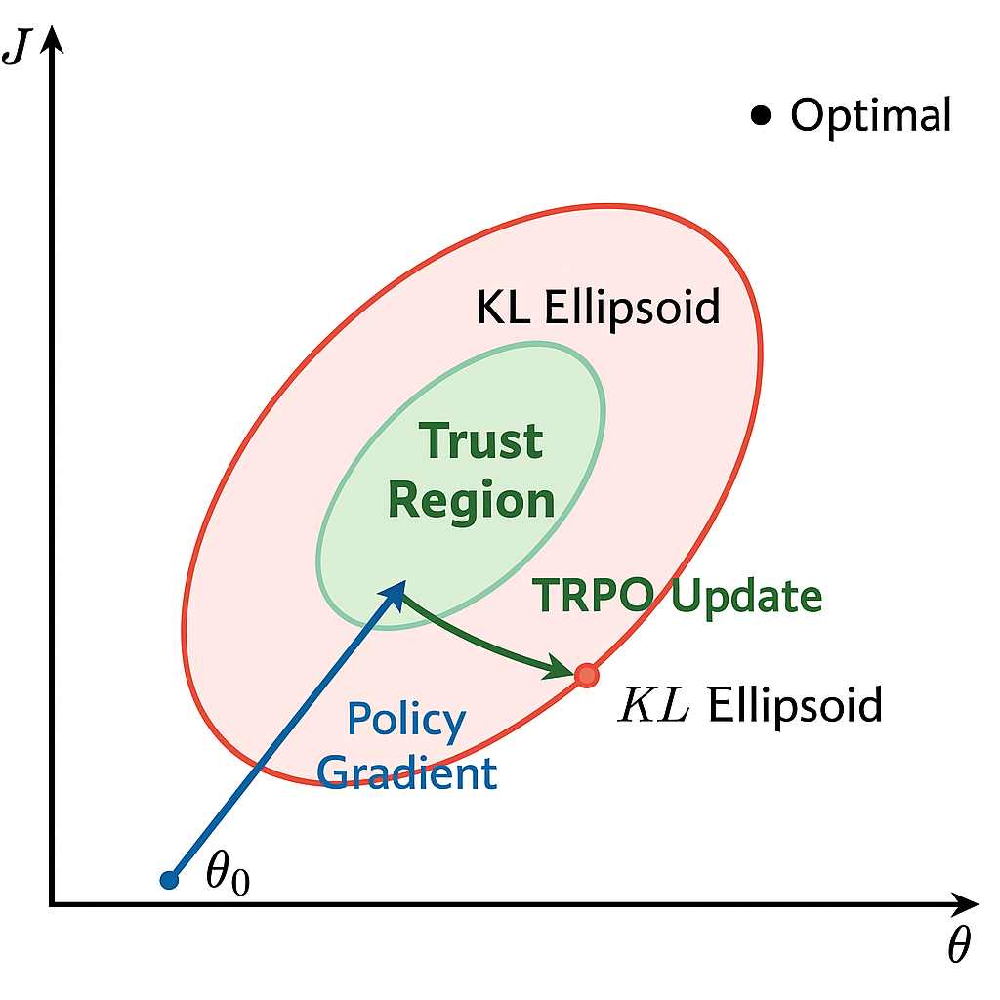

# TRPO 算法

## 简介

$\text{REINFORCE}$ 和 $\text{Actor-Critic}$ 等策略梯度方法虽然简单直观，但是在实际应用中会遇到训练不稳定的情况。具体来说，基于策略的方法主要沿着策略梯度 $\nabla_\theta J(\theta)$ 更新策略参数 $\theta$，但是如果每次更新的步长过大，可能会导致策略发生剧烈变化，从而使得训练过程不稳定，甚至发散。 为了解决这个问题，TRPO（Trust Region Policy Optimization，信赖域策略优化）算法考虑在更新时引入一个约束，也叫做置信域（$\text{Trust Region}$，用于限制每次更新后新旧策略之间的差异，从而保证策略更新的稳定性。

## 置信域

如图 1 所示，$\text{REINFORCE}$ 等策略梯度算法在更新参数时，从初始值 $\theta_0$ 出发，沿着梯度方向更新参数，由于没有对更新步长进行限制，可能会导致参数更新过大，进而使得策略发生剧烈变化，偏离了最优的参数区域，导致训练不稳定。

<div align=center>

<figcaption style="font-size: 14px;">图 1 策略梯度更新不稳定问题</figcaption>
</div>

为了避免这种情况，TRPO 引入了置信域的概念，如图 2 所示，置信域定义了一个允许策略更新的区域，限制了新旧策略之间的差异，从而确保每次更新后的策略不会偏离旧策略太远。

<div align=center>

<figcaption style="font-size: 14px;">图 2 置信域</figcaption>
</div>

换句话说，在更新策略时，保证新策略 $\pi_{\theta_{\text{new}}}$ 和旧策略 $\pi_{\theta_{\text{old}}}$ 之间的差异不会太大，“一步一个脚印” 地优化策略，从而提高训练的稳定性。

## KL 散度

具体用什么来衡量新旧策略之间的差异呢？由于策略本质上是一个概率分布，因此可以使用概率分布之间的距离度量来衡量新旧策略的差异。在 $\text{TRPO}$ 算法中，我们使用 $\text{KL}$ 散度（$\text{Kullback-Leibler Divergence}$）来度量两个概率分布之间的差异，如式 $\eqref{eq:kl_divergence}$ 所示。

$$
\begin{equation}\label{eq:kl_divergence}
D_{\text{KL}}(P || Q) = \sum_{x} P(x) \log \frac{P(x)}{Q(x)}
\end{equation}
$$

其中，$P$ 和 $Q$ 分别表示两个概率分布， $\text{KL}$ 散度的值越大，表示两个分布之间的差异越大；反之，值越小，表示两个分布越相似。代入到策略中，我们可以定义新旧策略之间的 $\text{KL}$ 散度，如式 $\eqref{eq:kl_policy}$ 所示。

$$
\begin{equation}\label{eq:kl_policy}
D_{\text{KL}}(\pi_{\theta_{\text{old}}} || \pi_{\theta_{\text{new}}}) = \mathbb{E}_{s \sim \rho_{\pi_{\theta_{\text{old}}}}} \left[ \sum_{a} \pi_{\theta_{\text{old}}}(a|s) \log \frac{\pi_{\theta_{\text{old}}}(a|s)}{\pi_{\theta_{\text{new}}}(a|s)} \right]
\end{equation}
$$

其中，$\rho_{\pi_{\theta_{\text{old}}}}$ 表示在旧策略下状态的分布，$\pi_{\theta_{\text{old}}}(a|s)$ 和 $\pi_{\theta_{\text{new}}}(a|s)$ 分别表示旧策略和新策略在状态 $s$ 下选择动作 $a$ 的概率。

为方便理解，使用 `Numpy` 模块来实现计算两个离散概率分布之间的 $\text{KL}$ 散度，如代码 1 所示。
<div style="text-align: center;">
    <figcaption style="font-size: 14px;"> <b>代码 1 KL 散度 Numpy 实现</b> </figcaption>
</div>

```python
import numpy as np
def kl_divergence(p, q):
    """
    计算两个离散概率分布之间的 KL 散度
    参数:
        p: 旧策略的概率分布 (numpy 数组)
        q: 新策略的概率分布 (numpy 数组)
    返回:
        KL 散度值
    """
    return np.sum(p * np.log(p / q))

# 示例
old_policy = np.array([0.2, 0.5, 0.3])  # 旧策略的概率分布
new_policy = np.array([0.3, 0.4, 0.3])  # 新策略的概率分布
kl_value = kl_divergence(old_policy, new_policy)
print(f"KL 散度: {kl_value}")
```

在代码实战中，可以使用 `PyTorch` 或 `TensorFlow` 等深度学习框架来计算 $\text{KL}$ 散度，如代码 2 所示。

<div style="text-align: center;">
    <figcaption style="font-size: 14px;"> <b>代码 2 KL 散度 PyTorch 实现</b> </figcaption>
</div>

```python
import torch
import torch.nn as nn
from torch.distributions import Categorical

class Policy(nn.Module):
    ''' 简单的离散动作策略网络
    '''
    def __init__(self, state_dim, action_dim):
        super(Policy, self).__init__()
        self.fc = nn.Linear(state_dim, action_dim)

    def forward(self, state):
        logits = self.fc(state)
        return Categorical(logits=logits)

def kl_divergence(policy_old, policy_new, state):
    dist_old = policy_old(state)
    dist_new = policy_new(state)
    return torch.distributions.kl.kl_divergence(dist_old, dist_new).mean()

# 示例
state_dim = 4
action_dim = 2
policy_old = Policy(state_dim, action_dim)
policy_new = Policy(state_dim, action_dim)
state = torch.randn(1, state_dim)
kl_value = kl_divergence(policy_old, policy_new, state)
print(f"KL 散度: {kl_value.item()}")
```