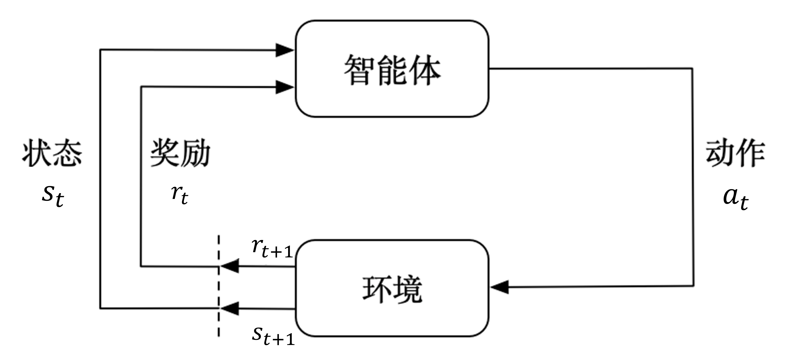

# 马尔可夫决策过程

本章开始介绍马尔可夫决策过程的基本概念，包括马尔可夫性质、回报、状态转移矩阵、策略与价值等内容，这些概念是理解强化学习算法的基础。

## 马尔可夫决策过程

在强化学习中，马尔可夫过程决策过程（$\text{Markov Decision Process, MDP}$）是用来描述智能体与环境交互的数学模型。如图 1 所示，智能体（$\text{Agent}$）与环境（$\text{Environment}$）在一系列离散的时步（ $\text{time step}$ ）中交互，在每个时步 $t$，智能体接收环境的状态 $s_t$，并根据该状态选择一个动作 $a_t$。执行该动作后，智能体会收到一个奖励 $r_{t}$，同时环境会转移到下一个状态 $s_{t+1}$。

<figcaption style="font-size: 14px;">图 1 智能体与环境的交互过程</figcaption>

这个过程不断重复，形成一条**轨迹**，如式 $\eqref{eq:1}$ 所示。

$$
\begin{equation}\label{eq:1}
s_0,a_0,r_0,s_1,a_1,r_1,\cdots,s_t,a_t,r_t,\cdots
\end{equation}
$$

完成一条轨迹，也称为一个**回合**（ $\text{episode}$ ），通常在有限的时步 $T$ 后结束，即 $t=0,1,2,\cdots,T$， $T$ 是回合的最大步数。

**如果要用强化学习来解决问题，首先需要将问题建模为马尔可夫决策过程，即明确状态空间、动作空间、状态转移概率和奖励函数等要素**。通常我们用一个五元组来定义马尔可夫决策过程，如式 $\eqref{eq:2}$ 所示。

$$
\begin{equation}\label{eq:2}
MDP = (S, A, P, R, \gamma)
\end{equation}
$$

其中 $S$ 是状态空间，表示所有可能的环境状态的集合， $A$ 是动作空间，表示智能体可以选择的所有可能动作的集合，$P$ 是状态转移概率矩阵，描述了在给定当前状态和动作的情况下，环境转移到下一个状态的概率分布，$R$ 是奖励函数，定义了在特定状态下执行某个动作所获得的即时奖励，$\gamma$ 是折扣因子，用于权衡当前奖励和未来奖励的重要性，其取值范围在 $0$ 到 $1$ 之间。其中状态转移矩阵和折扣因子将在下文详细展开说明。

## 马尔可夫性质

马尔可夫决策过程的核心假设是**马尔可夫性质（Markov Property）**，即系统的未来状态只依赖于当前状态，而与过去的状态无关，如式 $\eqref{eq:3}$ 所示。

$$
\begin{equation}\label{eq:3}
P(s_{t+1}|s_t,a_t, s_{t-1},a_{t-1},\cdots,s_0,a_0) = P(s_{t+1}|s_t,a_t)
\end{equation}
$$

即未来状态 $s_{t+1}$ 的概率分布仅由当前状态 $s_t$ 和当前动作 $a_t$ 决定，而与过去的状态和动作无关。

然而真实世界中，严格满足马尔可夫性质的情况并不多见，但在很多情况下，我们可以通过适当的状态表示来近似满足马尔可夫性质。例如，在自动驾驶中，当前车辆的位置、速度和周围环境信息可以作为状态表示，这些信息足以预测下一时刻的状态，而不需要考虑更早之前的历史数据，从而近似满足马尔可夫性质，这样的过程也叫做**部分可观测马尔可夫决策过程（Partially Observable Markov Decision Process, POMDP）**。

## 状态转移矩阵

通常，马尔可夫决策过程通常指有限马尔可夫决策过程（$\text{finite MDP}$），即状态空间和动作空间都是有限的。如果状态空间或动作空间是无限的，通常需要采用其他方法进行建模，例如连续时间马尔可夫过程等。既然状态数有限，就可以用一种状态流向图的形式表示智能体与环境交互过程中的走向。

如图 2 所示，图中每个曲线箭头表示指向自己，对于状态 $s_1$ 来说，有 $0.2$ 的概率继续保持在 $s_1$ 状态，同时也有 $0.4$ 和 $0.4$ 的概率转移到状态 $s_2$ 和 $s_3$。同理，其他状态之间也有类似的转移概率。

图 2 马尔可夫链

注意，图 2 中并没有包含动作和奖励等元素，因此严格来说它表示的是**马尔可夫链（$\text{Markov Chain}$）**，又叫做离散时间的马尔可夫过程（$\text{Markov Process}$），但它与马尔可夫决策过程有着密切的联系，都是基于马尔可夫性质构建的。

我们用一个概率来表示状态之间的切换，如式 $\eqref{eq:4}$ 所示。

$$
\begin{equation}\label{eq:4}
P_{ss'} = P(S_{t+1}=s'|S_{t}=s)
\end{equation}
$$

即当前状态是 $s$ 时，下一个状态是 $s'$的概率，其中大写的 $S$ 表示所有状态的集合，即 $S=\{s_1,s_2,s_3\}$ 。例如，$ P_{12}=P(S_{t+1}=s_2 | S_{t}=s_1) = 0.4$ 表示当前时步的状态是 $s_1$ ，下一个时步切换到 $s_2$ 的概率为 $0.4$ 。

拓展到所有状态，可以把这些概率绘制成一个状态转移表，如表 1 所示。

  

    <table>
      <tr>
        <th> $\space$ </th>
        <th>$S_{t+1} = s_1$</th>
        <th>$S_{t+1} = s_2$</th>
        <th>$S_{t+1} = s_3$</th>
      </tr>
      <tr>
        <td>$S_t = s_1$</td>
        <td>$0.2$</td>
        <td>$0.4$</td>
        <td>$0.4$</td>
      </tr>
      <tr>
        <td>$S_t = s_2$</td>
        <td>$0.2$</td>
        <td>$0.5$</td>
        <td>$0.3$</td>
      </tr>
      <tr>
        <td>$S_t = s_3$</td>
        <td>$0.1$</td>
        <td>$0.3$</td>
        <td>$0.6$</td>
      </tr>
    </table>
  

  
表 $1$ ：马尔可夫状态转移表

在数学上也可以用矩阵来表示，如式 $\eqref{eq:5}$ 所示。

$$
\begin{equation}\label{eq:5}
P_{ss'}=
    \begin{bmatrix}
        0.2 & 0.4 & 0.4\\
        0.2 & 0.5 & 0.3\\
        0.1 & 0.3 & 0.6\\
    \end{bmatrix}
\end{equation}
$$

这个矩阵就叫做**状态转移矩阵（State Transition Matrix）**，拓展到所有状态可表示为式 $\eqref{eq:6}$ 所示。

$$
\begin{equation}\label{eq:6}
P_{ss'}=\begin{pmatrix}
p_{11} & p_{12} & \cdots & p_{1n}\\
p_{21} & p_{22} & \cdots & p_{2n}\\
\vdots & \vdots & \ddots & \vdots \\
\end{pmatrix}
\end{equation}
$$

$\qquad$ 其中 $n$ 表示状态数，注意从同一个状态出发转移到其他状态的概率之和是等于 $1$ 的，即 $\sum_{j=1}^{n} p_{ij}=1$，$i=1,2,\cdots,n$。**状态转移矩阵是环境的一部分**，描述了环境状态之间的转移关系。 

## 目标与回报

在强化学习中，智能体的目标是**通过与环境的交互，学习一个最优策略，使得在每个状态下选择的动作能够最大化累积的奖励**。这个累积的奖励通常被称为**回报（Return）**，如式 $\eqref{eq:7}$ 所示。

$$
\begin{equation}\label{eq:7}
G_t = R_{t+1}+\gamma R_{t+2}+\gamma^2 R_{t+3} + \cdots = \sum_{k=0}^{\infty} \gamma^k R_{t+k+1}
\end{equation}
$$

表示从时间步 $t$ 开始，未来所有奖励的加权和，其中 $\gamma$ 是折扣因子，在 $0$ 到 $1$ 之间。折扣因子的作用是用来控制未来奖励在当前决策中的重要性。当 $\gamma$ 接近 $0$ 时，智能体更关注当前的奖励，而忽略未来的奖励；当 $\gamma$ 接近 $1$ 时，智能体会更加重视未来的奖励。

折扣因子一方面在数学上确保回报 $G_t$ 的收敛性，另一方面也代表了时间价值，就像经济学中的货币折现，同样面值的货币现在拿到手中比未来拿到更有价值。此外，折扣因子还可以用来衡量智能体对长期回报的关注度，或者者说”能看到多远“，称之为有效视界（$\text{effective horizon}$），如式 $\eqref{eq:8}$ 所示。

$$
\begin{equation}\label{eq:8}
H_{eff} = \frac{1}{1-\gamma}
\end{equation}
$$

当 $\gamma=0.9$ 时，$H_{eff}=10$，表示智能体主要关注未来 $10$ 个时步内的奖励；当 $\gamma=0.99$ 时，$H_{eff}=100$，表示智能体关注未来 $100$ 个时步内的奖励。

此外，当前时步的回报 $G_t$ 跟下一个时步 $G_{t+1}$ 的回报是有所关联的，即递归地定义，如式 $\eqref{eq:9}$ 所示。

$$
\begin{equation}\label{eq:9}
\begin{aligned}
G_t & \doteq r_{t+1}+\gamma r_{t+2}+\gamma^2 r_{t+3}+\gamma^3 r_{t+4}+\cdots \\
& =r_{t+1}+\gamma\left(r_{t+2}+\gamma r_{t+3}+\gamma^2 r_{t+4}+\cdots\right) \\
& =r_{t+1}+\gamma G_{t+1}
\end{aligned}
\end{equation}
$$

## 策略与价值

### 策略

策略 （$\text{Policy}$）表示智能体在每个状态下选择动作的规则或方法，用 $\pi$ 表示。如式 $\eqref{eq:10}$ 所示，策略是一个从状态到动作的映射或函数。

$$
\begin{equation}\label{eq:10}
\pi(a|s) = P(A_t = a | S_t = s)
\end{equation}
$$

表示在状态 $s$ 下选择动作 $a$ 的概率分布。**策略可以是确定性的（$\text{deterministic}$），即在每个状态下总是选择同一个动作，或者是随机性的（$\text{stochastic}$），即在每个状态下根据一定的概率分布选择动作。**

### 状态价值

状态价值函数（$\text{State-Value Function}$）表示在给定状态下，按照某种策略 $\pi$ 进行决策所能获得的回报期望值，用 $V_\pi(s)$ 表示，如式 $\eqref{eq:11}$ 所示。

$$
\begin{equation}\label{eq:11}
\begin{aligned}
V_\pi(s) &=\mathbb{E}_{\pi}[R_t+\gamma R_{t+1}+\gamma^2 R_{t+2} + \cdots |S_t=s ] \\
&=\mathbb{E}_{\pi}[G_t|S_t=s ] 
\end{aligned}
\end{equation}
$$

举例来说，假设智能体处于一个 $3\times3$ 的网格世界中，目标是走到右下角，对应获得 $10$ 分的奖励，走到其他格子的奖励为 $0$，策略是随机选择一个方向（上、下、左、右）移动一步。

如果初始状态 $s_0$ 即起点在左上角，按照当前策略，平均可能需要 $10$ 才能到达终点，每步奖励为 $0$，到达终点时获得 $10$ 分奖励，设折扣因子 $\gamma=0.9$，则从起点状态出发的状态价值计算如式 $\eqref{eq:14}$ 所示。

$$
\begin{equation}\label{eq:14}
V_\pi(s_0) = 0 + 0.9^1 \times 0 + 0.9^2 \times 0 + \cdots + 0.9^{10} \times 10 \approx 3.49
\end{equation}
$$

### 动作价值

动作价值函数（$\text{Action-Value Function}$）表示在给定状态 $s$ 和动作 $a$ 下，按照某种策略 $\pi$ 进行决策所能获得的回报期望值，用 $Q_\pi(s, a)$ 表示，如式 $\eqref{eq:12}$ 所示。

$$
\begin{equation}\label{eq:12}
Q_\pi(s, a)=\mathbb{E}_\pi\left[G_t \mid s_t=s, a_t=a\right]
\end{equation}
$$

### 状态价值与动作价值的关系

状态价值函数和动作价值函数之间存在密切的关系，如式 $\eqref{eq:13}$ 所示。

$$
\begin{equation}\label{eq:13}
V_\pi(s)=\sum_{a \in A} \pi(a \mid s) Q_\pi(s, a)
\end{equation}
$$

换句话说，状态价值是对所有可能的动作价值的加权平均，而动作价值则是对特定动作的评价。

状态价值反映了策略本身的好坏，它不关心智能体在状态 $s$ 下选择了哪个具体动作，而是关注在该状态下按照策略 $\pi$ 进行决策所能获得的整体回报期望值。动作价值则更具体地反映了在特定状态下选择某个动作所能获得的回报期望值，即不仅考虑智能体所处的状态，还考虑了智能体在该状态下选择的具体动作。
## 小结

本章主要介绍了马尔可夫决策过程的概念，它是强化学习的基本问题模型之一，因此读者需要牢牢掌握。此外拓展了一些重要的概念，包括马尔可夫性质、回报、状态转移矩阵、轨迹、回合等，这些概念在我们后面讲解强化学习算法的时候会频繁用到，务必牢记。

## 思考

**强化学习所解决的问题一定要严格满足马尔可夫性质吗？请举例说明。**

不一定。例如在围棋游戏场景中，不仅需要考虑当前棋子的位置，还需要考虑棋子的历史位置，因此不满足马尔可夫性质。但依然可以使用强化学习的方法进行求解，例如在 $\text{AlphaGO}$ 论文中使用了蒙特卡洛树搜索算法来解决这个问题。在一些时序性场景中，也可以通过引入记忆单元来解决这个问题，例如在 $\text{DQN}$ 算法中，使用了记忆单元来存储历史状态，从而解决了这个问题，尽管它也不满足马尔可夫性质。

**马尔可夫决策过程主要包含哪些要素？**

马尔可夫决策 $<S,A,R,P,\gamma>$ 主要包含状态空间 $S$、动作空间 $A$、奖励函数 $R$、状态转移矩阵 $P$、折扣因子 $\gamma$ 等要素，其中状态转移矩阵 $P$ 是环境的一部分，而其他要素是智能体的一部分。在实际应用中，通常还考虑值函数 $V$ 和策略函数 $\pi$ 等要素，值函数用于某个状态下的长期累积奖励，策略函数用于某个状态下的动作选择。

**马尔可夫决策过程引入折扣因子 $\gamma$ 的作用是什么？如何理解折扣因子的意义？**

折扣因子 $\gamma$ 的作用是用来控制未来奖励在当前决策中的重要性。它的取值范围在 $0$ 到 $1$ 之间。当 $\gamma$ 接近 $0$ 时，智能体更关注当前的奖励，而忽略未来的奖励；当 $\gamma$ 接近 $1$ 时，智能体会更加重视未来的奖励。一方面在数学上能够确保回报 $G_t$ 的收敛性，另一方面也代表了时间价值，就像经济学中的货币折现，同样面值的货币现在拿到手中比未来拿到更有价值。

**马尔可夫决策过程与金融科学中的马尔可夫链有什么区别与联系？**

马尔可夫链是一个随机过程，其下一个状态只依赖于当前状态而不受历史状态的影响，即满足马尔可夫性质。马尔可夫链由状态空间、初始状态分布和状态转移概率矩阵组成。马尔可夫决策过程是一种基于马尔可夫链的决策模型，它包含了状态、行动、转移概率、奖励、值函数和策略等要素。马尔可夫决策过程中的状态和状态转移概率满足马尔可夫性质，但区别在于它还包括了行动、奖励、值函数和策略等要素，用于描述在给定状态下代理如何选择行动以获得最大的长期奖励。
