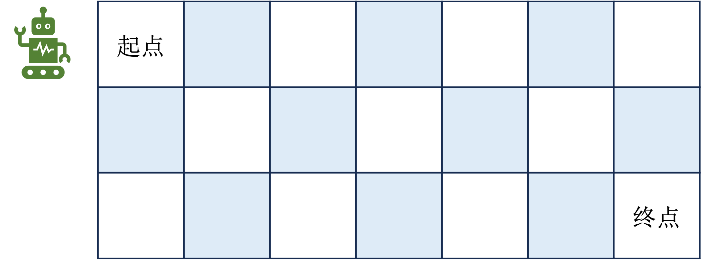
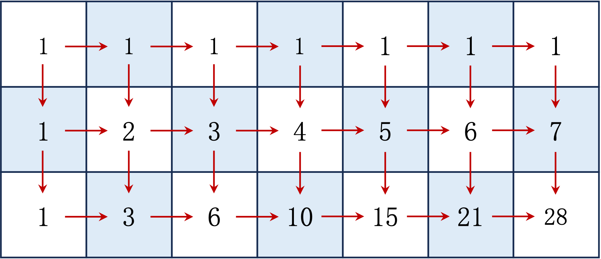
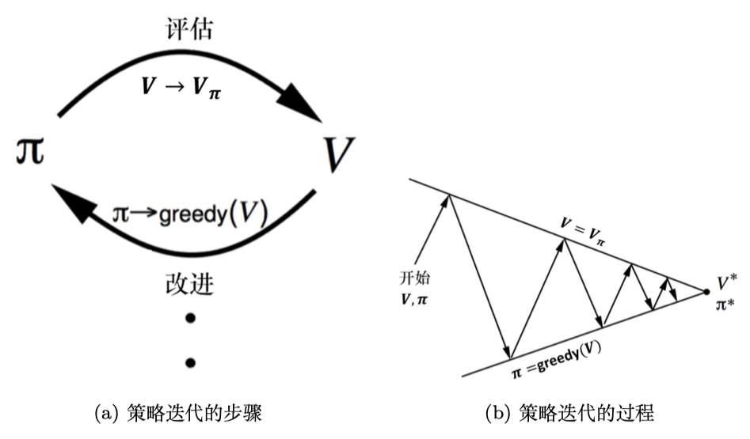
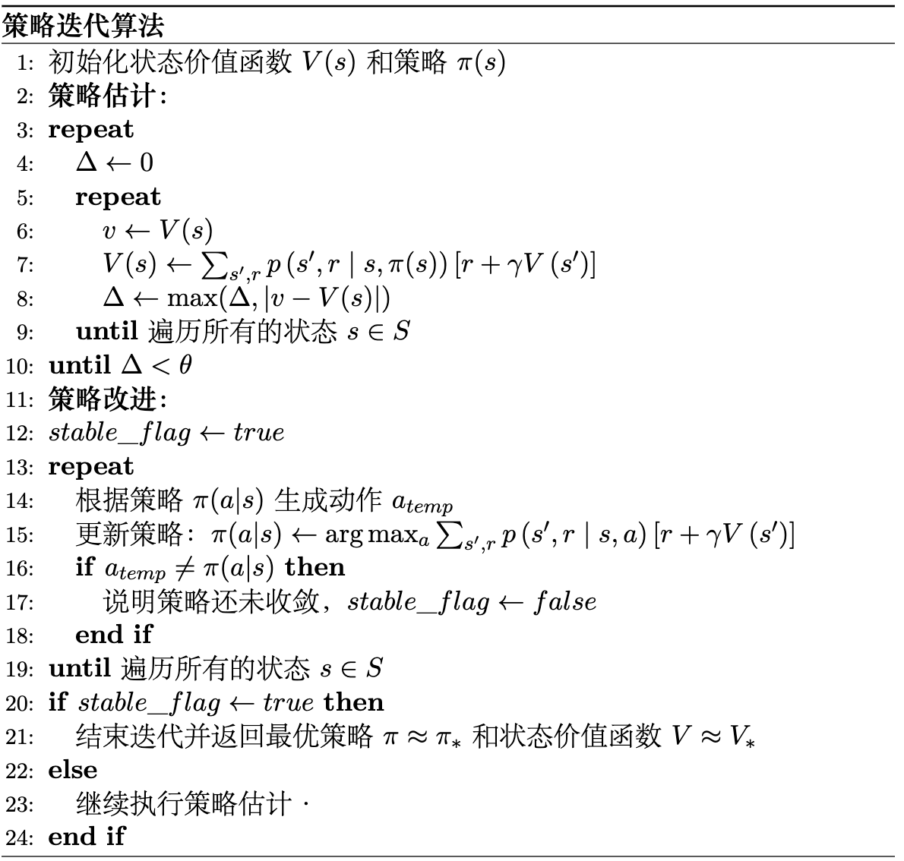
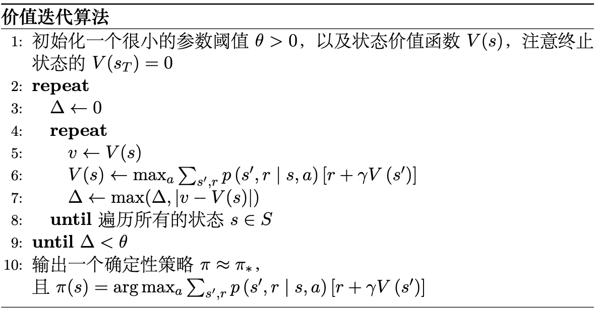
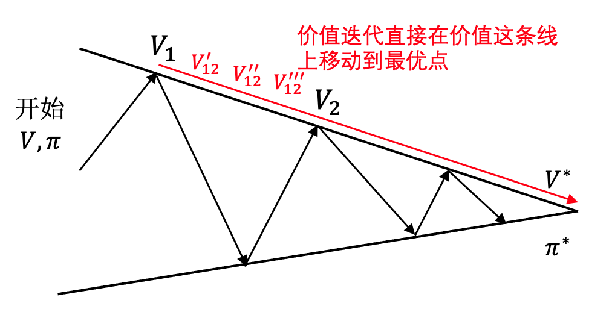

#  动态规划

动态规划是一种用于解决复杂问题的数学方法，广泛应用于计算机科学、经济学等领域，其核心思想是将问题分解为更小的子问题，并存储这些子问题的解决方案，以避免重复计算，从而提高效率。

在强化学习中，动态规划被用于求解值函数和最优策略，核心概念是贝尔曼方程，它描述了状态价值函数和动作价值函数的递归关系。

基于动态规划的强化学习算法主要包括策略迭代和价值迭代等，这些算法依赖于对环境的完全了解，即需要知道状态转移概率和奖励函数，即属于有模型的方法。这两种算法虽然现在很少直接应用于实际问题，但它们为理解更复杂的强化学习算法奠定了基础。

### 动态规划

动态规划（$\text{dynamic programming, DP}$ ）是一种用于解决复杂问题的数学优化方法，在计算机科学、管理科学和经济学等领域都有着广泛的应用。它通过将问题分解为更小的子问题，并存储这些子问题的解决方案，以避免重复计算，从而提高效率。

动态规划能够解决的问题通常具备三个性质：**重叠子问题**（$\text{overlapping subproblems}$）、**最优化原理**（$\text{optimal substructure}$）和**无后效性**（$\text{no aftereffect}$）。重叠子问题指的是子问题在求解过程中会被多次计算，而最优子结构则意味着一个问题的最优解可以通过其子问题的最优解来构建。无后效性则表示未来只依赖于当前状态，不依赖于过去，即未来的独立性，这与马尔可夫性质相契合。

动态规划通常采用自底向上的方法，通过迭代地解决子问题，最终得到原始问题的解决方案。常见的动态规划算法包括斐波那契数列、背包问题和路径规划问题等。

为帮助理解动态规划的思想，这里以一个路径规划问题为例进行说明。如图 1 所示，在一个 $m \times n$ 的网格世界中，机器人以左上角为起点，右下角为终点，每次只能向右或向下移动一步，这里的问题是需要计算出从起点到终点的不同路径数量。

<div align=center>

</div>
<div align=center>图 1: 路径之和</div>

使用动态规划的方法来解决这个问题的话，主要包含几个步骤：**确定状态，写出状态转移方程和寻找边界条件**。

首先可以将状态定义为 $f(i,j)$ ，表示从左上角即坐标为 $(0,0)$ 到坐标 $(i,j)$ 的路径数量，其中 $i \in [0,m)$ 以及$j \in [0,n)$。由于机器人只能向右或者向下走，所以当机器人处于 $(i,j)$ 的位置时，它的前一个坐标只能是上边一格 $(i,j-1)$ 或者左边一格 $(i-1,j)$ ，这样一来就能建立出一个状态之间的关系，如式 $\eqref{eq:1}$ 所示。

$$
\begin{equation}\label{eq:1}
f(i,j) = f(i-1,j) + f(i,j-1)
\end{equation}
$$

即走到当前位置 $(i,j)$ 的路径数量等于走到前一个位置 $(i,j-1)$ 和 $(i-1,j)$ 的所有路径之和，这个就是状态转移方程。

然后再考虑一些边界条件，首先 $i$ 和 $j$ 是不能等于 $0$ 的，因为这种情况下会出现 $f(0,0)+f(-1,0)+f(0,-1)$ ，$f(-1,0)$ 或者 $f(0,-1)$ 在本题中是没有意义的。换句话说，$f(0,0)$ 就是该题的一个边界，在这种情况下器人在起始点，从起始点到起始点 $(0,0)$ 对应的路径数量 $f(0,0)$ 必然是 $1$ ，对于 $i\neq0,j=0$ ，此时机器人会一直沿着网格左边沿往下走，这条路径上的所有 $f(i,j)$ 也都会是 $1$ ，$i=0,j\neq0$ 的情况同理。

代入边界条件后，状态转移方程可以完善如式 $\eqref{eq:2}$ 所示。

$$
\begin{equation}\label{eq:2}
f(i,j)=\left\{\begin{array}{c}
0, i=0, j=0 \\
1, i=0, j \neq 0 \\
1, i \neq 0, i=0 \\
f(i-1,j) + f(i,j-1)
\end{array}\right.
\end{equation}
$$

实现如代码 1 所示。


<div style="text-align: center;">
    <figcaption style="font-size: 14px;"> <b>代码 1: 路径问题求解</b> </figcaption>
</div>

```python
def solve(m,n):
    # 初始化边界条件
    f = [[1] * n] + [[1] + [0] * (n - 1) for _ in range(m - 1)]
    # 状态转移
    for i in range(1, m):
        for j in range(1, n):
            f[i][j] = f[i - 1][j] + f[i][j - 1]
    return f[m - 1][n - 1]
```

输入 $m=7,n=3$ 时，最终输出结果为 $28$ ，表示从起点到终点一共有 $28$ 种不同的路径，对应的解析流程如图 2 所示。

<div align=center>

</div>
<div align=center>图 2: 路径之和解析</div>

在强化学习中，基于动态规划的算法主要有两种，一是**策略迭代**（$\text{policy iteration, PI}$），二是**价值迭代**（$\text{value iteration, VI}$）。其中策略迭代由两部分组成，分别是**策略评估**（$\text{policy evaluation}$）和**策略改进**（$\text{policy improvement}$）。

价值迭代则是将策略评估和策略改进合并在一起进行。这两种算法都依赖于对环境的完全了解，即需要知道状态转移概率和奖励函数，因此在实际应用中受到了一定的限制。然而，它们为理解更复杂的强化学习算法奠定了基础。

## 贝尔曼方程

### 状态价值形式

类比于回报公式 $G_{t} = R_{t+1}+\gamma G_{t+1}$，状态价值也有类似的递归公式，如式 $\eqref{eq:3}$ 所示。

$$
\begin{equation}\label{eq:3}
\begin{aligned}
V_{\pi}(s) & =\mathbb{E}_{\pi}\left[G_t \mid S_t=s\right] \\
& =\mathbb{E}_{\pi}\left[R_{t+1}+\gamma G_{t+1} \mid S_t=s\right] \:\text{回报递归公式} \\ 
& =\mathbb{E}_{\pi}\left[R_{t+1}+\gamma V_{\pi}\left(S_{t+1}\right) \mid S_t=s\right] \:\text{状态价值定义} \\
& =\sum_{a \in A} \pi(a \mid s) \sum_{s^{\prime} \in S} p\left(S_{t+1}=s^{\prime} \mid S_{t}=s, A_{t}=a\right)\left[R(s, a)+\gamma V_{\pi}\left(s^{\prime}\right)\right] \:\text{全期望公式展开}\\
& =\sum_{a} \pi(a \mid s) \sum_{s^{\prime}} p\left(s^{\prime} \mid s, a\right)\left[r+\gamma V_{\pi}\left(s^{\prime}\right)\right] \:\text{简写}
\end{aligned}
\end{equation}
$$

其中 $p\left(s^{\prime}\mid s, a\right)$ 是状态转移概率，即在状态 $s$ 下采取动作 $a$ 后转移到状态 $s^{\prime}$ 并获得奖励 $r$ 的概率，这就是**贝尔曼方程**的状态价值函数形式。

贝尔曼方程相当于动态规划中的状态转移方程，将整体期望拆分“当前+未来”两部分递归地计算。它也进一步表示了当智能体在环境中处于某个状态$s$时，它未来的“好坏”（即回报 $\text{Return}$）不仅取决于当前获得的奖励$r$，还取决于之后的状态中能获得的所有未来奖励。

### 动作价值形式

类似地，贝尔曼方程的动作价值形式如式 $\eqref{eq:4}$ 所示。

$$
\begin{equation}\label{eq:4}
Q_{\pi}(s,a) = R(s,a) + \gamma \sum_{s^{\prime} \in S} p\left(s^{\prime} \mid s,a\right) \sum_{a^{\prime} \in A} \pi\left(a^{\prime} \mid s ^{\prime} \right)Q_{\pi}\left(s^{\prime},a'\right)
\end{equation}
$$

### 贝尔曼最优方程

在一个马尔可夫决策过程中，我们可以找到一个最优策略 $\pi^{\star}$，使得从任意状态 $s$ 出发，获得的期望回报最大，如式 $\eqref{eq:5}$ 所示。

$$
\begin{equation}\label{eq:5}
\begin{aligned}
V^{*}(s)&=\max _a \mathbb{E}\left[R_{t+1}+\gamma V^{*}\left(S_{t+1}\right) \mid S_t=s, A_t=a\right] \\
&=\max_a \sum_{s',r}p(s',r|s,a)[r+\gamma V^{*}(s')] 
\end{aligned}
\end{equation}
$$

这个公式就是**贝尔曼最优方程（Bellman optimality equation）**，它对于后面要讲的策略迭代算法具有一定的指导意义。同理，对应的动作价值函数形式如式 $\eqref{eq:6}$ 所示。

$$
\begin{equation}\label{eq:6}
\begin{aligned}
Q^{*}(s, a) & =\mathbb{E}\left[R_{t+1}+\gamma \max _{a^{\prime}} Q^{*}\left(S_{t+1}, a^{\prime}\right) \mid S_t=s, A_t=a\right] \\
& =\sum_{s^{\prime}, r} p\left(s^{\prime}, r \mid s, a\right)\left[r+\gamma \max _{a^{\prime}} Q^{*}\left(s^{\prime}, a^{\prime}\right)\right]
\end{aligned}
\end{equation}
$$

## 策略迭代

在最优策略$\pi^{*}$下，对应的状态和动作价值函数也都是最优的，即 $V^{*}(s)$ 和$Q^{*}(s)$。但是实际求解中在优化策略的过程中，同时我们还需要优化状态和动作价值函数，这其实是一个多目标优化的问题。

策略迭代算法的思路是分成两个步骤，首先固定策略 $\pi$ 不变，然后估计对应的状态价值 $V$ ，这一叫做**策略估计（policy evaluation）**。然后根据估计好的状态价值函数$V$结合策略推算出动作价值函数$Q$，并对 $Q$ 函数优化然后进一步改进策略，这一步叫**策略改进（policy improvement）**。在策略改进的过程中一般是通过贪心策略来优化的，即选择使得$Q(s,a)$最大的动作$a$，更新策略$\pi$，如式 $\eqref{eq:7}$ 所示。

$$
\begin{equation}\label{eq:7}
\pi^{\prime}(a|s) = \begin{cases}1, & a=\arg \max _a Q(s,a) \\ 0, & \text{else}\end{cases}
\end{equation}
$$

然后在策略改进时选择最大的$Q(s,a)$值来更新。在一轮策略估计和改进之后，又会进入新的一轮策略估计和改进，直到收敛为止。

如图 3 所示，（a）描述了上面所说的策略估计和改进持续迭代的过程，（b）则描述了在迭代过程中策略$\pi$和状态价值函数$V$最后会同时收敛到最优。

<div align=center>

</div>
<div align=center>图 3: 策略迭代的收敛过程</div>

算法流程的伪代码如图 4 所示。

<div align=center>

</div>
<div align=center>图 4: 策略迭代算法流程</div>

## 价值迭代

价值迭代算法相对于策略迭代更加直接，如式 $\eqref{eq:8}$ 所示。

$$
\begin{equation}\label{eq:8}
V(s) \leftarrow \max _{a \in A}\left(R(s, a)+\gamma \sum_{s^{\prime} \in S} p\left(s^{\prime} \mid s, a\right) V\left(s^{\prime}\right)\right)
\end{equation}
$$

价值迭代算法流程的伪代码如图 5 所示。

<div align=center>

</div>
<div align=center>图 5: 价值迭代算法伪代码</div>

首先将所有的状态价值初始化，然后不停地对每个状态迭代，直到收敛到最优价值$V^{*}$，并且根据最优价值推算出最优策略$\pi^{*}$。这样其实更像是一个动态规划本身的思路，而不是强化学习的问题。这种情况下，其实比策略迭代算法要慢得多，尽管两种方法都需要多次遍历。但是在策略迭代算法中考虑了中间每个时步可能遇到的最优策略并及时加以改进，这意味着就算策略在早期并不完美（也许需要改进），策略迭代仍能够更快地接近最优解。

<div align=center>

</div>
<div align=center>图 6: 策略迭代与价值迭代收敛过程的区别</div>

举例来说，回顾一下策略迭代的收敛过程，如图 6 所示，我们知道策略迭代是不停地在 $V$ 和 $\pi$ 这两条线之间“跳变”直到收敛到$V^*$。这种“跳变”是几乎不需要花费时间的，只是一个 $\pi$ 与 $V$ 互相推算的过程，通过一个公式就能得到，也就是策略估计和策略改进之间的切换过程。而在各自的线上，比如价值函数这条线从 $V_1$ 到 $V_2$ 这个点是需要更多时间的，这其实就是一个策略估计的过程，需要遍历到所有状态，在策略这条线上同理。而实际上 $V_1$ 到 $V_2$ 中间也可能存在更多个点，比如 $V_{12}^{\prime},V_{12}^{\prime \prime},V_{12}^{\prime \prime \prime}$，每次在这些点之间移动是需要遍历所有的状态的，只是在策略迭代算法中借助了策略这条线跳过了中间的 $V_{12}^{\prime},V_{12}^{\prime \prime},V_{12}^{\prime \prime \prime}$ 这些点，而在价值迭代算法的时候会经过价值这条线上的所有点，直到最优，从这个角度来看策略迭代算法是要比价值迭代更快的。

## 思考

**动态规划问题的主要性质有哪些？**

动态规划主要性质包括最优化原理、无后效性和有重叠子问题，其中无后效性指的是某状态以后的过程不会影响以前的状态，这十分契合马尔可夫性质，因此动态规划问题可以看作是马尔可夫决策过程的一种特殊情况。

**状态价值函数和动作价值函数之间的关系是什么？**

状态价值函数是所有可能动作的动作价值函数的平均值，也就是说，对于一个状态 $s$ ，其状态价值函数 $V(s)$ 等于所有可能动作 $a$ 的动作价值函数 $Q(s,a)$ 的平均值，即 $V(s) = 1/|A(s)| * ΣQ(s,a)$ ，其中 $|A(s)|$ 表示在状态 $s$ 下可用的动作数。

**策略迭代和价值迭代是有模型还是无模型的方法？**

策略迭代和价值迭代都是有模型的方法，因为它们都需要知道环境的状态转移概率和奖励函数，以便进行状态价值函数和动作价值函数的计算和更新。

**策略迭代和价值迭代哪个算法速度会更快？**

通常，价值迭代算法的收敛速度比策略迭代算法更快。因为价值迭代算法在每次迭代中更新所有状态的价值函数，而策略迭代算法需要在每次迭代中更新策略和状态的价值函数，因此策略迭代算法的计算量比价值迭代算法更大。此外，策略迭代算法的每次迭代都需要进行一次策略评估和一次策略改进，而价值迭代算法只需要进行一次价值迭代，因此策略迭代算法的迭代次数通常比价值迭代算法多。

