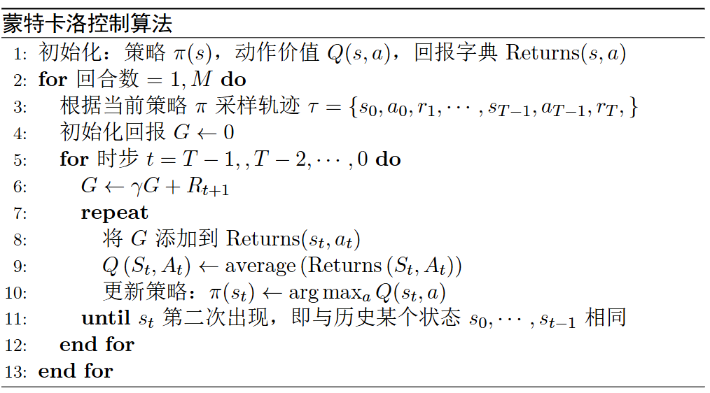

# 蒙特卡洛方法

蒙特卡洛方法的核心思想是通过大量的随机采样来近似估计期望或积分。在强化学习中，一方面可以用来解决预测问题，即估计状态价值函数 $V(s)$ 或动作价值函数 $Q(s,a)$。另一方面，可以用来优化策略，即通过采样来评估和改进策略来解决控制问题。

蒙特卡洛预测包括首次访问法和每次访问法两种基本方法，前者只在每个状态的首次访问时更新价值估计，后者则在每次访问时都进行更新。

蒙特卡洛控制则结合了蒙特卡洛预测和策略改进，通过采样来估计动作价值函数，并基于该估计来改进策略，最终实现策略的优化。

## 状态价值计算示例

为帮助理解蒙特卡洛方法，我们先举一个简单的例子来根据定义计算状态价值，然后再介绍蒙特卡洛预测算法。

如图 1 所示，考虑智能体在 $2 \times 2$ 的网格中使用随机策略进行移动，以左上角为起点，右下角为终点，规定每次只能向右或向下移动，动作分别用 $a_1$ 和 $a_2$ 表示。用智能体的位置不同的状态，即$s_1,s_2,s_3,s_4$，初始状态为$S_0=s_1$。设置每走一步接收到的奖励为 $-1$， 折扣因子 $\gamma=0.9$，目标是计算各个状态的价值函数 $V(s)$。

<div align=center>

</div>
<div align=center>图 1 迷你网格示例</div>

回顾状态价值函数的定义，如式 $\eqref{eq:state_value}$ 所示。

$$
\begin{equation}\label{eq:state_value}
\begin{aligned}
V_\pi(s) &=\mathbb{E}_{\pi}[R_{t+1}+\gamma R_{t+2}+\gamma^2 R_{t+3} + \cdots |S_t=s ] \\
&=\mathbb{E}_{\pi}[G_t|S_t=s ] 
\end{aligned}
\end{equation}
$$

现在根据定义来分别计算各状态的价值，首先由于 $s_4$ 是终止状态，因此 $V(s_4)=0$。

接下来计算 $s_2$ 的价值 $V(s_2)$，从 $s_2$ 出发只能向下走到达终点 $s_4$，对应的轨迹为 $\tau_1 = \{s_2,a_2,r(s_2,a_2),s_4\}$，回报为 $G_{\tau_1} = r(s_2,a_2)=-1$，因此 $V(s_2) = G_{\tau_1} = -1$。

然后计算 $s_3$ 的价值 $V(s_3)$，从 $s_3$ 出发只能向右走到达终点 $s_4$，对应的轨迹为 $\tau_2 = \{s_3,a_1,r(s_3,a_1),s_4\}$，回报为 $G_{\tau_2} = r(s_3,a_1)=-1$，因此 $V(s_3) = G_{\tau_2} = -1$。

最后计算起始状态 $s_1$ 的价值 $V(s_1)$，从 $s_1$ 出发有两条可能的轨迹，其一是 $s_1 \to s_2 \to s_4$，其二是 $s_1 \to s_3 \to s_4$，对应的轨迹分别如式 $\eqref{eq:tau3}$ 和 $\eqref{eq:tau4}$ 所示。

$$
\begin{equation}\label{eq:tau3}
\tau_3 = \{s_1,a_1,r(s_1,a_1),s_2,a_2,r(s_2,a_2),s_4\}
\end{equation}
$$

$$
\begin{equation}\label{eq:tau4}
\tau_4 = \{s_1,a_2,r(s_1,a_2),s_3,a_1,r(s_3,a_1),s_4\}
\end{equation}
$$

相应地，对应的回报计算分别如式 $\eqref{eq:G_tau3}$ 和 $\eqref{eq:G_tau4}$ 所示。

$$
\begin{equation}\label{eq:G_tau3}
G_{\tau_3} = r(s_1,a_1) + \gamma r(s_2,a_2)= (-1) + 0.9 * (-1) = -1.9
\end{equation}
$$

$$
\begin{equation}\label{eq:G_tau4}
G_{\tau_4} = r(s_1,a_2) + \gamma r(s_3,a_1)= (-1) + 0.9 * (-1) = -1.9
\end{equation}
$$

由于智能体采用随机策略，因此两条轨迹的概率相等，均为 $0.5$。因此，$V(s_1)$ 可以表示为式 $\eqref{eq:V_s1}$ 。

$$
\begin{equation}\label{eq:V_s1}
V(s_1) = 0.5 * G_{\tau_3} + 0.5 * G_{\tau_4} = 0.5 * (-1.9) + 0.5 * (-1.9) = -1.9
\end{equation}
$$

综上所述，各状态的价值函数结果如表 1 所示。

<div style="text-align: center;">
    <figcaption style="font-size: 14px;"> <b>表 1 各状态的价值函数</b> </figcaption>
</div>

| 状态 | $s_1$ | $s_2$ | $s_3$ | $s_4$ |
| :--: | :---: | :---: | :---: | :---: |
| 价值 | $-1.9$  | $-1.0$  | $-1.0$  |  $0.0$  |

下面将介绍蒙特卡洛方法是如何通过采样来估计状态价值的。

## 蒙特卡洛预测

### 蒙特卡洛估计

蒙特卡洛估计是一种用随机采样近似求期望、积分或概率分布特征的通用方法。换句话说，如果想求一个复杂的数学期望（或积分），而无法直接解析求解时，就可以用大量随机样本的平均值去逼近它。

假设我们想要估计某个函数 $f(x)$ 的期望，如式 $\eqref{eq:expectation}$ 所示。

$$
\begin{equation}\label{eq:expectation}
\mathbb{E}[f(X)] = \int f(x) p(x) dx
\end{equation}
$$

其中 $p(x)$ 是 随机变量 $X$ 的概率密度函数。直接计算这个积分可能很复杂，但我们可以通过蒙特卡洛采样来近似估计它。具体步骤如下：

1. 从概率分布 $p(x)$ 中采样 $N$ 个独立同分布的样本 $\{x_1, x_2, \ldots, x_N\}$。
2. 计算函数值的平均，如式 $\eqref{eq:monte_carlo_estimate}$ 所示。

$$
\begin{equation}\label{eq:monte_carlo_estimate}
\hat{\mathbb{E}}[f(X)] = \frac{1}{N} \sum_{i=1}^{N} f(x_i)
\end{equation}
$$

根据大数定律，当样本数量 $N$ 足够大时，估计值 $\hat{\mathbb{E}}[f(X)]$ 会收敛到真实的期望值 $\mathbb{E}[f(X)]$。

为帮助理解，我们来演示如何通过蒙特卡洛方法来估计圆周率 $\pi$。考虑一个单位正方形内切一个单位圆，圆的面积为 $\pi r^2 = \pi$，正方形的面积为 $4$。如果我们在正方形内随机撒点，落在圆内（即满足 $x^2 + y^2 \leq 1$）的点数与总点数的比例应该接近于圆的面积与正方形面积的比例，即 $\pi / 4$。

用 `Python` 代码实现这个过程，如代码 1 所示。

<div style="text-align: center;">
    <figcaption style="font-size: 14px;"> <b>代码 1 使用蒙特卡洛方法估计 $\pi$ 的值</b> </figcaption>
</div>

```python
import random

def monte_carlo_pi(num_samples=1000000):
    count_in_circle = 0
    for _ in range(num_samples):
        x, y = random.random(), random.random()
        if x**2 + y**2 <= 1:
            count_in_circle += 1
    pi_estimate = 4 * count_in_circle / num_samples
    return pi_estimate

print("Estimated π:", monte_carlo_pi())
```

运行代码后，可以得到一个接近 $\pi$ 的估计值。随着采样数量的增加，估计值会越来越精确。   

**蒙特卡洛预测**（$\text{Monte Carlo Prediction}$）则指的是，在强化学习中，利用蒙特卡洛估计来预测给定策略 $\pi$ 下的状态价值 $V_\pi(s)$。具体思路是多次完整地执行策略 $\pi$，每次执行都会产生一条完整的轨迹（从初始状态到终止状态），然后根据这些轨迹来计算各个状态的回报，最后取平均作为该状态的价值估计，如式 $\eqref{eq:mc_value_estimate}$ 所示。

$$
\begin{equation}\label{eq:mc_value_estimate}
V_\pi(s) \approx \frac{1}{N(s)} \sum_{i=1}^{N(s)} G_t^{(i)}
\end{equation}
$$

### 增量式更新

在实际强化学习应用中，由于状态空间可能非常大，估计状态价值所需的轨迹数量可能上万甚至更多。一方面，轨迹是通过智能体与环境交互产生的，这一交互过程可能也会非常耗时；另一方面，存储和处理大量轨迹数据也会带来计算和内存的压力。

为了解决这些问题，蒙特卡洛预测通常采用增量式更新的方式来估计状态价值，即**边采样边更新**，而不是等采样完所有轨迹后再进行批量更新。

如式 $\eqref{eq:incremental_update}$ 所示，增量式更新的基本思想是每次采样到一个新的回报 $G$ 后，立即用它来更新对应状态 $s$ 的价值估计 $V(s)$。

$$
\begin{equation}\label{eq:incremental_update}
V(s) \leftarrow V(s) + \frac{1}{N(s)} [G - V(s)]
\end{equation}
$$

其中 $N(s)$ 是状态 $s$ 被访问的次数，$G$ 是当前采样到的回报。或者使用常数步长，如式 $\eqref{eq:constant_step_size}$ 所示。

$$
\begin{equation}\label{eq:constant_step_size}
V(s) \leftarrow V(s) + \alpha [G - V(s)]
\end{equation}
$$

其中 $\alpha \in (0,1]$ 是学习率，$\alpha$ 越大，收敛速度很快但波动也较大；$\alpha$ 越小，收敛速度较慢但更稳定。

可以发现，增量式更新的核心思想如式 $\eqref{eq:incremental_update_core}$ 所示。

$$
\begin{equation}\label{eq:incremental_update_core}
新的估计值 \leftarrow 旧的估计值 + 步长 \times（目标值-旧的估计值）
\end{equation}
$$

### 首次访问蒙特卡洛

在增量式更新的基础上，蒙特卡洛方法主要分成两种算法，一种是首次访问蒙特卡洛（$\text{first-visit Monte Carlo，FVMC}$）方法，另外一种是每次访问蒙特卡洛（$\text{every-visit Monte Carlo，EVMC}$）方法。$\text{FVMC}$ 方法主要包含两个步骤，首先是产生一个回合的完整轨迹，然后遍历轨迹计算每个状态的回报。

我们先来看首次访问蒙特卡洛（$\text{FVMC}$）方法的具体实现，算法流程如图 2 所示。

<div align=center>

</div>
<div align=center>图 2 首次访问蒙特卡洛算法伪代码</div>

假设我们已经采样得到了一条完整的轨迹 $\tau = \{S_0, A_0, R_1, S_1, A_1, R_2, \ldots, S_{T-1}, A_{T-1}, R_T, S_T\}$，其中 $S_T$ 是终止状态。对于轨迹中的每个状态 $S_t$，我们检查它是否是该状态在当前轨迹中的首次出现。如果是首次出现，我们计算从该时间步 $t$ 开始的回报 $G_t$，并将其添加到该状态的回报列表中，最后更新该状态的价值函数 $V(S_t)$ 为回报列表的平均值。

回头看我们前面的示例，可以用 $\text{FVMC}$ 方法来实现状态价值函数的估计，如代码 2 所示。

<div style="text-align: center;">
    <figcaption style="font-size: 14px;"> <b>代码 2 首次访问蒙特卡洛方法估计状态价值函数</b> </figcaption>
</div>

```python
import numpy as np
from collections import defaultdict

# ----------- 环境定义 -----------
states = ['s1', 's2', 's3', 's4']
gamma = 0.9
R = -1
terminal = 's4'

# 状态转移（确定性）
transitions = {
    's1': {'right': 's2', 'down': 's3'},
    's2': {'down': 's4'},
    's3': {'right': 's4'},
}

# 策略 π：在合法动作间随机选择
def policy(state):
    actions = list(transitions[state].keys())
    return np.random.choice(actions)

# 生成一条完整轨迹（从 s1 到 s4）
def generate_episode():
    episode = []
    state = 's1'
    while state != terminal:
        action = policy(state)
        next_state = transitions[state][action]
        episode.append((state, action, R))
        state = next_state
    episode.append((terminal, None, 0))  # 终止
    return episode

def first_visit_mc(num_episodes=1000):
    V = defaultdict(float)
    returns = defaultdict(list)

    for _ in range(num_episodes):
        episode = generate_episode()
        G = 0
        visited = set()  # 用于记录首访

        # 反向遍历轨迹
        for state, action, reward in reversed(episode):
            G = gamma * G + reward
            if state not in visited:
                visited.add(state)
                returns[state].append(G)
                V[state] = np.mean(returns[state])
    return V

if __name__ == "__main__":
    V_first = first_visit_mc()
    print("First-Visit MC:")
    for s in states:
        print(f"  {s}: {V_first[s]:.2f}")
```

运行结果如代码 3 所示。

<div style="text-align: center;">
    <figcaption style="font-size: 14px;"> <b>代码 3 首次访问蒙特卡洛方法估计状态价值函数结果</b> </figcaption>
</div>

```
First-Visit MC:
  s1: -1.90
  s2: -1.00
  s3: -1.00
  s4: 0.00
```

可以发现，估计的状态价值函数与我们前面根据定义计算的结果是一致的。

注意，只在第一次遍历到某个状态时会记录并计算对应的回报，对应伪代码如图 2 所示。

### 每次访问蒙特卡洛

在 $\text{EVMC}$ 方法中则不会忽略同一状态的多个回报，具体代码实现如代码 4 所示。

<div style="text-align: center;">
    <figcaption style="font-size: 14px;"> <b>代码 4 每次访问蒙特卡洛方法估计状态价值函数</b> </figcaption>
</div>

```python
import numpy as np
from collections import defaultdict

# ----------- 环境定义 -----------
states = ['s1', 's2', 's3', 's4']
gamma = 0.9
R = -1
terminal = 's4'

# 状态转移（确定性）
transitions = {
    's1': {'right': 's2', 'down': 's3'},
    's2': {'down': 's4'},
    's3': {'right': 's4'},
}

# 策略 π：在合法动作间随机选择
def policy(state):
    actions = list(transitions[state].keys())
    return np.random.choice(actions)

# 生成一条完整轨迹（从 s1 到 s4）
def generate_episode():
    episode = []
    state = 's1'
    while state != terminal:
        action = policy(state)
        next_state = transitions[state][action]
        episode.append((state, action, R))
        state = next_state
    episode.append((terminal, None, 0))  # 终止
    return episode

def every_visit_mc(num_episodes=1000):
    V = defaultdict(float)
    returns = defaultdict(list)

    for _ in range(num_episodes):
        episode = generate_episode()
        G = 0

        # 反向遍历轨迹（每次出现都更新）
        for state, action, reward in reversed(episode):
            G = gamma * G + reward
            returns[state].append(G)
            V[state] = np.mean(returns[state])
    return V

    return V

if __name__ == "__main__":
    V_every = every_visit_mc()

    print("\nEvery-Visit MC:")
    for s in states:
        print(f"  {s}: {V_every[s]:.2f}")
```

同样运行结果如代码 5 所示。

<div style="text-align: center;">
    <figcaption style="font-size: 14px;"> <b>代码 5 每次访问蒙特卡洛方法估计状态价值函数结果</b> </figcaption>
</div>

```
Every-Visit MC:
  s1: -1.90
  s2: -1.00
  s3: -1.00
  s4: 0.00
```

总的来说，$\text{FVMC}$ 是一种基于回合的增量式方法，具有无偏性和收敛快的优点，但是在状态空间较大的情况下，依然需要训练很多个回合才能达到稳定的结果。而 $\text{EVMC}$ 则是更为精确的预测方法，但是计算的成本相对也更高。

### 蒙特卡洛动作价值

蒙特卡洛预测或者估计动作价值函数 $Q(s,a)$ 的方法与状态价值函数类似，只不过需要同时考虑状态和动作的组合。具体来说，蒙特卡洛动作价值估计的步骤如下：

1. **生成完整轨迹**：与状态价值函数相同，首先需要通过与环境的交互生成一条完整的轨迹，包括状态、动作和奖励。

2. **计算回报**：对于轨迹中的每个状态-动作对 $(s,a)$，计算从该对开始的回报 $G_t$。

3. **更新价值函数**：根据计算得到的回报更新动作价值函数 $Q(s,a)$，可以使用首次访问或每次访问的方式。
具体的增量式更新公式与状态价值函数类似，如式 $\eqref{eq:mc_action_value_update}$ 所示。

$$
\begin{equation}\label{eq:mc_action_value_update}
Q(s,a) \leftarrow Q(s,a) + \alpha [G - Q(s
,a)]
\end{equation}
$$

其中 $\alpha$ 是学习率，$G$ 是从状态 $s$ 执行动作 $a$ 后得到的回报。

使用`Python` 代码实现蒙特卡洛动作价值估计来解决前面示例的问题，如代码 6 所示。

<div style="text-align: center;">
    <figcaption style="font-size: 14px;"> <b>代码 6 蒙特卡洛方法估计动作价值函数</b> </figcaption>
</div>

```python
import numpy as np
from collections import defaultdict

states = ['s1', 's2', 's3', 's4']
actions = ['right', 'down']
gamma = 0.9
R = -1
terminal = 's4'

# 转移定义
transitions = {
    ('s1', 'right'): 's2',
    ('s1', 'down'): 's3',
    ('s2', 'down'): 's4',
    ('s3', 'right'): 's4',
}

def policy(state):
    # 随机策略 π(a|s)
    legal = [a for (s,a) in transitions if s == state]
    return np.random.choice(legal)

def generate_episode():
    episode = []
    state = 's1'
    while state != terminal:
        action = policy(state)
        next_state = transitions[(state, action)]
        episode.append((state, action, R))
        state = next_state
    episode.append((terminal, None, 0))
    return episode

def mc_action_value(num_episodes=1000):
    Q = defaultdict(float)
    returns = defaultdict(list)

    for _ in range(num_episodes):
        episode = generate_episode()
        G = 0
        visited = set()
        for state, action, reward in reversed(episode):
            G = gamma * G + reward
            if action is not None and (state, action) not in visited:
                visited.add((state, action))
                returns[(state, action)].append(G)
                Q[(state, action)] = np.mean(returns[(state, action)])
    return Q

Q = mc_action_value()
for (s,a), v in Q.items():
    print(f"Q({s},{a}) = {v:.2f}")
```

运行结果如代码 7 所示。

<div style="text-align: center;">
    <figcaption style="font-size: 14px;"> <b>代码 7 蒙特卡洛方法估计动作价值函数结果</b> </figcaption>
</div>

```python
Q(s1,down) = -1.90
Q(s1,right) = -1.90
Q(s2,down) = -1.00
Q(s3,right) = -1.00
```

联系状态价值和动作价值的关系，如式 $\eqref{eq:state_action_value_relation}$ 所示。

$$
\begin{equation}\label{eq:state_action_value_relation}
V_\pi(s) = \sum_{a} \pi(a|s) Q_\pi(s,a)
\end{equation}
$$

以状态 $s_1$ 为例，由于智能体采用随机策略，即在动作 $a_1$ 和 $a_2$ 之间按同等概率选择，因此可以计算出 $V(s_1)$ 如式 $\eqref{eq:V_s1_from_Q}$ 所示。

$$
\begin{equation}\label{eq:V_s1_from_Q}
\begin{aligned}
V(s_1) &= 0.5 * Q(s_1,a_1) + 0.5 * Q(s_1,a_2)  \\
&= 0.5 *(-1.9) + 0.5 * (-1.9) \\
&= -1.9
\end{aligned}
\end{equation}
$$

可以发现，计算结果与前面直接估计的状态价值是一致的。


## 蒙特卡洛控制

### 更复杂的蒙特卡洛预测示例

为了更好地理解蒙特卡洛控制方法，先举一个更复杂的蒙特卡洛预测示例。如图 3 所示，在前面示例的基础上，考虑智能体在 $3 \times 3$ 的网格中使用随机策略进行移动，以左上角为起点，右下角为终点，同样规定每次只能向右或向下移动，动作分别用 $a_1$ 和 $a_2$ 表示。用智能体的位置不同的状态，即$s_1,s_2,\ldots,s_9$，初始状态为$S_0=s_1$，终止状态为$s_9$。


<div align=center>

</div>
<div align=center>图 3 3x3 网格示例</div>


除了每走一步接收 $-1$ 的奖励之外，这次我们在网格中增加了一些障碍物，例如在位置 $s_4$ 处设置了一个深坑，智能体走到该位置时会受到一个额外的负奖励 $-3$，在位置 $s_5$ 处设置了一个水洼，智能体走到该位置时会受到一个额外的负奖励 $-0.5$。折扣因子 $\gamma=0.9$，目标是计算各个状态的价值函数 $V(s)$。

用 `Python` 代码实现蒙特卡洛方法来估计状态价值函数，如代码 8 所示。

<div style="text-align: center;">
    <figcaption style="font-size: 14px;"> <b>代码 8 使用蒙特卡洛方法估计 3x3 网格状态价值函数</b> </figcaption>
</div>

```python
import random
from collections import defaultdict
import numpy as np
import pandas as pd
import matplotlib.pyplot as plt

# ---------- 参数 ----------
gamma = 0.9
episodes = 30000
states = [f"s{i}" for i in range(1, 10)]
terminal = "s9"
start = "s1"

coords = {
    "s1": (0,0), "s2": (0,1), "s3": (0,2),
    "s4": (1,0), "s5": (1,1), "s6": (1,2),
    "s7": (2,0), "s8": (2,1), "s9": (2,2)
}

# ---------- 环境 ----------
def legal_actions(s):
    r, c = coords[s]
    acts = []
    if c < 2: acts.append("right")
    if r < 2: acts.append("down")
    return acts

def step(s, a):
    r, c = coords[s]
    if a == "right": r2, c2 = r, c + 1
    elif a == "down": r2, c2 = r + 1, c
    s2 = [k for k, v in coords.items() if v == (r2, c2)][0]
    reward = -1.0
    # 额外惩罚修改 ↓↓↓
    if s2 == "s4": reward -= 3.0     # 深坑
    if s2 == "s5": reward -= 0.5     # 水洼
    if s2 == "s9": reward += 1.0     # 终点 +1 → 净0
    done = (s2 == terminal)
    return s2, reward, done

def policy(s):
    acts = legal_actions(s)
    return random.choice(acts)

def generate_episode():
    episode = []
    s = start
    while True:
        if s == terminal:
            episode.append((s, None, 0))
            break
        a = policy(s)
        s2, r, done = step(s, a)
        episode.append((s, a, r))
        s = s2
    return episode

# ---------- First-Visit Monte Carlo ----------
def first_visit_mc(num_episodes=episodes, gamma=0.9):
    V = defaultdict(float)
    N = defaultdict(int)
    for _ in range(num_episodes):
        episode = generate_episode()
        G = 0
        visited = set()
        for s, a, r in reversed(episode):
            G = gamma * G + r
            if s not in visited:
                visited.add(s)
                N[s] += 1
                V[s] += (G - V[s]) / N[s]
    return V

V = first_visit_mc()

# ---------- 打印结果 ----------
grid = np.array([[V[f"s{r*3+c+1}"] for c in range(3)] for r in range(3)])
df = pd.DataFrame(grid.round(3),
                  columns=["col1","col2","col3"],
                  index=["row1","row2","row3"])
print(df)

# ---------- 热力图展示 ----------
plt.figure(figsize=(5,5))
plt.imshow(grid, cmap='coolwarm', origin='upper')
for i in range(3):
    for j in range(3):
        plt.text(j, i, f"{grid[i,j]:.2f}", ha='center', va='center', color='black')
plt.title("Monte Carlo State Values")
plt.colorbar(label="V(s)")
plt.tight_layout()
plt.show()
```

执行代码后，除了打印出各状态的价值函数结果外，还会生成一个热力图来直观展示各状态的价值分布情况，如图 4 所示。

<div align=center>

</div>
<div align=center>图 4 3x3 网格中的状态价值热力图</div>

初学者可能会有疑问，为什么平地状态例如 $s_1$ 反而比有障碍物的状态 $s_4$ 和 $s_5$ 价值更低呢？直觉上，我们可能会认为障碍物的存在会降低对应位置的状态价值，但实际上注意状态价值的计算是基于**从该状态出发**的未来回报的期望，而不是仅仅考虑该状态本身的奖励。

由于智能体采用的是随机策略，且动作只能向右或向下移动，因此从起始状态 $s_1$ 出发，智能体有较高的概率会经过障碍物位置 $s_4$ 和 $s_5$，从而导致整体回报降低，因此 $s_1$ 的状态价值较低。

而对于障碍物位置 $s_4$ 和 $s_5$，虽然从别的状态走到它们时身会带来额外的负奖励，但从这些状态出发，例如从 $s_5$ 出发，只能到达平地状态 $s_6$ 、$s_8$ 和终点 $s_9$，这些状态的未来回报相对较高，因此 $s_4$ 和 $s_5$ 的状态价值反而可能高于一些平地位置。

同样地，可以用蒙特卡洛方法来估计动作价值函数 $Q(s,a)$，代码实现如代码 9 所示。

<div style="text-align: center;">
    <figcaption style="font-size: 14px;"> <b>代码 9 使用蒙特卡洛方法估计 3x3 网格动作价值函数</b> </figcaption>
</div>

```python
import random
from collections import defaultdict
import numpy as np
import matplotlib.pyplot as plt

# ---------- 参数 ----------
gamma = 0.9
episodes = 30000
states = [f"s{i}" for i in range(1, 10)]
terminal = "s9"
start = "s1"

coords = {
    "s1": (0,0), "s2": (0,1), "s3": (0,2),
    "s4": (1,0), "s5": (1,1), "s6": (1,2),
    "s7": (2,0), "s8": (2,1), "s9": (2,2)
}

# ---------- 环境 ----------
def legal_actions(s):
    r, c = coords[s]
    acts = []
    if c < 2: acts.append("right")
    if r < 2: acts.append("down")
    return acts

def step(s, a):
    r, c = coords[s]
    if a == "right": r2, c2 = r, c + 1
    elif a == "down": r2, c2 = r + 1, c
    s2 = [k for k, v in coords.items() if v == (r2, c2)][0]
    reward = -1.0
    if s2 == "s4": reward -= 3.0     # 深坑
    if s2 == "s5": reward -= 0.5     # 水洼
    if s2 == "s9": reward += 1.0     # 终点奖励 +1 → 净0
    done = (s2 == terminal)
    return s2, reward, done

def policy(s):
    acts = legal_actions(s)
    return random.choice(acts)

def generate_episode():
    episode = []
    s = start
    while True:
        if s == terminal:
            episode.append((s, None, 0))
            break
        a = policy(s)
        s2, r, done = step(s, a)
        episode.append((s, a, r))
        s = s2
    return episode

def first_visit_mc_Q(num_episodes=episodes, gamma=0.9):
    Q = defaultdict(float)
    N = defaultdict(int)
    for _ in range(num_episodes):
        episode = generate_episode()
        G = 0
        visited = set()
        for s, a, r in reversed(episode):
            G = gamma * G + r
            if a is None:
                continue
            if (s, a) not in visited:
                visited.add((s, a))
                N[(s, a)] += 1
                Q[(s, a)] += (G - Q[(s, a)]) / N[(s, a)]
    return Q

Q = first_visit_mc_Q()

# 构建Q值矩阵
q_right = np.full((3, 3), np.nan)
q_down = np.full((3, 3), np.nan)

for s in states:
    if "right" in legal_actions(s):
        r, c = coords[s]
        q_right[r, c] = Q[(s, "right")]
    if "down" in legal_actions(s):
        r, c = coords[s]
        q_down[r, c] = Q[(s, "down")]      

for r in range(3):
    for c in range(3):
        s = [k for k, v in coords.items() if v == (r, c)][0]
        print(f"State {s}: Q(s, 'right') = {q_right[r,c]:.2f}, Q(s, 'down') = {q_down[r,c]:.2f}")  

# 可视化 Q(s,a) 热力图
fig, axes = plt.subplots(1, 2, figsize=(10, 4))

im1 = axes[0].imshow(q_right, cmap='coolwarm', origin='upper')
axes[0].set_title("Q(s1, a='right')")
for i in range(3):
    for j in range(3):
        if not np.isnan(q_right[i, j]):
            axes[0].text(j, i, f"{q_right[i,j]:.2f}", ha='center', va='center', color='black')
fig.colorbar(im1, ax=axes[0])

im2 = axes[1].imshow(q_down, cmap='coolwarm', origin='upper')
axes[1].set_title("Q(s1, a='down')")
for i in range(3):
    for j in range(3):
        if not np.isnan(q_down[i, j]):
            axes[1].text(j, i, f"{q_down[i,j]:.2f}", ha='center', va='center', color='black')
fig.colorbar(im2, ax=axes[1])

plt.suptitle("Monte Carlo Action Values")
plt.tight_layout()
plt.show()
```

执行代码后，可以得到各状态-动作对的动作价值函数结果，并生成两个热力图来直观展示各状态在不同动作下的价值分布情况，如图 5 所示。

<div align=center>

</div>
<div align=center>图 5 3x3 网格中的动作价值热力图</div>

可以发现，从状态 $s_1$ 出发，选择向右移动（动作 $a_1$）和向下移动（动作 $a_2$）的动作价值分别为 $Q(s_1,a_1) = -2.93$ 和 $Q(s_1,a_2) = -5.93$，这表明在随机策略下，选择向右移动的动作相对更优一些，因为对应的动作价值更高。

### 蒙特卡洛控制算法

在计算动作价值的过程中，可以借助动态规划中策略迭代的思想，先进行策略评估，即预测动作价值，然后基于当前的动作价值函数进行策略改进，形成一个新的策略，如式 $\eqref{eq:policy_improvement}$ 所示。

$$
\begin{equation}\label{eq:policy_improvement}
\pi_0 \rightarrow Q_{\pi_0} \rightarrow \pi_1 \rightarrow Q_{\pi_1} \rightarrow \pi_2 \rightarrow \ldots \rightarrow \pi^* \rightarrow Q_{\pi^*}
\end{equation}
$$

这种交替进行策略评估和策略改进的过程，称为**蒙特卡洛控制**（$\text{Monte Carlo Control}$），算法流程如图 6 所示。

<div align=center>

</div>
<div align=center>图 6 蒙特卡洛控制算法伪代码</div>

在 $3 \times 3$ 网格的示例中，可以用蒙特卡洛控制方法来学习一个更优的策略，代码实现如代码 10 所示。

<div style="text-align: center;">
    <figcaption style="font-size: 14px;"> <b>代码 10 使用蒙特卡洛控制方法学习 3x3 网格最优策略</b> </figcaption>
</div>

```python
import random
from collections import defaultdict
import numpy as np
import matplotlib.pyplot as plt

# ---------- 环境定义 ----------
gamma = 0.9
states = [f"s{i}" for i in range(1, 10)]
terminal = "s9"

coords = {
    "s1": (0,0), "s2": (0,1), "s3": (0,2),
    "s4": (1,0), "s5": (1,1), "s6": (1,2),
    "s7": (2,0), "s8": (2,1), "s9": (2,2)
}

def legal_actions(s):
    r, c = coords[s]
    acts = []
    if c < 2: acts.append("right")
    if r < 2: acts.append("down")
    return acts

def step(s, a):
    r, c = coords[s]
    if a == "right": r2, c2 = r, c + 1
    elif a == "down": r2, c2 = r + 1, c
    s2 = [k for k, v in coords.items() if v == (r2, c2)][0]

    reward = -1.0
    if s2 == "s4": reward -= 3.0
    if s2 == "s5": reward -= 0.5
    if s2 == "s9": reward += 1.0
    done = (s2 == terminal)
    return s2, reward, done

# ---------- Monte Carlo ES 控制 ----------
def monte_carlo_es(num_episodes=10000, gamma=0.9):
    Q = defaultdict(float)
    Returns = defaultdict(list)
    policy = {}

    # 初始化策略 π 随机
    for s in states:
        actions = legal_actions(s)
        if actions:
            policy[s] = random.choice(actions)

    for episode in range(num_episodes):
        # Exploring Starts: 随机选起点 (s0, a0)
        s0 = random.choice([s for s in states if s != terminal])
        actions = legal_actions(s0)
        if not actions:
            continue
        a0 = random.choice(actions)

        # 生成一条完整轨迹
        episode_list = []
        s, a = s0, a0
        while True:
            s_next, r, done = step(s, a)
            episode_list.append((s, a, r))
            if done:
                break
            a = policy.get(s_next, random.choice(legal_actions(s_next)))
            s = s_next

        # 反向计算 G 并更新 Q
        G = 0
        visited = set()
        for s, a, r in reversed(episode_list):
            G = gamma * G + r
            if (s, a) not in visited:
                visited.add((s, a))
                Returns[(s,a)].append(G)
                Q[(s,a)] = np.mean(Returns[(s,a)])
                # 策略改进：贪婪选择
                policy[s] = max(legal_actions(s), key=lambda x: Q[(s,x)])
    return policy, Q

policy, Q = monte_carlo_es()

# ---------- 输出结果 ----------
print("最优策略 π(s):")
for s in states:
    if s in policy:
        print(f"{s}: {policy[s]}")
print("\n示例部分 Q 值:")
for k in list(Q.keys())[:10]:
    print(k, "=", round(Q[k], 2))

import matplotlib.pyplot as plt

# ---------- 绘制最优策略箭头图（从 s1 出发） ----------
fig, ax = plt.subplots(figsize=(5, 5))
ax.set_xlim(-0.5, 2.5)
ax.set_ylim(-0.5, 2.5)
ax.set_xticks(range(3))
ax.set_yticks(range(3))
ax.set_xticklabels(["col1","col2","col3"])
ax.set_yticklabels(["row1","row2","row3"])
ax.set_title("Optimal Policy Arrows (from s1)")

# 画方格背景（起点/终点/水洼/深坑）
colors = {"s1":"#b2df8a", "s4":"#999999", "s5":"#80b1d3", "s9":"#fdb462"}
for s, (r, c) in coords.items():
    rect = plt.Rectangle((c-0.5, r-0.5), 1, 1,
                         facecolor=colors.get(s, "white"),
                         edgecolor='black', lw=1.5)
    ax.add_patch(rect)
    ax.text(c, r, s, ha='center', va='center', fontsize=12, fontweight='bold')

import matplotlib.pyplot as plt

# ---------- 构造从 s1 出发的最优路径 ----------
path = ["s1"]
s = "s1"
while s != "s9":
    a = policy[s]
    r, c = coords[s]
    if a == "right":
        s_next = [k for k, v in coords.items() if v == (r, c+1)][0]
    else:  # down
        s_next = [k for k, v in coords.items() if v == (r+1, c)][0]
    path.append(s_next)
    s = s_next

# ---------- 准备通用绘图函数 ----------
def draw_policy(ax, highlight_path=False):
    ax.set_xlim(-0.5, 2.5)
    ax.set_ylim(-0.5, 2.5)
    ax.set_xticks(range(3))
    ax.set_yticks(range(3))
    ax.set_xticklabels(["col1","col2","col3"])
    ax.set_yticklabels(["row1","row2","row3"])
    ax.grid(True)

    # 背景方格：起点、终点、水洼、深坑
    colors = {"s1":"#b2df8a", "s4":"#999999", "s5":"#80b1d3", "s9":"#fdb462"}
    for s, (r, c) in coords.items():
        rect = plt.Rectangle((c-0.5, r-0.5), 1, 1,
                             facecolor=colors.get(s, "white"),
                             edgecolor='black', lw=1.5)
        ax.add_patch(rect)
        ax.text(c, r, s, ha='center', va='center', fontsize=12, fontweight='bold')

    # 策略箭头（黑色）
    for s, a in policy.items():
        if s == "s9":  # 终点不画箭头
            continue
        r, c = coords[s]
        dx, dy = 0, 0
        if a == "right": dx = 0.4
        elif a == "down": dy = 0.4
        ax.arrow(c, r, dx, dy, head_width=0.15, head_length=0.15, fc='black', ec='black')

    # 若 highlight_path=True，则绘制红色最优路径
    if highlight_path:
        for i in range(len(path)-1):
            s1, s2 = path[i], path[i+1]
            r1, c1 = coords[s1]
            r2, c2 = coords[s2]
            ax.arrow(c1, r1, c2-c1, r2-r1, head_width=0.18, head_length=0.18,
                     fc='red', ec='red', lw=2)

    ax.invert_yaxis()

print("最优路径：", " → ".join(path))
# ---------- 绘制对比图 ----------
fig, axes = plt.subplots(1, 2, figsize=(10, 5))
draw_policy(axes[0], highlight_path=False)
axes[0].set_title("Global Optimal Policy π(s)")

draw_policy(axes[1], highlight_path=True)
axes[1].set_title("Trajectory from s1 (Red Arrows)")

plt.suptitle("Monte Carlo ES Policy vs Optimal Path", fontsize=14)
plt.tight_layout()
plt.show()

```

执行代码后，可以得到最优策略 $\pi(s)$ 以及从起始状态 $s_1$ 出发的最优路径，并生成对比图来展示全局最优策略和从 $s_1$ 出发的最优路径，如图 7 所示。

<div align=center>

</div>
<div align=center>图 7 3x3 网格中的蒙特卡洛控制最优策略与路径</div>

左图展示了不同状态下的全局最优策略，右图用红色箭头高亮显示了从起始状态 $s_1$ 出发的最优路径，如式 $\eqref{eq:optimal_path}$ 所示。

$$
\begin{equation}\label{eq:optimal_path}
s_1 \rightarrow s_2 \rightarrow s_3 \rightarrow s_6 \rightarrow s_9
\end{equation}
$$


可以看到，智能体避开了深坑 $s_4$ 和水洼 $s_5$，选择了一条累计回报较高的路径到达终点 $s_9$，这验证了蒙特卡洛控制方法在学习最优策略方面的有效性。

