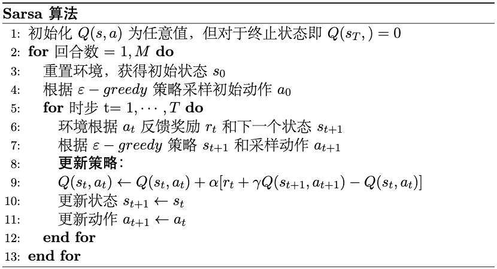
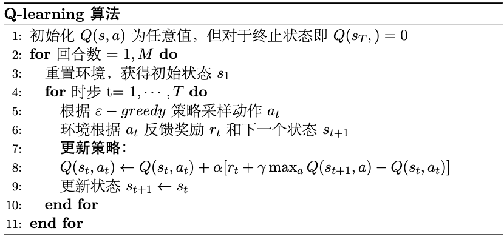

# 时序差分方法

## 更新日志

- 2025-10-29: 删去免模型预测和控制章节，改成蒙特卡洛估计和时序差分估计两个章节，并将 $\text{Q-learning}$ 和 $\text{Sarsa}$ 算法放到时序差分方法部分中。
- 2025-10-27: $\text{Q-learning}$ 和 $\text{Sarsa}$ 算法实战部分单独放到实战部分中。

## 时序差分估计

回顾蒙特卡洛估计的更新，如式 $\eqref{eq:constant_step_mc}$ 所示。

$$
\begin{equation}\label{eq:constant_step_mc}
V(s) \leftarrow V(s) + \alpha [G - V(s)]
\end{equation}
$$

其中回报 $G$ 是从状态 $s$ 开始一直到终止状态的完整回报，定义如式 $\eqref{eq:return}$ 所示。

$$
\begin{equation}\label{eq:return}
G = R_{t+1} + \gamma R_{t+2} + \gamma^2 R_{t+3} + \cdots + \gamma^{T-t-1} R_T
\end{equation}
$$

尽管蒙特卡洛方法可以通过增量式更新来迭代预测状态价值函数 $V(s)$，但它有一个明显的缺点，即它必须等到回合结束后才能进行更新，因为只有在终止状态时才能计算出完整的回报 $G$。这在某些情况下可能会导致学习过程变得缓慢，尤其是在回合较长或没有明确终止状态的环境中。

为了解决这个问题，时序差分（$\text{Temporal Difference，TD}$）估计方法被提出。时序差分方法结合了蒙特卡洛方法和动态规划的思想，允许在每个时间步进行更新，而不需要等待回合结束。具体来说，时序差分方法使用当前奖励和下一个状态的估计值来更新当前状态的价值估计，如式 $\eqref{eq:td_update}$ 所示。

$$
\begin{equation}\label{eq:td_update}
V(s_t) \leftarrow V(s_t) + \alpha [R_{t+1} + \gamma V(s_{t+1}) - V(s_t)]
\end{equation}
$$

其中，$R_{t+1} + \gamma V(s_{t+1})$ 被称为**时序差分目标**，它表示的是当前回报 $G$ 的一个估计值。

当前估计与目标之间的差值则被称为**时序差分误差（$\text{TD Error}$）**，如式 $\eqref{eq:td_error}$ 所示。

$$
\begin{equation}\label{eq:td_error}
\delta_t = R_{t+1} + \gamma V(s_{t+1}) - V(s_t)
\end{equation}
$$

这种使用当前估计来更新现有估计的方式被称为**自举**（$\text{bootstrapping}$），这样做的好处是可以在每个时间步进行更新，不用等到回合结束拿到完整的回报 $G$ 再更新。这样做的好处就是一方面结合了蒙特卡洛的无模型特性，即不需要知道环境的状态转移概率，另一方面也结合了动态规划的自举特性，即利用现有的估计来更新估计，从而提高了学习效率。

注意，实际应用中会考虑终止状态的特殊情况，由于终止状态没有下一个状态，因此在更新时需要单独处理，通常将终止状态的估计值设为 $0$，如式 $\eqref{eq:td_update_terminal}$ 所示。

$$
\begin{equation}\label{eq:td_update_terminal}
\begin{split}
    \begin{cases} V(s_t) \leftarrow V(s_t) + \alpha[R_{t+1}- V(s_{t})]
 & \text {对于终止状态} V(s_{t}) \\ V(s_t) \leftarrow V(s_t) + \alpha[R_{t+1}+\gamma V(s_{t+1})- V(s_{t})] & \text {对于非终止状态} V(s_{t})\end{cases}
\end{split}
\end{equation}
$$

## 时序差分估计计算示例

回顾蒙特卡洛方法中讲到的 $3\times3$ 网格世界的例子，如图 1 所示。考虑智能体在 $3 \times 3$ 的网格中使用随机策略进行移动，以左上角为起点，右下角为终点，同样规定每次只能向右或向下移动，动作分别用 $a_1$ 和 $a_2$ 表示。用智能体的位置不同的状态，即$s_1,s_2,\ldots,s_9$，初始状态为$S_0=s_1$，终止状态为$s_9$。

<div align=center>

</div>
<div align=center>图 1 3x3 网格示例</div>

除了每走一步接收 $-1$ 的奖励之外，这次我们在网格中增加了一些障碍物，例如在位置 $s_4$ 处设置了一个深坑，智能体走到该位置时会受到一个额外的负奖励 $-3$，在位置 $s_5$ 处设置了一个水洼，智能体走到该位置时会受到一个额外的负奖励 $-0.5$。折扣因子 $\gamma=0.9$，目标是计算各个状态的价值函数 $V(s)$。

用 `Python` 实现时序差分估计的代码并且对比蒙特卡洛估计的结果，如代码 1 所示。

<div style="text-align: center;">
    <figcaption style="font-size: 14px;"> <b>代码 1 时序差分估计与蒙特卡洛估计对比</b> </figcaption>
</div>

```python
import random
from collections import defaultdict
import numpy as np
import pandas as pd
import matplotlib.pyplot as plt
import time

# ---------- 参数 ----------
gamma = 0.9
alpha = 0.1            # 学习率（可试 0.05~0.2）
episodes = 100000
states = [f"s{i}" for i in range(1, 10)]
terminal = "s9"
start = "s1"

coords = {
    "s1": (0,0), "s2": (0,1), "s3": (0,2),
    "s4": (1,0), "s5": (1,1), "s6": (1,2),
    "s7": (2,0), "s8": (2,1), "s9": (2,2)
}

# ---------- 环境 ----------
def legal_actions(s):
    r, c = coords[s]
    acts = []
    if c < 2: acts.append("right")
    if r < 2: acts.append("down")
    return acts

def step(s, a):
    r, c = coords[s]
    if a == "right": r2, c2 = r, c + 1
    elif a == "down": r2, c2 = r + 1, c
    s2 = [k for k, v in coords.items() if v == (r2, c2)][0]
    reward = -1.0
    # 额外惩罚修改 ↓↓↓
    if s2 == "s4": reward -= 3.0     # 深坑
    if s2 == "s5": reward -= 0.5     # 水洼
    if s2 == "s9": reward += 1.0     # 终点 +1 → 净0
    done = (s2 == terminal)
    return s2, reward, done

def policy(s):
    acts = legal_actions(s)
    return random.choice(acts)

def generate_episode():
    episode = []
    s = start
    while True:
        if s == terminal:
            episode.append((s, None, 0))
            break
        a = policy(s)
        s2, r, done = step(s, a)
        episode.append((s, a, r))
        s = s2
    return episode

# ---------- First-Visit Monte Carlo ----------
def first_visit_mc(num_episodes=episodes, gamma=0.9):
    V = defaultdict(float)
    N = defaultdict(int)
    for _ in range(num_episodes):
        episode = generate_episode()
        G = 0
        visited = set()
        for s, a, r in reversed(episode):
            G = gamma * G + r
            if s not in visited:
                visited.add(s)
                N[s] += 1
                V[s] += (G - V[s]) / N[s]
    return V

# ---------- TD(0) 预测 ----------
def td0_value_prediction(episodes=episodes, alpha=alpha, gamma=gamma, start="s1"):
    V = defaultdict(float)  # 初始全0
    for _ in range(episodes):
        s = start
        while s != terminal:
            a = policy(s)
            s2, r, done = step(s, a)
            # TD(0) 更新
            V[s] += alpha * (r + gamma * V[s2] - V[s])
            s = s2
    return V

s_t = time.time()
V_mc = first_visit_mc()
t_cost_mc = time.time() - s_t
print(f"First-Visit MC 用时: {t_cost_mc:.2f} 秒")

# ---------- 打印结果 ----------
grid_mc = np.array([[V_mc[f"s{r*3+c+1}"] for c in range(3)] for r in range(3)])
df_mc = pd.DataFrame(grid_mc.round(3),
                     columns=["col1","col2","col3"],
                     index=["row1","row2","row3"])
print(df_mc)

s_t = time.time()
V_td0 = td0_value_prediction()
t_cost_td0 = time.time() - s_t

print(f"TD(0) 用时: {t_cost_td0:.2f} 秒")

grid_td0 = np.array([[V_td0[f"s{r*3+c+1}"] for c in range(3)] for r in range(3)])
df_td0 = pd.DataFrame(grid_td0.round(3),
                      columns=["col1","col2","col3"],
                      index=["row1","row2","row3"])
print(df_td0)
```

运行代码后，得到结果如代码 2 所示。

<div style="text-align: center;">
    <figcaption style="font-size: 14px;"> <b>代码 2 时序差分估计与蒙特卡洛估计结果对比</b> </figcaption>
</div>

```python
First-Visit MC 用时: 0.57 秒
      col1   col2  col3
row1 -4.43 -2.149  -1.0
row2 -2.15 -1.000   0.0
row3 -1.00  0.000   0.0
TD(0) 用时: 0.47 秒
       col1   col2  col3
row1 -4.110 -2.216  -1.0
row2 -2.182 -1.000   0.0
row3 -1.000  0.000   0.0
```

可以发现，时序差分估计和蒙特卡洛估计得到的状态价值函数 $V(s)$ 非常接近，但时序差分估计的计算速度更快一些。这是因为时序差分方法能够在每个时间步进行更新，而不需要等待整个回合结束，从而提高了学习效率，并且在更加复杂的环境中，这种优势会更加明显。

## 时序差分目标的推导

那么时序差分目标 $R_{t+1} + \gamma V(s_{t+1})$ 是怎么定义来的呢？。回顾贝尔曼方程的状态价值函数形式，如式 $\eqref{eq:3}$ 所示。

$$
\begin{equation}\label{eq:3}
\begin{aligned}
V_{\pi}(s) & =\mathbb{E}_{\pi}\left[G_t \mid S_t=s\right] \\
& =\mathbb{E}_{\pi}\left[R_{t+1}+\gamma V_{\pi}\left(S_{t+1}\right) \mid S_t=s\right]
\end{aligned}
\end{equation}
$$

会发现，在给定策略 $\pi$ 的期望公式中，回报和状态价值存在等价关系，如式 $\eqref{eq:4}$ 所示。

$$
\begin{equation}\label{eq:4}
G_t \approx R_{t+1} + \gamma V(s_{t+1})
\end{equation}
$$

代入到蒙特卡洛更新公式 $\eqref{eq:constant_step_mc}$ 中，就得到了时序差分更新公式 $\eqref{eq:td_update}$ 。

注意，$\eqref{eq:4}$ 中的等价近似是有条件的，需要满足在“期望”的环境下。具体来说，首先需保证**策略是稳定的**（通常指策略能够收敛，感兴趣的读者也可参考后面要讲的策略梯度方法中的平稳分布概念），其次**需要足够的探索**，产生足够多样的轨迹，尽可能覆盖所有的回报情况。然后在此基础上通过不断地迭代更新 $V(s)$，使得 $V(s)$ 趋近于真实的状态价值 $V_{\pi}(s)$，在这个过程中，时序差分目标 $R_{t+1} + \gamma V(s_{t+1})$ 也会趋近于真实的期望回报 $\mathbb{E}_{\pi}[G_t | S_t=s]$。

换句话说，在保证策略收敛的前提下，使用时序差分方法时，最重要的是**足够多次的迭代更新和足够的探索性**，否则时序差分估计可能会一直不稳定，从而无法收敛到最优策略，这是在实际应用中需要特别注意的地方。

在策略收敛前，由于状态价值函数 $V(s)$ 还没有收敛到真实的值，是一个估计的量，因此时序差分目标 $R_{t+1} + \gamma V(s_{t+1})$ 也只是一个近似的估计值。因此，在实际应用中，为了保证前期的估计更加稳定，会采用一些技巧，例如使用较小的学习率 $\alpha$、提高探索率等，来减小估计误差对学习过程的影响。很多时候，也会优化时序差分目标本身的表示形式，例如使用 $R_{t+1} + \gamma V(s_{t+1})$ 形式的变种，或者引入神经网络等函数逼近方法来提高估计的准确性。

##  n 步时序差分

式 $\eqref{eq:4}$ 中的时序差分目标 $R_{t+1} + \gamma V(s_{t+1})$ 实际上是向前自举了一步的结果，即单步时序差分（$\text{TD(0)}$）。实际上我们也可以向前自举多步，得到 $n$ 步时序差分目标，如式 $\eqref{eq:n_step_td_annotated}$ 所示。

$$
\begin{equation}\label{eq:n_step_td_annotated}
G_t^{(n)} =
\underbrace{R_{t+1} + \gamma R_{t+2} + \cdots + \gamma^{n-1} R_{t+n}}_{\textcolor{blue}{\text{实际回报（采样得到）}}}
+ \underbrace{\gamma^n V(s_{t+n})}_{\textcolor{red}{\text{估计值（引入自举）}}}
\end{equation}
$$

可以看出该等价近似式中，前半部分是从时间步 $t$ 开始，连续 $n$ 步的实际奖励回报的折扣和，这部分是通过采样得到的实际值；后半部分则是从时间步 $t+n$ 开始的状态 $s_{t+n}$ 的估计价值 $V(s_{t+n})$，这部分是通过自举引入的估计值。 当 $n$ 越大时，$\gamma^{n-1}$ 的权重会越来越小，意味着估计值 $V(s_{t+n})$ 对整体目标的影响会减小，而实际回报部分的影响会增大，但同时计算复杂度也会增加；反之，当 $n$ 越小时，估计值 $V(s_{t+n})$ 的影响会增大，而实际回报部分的影响会减小，但计算复杂度会降低。

如式 $\eqref{eq:n_step_td}$ 所示，当 $n$ 趋近于无穷大时，$n$ 步时序差分目标就变成了完整的回报 $G$，即蒙特卡洛方法；当 $n=1$ 时，则退化为单步时序差分目标

$$
\begin{equation}\label{eq:n_step_td}
\begin{aligned}
& n=1(\mathrm{TD}) \quad G_t^{(1)}=R_{t+1}+\gamma V\left(s_{t+1}\right) \\
& n=2 \quad G_t^{(2)}=R_{t+1}+\gamma R_{t+2}+\gamma^2 V\left(s_{t+2}\right) \\
& n=\infty(\mathrm{MC}) \quad G_t^{\infty}=R_{t+1}+\gamma R_{t+2}+\cdots+\gamma^{T-t-1} R_T
\end{aligned}
\end{equation}
$$

因此，$n$ 步时序差分方法实际上是蒙特卡洛方法和单步时序差分方法之间的一种折中，通过调整 $n$ 的取值，一方面在计算复杂度和估计准确性之间进行权衡，另一方面也在偏差和方差之间进行权衡。较小的 $n$ 值通常会导致较高的偏差但较低的方差，而较大的 $n$ 值则会导致较低的偏差但较高的方差。

## 动态规划、蒙特卡洛和时序差分的比较

回顾动态规划、蒙特卡洛和时序差分这三种算法，它们都是强化学习中比较重要的价值估计方法，并且各自有不同的特点和适用场景，具体比较如表 1 所示。

<div style="text-align: center;">
    <figcaption style="font-size: 14px;"> <b>表 1 动态规划、蒙特卡洛和时序差分比较</b> </figcaption>
</div>

| 方法         | 依赖环境模型 | 更新时机           | 估计方式           | 优缺点                                     |
| :----------: | :----------: | ------------------ | :----------------: | :----------------------------------------: |
| 动态规划     | 需要         | 每个时间步         | 自举             | 优点：收敛速度快；缺点：有模型方法，需要完整的环境模型 |
| 蒙特卡洛方法 | 不需要       | 回合结束后         | 采样             | 优点：无偏估计，无模型方法，适用于未知环境；缺点：需要完整回合，高方差，收敛速度慢 |
| 时序差分方法 | 不需要       | 每个时间步         | 自举和采样结合 | 优点：无模型方法，适用于未知环境，更新及时高效，低方差；缺点：有偏估计，可能不稳定，依赖于探索策略 |

## Sarsa 算法

$\text{Sarsa}$ 是一种基于时序差分的同策略（$\text{on-policy}$）控制算法，用于估计动作价值函数 $Q(s,a)$，它的名称来源于更新过程中涉及的五个元素：状态 $S_t$、动作 $A_t$、奖励 $R_{t+1}$、下一个状态 $S_{t+1}$ 和下一个动作 $A_{t+1}$。

### 时序差分估计动作价值

在讲解 $\text{Sarsa}$ 算法流程之前，我们先看时序差分如何估计动作价值。类似于状态价值，动作价值的时序差分更新如式 $\eqref{eq:td_q_update}$ 所示。

$$
\begin{equation}\label{eq:td_q_update}
Q(s_t, a_t) \leftarrow Q(s_t, a_t) + \alpha [R_{t+1} + \gamma Q(s_{t+1}, a_{t+1}) - Q(s_t, a_t)]
\end{equation}
$$

### Sarsa 算法流程

参考蒙特卡洛控制算法的流程，结合时序差分估计动作价值的方式，$\text{Sarsa}$ 算法的具体流程如图 2 所示，**完整的代码实现可参考实战部分的内容**。

<div align=center>

</div>
<div align=center>图 2 Sarsa 算法流程</div>

可以看出，由于时序差分方法是在每个时间步进行更新的，因此 $\text{Sarsa}$ 算法无需等待回合结束，而是在每个时间步根据当前状态 $s_t$ 和动作 $a_t$，以及环境反馈的奖励 $r_{t}$ 和下一个状态 $s_{t+1}$，并更新动作价值函数 $Q(s_t, a_t)$。

### 探索策略

前面讲到，为了保证时序差分估计的收敛性，最好进行足够的探索。在 $\text{Sarsa}$ 算法中，通常使用 $\varepsilon$-贪婪策略（$\varepsilon$-greedy policy）来**平衡探索和利用**。

具体来说，在每个时间步，智能体以概率 $1-\varepsilon$ 选择当前估计最优的动作（即具有最高 $Q$ 值的动作），以概率 $\varepsilon$ 随机选择一个动作进行探索，从而确保在学习过程中能够覆盖更多的状态和动作，具体如式 $\eqref{eq:epsilon_greedy}$ 所示。

$$
\begin{equation}\label{eq:epsilon_greedy}
\pi(a|s) =
\begin{cases}
1 - \varepsilon + \frac{\varepsilon}{|\mathcal{A}(s)|}, & \text{if } a = \arg\max_{a'} Q(s, a') \\
\frac{\varepsilon}{|\mathcal{A}(s)|}, & \text{otherwise}
\end{cases}
\end{equation}
$$

其中 $\varepsilon$ 表示探索率，随着训练的进行，通常会逐渐减小 $\varepsilon$ 的值，以便在初期进行更多的探索，而在后期更多地利用已经学到的知识，从而提高学习效率和最终的策略表现。

## Q-learning 算法  

$\text{Q-learning}$ 是一种基于时序差分的异策略（$\text{off-policy}$）控制算法，。与 $\text{Sarsa}$ 不同，$\text{Q-learning}$ 在更新过程中使用的是下一个状态 $s_{t+1}$ 的最优动作的估计值，而不是实际采取的动作 $a_{t+1}$，这使得 $\text{Q-learning}$ 能够学习到最优策略，而不依赖于当前的行为策略。具体的更新公式如式 $\eqref{eq:q_learning_update}$ 所示。

$$
\begin{equation}\label{eq:q_learning_update}
Q(s_t, a_t) \leftarrow Q(s_t, a_t) + \alpha [R_{t+1} + \gamma \max_{a'} Q(s_{t+1}, a') - Q(s_t, a_t)]
\end{equation}
$$

类似的，算法流程如图 3 所示，**完整的代码实现可参考实战部分的内容**。

<div align=center>

</div>
<div align=center>图 3 Q-learning 算法流程</div>


## 思考

**蒙特卡洛和时序差分都是无模型方法吗？**

是的，蒙特卡洛方法和时序差分方法都是无模型（$\text{model-free}$）方法。这意味着它们不需要对环境的动态模型进行显式建模，而是通过与环境的交互来学习价值函数或策略。

**蒙特卡洛方法和时序差分方法的优劣势分别是什么？**

**蒙特卡洛方法优势**：可以直接从经验中学习，不需要环境的转移概率；收敛性良好，可以保证在有限步内收敛到最优策略；可以处理长期回报，对于无折扣情况也可以使用。**蒙特卡洛方法劣势**：需要等到一条完整的轨迹结束才能更新价值函数，因此效率较低；对于连续状态空间和动作空间的问题，蒙特卡洛方法难以处理。**时序差分优势**：可以在交互的过程中逐步更新价值函数，效率较高；可以处理连续状态空间和动作空间的问题；可以结合函数逼近方法使用，对于高维状态空间的问题有很好的应用。**时序差分劣势**：更新过程中存在一定的方差，可能会影响收敛速度和稳定性；对于无折扣情况，需要采取一些特殊的方法来保证收敛。总的来说，蒙特卡洛方法对于离散状态空间的问题，特别是存在长期回报的问题有很好的适用性，但是其效率较低。时序差分方法则可以高效地处理连续状态空间和动作空间的问题，但是其更新过程中存在方差问题。在实际应用中需要根据问题的特点和实际情况选择合适的方法。