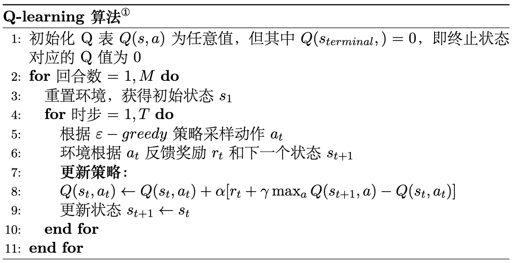
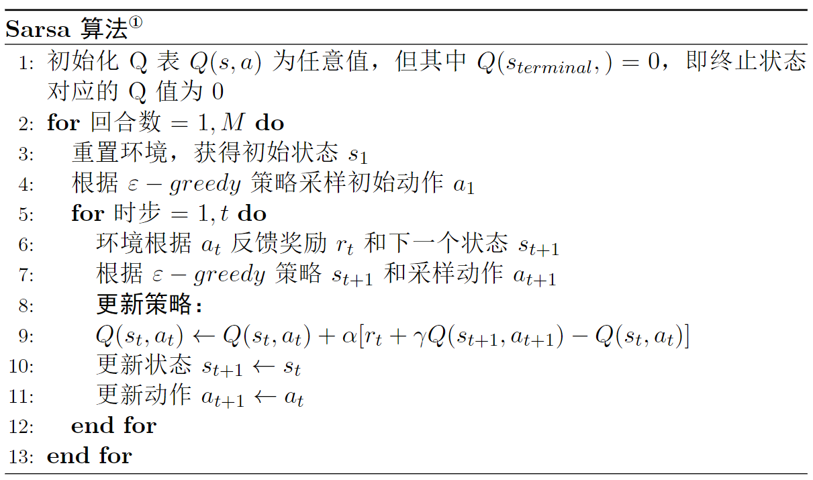

# 经典控制方法

$\qquad$ 回顾前面讲的控制，即给定一个马尔可夫决策过程，输出最优策略以及对应的最优价值函数。而免模型则是指不需要知道环境的状态转移概率的一类算法，实际上很多经典的强化学习算法都是免模型控制的。本章会重点介绍两种基础的免模型算法，$\text{Q-learning}$ 和 $\text{Sarsa}$ ，也都是基于时序差分的方法。

## Q-learning 算法

$\qquad$ 在时序差分方法的章节中我们讲的是状态价值函数的时序差分，其目的是为了预测每个状态的价值。而在预测与控制的内容中我们提到了控制的方法是需要输出最优策略的同时，也会输出对应的状态价值函数，预测的方法也是为了帮助解决控制问题做一个铺垫。不知道读者还记不记得，策略与状态价值函数之间是存在一个联系的，这个联系就是动作价值函数，如式 $\text(5.1)$ 所示：

$$
\tag{5.1}
V_\pi(s)=\sum_{a \in A} \pi(a \mid s) Q_\pi(s, a)
$$

$\qquad$ 因此，为了解决控制问题，我们只需要直接预测动作价值函数，然后在决策时选择动作价值即 Q 值最大对应的动作即可。这样一来，策略和动作价值函数同时达到最优，相应的状态价值函数也是最优的，这就是 $\text{Q-learning}$ 算法的思路。

$\text{Q-learning}$ 算法更新公式如式 $\text{(5.2)}$ 所示。

$$
\tag{5.2}
Q(s_t,a_t) \leftarrow Q(s_t,a_t)+\alpha[r_t+\gamma\max _{a}Q(s_{t+1},a)-Q(s_t,a_t)]
$$

$\qquad$ 我们再回忆一下时序差分方法中状态价值函数的更新公式，如式 $\text(4.5)$ ：

$$
\tag{5.3}
V(s_t) \leftarrow V(s_t) + \alpha[r_{t+1}+\gamma V(s_{t+1})- V(s_{t})]
$$

$\qquad$ 我们会发现两者的更新方式是一样的，都是基于时序差分的更新方法。不同的是，动作价值函数更新时是直接拿最大的未来动作价值的 $\gamma\max _{a}Q(s_{t+1},a)$ 来估计的，而在状态价值函数更新中相当于是拿对应的平均值来估计的。这就会导致这个估计相当于状态价值函数中的估计更不准确，一般称为 **Q 值的过估计**，当然这个过估计仅仅限于以 $\text{Q-learning}$ 为基础的算法，不同的算法为了优化这个问题使用了不同的估计方式，其中就包括本章后面会讲的 Sarsa 算法，暂时先不详细展开。

### Q 表格

$\qquad$ 回到 $\text{Q-learning}$ 算法本身，其实到这里我们已经把 $\text{Q-learning}$ 算法的核心内容讲完了，即上面的更新公式 $\text(4.5)$。但是有必要提到几个概念，$\text{Q}$ 表格和探索策略，以便帮助读者加深理解。

$\qquad$ 关于 $\text{Q}$ 表格，其实我们在前面讲蒙特卡洛方法的过程中已经形成了雏形，就是我们所举的价值函数网格分布的例子。我们接着这个例子继续讲，不记得的同学建议再往前回顾一下。如图 $\text{5.1}$ 所示，这个例子是以左上角为起点，右下角为终点，机器人只能向右或者向下走，每次移动后机器人会收到一个 $-1$ 的奖励，即奖励函数 $R(s,a)=1$，然后求出机器人从起点走到终点的最短路径。

图 $\text{5.1}$ 迷你网格示例

$\qquad$ 其实这个答案比较简单，机器人要达到终点只能先向右然后向下，或者先向下然后向右走，有且只有两条路径，并且同时也是最短路径。当时出于简化计算的考虑（状态价值的计算实在是太繁琐了！），只考虑了 $2 \times 2$ 的网格。这次我们可以将问题变得更有挑战性一些，如图 $\text{5.2}$ 所示， 我们将网格变成大一点的 $3 \times 3$ 的网格，并且不再限制机器人只能向右或者向下走，它可以向上、向下、向左和向右随意走动，当然每次还是只能走动一格，并且不能出边界，另外奖励函数也不变。

图 $\text{5.2}$ 迷你网格进阶

$\qquad$ 我们还是把机器人的位置看作状态，这样一来总共有 $\text{9}$ 个状态，$\text{4}$ 个动作 $a_1,a_2,a_3,a_4$（分别对应上、下、左、右）。我们知道 Q 函数，也就是状态价值函数的输入就是状态和动作，输出就是一个值，由于这里的状态和动作都是离散的，这样一来我们就可以用一个表格来表示，如表 $\text{5.1}$ 所示。

  

    <table>
      <tr>
        <th> $\space$ </th>
        <th>$s_1$</th>
        <th>$s_2$</th>
        <th>$s_3$</th>
        <th>$s_4$</th>
        <th>$s_5$</th>
        <th>$s_6$</th>
        <th>$s_7$</th>
        <th>$s_8$</th>
        <th>$s_9$</th>
      </tr>
      <tr>
        <td>$a_1$</td>
        <td>$\text{0}$</td>
        <td>$\text{0}$</td>
        <td>$\text{0}$</td>
        <td>$\text{0}$</td>
        <td>$\text{0}$</td>
        <td>$\text{0}$</td>
        <td>$\text{0}$</td>
        <td>$\text{0}$</td>
        <td>$\text{0}$</td>
      </tr>
      <tr>
        <td>$a_2$</td>
        <td>$\text{0}$</td>
        <td>$\text{0}$</td>
        <td>$\text{0}$</td>
        <td>$\text{0}$</td>
        <td>$\text{0}$</td>
        <td>$\text{0}$</td>
        <td>$\text{0}$</td>
        <td>$\text{0}$</td>
        <td>$\text{0}$</td>
      </tr>
      <tr>
        <td>$a_3$</td>
        <td>$\text{0}$</td>
        <td>$\text{0}$</td>
        <td>$\text{0}$</td>
        <td>$\text{0}$</td>
        <td>$\text{0}$</td>
        <td>$\text{0}$</td>
        <td>$\text{0}$</td>
        <td>$\text{0}$</td>
        <td>$\text{0}$</td>
      </tr>
      <tr>
        <td>$a_4$</td>
        <td>$\text{0}$</td>
        <td>$\text{0}$</td>
        <td>$\text{0}$</td>
        <td>$\text{0}$</td>
        <td>$\text{0}$</td>
        <td>$\text{0}$</td>
        <td>$\text{0}$</td>
        <td>$\text{0}$</td>
        <td>$\text{0}$</td>
      </tr>
    </table>
  

  
表 $\text{5.1}$ ：$\text{Q}$ 表格

$\qquad$ 表格的横和列对应状态和动作，数值表示对应的 $Q$ 值，比如最左上角的值表示 $Q(s_1,a_1)=0$，这就是 $Q$ 表格。在实践中，我们可以给所有的 $Q$ 预先设一个值，这就是 $Q$ 值的初始化。这些值是可以随机的，这里为了方便全部初始化为 $0$，但除了终止状态对应的值必须为 $\text{0}$ 之外，这点我们在讲时序差分的方法中有提到过，比如这里终止状态 $s_9$ 对应的所有 $Q$ 值，包括 $Q(s_9,a_1),Q(s_9,a_2),Q(s_9,a_3),Q(s_9,a_4)$ 等都必须为 $\text{0}$ ，并且也不参与 $Q$ 值的更新。

$\qquad$ 现在我们讲讲 $Q$ 值的更新过程，其实跟前面讲的状态价值更新是类似的。但不一样的是，前面讲状态价值的更新是蒙特卡洛方法，这次是时序差分方法。具体的做法是，我们会让机器人自行在网格中走动，走到一个状态，就把对应的 $Q$ 值 更新一次，这个过程就叫做 **探索** 。这个探索的过程也是时序差分方法结合了蒙特卡洛方法的体现。当然探索的方式有很多种，很难在读者初学的阶段一次性就全部倒腾出来，这也是为什么在前面讲时序差分方法的时候我们只讲了更新公式而没有讲实际是怎么操作的原因，之后会结合具体情况一一道来，下面我们讲讲 $\text{Q-learning}$ 算法中智能体是怎么探索的。

### 探索策略

$\qquad$ 按理说来，直接根据 $Q$ 函数（即每次选择 $Q$ 值最大对应的动作）来探索是没有问题的。但是由于在探索的过程中 $Q$ 值也是估计出来的，然后还需要利用先前的估计值来更新 $Q$ 值（也就是自举的过程），换句话说，由于自举依赖于先前的估计值，因此这可能会导致估计出的价值函数存在某种程度上的偏差。

$\qquad$ 通俗的理解就是，如果我们一直基于某种思路去工作，工作完之后总结经验（也就是学习的过程）以便提高工作能力和效率，这种方式也许会让我们工作得越来越好，但任何一种思路都不是完美的，都会有一定的瑕疵，也就是说可能会慢慢走偏，此时换一种思路也许就会豁然开朗。实际上人类社会和科学的发展也有着异曲同工之处，举一个古老的例子，很久之前人们认为地球是宇宙的中心（即地心说），并且在公元2世纪将它形成一个体系化的理论，并且以此理论为基础也解决了很多当时难以捉摸的问题。

$\qquad$ 但是随着科学的进一步发展这种理论也开始走到极限，直到后面哥白尼提出日心说的理论，尽管当时哥白尼由于不被坚持地心说的守旧派而为此付出了沉重的代价。守旧派就相当于一直坚持同一个思路去探索学习，这种探索思路总会受限于当时人们的认知，并且迟早会到达极限，除非出现一个偶然的因素让我们切换一种思路探索并且学习到更多的东西。尽管在今天看来，地心说和日心说都不是准确的，但其实诸多类似的历史事件也告诉我们一个道理，我们需要牢牢掌握现有的知识形成自己的理论或者经验体系，同时也要保持好奇心与时俱进，这样才能长久地发展下去，对于强化学习中的智能体也是如此。

$\qquad$ 回到正题，$\text{Q-learning}$ 算法是采用了一个叫做  $\varepsilon-greedy$ 的探索策略，$\varepsilon-greedy$ 是指智能体在探索的过程中，会以 $1-\varepsilon$ 的概率按照 $Q$ 函数来执行动作，然后以剩下 $\varepsilon$ 的概率随机动作。这个 $1-\varepsilon$ 的过程就是前面所说的“守旧派”，即以现有的经验去动作，$\varepsilon$ 就是保持一定的好奇心去探索可能的更优的动作。当然，通常这个 $\varepsilon$ 的值会设置的特别小，比如 $\text{0.1}$ ，毕竟“守旧”并不总是一件坏事，新的东西出现的概率总是特别小的，如果保持过度的好奇心即 $\varepsilon$ 的值设得很大，就很有可能导致智能体既学不到新的东西也丢掉了已经学习到的东西，所谓“捡了芝麻丢了西瓜”。而且一般来说也会随着学到的东西增多而更少，就好比科学知识体系几近完备的现代，能够探索到新的东西的概率是特别特别小的。因此通常在实践中，这个 $\varepsilon$ 的值还会随着时步的增长而衰减，比如从 $\text{0.1}$ 衰减到 $\text{0.01}$ 。 

$\qquad$ 更确切地说，以 $1-\varepsilon$ 的概率按照 $Q$ 函数来执行动作的这个过程在强化学习中我们一般称作利用（ $\text{exploitation}$ ），而以 $\varepsilon$ 的概率随机动作的过程称之为探索（ $\text{exploration}$ ）。什么时候需要探索的更多，什么时候需要利用的更多，其实是很难下定论的，这就是大多数强化学习情景中需要面临的**探索-利用窘境**（ $\text{exploration-exploitation dilemma}$ ）。我们需要在探索和利用之间做一个权衡，这其实跟深度学习中讲的**偏差-方差权衡**（ $\text{Bias-Variance Tradeoff}$ ）是如出一辙的。

$\qquad$ 讲到这里，我们就可以贴出 $\text{Q-learning}$ 算法的伪代码了，如图 $\text{5.3}$ 所示。

图 $\text{5.3}$ $\text{Q-learning}$ 算法伪代码

## Sarsa 算法

$\qquad$ $\text{Sarsa}$ 算法虽然在刚提出的时候被认为是 $\text{Q-learning}$ 算法的改进，但在今天看来是非常类似，但是模式却不同的两类算法，$\text{Q-learning}$ 算法被认为是 $\text{Off-Policy}$ 算法，而 $\text{Sarsa}$ 算法相对地则是 $\text{On-policy}$ 的，具体我们后面会展开说明。我们先来看 $\text{Sarsa}$ 算法，我们讲到 $\text{Sarsa}$ 算法跟 $\text{Q-learning}$ 算法是非常类似的，这是因为两者之间在形式上只有 $Q$ 值更新公式是不同的，如式 $\text(5.4)$ 所示：

$$
\tag{5.4}
Q(s_t,a_t) \leftarrow Q(s_t,a_t)+\alpha[r_t+\gamma Q(s_{t+1},a_{t+1})-Q(s_t,a_t)]
$$

$\qquad$ 也就是说，$\text{Sarsa}$ 算法是直接用下一个状态和动作对应的 $Q$ 值来作为估计值的，而 $\text{Q-learning}$ 算法则是用下一个状态对应的最大 $Q$ 值。然后我们就可以贴出伪代码了，如图 $\text{5.4}$ 所示。

图 $\text{5.4}$ $\text{Sarsa}$ 算法伪代码 

## 同策略与异策略

$\qquad$ 尽管 $\text{Q-learning}$ 算法和 $\text{Sarsa}$ 算法仅在一行更新公式上有所区别，但这两种算法代表的是截然不同的两类算法。我们注意到，$\text{Sarsa}$ 算法在训练的过程中当前策略来生成数据样本，并在其基础上进行更新。换句话说，策略评估和策略改进过程是基于相同的策略完成的，这就是**同策略算法**。相应地，像 $\text{Q-learning}$ 算法这样从其他策略中获取样本然后利用它们来更新目标策略，我们称作**异策略算法**。也就是说，异策略算法基本上是从经验池或者历史数据中进行学习的。这两类算法有着不同的优缺点，同策略相对来说更加稳定，但是效率较低，如同我们实战中展示的那样。而异策略通常来说更加高效，但是需要让获取样本的策略和更新的策略具备一定的分布匹配条件，以避免偏差。

## Dyna-Q 算法

待补充。

## 小结

$\qquad$ 本章主要介绍了两种经典的传统强化学习算法，即 $\text{Q-learning}$ 和 $\text{Sarsa}$ 算法。同时，这两种算法虽然非常近似，但本质上是两类不同的算法，前者为 $\text{off-policy}$ 算法，后者为 $\text{on-policy}$ 算法。虽然这两种算法在目前强化学习实践中几乎不怎么用到，但却是后面 $\text{DQN}$ 算法的基础，读者需要熟练掌握。

## 思考

**什么是 $Q$ 值的过估计？有什么缓解的方法？**

值的过估计（$\text{overestimation of values}$）是指在强化学习中，由于采样数据的不充分或者算法本身的限制，导致学习到的状态或动作价值函数高估了它们的真实值。值的过估计会影响强化学习算法的性能和稳定性，因此需要采取相应的缓解措施。一些缓解值的过估计的方法有：双重 $Q$ 学习（$\text{Double Q-learning}$）：将一个Q函数的更新过程分为两步，分别用来更新行动值函数和目标值，从而避免了 $Q$ 函数的过估计；优先经验回放（ $\text{Prioritized Experience Replay}$ ）：在经验回放中，根据每条经验的 $\text{TD}$ 误差大小来选择回放的概率，使得 $\text{TD}$ 误差大的经验更有可能被回放，从而更好地修正价值函数；目标网络（ $\text{Target Network}$ ）：使用一个目标网络来计算目标值，目标网络的参数较稳定，不会随着每次更新而改变，从而减缓了价值函数的过估计问题；随机探索策略（ $\text{Exploration Strategy}$ ）：采用一些随机的探索策略，如 $\varepsilon-\text{greedy}$ 、高斯噪声等，可以使得智能体更多地探索未知的状态和动作，从而减少了价值函数的过估计问题。这些方法可以在不同的强化学习算法中使用，比如 $\text{DQN}$ 、$\text{DDQN}$ 、$\text{Dueling DQN}$ 等。选择合适的方法可以有效地缓解价值函数的过估计问题。

**$\text{on-policy}$ 与 $\text{off-policy}$ 之间的区别是什么？**

$\text{on-policy}$ 指的是学习一个策略时，使用同一策略来收集样本，并且利用这些样本来更新该策略。即学习的策略和探索的策略是相同的。$\text{off-policy}$ 指的是学习一个策略时，使用不同于目标策略的行为策略来收集样本，并且利用这些样本来更新目标策略。即学习的策略和探索的策略是不同的。在强化学习中，通常使用 $\text{Q-learning}$、$\text{SARSA}$ 等算法来实现 $\text{off-policy}$ 学习。而使用 $\text{policy gradient}$ 等算法来实现 $\text{on-policy}$ 学习。 $\text{on-policy}$ 学习的优点是可以较好地处理连续动作空间的问题，并且可以保证学习到的策略收敛到最优策略。但是其缺点是样本的利用效率较低，因为样本只能用于更新当前策略，不能用于更新其他策略。 $\text{off-policy}$ 学习的优点是样本的利用效率较高，因为可以使用不同的行为策略来收集样本，并且利用这些样本来更新目标策略。但是其缺点是可能会出现样本不一致的问题，即目标策略和行为策略不同，会导致学习的不稳定性。因此，在实际应用中需要根据具体问题的特点和实际情况选择合适的学习方式。

**为什么需要探索策略？**

探索策略是强化学习中非常重要的一个概念，原因有：强化学习的目标是学习一个最优策略，但初始时我们并不知道最优策略，因此需要通过探索来发现更优的策略；在强化学习中，往往存在许多未知的状态和动作，如果智能体只采用已知的策略，那么它将无法探索到未知状态和动作，从而可能会错过更优的策略；探索策略可以帮助智能体避免陷入局部最优解，从而更有可能找到全局最优解。探索策略可以提高智能体的鲁棒性，使其对环境的变化更加适应。常用的探索策略包括 $\varepsilon-\text{greedy}$ 策略、$\text{softmax}$ 策略、高斯噪声等。