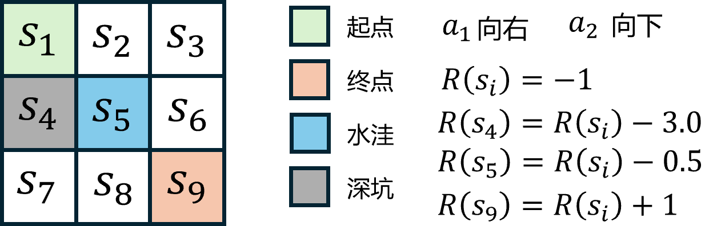

# 深度学习基础

在教程前面部分我们介绍了强化学习的基础内容，包含马尔可夫决策过程、预测与控制等，其中经典的预测与控制算法主要包括动态规划、蒙特卡洛方法和时序差分方法等。

这些算法在解决一些简单的强化学习问题时表现良好，但在面对高维度和复杂环境时，传统方法往往力不从心。为了解决这些问题，深度强化学习应运而生，它结合了深度学习的强大功能，使得强化学习能够处理更复杂的任务。

## 价值函数表格

在强化学习中，价值函数（如状态价值函数 $V(s)$ 和动作价值函数 $Q(s,a)$）是评估状态或状态-动作对好坏的关键工具，怎么表示这些函数是强化学习中的一个重要问题。

对于小规模的问题，例如前面章节中介绍的网格世界（$\text{Grid World}$）示例，我们可以使用表格形式来存储对应的状态或动作价值。如表 1 所示，我们可以使用一个二维表格来表示动作价值函数 $Q(s,a)$，其中行表示不同的动作 $a$，列表示不同的状态 $s$。表格中的每个元素 $Q(s,a)$ 存储了在状态 $s$ 下采取动作 $a$ 所获得的预期回报。

<div style="text-align: center;">
  <div style="display: table; margin: 0 auto;">
    <table>
      <tr>
        <th> $\space$ </th>
        <th>$s_1$</th>
        <th>$s_2$</th>
        <th>$s_3$</th>
        <th>$s_4$</th>
      </tr>
      <tr>
        <td>$a_1$</td>
        <td>$\text{-1.9}$</td>
        <td>$\text{-1.0}$</td>
        <td>$\text{-1.0}$</td>
        <td>$\text{0.0}$</td>
      </tr>
      <tr>
        <td>$a_2$</td>
        <td>$\text{-1.3}$</td>
        <td>$\text{-0.9}$</td>
        <td>$\text{-0.7}$</td>
        <td>$\text{-0.5}$</td>
      </tr>
    </table>
  </div>
  <div>表 1 $\:$ $\text{Q}$ 表格</div>
</div>

表格实际上是一种数学抽象形式，在程序实现上可以使用`Python`数组或者字典来表示，如代码 1 所示。

<div style="text-align: center;">
    <figcaption style="font-size: 14px;"> <b>代码 1 $\:$ 表格的程序实现示例</b> </figcaption>
</div>

```python
import numpy as np
# 使用二维数组表示 Q 表格
# 维度为 (状态数, 动作数)，例如 Q[0, 1] 表示状态 s1 下采取动作 a2 的价值
Q_table = np.array([[-1.9, -1.0, -1.0, 0.0],
                    [-1.3, -0.9, -0.7, -0.5]])
# 使用字典表示 Q 表格
# 键为 (状态, 动作) 的元组，值为对应的动作价值，例如 Q_dict[(0, 1)] 表示状态 s1 下采取动作 a2 的价值
Q_dict = {
    (0, 0): -1.9, (0, 1): -1.0, (0, 2): -1.0, (0, 3): 0.0,
    (1, 0): -1.3, (1, 1): -0.9, (1, 2): -0.7, (1, 3): -0.5
}
# 为便于理解可以使用str元组表示状态和动作
Q_dict_str = {
    ('s_1', 'a_1'): -1.9, ('s_2', 'a_1'): -1.0,
    ('s_3', 'a_1'): -1.0, ('s_4', 'a_1'): 0.0,
    ('s_1', 'a_2'): -1.3, ('s_2', 'a_2'): -0.9,
    ('s_3', 'a_2'): -0.7, ('s_4', 'a_2'): -0.5
}
```

然而，随着问题规模的增大，状态和动作空间变得庞大甚至连续，使用表格来存储价值函数变得不可行。一方面，表格的存储内存会随着状态和动作数量的增加而指数级增长，导致计算开销过大。另一方面，表格方法无法处理连续状态或动作空间，因为无法为每一个可能的状态-动作对分配一个独立的表格项。

## 函数近似表示

为了解决上述问题，我们可以使用函数近似的方法来表示价值函数。函数近似通过参数化的函数（如线性函数、神经网络等）来估计价值函数，从而避免了存储整个表格的需求。

在深度学习出现之前，线性函数是常用的函数近似方法。线性函数通过将状态和动作映射到一个特征空间，并使用线性组合来估计价值函数。例如，动作价值函数 $Q(s,a)$ 可以表示式 $\eqref{eq:1}$ 。

$$
\begin{equation}\label{eq:1}
Q(s,a; \boldsymbol{\theta}) = \boldsymbol{\theta}^T \boldsymbol{\phi}(s,a)
\end{equation}
$$

其中 $Q(s,a; \boldsymbol{\theta})$ 有时也协作 $Q_{\boldsymbol{\theta}}(s,a)$，$\boldsymbol{\phi}(s,a)$ 是状态-动作对的特征向量，$\boldsymbol{\theta}$ 是参数向量。通过调整参数 $\boldsymbol{\theta}$，我们可以使得函数近似更好地拟合实际的价值函数。

但是，线性函数在处理复杂的非线性关系时表现有限，参数调整也较为困难，这限制了其在复杂强化学习任务中的应用。

除了线性函数，其他传统的函数近似方法还包括决策树、支持向量机等，这些方法在某些特定任务中也有一定的应用价值，具体总结如表 2 所示。

<div style="text-align: center;">
    <figcaption style="font-size: 14px;"> <b>表 2 $\:$ 典型函数近似方法总结</b> </figcaption>
</div>

|       方法类型       |                      核心思想                      | 表达能力 |           优缺点           |                  示例算法                  |
| :------------------: | :------------------------------------------------: | :------: | :------------------------: | :----------------------------------------: |
|       线性近似       | $V(s) = \boldsymbol{\theta}^T\boldsymbol{\phi}(s)$ |    弱    |    高效但不能表达非线性    |     $\text{Linear TD}$, $\text{LSTD}$      |
|  $\text{RBF}$ 网络   |                   高斯核函数组合                   |   中等   | 可表示局部非线性，计算较重 |               $\text{RBF-Q}$               |
| 决策树/$\text{GBDT}$ |                  树状划分状态空间                  |   中高   |   可解释、难与在线RL结合   |        $\text{Fitted Q-Iteration}$         |
|     局部加权回归     |                  局部样本加权平均                  |   中高   |    局部准确，全局难泛化    |               $\text{LWPR}$                |
| $\text{Tile Coding}$ |                   分层网格离散化                   |    中    |     稀疏更新，高维困难     | $\text{Sarsa}(\lambda)\: \text{with Tile}$ |
|       神经网络       |                   层级非线性映射                   |   很强   | 表达力最强，但有时也不稳定 |  $\text{DQN}$, $\text{PPO}$, $\text{SAC}$  |

从表中可以看出，神经网络在表达能力上最强，能够处理复杂的非线性关系，因此，现在更**常用的是神经网络作为函数近似器**，它能够捕捉复杂的非线性关系，并且通过反向传播算法进行高效的参数更新，具体内容将在下文展开讲解。

## 梯度下降

相比于表格方法，函数近似具有更好的泛化能力，但同时也引入额外的参数，因此在训练中除了考虑价值函数预测的准确性（或者说最小化预测误差）之外，还需要考虑参数的优化问题。

参数优化通常使用梯度下降（$\text{Gradient Descent}$）方法，通过计算损失函数关于参数的梯度，并沿着梯度的反方向更新参数，从而逐步逼近最优解。具体来说，假设我们有一个损失函数 $L(\boldsymbol{\theta})$，表示预测值与真实值之间的差异，那么参数更新的公式可以表示为式 $\eqref{eq:4}$ 。

$$
\begin{equation}\label{eq:4}
\boldsymbol{\theta} \leftarrow \boldsymbol{\theta} - \alpha \nabla_{\boldsymbol{\theta}} L(\boldsymbol{\theta})
\end{equation}
$$

其中 $\alpha$ 是学习率，控制参数更新的步长，$\nabla_{\boldsymbol{\theta}} L(\boldsymbol{\theta})$ 是损失函数关于参数的梯度。

注意，梯度下降的目标是最小化损失函数，有时可能需要最大化某个目标函数（例如累积奖励），此时可使用梯度上升（$\text{Gradient Ascent}$）方法，如式 $\eqref{eq:4_1}$ 所示。

$$
\begin{equation}\label{eq:4_1}
\boldsymbol{\theta} \leftarrow \boldsymbol{\theta} + \alpha \nabla_{\boldsymbol{\theta}} J(\boldsymbol{\theta})
\end{equation}
$$

但在实际应用中，梯度上升可以通过优化负的损失函数来实现，即式 $\eqref{eq:4_2}$ 。

$$
\begin{equation}\label{eq:4_2}
\boldsymbol{\theta} \leftarrow \boldsymbol{\theta} - \alpha \nabla_{\boldsymbol{\theta}} (-J(\boldsymbol{\theta}))
\end{equation}
$$

换句话说，梯度下降和梯度上升在数学上是很容易互相转换的，出于统一性和习惯性考虑，通常都会把问题转化为最小化损失函数的问题，然后使用梯度下降方法来进行参数优化。

在标准的梯度下降基础上，一些改进的优化算法，如随机梯度下降（$\text{SGD}$）、动量法（$\text{Momentum}$）、自适应学习率方法（如 $\text{Adam}$）等，这些方法在实际应用中能够提高收敛速度和稳定性。

除了梯度下降方法之外，还有其他优化方法，如牛顿法、拟牛顿法等，**这些方法通过利用二阶导数信息来加速收敛，但计算复杂度较高，通常在大规模强化学习中不常用**，具体总结如表 3 所示。

<div style="text-align: center;">
    <figcaption style="font-size: 14px;"> <b>表 2 $\:$ 典型参数优化方法总结</b> </figcaption>
</div>

|      方法类型       |                      核心思想                      |           优点           |           缺点           |              **常见算法**              |
| :-----------------: | :------------------------------------------------: | :------------------------: | ---------------------------------- | ---------------------------------- |
|    梯度下降    |   按误差方向更新参数   |   简单、通用   | 收敛慢、需调学习率 | $\text{TD}(\lambda)$, $\text{SARSA}$  |
|   最小二乘法   |     一次性解析求解     |    快速收敛    | 不适合在线         | $\text{Monte Carlo Fit}$              |
| $\text{LSTD}$  | $\text{TD}$ + 最小二乘 | 稳定、无学习率 | 需计算矩阵逆       | $\text{LSTD}(\lambda)$, $\text{LSPI}$ |
|  $\text{RLS}$  |    在线更新最小二乘    |    快、稳定    | 计算略复杂         | $\text{Adaptive TD}$                  |
|    共轭梯度    |     近似解线性系统     |  快、节省内存  | 需矩阵操作         | $\text{LSTD-CG}$                      |
|     岭回归     |    带正则的最小二乘    |    稳定性高    | λ需调              | $\text{L2-TD}$                        |
| 贝叶斯线性回归 |      估计参数分布      |  不确定性估计  | 计算复杂           | $\text{Bayesian TD}$                  |


在强化学习中，以状态价值为例，将这里的 $V(s)$ 用线性函数近似来替换原来的表格表示，如式 $\eqref{eq:6}$ 所示。

$$
\begin{equation}\label{eq:6}
V_{\theta}(s) = \boldsymbol{\theta}^T \boldsymbol{\phi}(s)
\end{equation}
$$

其中 $\boldsymbol{\phi}(s)$ 是状态 $s$ 的特征向量，$\boldsymbol{\theta}$ 是参数向量。由于是线性函数，因此对应的梯度非常简单，如式 $\eqref{eq:11}$ 所示。

$$
\begin{equation}\label{eq:6_1}
\nabla_{\boldsymbol{\theta}} V_{\theta}(s) = \boldsymbol{\phi}(s)
\end{equation}
$$

如何更新参数呢？可以通过最小化函数近似的状态价值与真实价值之间的均方误差来实现，如式 $\eqref{eq:2}$ 所示。

$$
\begin{equation}\label{eq:2}
L(\boldsymbol{\theta}) = \frac{1}{2}\mathbb{E} \left[ \left( V^{\pi}(s) - V_{\theta}(s) \right)^2 \right]
\end{equation}
$$

这里 $V^{\pi}(s)$ 是在策略 $\pi$ 下状态 $s$ 的真实价值，$V_{\theta}(s)$ 是函数近似的估计值，加上 $\frac{1}{2}$ 是为了在计算梯度时方便抵消平方项的系数 $2$。其中真实价值 $V^{\pi}(s)$ 通常是未知的，因此我们需要使用采样得到的目标值来替代它。

具体来说，若使用蒙特卡洛估计，可以将目标值设为完整回合的累积奖励 $V^{\pi}(s_t) \approx G_t$，结合复合函数求导法则，得到损失函数的梯度为式 $\eqref{eq:3}$ 。


$$
\begin{equation}\label{eq:3}
\nabla_{\boldsymbol{\theta}} L(\boldsymbol{\theta}) =\mathbb{E} \left[ \left( G_t - V_{\theta}(s_t) \right)(- \nabla_{\boldsymbol{\theta}} V_{\theta}(s_t) \right)]
\end{equation}
$$

注意这里目标值 $G_t$ 不依赖于参数 $\boldsymbol{\theta}$，因此梯度只包含一个部分，对应的梯度下降更新公式为式 $\eqref{eq:8}$ 。

$$
\begin{equation}\label{eq:8}
\begin{aligned}
\boldsymbol{\theta} &\leftarrow \boldsymbol{\theta} - \alpha \left[ G_t - V_{\theta}(s_t) \right] (- \nabla_{\boldsymbol{\theta}} V_{\theta}(s_t))\\ 
&= \boldsymbol{\theta} - \alpha \left[ V_{\theta}(s_t) - G_t \right] \nabla_{\boldsymbol{\theta}} V_{\theta}(s_t) \\ 
&= \boldsymbol{\theta} - \alpha \left[ V_{\theta}(s_t) - G_t \right] \boldsymbol{\phi}(s_t)
\end{aligned}
\end{equation}
$$

若使用时序差分估计，可以将目标值设为单步奖励加上下一个状态的估计价值 $V^{\pi}(s_t) \approx R_{t+1} + \gamma V_{\theta}(s_{t+1})$，则梯度如式 $\eqref{eq:12}$ 所示。

$$
\begin{equation}\label{eq:12}
\nabla_{\boldsymbol{\theta}} L(\boldsymbol{\theta}) = \mathbb{E} \left[ \left( R_{t+1} + \gamma V_{\theta}(s_{t+1}) - V_{\theta}(s_t) \right) ( \gamma\nabla_{\boldsymbol{\theta}} V_{\theta}(s_{t+1}) - \nabla_{\boldsymbol{\theta}} V_{\theta}(s_t) ) \right]
\end{equation}
$$

注意，这里目标值 $R_{t+1} + \gamma V_{\theta}(s_{t+1})$ 也依赖于参数 $\boldsymbol{\theta}$，因此梯度包含了两个部分。但是由于实际应用中通常忽略目标值对参数的依赖，即半梯度更新，对应的梯度下降更新公式为式 $\eqref{eq:9}$ 。

$$
\begin{equation}\label{eq:9}
\begin{aligned}
\boldsymbol{\theta} &\leftarrow \boldsymbol{\theta} - \alpha \left[ V_{\theta}(s_t) - \left( R_{t+1} + \gamma V_{\theta}(s_{t+1}) \right) \right] \nabla_{\boldsymbol{\theta}} V_{\theta}(s_t) \\
&= \boldsymbol{\theta} - \alpha \left[ V_{\theta}(s_t) - R_{t+1} + \gamma V_{\theta}(s_{t+1})  \right] \boldsymbol{\phi}(s_t)
\end{aligned}
\end{equation}
$$

半梯度更新 $\text{TD(0)}$ 方法虽然忽略了目标值对参数的依赖，但这样的做法已经被证明可以收敛到一个较好的解，且计算更为简单。此外如果直接使用完整梯度，反而会破坏时序差分的递推结果，从而导致不稳定。

## 梯度下降示例

本节将继续以前面章节中的 $3\times3$ 网格世界为例，演示如何使用线性函数近似和梯度下降，并结合时序差分方法来估计状态价值函数 $V(s)$。

先回顾一下网格世界的环境设置，如图 1 所示。考虑智能体在 $3 \times 3$ 的网格中使用随机策略进行移动，以左上角为起点，右下角为终点，同样规定每次只能向右或向下移动，动作分别用 $a_1$ 和 $a_2$ 表示。用智能体的位置不同的状态，即$s_1,s_2,\ldots,s_9$，初始状态为$S_0=s_1$，终止状态为$s_9$。

<div align=center>

</div>
<div align=center>图 1 $\:$ $3\times 3$ 网格示例</div>

除了每走一步接收 $-1$ 的奖励之外，这次我们在网格中增加了一些障碍物，例如在位置 $s_4$ 处设置了一个深坑，智能体走到该位置时会受到一个额外的负奖励 $-3$，在位置 $s_5$ 处设置了一个水洼，智能体走到该位置时会受到一个额外的负奖励 $-0.5$。折扣因子 $\gamma=0.9$，目标是计算各个状态的价值函数 $V(s)$。

在这个网格示例中，我们可以设计一个简单的特征映射 $\boldsymbol{\phi}(s)$，将状态 $s$ 映射为一个包含位置坐标和障碍物信息的特征向量。例如，状态 $s$ 的特征向量可以设计如表 4 所示。

<div style="text-align: center;">
    <figcaption style="font-size: 14px;"> <b>表 4 $\:$ 状态特征映射示例</b> </figcaption>
</div>

| 状态 $s$ | 行坐标 | 列坐标 | 行列乘积 | 行坐标平方 | 列坐标平方 | 是否深坑 | 是否水洼 |
| :------: | :-----------------: | :-----------------: | :----------: | :--------: | :--------: | :------: | :------: |
|   $s_1$  |        0.0        |        0.0        |      0.0     |      0.0   |      0.0   |    0.0   |    0.0   |
|   $s_2$  |        0.0        |       0.5         |      0.0     |      0.0   |     0.25   |    0.0   |    0.0   |
|   $s_3$  |        0.0        |        1.0        |      0.0     |      0.0   |      1.0   |    0.0   |    0.0   |
|   $s_4$  |       0.5         |        0.0        |      0.0     |     0.25   |      0.0   |    1.0   |    0.0   |
|   $s_5$  |       0.5         |       0.5         |     0.25     |     0.25   |     0.25   |    0.0   |    1.0   |
|   $s_6$  |       0.5         |        1.0        |      0.5     |     0.25   |      1.0   |    0.0   |    0.0   |
|   $s_7$  |        1.0        |        0.0        |      0.0     |      1.0   |      0.0   |    0.0   |    0.0   |
|   $s_8$  |        1.0        |       0.5         |      0.5     |      1.0   |     0.25   |    0.0   |    0.0   |
|   $s_9$  |        1.0        |        1.0        |      1.0     |      1.0   |      1.0   |    0.0   |    0.0   |
|   特征表示   |    $\text{r}$ | $\text{c}$ |    $\text{r}\times \text{c}$    |   $\text{r}^2$   |  $\text{c}^2$  |  $\text{is\_pit}$  | $\text{is\_puddle}$ |
| 权重表示 |     $\theta_1$     |     $\theta_2$     |    $\theta_3$    |   $\theta_4$  |   $\theta_5$  |   $\theta_6$  |   $\theta_7$  |

注意行列坐标为了了避免数值过大，均做了归一化处理，取值范围为 $[0,1]$。此外，还引入了两个二值特征，分别表示当前状态是否为深坑（$\text{is\_pit}$）或水洼（$\text{is\_puddle}$）。

然后再加上偏置项，总共八个特征。这样，状态 $s$ 的价值函数估计 $\eqref{eq:6}$ 可以展开如式 $\eqref{eq:7}$ 所示。

$$
\begin{equation}\label{eq:7}
V_{\theta}(s) = \theta_0 + \theta_1 \cdot \text{r} + \theta_2 \cdot \text{c} + \theta_3 \cdot (\text{r} \times \text{c}) + \theta_4 \cdot \text{r}^2 + \theta_5 \cdot \text{c}^2 + \theta_6 \cdot \text{is\_pit} + \theta_7 \cdot \text{is\_puddle}
\end{equation}
$$


基于上述设置，我们可以实现一个简单的半梯度 $\text{TD(0)}$ 算法来估计状态价值函数 $V(s)$，具体如代码 2 所示。

<div style="text-align: center;">
    <figcaption style="font-size: 14px;"> <b>代码 2 $\:$ 使用线性函数近似和半梯度 TD(0) 估计状态价值函数</b> </figcaption>
</div>  


```python
import numpy as np
import pandas as pd
import random

# ----- MDP setup -----
gamma = 0.9
states = [f"s{i}" for i in range(1, 10)]
terminal = "s9"
coords = {
    "s1": (0,0), "s2": (0,1), "s3": (0,2),
    "s4": (1,0), "s5": (1,1), "s6": (1,2),
    "s7": (2,0), "s8": (2,1), "s9": (2,2),
}

def legal_actions(s):
    r,c = coords[s]
    acts = []
    if c < 2: acts.append("right")
    if r < 2: acts.append("down")
    return acts

def step(s, a):
    r,c = coords[s]
    if a == "right": r2,c2 = r, c+1
    else:            r2,c2 = r+1, c
    # next state
    s2 = next(k for k,v in coords.items() if v==(r2,c2))
    reward = -1.0
    if s2=="s4": reward -= 3.0      # pit
    if s2=="s5": reward -= 0.5      # puddle
    if s2=="s9": reward += 1.0      # terminal bonus -> net 0
    done = (s2==terminal)
    return s2, reward, done

def random_policy(s):
    return random.choice(legal_actions(s))

# ----- feature map -----
def phi(s):
    r, c = coords[s]
    rn, cn = r/2.0, c/2.0
    is_pit = 1.0 if s=="s4" else 0.0
    is_puddle = 1.0 if s=="s5" else 0.0
    return np.array([1.0, rn, cn, rn*cn, rn*rn, cn*cn, is_pit, is_puddle], dtype=float)

# ----- semi-gradient TD(0) -----
def td0_linear_value(episodes=20000, alpha=0.05, gamma=0.9):
    w = np.zeros(len(phi("s1")), dtype=float)
    for _ in range(episodes):
        s = "s1"
        while s != terminal:
            a = random_policy(s)
            s2, r, done = step(s, a)
            v_s  = float(w @ phi(s))
            v_s2 = 0.0 if done else float(w @ phi(s2))
            td_error = r + gamma*v_s2 - v_s
            w += alpha * td_error * phi(s)
            s = s2
    return w

w = td0_linear_value()

def V_hat(s): return float(w @ phi(s)) if s!="s9" else 0.0
grid = np.array([[V_hat(f"s{r*3+c+1}") for c in range(3)] for r in range(3)])
print(pd.DataFrame(np.round(grid,3),
                   index=["row1","row2","row3"],
                   columns=["col1","col2","col3"]))
print("\nweights:", np.round(w,3))
```

运行上述代码后，可以得到结果如代码 3 所示。

<div style="text-align: center;">
    <figcaption style="font-size: 14px;"> <b>代码 3 $\:$ 线性函数近似估计的状态价值函数结果</b> </figcaption>
</div>

```python
       col1   col2   col3
row1 -4.456 -2.148 -0.906
row2 -2.030 -0.866  0.117
row3 -0.875  0.185  0.000

weights: [-4.456  5.501  5.679 -2.494 -1.921 -2.13   0.155 -0.364]
```

可以看到，状态价值函数 $V(s)$ 的估计结果与之前使用表格方法得到的结果较为接近，说明线性函数近似结合梯度下降和时序差分方法在这个示例问题中能够有效地估计状态价值函数。

## 神经网络近似

前面讲到，线性函数近似或者拟合价值函数在某些简单问题中表现良好，但在面对复杂的环境和高维状态空间时，线性函数的表达能力有限，难以捕捉复杂的非线性关系。

随着深度学习的发展，神经网络成为了更强大的函数近似工具。神经网络通过多层非线性变换，能够捕捉复杂的模式和关系，从而更准确地估计价值函数，如式 $\eqref{eq:2}$ 所示。

$$
\begin{equation}\label{eq:10}
Q_{\boldsymbol{\theta}}(s,a) = \text{NN}(s,a; \boldsymbol{\theta})
\end{equation}
$$

神经网络的输入类型可以是一维向量（线性特征），也可以是二维矩阵（图像特征），甚至是更高维度的数据（如视频），输出则一般是单个值（如某个状态的价值）或者一维向量（某个状态下各个动作的价值）。

### 独热编码

对于离散的状态输入，直接使用整数表示例如用 $1, 2, 3, \cdots$ 来分别表示状态 $s_1, s_2, s_3, \cdots$，可能会导致神经网络难以学习到有效的特征。因为这些状态之间并没有实际的数值关系，更多的是不同的类别或标签，直接使用整数表示可能会导致神经网络难以学习到有效的特征。

因此，我们通常使用独热编码（$\text{One-Hot Encoding}$）来表示离散状态。独热编码将每个离散状态映射为一个高维向量，其中只有对应状态的位置为 $1$，其他位置为 $0$。例如，假设有四个离散状态 $s_1, s_2, s_3, s_4$，它们的独热编码表示如式 $\eqref{eq:3}$ 所示。

$$
\begin{equation}\label{eq:11}
\begin{aligned}
s_1 & : [1, 0, 0, 0] \\
s_2 & : [0, 1, 0, 0] \\
s_3 & : [0, 0, 1, 0] \\
s_4 & : [0, 0, 0, 1] \\
\end{aligned}
\end{equation}
$$

使用独热编码后，神经网络可以更好地学习到不同状态之间的区别，从而提高价值函数的估计精度。此外，如果状态空间较大，独热编码会导致输入向量维度过高，这时可以考虑使用嵌入层（$\text{embedding layer}$）来降低维度，从而提高计算效率，具体内容将在后续展开讲解。

```python
"""
3x3 网格：NN 近似 V_pi(s)
- 动作：right / down（越界不可选）
- 奖励：每步 -1；进 s4 额外 -3；进 s5 额外 -0.5；到 s9 +1（等价进终点净0）
- 策略：在可行动作间均匀随机
- 训练：TD(0) 半梯度（也可切换成蒙特卡洛回归）
"""
import math, random, numpy as np
import torch, torch.nn as nn, torch.optim as optim
from collections import defaultdict

# ----------------- 环境 -----------------
gamma = 0.9
states = [f"s{i}" for i in range(1,10)]
terminal = "s9"
coords = {
    "s1":(0,0), "s2":(0,1), "s3":(0,2),
    "s4":(1,0), "s5":(1,1), "s6":(1,2),
    "s7":(2,0), "s8":(2,1), "s9":(2,2),
}
def legal_actions(s):
    r,c = coords[s]
    acts=[]
    if c<2: acts.append("right")
    if r<2: acts.append("down")
    return acts

def step(s,a):
    r,c = coords[s]
    if a=="right": r2,c2=r,c+1
    else:          r2,c2=r+1,c
    s2 = next(k for k,v in coords.items() if v==(r2,c2))
    # 奖励
    rwd = -1.0
    if s2=="s4": rwd -= 3.0
    if s2=="s5": rwd -= 0.5
    if s2=="s9": rwd += 1.0   # 到终点净0
    done = (s2==terminal)
    return s2, rwd, done

def random_policy(s):
    return random.choice(legal_actions(s))

# ----------------- 特征（可换成 one-hot） -----------------
def phi(s):
    r,c = coords[s]
    rn, cn = r/2.0, c/2.0                    # 归一化到 [0,1]
    is_pit    = 1.0 if s=="s4" else 0.0
    is_puddle = 1.0 if s=="s5" else 0.0
    return np.array([1.0, rn, cn, rn*cn, rn*rn, cn*cn, is_pit, is_puddle], dtype=np.float32)

feat_dim = len(phi("s1"))

# ----------------- 神经网络 -----------------
class ValueNet(nn.Module):
    def __init__(self, in_dim):
        super().__init__()
        self.net = nn.Sequential(
            nn.Linear(in_dim, 64), nn.ReLU(),
            nn.Linear(64, 64), nn.ReLU(),
            nn.Linear(64, 1)
        )
    def forward(self, x):    # x: [B, in_dim]
        return self.net(x).squeeze(-1)

device = torch.device("cpu")
net = ValueNet(feat_dim).to(device)
opt = optim.Adam(net.parameters(), lr=1e-3)

# ----------------- 训练开关 -----------------
USE_TD0 = True   # True: TD(0)；False: 蒙特卡洛回归

# ----------------- 训练 -----------------
episodes = 40000
batch_buf_s, batch_buf_target = [], []

def tensorify(ss):  # list[str] -> tensor
    feats = np.stack([phi(s) for s in ss], axis=0)
    return torch.tensor(feats, dtype=torch.float32, device=device)

for ep in range(episodes):
    # Exploring starts 也行；此处固定从 s1
    s = "s1"
    traj = []  # for MC
    while s != terminal:
        a = random_policy(s)
        s2, rwd, done = step(s, a)

        if USE_TD0:
            # TD(0) 半梯度：target = r + γ V(s')，并 detach V(s')
            with torch.no_grad():
                v_sp = 0.0 if done else net(tensorify([s2]))[0].item()
            target = rwd + gamma * v_sp
            preds = net(tensorify([s]))
            loss = nn.MSELoss()(preds, torch.tensor([target], dtype=torch.float32, device=device))
            opt.zero_grad(); loss.backward(); opt.step()
        else:
            # 先记轨迹，等 episode 结束再做 MC 回归
            traj.append((s, rwd))
        s = s2

    if not USE_TD0:
        # 蒙特卡洛：从后往前算 G，并回归到 V(s)
        G = 0.0
        for s, rwd in reversed(traj):
            G = rwd + gamma*G
            batch_buf_s.append(s); batch_buf_target.append(G)
        # 小批量更新
        if len(batch_buf_s) >= 64:
            X = tensorify(batch_buf_s)
            y = torch.tensor(batch_buf_target, dtype=torch.float32, device=device)
            pred = net(X)
            loss = nn.MSELoss()(pred, y)
            opt.zero_grad(); loss.backward(); opt.step()
            batch_buf_s.clear(); batch_buf_target.clear()

# ----------------- 评估与打印 -----------------
with torch.no_grad():
    grid = np.zeros((3,3), dtype=np.float32)
    for r in range(3):
        for c in range(3):
            sid = f"s{r*3+c+1}"
            grid[r,c] = 0.0 if sid==terminal else net(tensorify([sid]))[0].item()
    print("Estimated V_pi(s) by NN (rows=row1..row3):")
    print(np.round(grid, 3))

# 热力图：
# import matplotlib.pyplot as plt
# plt.imshow(grid, origin='upper'); 
# for i in range(3):
#   for j in range(3): plt.text(j,i,f"{grid[i,j]:.2f}",ha='center',va='center')
# plt.title("NN-approximated V(s)"); plt.colorbar(); plt.show()
```


## 更高级的神经网络

通常来说，基于线性模型的神经网络已经足够适用于大部分的强化学习问题。但是对于一些更复杂更特殊的问题，我们可能需要更高级的神经网络模型来解决。这些高级的神经网络理论上能够取得更好的效果，但从实践上来看，这些模型在强化学习上的应用并不是很多，因为这些模型的训练过程往往比较复杂，需要调整的参数也比较多，而且这些模型的效果并不一定比基础的神经网络模型好很多。

因此，读者在解决实际的强化学习问题时还是尽量简化问题，并使用基础的神经网络模型来解决。在这里我们只是简要介绍一些常用的高级神经网络模型，感兴趣的读者可以自行深入了解。

### 卷积神经网络

卷积神经网络（$\text{convolutional neural network，CNN}$）适用于处理具有网格结构的数据，如图像（$\text{2D}$网格像素点）或时间序列数据（$\text{1D}$网格）等，其中图像是用得最为广泛的。比如在很多的游戏场景中，其状态输入都是以图像的形式呈现的，并且图像能够包含更多的信息，这个时候我们就可以使用卷积神经网络来处理这些图像数据。在使用卷积神经网络的时候，我们需要注意以下几个主要特点：

* 局部感受野：传统的线性神经网络每个节点都与前一层的所有节点相连接。但在CNN中，我们使用小的局部感受野（例如3x3或5x5的尺寸），它只与前一层的一个小区域内的节点相连接。这可以减少参数数量，并使得网络能够专注于捕捉局部特征。
* 权重共享：在同一层的不同位置，卷积核的权重是共享的，这不仅大大减少了参数数量，还能帮助网络在图像的不同位置检测同样的特征。
* 池化层：池化层常常被插入在连续的卷积层之间，用来减少特征图的尺寸、减少参数数量并提高网络的计算效率。最常见的池化操作是最大池化（ $\text{Max-Pooling}$ ），它将输入特征图划分为若干个小区域，并输出每个区域的最大值。
* 归一化和 $\text{Dropout}$ ：为了优化网络的性能和防止过拟合，可以在网络中添加归一化层（如 $\text{Batch Normalization}$ ）和 $\text{Dropout}$ 。

### 循环神经网络

循环神经网络（$\text{recurrent neural network，RNN}$）适用于处理序列数据，也是最基础的一类时序网络。在强化学习中，循环神经网络常常被用来处理序列化的状态数据，例如在 $\text{Atari}$ 游戏中，我们可以将连续的四帧图像作为一个序列输入到循环神经网络中，这样一来就能够更好地捕捉到游戏中的动态信息。但是基础的 $\text{RNN}$ 结构很容易产生梯度消失或者梯度爆炸的问题，因此我们通常会使用一些改进的循环神经网络结构，例如 $\text{LSTM}$ 和 $\text{GRU}$ 等。$\text{LSTM}$ 主要是通过引入门机制（输入门、遗忘门和输出门）来解决梯度消失的问题，它能够在长序列中维护更长的依赖关系。而 $\text{GRU}$ 则是对 $\text{LSTM}$ 的简化，它只有两个门（更新门和重置门），并且将记忆单元和隐藏状态合并为一个状态向量，性能与 $\text{LSTM}$ 相当，但通常计算效率更高。

还有一种特殊的结构，叫做 $\text{Transformer}$。虽然它也是为了处理序列数据而设计的，但是是一个完全不同的结构，不再依赖循环来处理序列，而是使用自注意机制 ($\text{self-attention mechanism}$) 来同时考虑序列中的所有元素。并且 $\text{Transformer}$ 的设计特别适合并行计算，使得训练速度更快。自从被提出以后，$\text{Transformer}$ 就被广泛应用于自然语言处理领域，例如 $\text{BERT}$ 以及现在特别流行的 $\text{GPT}$ 等模型。

## 思考

**全连接网络、卷积神经网络、循环神经网络分别适用于什么场景？**

全连接网络是一种最基本的神经网络结构，每个神经元都与上一层的所有神经元相连。全连接网络适合于输入数据维度较低、数据量较小的场景，例如手写数字识别等。卷积神经网络是一种专门用于处理图像等二维数据的神经网络结构，其核心是卷积层和池化层。卷积神经网络适合于图像、语音等二维或多维数据的处理，可以有效地利用数据的局部特征，例如图像分类、目标检测等。循环神经网络是一种处理序列数据的神经网络结构，其核心是循环层，可以捕捉时序数据中的长期依赖关系。循环神经网络适合于序列数据的建模，例如自然语言处理、音乐生成等。需要注意的是，三种神经网络结构并不是相互独立的，它们可以灵活地组合使用，例如可以在卷积神经网络中嵌入循环神经网络来处理视频数据等。在实际应用中需要根据具体的问题特点和数据情况来选择合适的神经网络结构。

**循环神经网络在反向传播时会比全连接网络慢吗？为什么？**

循环神经网络在反向传播时相比于全连接网络会更慢，原因主要有：**循环依赖**：循环神经网络存在时间上的依赖关系，即当前时刻的隐藏状态依赖于上一时刻的隐藏状态。这种循环依赖会导致反向传播时梯度的计算变得复杂，需要使用反向传播算法中的BPTT（$\text{Backpropagation Through Time}$ ）算法来进行计算，计算量较大，因此速度相对较慢；**长期依赖**：循环神经网络在处理长序列时，会出现梯度消失或梯度爆炸的问题，这是由于反向传播时梯度在时间上反复相乘或相加导致的。为了解决这个问题，需要采用一些技巧，如 $\text{LSTM}$ 和 $\text{GRU}$ 等。相比之下，全连接网络不存在循环依赖关系，因此反向传播时梯度的计算较为简单，计算量相对较小，速度相对较快。需要注意的是，循环神经网络在处理序列数据方面具有独特的优势，它可以处理变长的序列数据，可以捕捉到序列中的长期依赖关系，因此在序列建模等方面被广泛应用。
