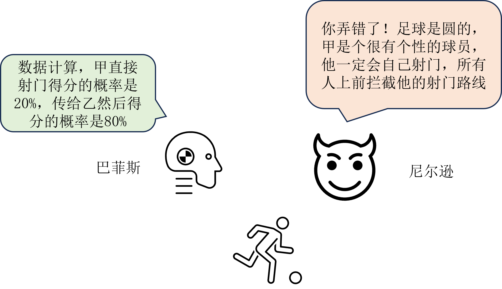
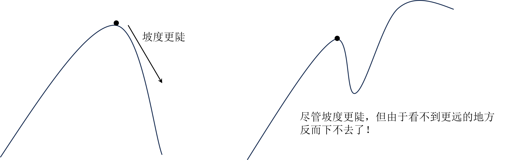
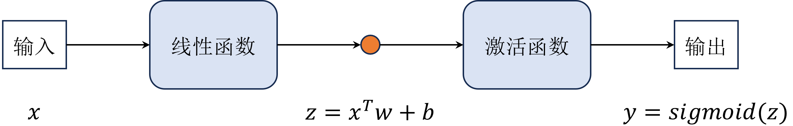
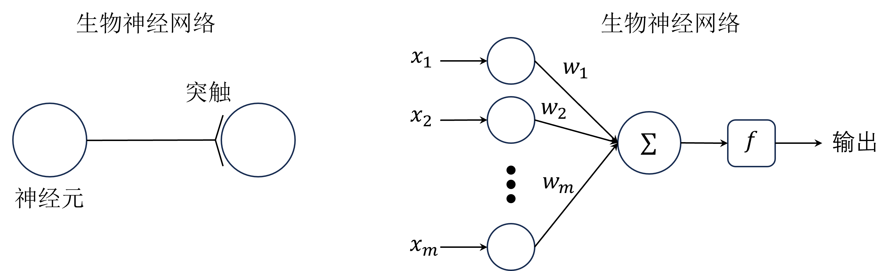

# 第 6 章 深度学习基础

在教程前面部分我们介绍了强化学习的基础内容，包含马尔可夫决策过程、预测与控制等，其中经典的预测与控制算法主要包括动态规划、蒙特卡洛方法和时序差分方法等。

这些算法在解决一些简单的强化学习问题时表现良好，但在面对高维度和复杂环境时，传统方法往往力不从心。为了解决这些问题，深度强化学习应运而生，它结合了深度学习的强大功能，使得强化学习能够处理更复杂的任务。

## 价值函数表格

在强化学习中，价值函数（如状态价值函数 $V(s)$ 和动作价值函数 $Q(s,a)$）是评估状态或状态-动作对好坏的关键工具，怎么表示这些函数是强化学习中的一个重要问题。

对于小规模的问题，例如前面章节中介绍的网格世界（$\text{Grid World}$）示例，我们可以使用表格形式来存储对应的状态或动作价值。如表 1 所示，我们可以使用一个二维表格来表示动作价值函数 $Q(s,a)$，其中行表示不同的动作 $a$，列表示不同的状态 $s$。表格中的每个元素 $Q(s,a)$ 存储了在状态 $s$ 下采取动作 $a$ 所获得的预期回报。

<div style="text-align: center;">
  <div style="display: table; margin: 0 auto;">
    <table>
      <tr>
        <th> $\space$ </th>
        <th>$s_1$</th>
        <th>$s_2$</th>
        <th>$s_3$</th>
        <th>$s_4$</th>
      </tr>
      <tr>
        <td>$a_1$</td>
        <td>$\text{-1.9}$</td>
        <td>$\text{-1.0}$</td>
        <td>$\text{-1.0}$</td>
        <td>$\text{0.0}$</td>
      </tr>
      <tr>
        <td>$a_2$</td>
        <td>$\text{-1.3}$</td>
        <td>$\text{-0.9}$</td>
        <td>$\text{-0.7}$</td>
        <td>$\text{-0.5}$</td>
      </tr>
    </table>
  </div>
  <div>表 1 ：$\text{Q}$ 表格</div>
</div>

表格实际上是一种数学抽象形式，在程序实现上可以使用`Python`数组或者字典来表示，如代码 1 所示。


```python
import numpy as np
# 使用二维数组表示 Q 表格
# 维度为 (状态数, 动作数)，例如 Q[0, 1] 表示状态 s1 下采取动作 a2 的价值
Q_table = np.array([[-1.9, -1.0, -1.0, 0.0],
                    [-1.3, -0.9, -0.7, -0.5]])
# 使用字典表示 Q 表格
# 键为 (状态, 动作) 的元组，值为对应的动作价值，例如 Q_dict[(0, 1)] 表示状态 s1 下采取动作 a2 的价值
Q_dict = {
    (0, 0): -1.9, (0, 1): -1.0, (0, 2): -1.0, (0, 3): 0.0,
    (1, 0): -1.3, (1, 1): -0.9, (1, 2): -0.7, (1, 3): -0.5
}
# 为便于理解可以使用str元组表示状态和动作
Q_dict_str = {
    ('s_1', 'a_1'): -1.9, ('s_2', 'a_1'): -1.0,
    ('s_3', 'a_1'): -1.0, ('s_4', 'a_1'): 0.0,
    ('s_1', 'a_2'): -1.3, ('s_2', 'a_2'): -0.9,
    ('s_3', 'a_2'): -0.7, ('s_4', 'a_2'): -0.5
}
```

然而，随着问题规模的增大，状态和动作空间变得庞大甚至连续，使用表格来存储价值函数变得不可行。一方面，表格的存储内存会随着状态和动作数量的增加而指数级增长，导致计算开销过大。另一方面，表格方法无法处理连续状态或动作空间，因为无法为每一个可能的状态-动作对分配一个独立的表格项。

## 函数近似表示

为了解决上述问题，我们可以使用函数近似的方法来表示价值函数。函数近似通过参数化的函数（如线性函数、神经网络等）来估计价值函数，从而避免了存储整个表格的需求。

在深度学习出现之前，线性函数是常用的函数近似方法。线性函数通过将状态和动作映射到一个特征空间，并使用线性组合来估计价值函数。例如，动作价值函数 $Q(s,a)$ 可以表示式 $\eqref{eq:1}$ 。

$$
\begin{equation}\label{eq:1}
Q(s,a; \boldsymbol{\theta}) = \boldsymbol{\theta}^T \boldsymbol{\phi}(s,a)
\end{equation}
$$

其中 $Q(s,a; \boldsymbol{\theta})$ 有时也协作 $Q_{\boldsymbol{\theta}}(s,a)$，$\boldsymbol{\phi}(s,a)$ 是状态-动作对的特征向量，$\boldsymbol{\theta}$ 是参数向量。通过调整参数 $\boldsymbol{\theta}$，我们可以使得函数近似更好地拟合实际的价值函数。

但是，线性函数在处理复杂的非线性关系时表现有限，参数调整也较为困难，这限制了其在复杂强化学习任务中的应用。

除了线性函数，其他传统的函数近似方法还包括决策树、支持向量机等，这些方法在某些特定任务中也有一定的应用价值，具体总结如表 2 所示。

<div style="text-align: center;">
    <figcaption style="font-size: 14px;"> <b>表 1 ：典型函数近似方法总结</b> </figcaption>
</div>

|       方法类型       |                      核心思想                      | 表达能力 |           优缺点           |                  示例算法                  |
| :------------------: | :------------------------------------------------: | :------: | :------------------------: | :----------------------------------------: |
|       线性近似       | $V(s) = \boldsymbol{\theta}^T\boldsymbol{\phi}(s)$ |    弱    |    高效但不能表达非线性    |     $\text{Linear TD}$, $\text{LSTD}$      |
|  $\text{RBF}$ 网络   |                   高斯核函数组合                   |   中等   | 可表示局部非线性，计算较重 |               $\text{RBF-Q}$               |
| 决策树/$\text{GBDT}$ |                  树状划分状态空间                  |   中高   |   可解释、难与在线RL结合   |        $\text{Fitted Q-Iteration}$         |
|     局部加权回归     |                  局部样本加权平均                  |   中高   |    局部准确，全局难泛化    |               $\text{LWPR}$                |
| $\text{Tile Coding}$ |                   分层网格离散化                   |    中    |     稀疏更新，高维困难     | $\text{Sarsa}(\lambda)\: \text{with Tile}$ |
|       神经网络       |                   层级非线性映射                   |   很强   | 表达力最强，但有时也不稳定 |  $\text{DQN}$, $\text{PPO}$, $\text{SAC}$  |

从表中可以看出，神经网络在表达能力上最强，能够处理复杂的非线性关系，因此，现在更**常用的是神经网络作为函数近似器**，它能够捕捉复杂的非线性关系，并且通过反向传播算法进行高效的参数更新，具体内容将在下文展开讲解。

## 梯度下降

相比于表格方法，函数近似具有更好的泛化能力，但同时也引入额外的参数，因此在训练中除了考虑价值函数预测的准确性（或者说最小化预测误差）之外，还需要考虑参数的优化问题。

参数优化通常使用梯度下降（$\text{Gradient Descent}$）方法，通过计算损失函数关于参数的梯度，并沿着梯度的反方向更新参数，从而逐步逼近最优解。具体来说，假设我们有一个损失函数 $L(\boldsymbol{\theta})$，表示预测值与真实值之间的差异，那么参数更新的公式可以表示为式 $\eqref{eq:4}$ 。

$$
\begin{equation}\label{eq:4}
\boldsymbol{\theta} \leftarrow \boldsymbol{\theta} - \alpha \nabla_{\boldsymbol{\theta}} L(\boldsymbol{\theta})
\end{equation}
$$

其中 $\alpha$ 是学习率，控制参数更新的步长，$\nabla_{\boldsymbol{\theta}} L(\boldsymbol{\theta})$ 是损失函数关于参数的梯度。

在标准的梯度下降基础上，一些改进的优化算法，如随机梯度下降（$\text{SGD}$）、动量法（$\text{Momentum}$）、自适应学习率方法（如 $\text{Adam}$）等，这些方法在实际应用中能够提高收敛速度和稳定性。

除了梯度下降方法之外，还有其他优化方法，如牛顿法、拟牛顿法等，**这些方法通过利用二阶导数信息来加速收敛，但计算复杂度较高，通常在大规模强化学习中不常用**，具体总结如表 3 所示。

<div style="text-align: center;">
    <figcaption style="font-size: 14px;"> <b>表 2 ：典型参数优化方法总结</b> </figcaption>
</div>

|      方法类型       |                      核心思想                      |           优点           |           缺点           |              **常见算法**              |
| :-----------------: | :------------------------------------------------: | :------------------------: | ---------------------------------- | ---------------------------------- |
|    梯度下降    |   按误差方向更新参数   |   简单、通用   | 收敛慢、需调学习率 | $\text{TD}(\lambda)$, $\text{SARSA}$  |
|   最小二乘法   |     一次性解析求解     |    快速收敛    | 不适合在线         | $\text{Monte Carlo Fit}$              |
| $\text{LSTD}$  | $\text{TD}$ + 最小二乘 | 稳定、无学习率 | 需计算矩阵逆       | $\text{LSTD}(\lambda)$, $\text{LSPI}$ |
|  $\text{RLS}$  |    在线更新最小二乘    |    快、稳定    | 计算略复杂         | $\text{Adaptive TD}$                  |
|    共轭梯度    |     近似解线性系统     |  快、节省内存  | 需矩阵操作         | $\text{LSTD-CG}$                      |
|     岭回归     |    带正则的最小二乘    |    稳定性高    | λ需调              | $\text{L2-TD}$                        |
| 贝叶斯线性回归 |      估计参数分布      |  不确定性估计  | 计算复杂           | $\text{Bayesian TD}$                  |


```python
import numpy as np
import pandas as pd
import random

# ----- MDP setup -----
gamma = 0.9
states = [f"s{i}" for i in range(1, 10)]
terminal = "s9"
coords = {
    "s1": (0,0), "s2": (0,1), "s3": (0,2),
    "s4": (1,0), "s5": (1,1), "s6": (1,2),
    "s7": (2,0), "s8": (2,1), "s9": (2,2),
}

def legal_actions(s):
    r,c = coords[s]
    acts = []
    if c < 2: acts.append("right")
    if r < 2: acts.append("down")
    return acts

def step(s, a):
    r,c = coords[s]
    if a == "right": r2,c2 = r, c+1
    else:            r2,c2 = r+1, c
    # next state
    s2 = next(k for k,v in coords.items() if v==(r2,c2))
    reward = -1.0
    if s2=="s4": reward -= 3.0      # pit
    if s2=="s5": reward -= 0.5      # puddle
    if s2=="s9": reward += 1.0      # terminal bonus -> net 0
    done = (s2==terminal)
    return s2, reward, done

def random_policy(s):
    return random.choice(legal_actions(s))

# ----- feature map -----
def phi(s):
    r, c = coords[s]
    rn, cn = r/2.0, c/2.0
    is_pit = 1.0 if s=="s4" else 0.0
    is_puddle = 1.0 if s=="s5" else 0.0
    return np.array([1.0, rn, cn, rn*cn, rn*rn, cn*cn, is_pit, is_puddle], dtype=float)

# ----- semi-gradient TD(0) -----
def td0_linear_value(episodes=20000, alpha=0.05, gamma=0.9):
    w = np.zeros(len(phi("s1")), dtype=float)
    for _ in range(episodes):
        s = "s1"
        while s != terminal:
            a = random_policy(s)
            s2, r, done = step(s, a)
            v_s  = float(w @ phi(s))
            v_s2 = 0.0 if done else float(w @ phi(s2))
            td_error = r + gamma*v_s2 - v_s
            w += alpha * td_error * phi(s)
            s = s2
    return w

w = td0_linear_value()

def V_hat(s): return float(w @ phi(s)) if s!="s9" else 0.0
grid = np.array([[V_hat(f"s{r*3+c+1}") for c in range(3)] for r in range(3)])
print(pd.DataFrame(np.round(grid,3),
                   index=["row1","row2","row3"],
                   columns=["col1","col2","col3"]))
print("\nweights:", np.round(w,4))
```

## 神经网络近似

随着深度学习的发展，神经网络成为了更强大的函数近似工具。神经网络通过多层非线性变换，能够捕捉复杂的模式和关系，从而更准确地估计价值函数，如式 $\eqref{eq:2}$ 所示。

$$
\begin{equation}\label{eq:2}
Q_{\boldsymbol{\theta}}(s,a) = \text{NN}(s,a; \boldsymbol{\theta})
\end{equation}
$$

神经网络的输入类型可以是一维向量（线性特征），也可以是二维矩阵（图像特征），甚至是更高维度的数据（如视频），输出则一般是单个值（如某个状态的价值）或者一维向量（某个状态下各个动作的价值）。

### 独热编码

对于离散的状态输入，直接使用整数表示例如用 $1, 2, 3, \cdots$ 来分别表示状态 $s_1, s_2, s_3, \cdots$，可能会导致神经网络难以学习到有效的特征。因为这些状态之间并没有实际的数值关系，更多的是不同的类别或标签，直接使用整数表示可能会导致神经网络难以学习到有效的特征。

因此，我们通常使用独热编码（$\text{One-Hot Encoding}$）来表示离散状态。独热编码将每个离散状态映射为一个高维向量，其中只有对应状态的位置为 $1$，其他位置为 $0$。例如，假设有四个离散状态 $s_1, s_2, s_3, s_4$，它们的独热编码表示如式 $\eqref{eq:3}$ 所示。

$$
\begin{equation}\label{eq:3}
\begin{aligned}
s_1 & : [1, 0, 0, 0] \\
s_2 & : [0, 1, 0, 0] \\
s_3 & : [0, 0, 1, 0] \\
s_4 & : [0, 0, 0, 1] \\
\end{aligned}
\end{equation}
$$

使用独热编码后，神经网络可以更好地学习到不同状态之间的区别，从而提高价值函数的估计精度。此外，如果状态空间较大，独热编码会导致输入向量维度过高，这时可以考虑使用嵌入层（$\text{embedding layer}$）来降低维度，从而提高计算效率，具体内容将在后续展开讲解。

### Q 网络


## 6.1 强化学习与深度学习的关系

之前我们讲到了强化学习的问题可以拆分成两类问题，即预测和控制。预测的主要目的是根据环境的状态和动作来预测状态价值和动作价值，而控制的主要目的是根据状态价值和动作价值来选择动作。换句话说，预测主要是告诉我们当前状态下采取什么动作比较好，而控制则是按照某种方式决策。就好比军师与主公的关系，军师提供他认为最佳的策略，而主公则决定是否采纳这个策略。


不知道读者们是否看过《超智能足球》这部热血动漫，老实讲它是笔者看过比较好的带有高科技元素的足球动漫，主要讲述的是主角团带领着他们的超智能足球机器人组队打入世界大赛的故事，也是启引笔者选择强化学习的初衷之一。

如图 $\text{6-1}$ 所示，其中有一队叫做英国三狮，主要领队是尼尔逊和巴菲斯，巴菲斯是一个超级数据分析专家，他能在各种场景下计算对手传球、射门的概率，也包括我方进球和传球的各种收益，然后尼尔逊会根据他的数据分析结果来决定下一步行动。尼尔逊也是一个非常有头脑的领队，他不会只依靠巴菲斯的计算结果，而是会结合自身的经验和对足球的直觉来做出数据之外的决策。这个数据之外的决策在强化学习中叫做探索，也就是说尼尔逊会根据巴菲斯的计算结果来做出决策，但是他也会根据自己的经验和直觉来做出一些不确定的决策，这样才能保证他的队伍不会被对手轻易的猜到。

<div align=center>

</div>
<div align=center>图 $\text{6-1}$ 预测与控制示例</div>

以上就是预测和控制的关系，通常在强化学习中预测和控制的部分看起来是共用一个 $Q$ 表或者神经网络的，因此读者们可能会因为主要关注价值函数的估计而忽视掉控制这层关系，控制通常在采样动作的过程中体现出来。其实在前面也提到过，预测也相当于人的眼睛和大脑的视觉神经处理部分，而控制相当于大脑的决策神经处理部分，看似是两个独立的部分，但实际上是相互依赖的，预测的结果会影响到控制的决策，而控制的决策也会影响到预测的结果。

讲到这里，读者应该不难理解，深度学习就是用来提高强化学习中预测的效果的，因为深度学习本身就是一个目前预测和分类效果俱佳的工具。比如 $\text{Q-learning}$ 的 $Q$ 表就完全可以用神经网络来拟合。注意，深度学习只是一种非常广泛的应用，但并不是强化学习的必要条件，也可以是一些传统的预测模型，例如决策树、贝叶斯模型等等，因此读者在研究相关问题时需要充分打开思路。类似地，在控制问题中，也可以利用深度学习或者其他的方法来提高性能，例如结合进化算法来提高强化学习的探索能力。

从训练模式上来看，深度学习和强化学习，尤其是结合了深度学习的深度强化学习，都是基于**大量的样本**来对相应算法进行迭代更新并且达到最优的，这个过程我们称之为**训练**。但与另外两者不同的是，强化学习是在交互中产生样本的，是一个产生样本、算法更新、再次产生样本、再次算法更新的动态循环训练过程，而不是一个准备样本、算法更新的静态训练过程。

这本质上还是跟要解决的问题不同有关，强化学习解决的是序列决策问题，而深度学习解决的是“打标签”问题，即给定一张图片，我们需要判断这张图片是猫还是狗，这里的猫和狗就是标签，当然也可以让算法自动打标签，这就是监督学习与无监督学习的区别。而强化学习解决的是“打分数”问题，即给定一个状态，我们需要判断这个状态是好还是坏，这里的好和坏就是分数。当然，这只是一个比喻，实际上强化学习也可以解决“打标签”问题，只不过这个标签是一个连续的值，而不是离散的值，比如我们可以给定一张图片，然后判断这张图片的美观程度，这里的美观程度就是一个连续的值，而不是离散的值。

如图 $\text{6-2}$ 所示，除了训练生成模型之外，强化学习相当于在深度学习的基础上增加了一条回路，即继续与环境交互产生样本。相信学过控制系统的读者很快会意识到，这个回路就是一个典型的反馈系统机制，模型的输出一开始并不能达到预期的值，因此通过动态地不断与环境交互来产生一些反馈信息，从而训练出一个更好的模型。

<div align=center>

</div>
<div align=center>图 $\text{6-2}$ 深度学习与强化学习示例</div>


## 6.2 线性回归

本节开始总结归纳强化学习用到的一些深度学习模型，首先是线性模型。严格来说，线性模型并不是深度学习模型，而是传统的机器学习模型，但它是深度学习模型的基础，在深度学习中相当于单层的神经网络。在线性模型中，应用较为广泛的两个基础模型就是线性回归和逻辑回归，通常分别用于解决回归和分类问题，尽管后者也可以用来解决回归问题。

以典型的房价预测问题为例，假设一套房子有 $m$ 个特征，例如建造年份、房子面积等，分别记为 $x_1, x_2, \cdots, x_m$，用向量表示为式 $\eqref{eq:11}$ 。

$$
\begin{equation}\label{eq:11}
\boldsymbol{x}=\left[x_1, x_2, \cdots, x_m\right]
\end{equation}
$$

那么房价 $y$ 可以表示为式 $\text{(6.2)}$。

$$
\tag{6.2}
f(\boldsymbol{x} ; \boldsymbol{w}, b) = w_1 x_1+w_2 x_2+\cdots+w_m x_m+b = \boldsymbol{w}^T \boldsymbol{x}+b
$$

其中 $\boldsymbol{w}$ 和 $b$ 是模型的参数，$f(\boldsymbol{x} ; \boldsymbol{w}, b)$ 是模型的输出，也就是我们要预测的房价。出于简化考虑，通常我们会用一个符号 $\boldsymbol{\theta}$ 来表示 $\boldsymbol{w}$ 和 $b$，如式 $\text{(6.3)}$ 所示。

$$
\tag{6.3}
f^{\theta}(\boldsymbol{x}) = \boldsymbol{\theta}^T \boldsymbol{x}
$$

在这类问题中，这样的关系可以用模型来表述，我们的目标是求得一组最优的参数 $\boldsymbol{\theta^{*}}$ ，使得该模型尽可能地能够根据房屋的 $m$ 个特征准确预测对应的房价。这类问题也叫做拟合问题，比如我们可以用一条直线来拟合一组散点，这条直线代表的就是模型。用来拟合最优参数的这些散点或者说数据称作样本，实际应用中由于需要拟合的模型是未知且复杂的，不可能用一个简单的函数来表示，因此需要大量的样本来训练模型，这些样本也就是训练集。

另外注意，这里是近似求解，因为几乎不可能找到一种模型能够完美拟合所有的样本，即找到最优解，甚至这个最优解不一定存在。因此，这类问题也普遍存在过拟合和欠拟合的问题，欠拟合指的是模型在训练集上表现就很差（可能在测试集中表现还行），而过拟合则是指在训练集上表现很好，但在测试集上表现很差。这两种情况都是不理想的，本质上都是陷入了局部最优解的问题，因此我们有时候需要一些方法来解决这个问题，比如正则化、数据增强等。

## 6.3 梯度下降

回到问题本身，这类问题的解决方法也有很多种，例如最小二乘法、牛顿法等，但目前最流行的方法还是梯度下降。其基本思想如下。

* 初始化参数：选择一个初始点或参数的初始值。
* 计算梯度：在当前点计算函数的梯度，即函数关于各参数的偏导数。梯度指向函数值增加最快的方向。
* 更新参数：按照负梯度方向更新参数，这样可以减少函数值。这个过程在神经网络中一般是以反向传播算法来实现的。
* 重复上述二三步骤，直到梯度趋近于 0 或者达到一定迭代次数。

梯度下降本质上是一种基于贪心思想的方法,它的泛化能力很强，能够基于任何**可导的函数**求解最优解。如图 $\text{6-3}$ 所示，假设我们要找到一个山谷中的最低点，也就是下山，那么我们可以从任意一点出发，然后沿着最陡峭的方向向下走，这样就能够找到山谷中的最低点。这里的最陡峭的方向就是梯度方向，而沿着这个方向走的步长就是学习率，这个学习率一般是一个超参数，需要我们自己来设定。

一般情况下，我们会将学习率设定为一个较小的值，这样可以保证我们不会错过最低点，但是如果学习率过小，那么我们就需要更多的迭代次数才能够达到最低点。每次梯度下降的迭代过程中，我们都会选取一个小批量的样本来计算梯度，这个小批量的样本称为一个 $\text{batch}$ 。这个批量相当于下山过程中我们看到的视野，如果批量太小的话，由于看不到更远的地方，我们就很容易被一些局部的山峰所迷惑，即陷入局部最优解。但是如果批量太大的话，那么我们就需要更多的计算资源。因此，我们需要根据实际情况来选择一个合适的 $\text{batch}$ 大小。

<div align=center>

</div>
<div align=center>图 $\text{6-3}$ 梯度下降示例</div>

除了调整学习率和批量大小之外，我们还可以对梯度下降的机制进行一些处理，比如加入动量、$\text{Adam}$ 等，这类工具我们一般称之为优化器（ $\text{optimizer}$ ）。动量法的基本思想是在梯度下降的过程中，不仅仅考虑当前的梯度，还要考虑之前的梯度，这样可以加快梯度下降的速度，同时也可以减少梯度下降过程中的震荡。

$\text{Adam}$ 是一种自适应的优化算法，它不仅仅考虑了当前的梯度，还考虑了之前的梯度的平方，这样可以更加准确地估计梯度的方向，从而加快梯度下降的速度，也是目前最流行的优化器之一。注意在做强化学习应用或研究的时候，我们并不需要太纠结于优化器的选择，因为这些优化器的效果并没有太大的差别，而且我们也不需要去了解它们的具体原理，只需要知道它们的大致作用就可以了。

此外，从训练中样本选择的方式来看，梯度下降可以分为单纯的梯度下降和随机梯度下降（ $\text{stochastic gradient descent, SGD}$ ）。前者是按照样本原本的顺序不断迭代去拟合模型参数，后者则是随机抽取样本，这样做的好处就是利用随机性可能帮助算法跳出一些局部最优解，从而使得算法的收敛性更高，增强鲁棒性。从批的大小来看，又可以分为批量梯度下降和小批量梯度下降（ $\text{mini-batch gradient descent}$ ），前者每次使用整个训练样本来迭代，也就是 $\text{batch}$ 很大，这样做的好处是每次迭代的方向比较准确，但是计算开销比较大。

后者每则次使用一小部分样本来迭代，也就是 $\text{batch}$ 很小，这样做的好处是计算开销比较小，但是每次迭代的方向比较不准确。综合来看，我们通常使用小批量的随机梯度下降 $\text{mini-batch stochastic gradient descent}$，这样可以兼顾到所有的优点，从而使得训练更加稳定，算法效果也会更好。

## 6.4 逻辑回归

简单介绍完梯度下降之后，我们就可以继续介绍一些模型了，现在是逻辑回归。注意，虽然逻辑回归名字中带有回归，但是它是用来解决分类问题的，而不是回归问题（即预测问题）。在分类问题中，我们的目标是预测样本的类别，而不是预测一个连续的值。例如，我们要预测一封邮件是否是垃圾邮件，这就是一个二分类问题，通常输出 $0$ 和 $1$ 等离散的数字来表示对应的类别。在形式上，逻辑回归和线性回归非常相似，如图 $\text{6-4}$ 所示，就是在线性模型的后面增加一个 $\text{sigmoid}$ 函数，我们一般称之为激活函数。

<div align=center>

</div>
<div align=center>图 $\text{6-4}$ 逻辑回归结构</div>

$\text{sigmoid}$ 函数定义为式 $\text{(6.4)}$。

$$
\tag{6.4}
sigmoid(z) = \frac{1}{1+exp(-z)}
$$

如图 $\text{6-5}$ 所示，$\text{sigmoid}$ 函数可以将输入的任意实数映射到 $(0,1)$ 的区间内，对其输出的值进行判断，例如小于 $0.5$ 我们认为预测的是类别 $0$，反之是类别 $1$ ，这样一来通过梯度下降来求解模型参数就可以用于实现二分类问题了。注意，虽然逻辑回归只是在线性回归模型基础上增加了一个激活函数，但两个模型是完全不同的，包括损失函数等等。线性回归的损失函数是均方差损失，而逻辑回归模型一般是交叉熵损失，这两种损失函数在深度学习和深度强化学习中都很常见。

<div align=center>

</div>
<div align=center>图 $\text{6-5}$ $\text{sigmoid}$ 函数图像</div>

逻辑回归的主要优点在于增加了模型的非线性能力，同时模型的参数也比较容易求解，但是它也有一些缺点，例如它的非线性能力还是比较弱的，而且它只能解决二分类问题，不能解决多分类问题。在实际应用中，我们一般会将多个二分类问题组合成一个多分类问题，例如将 $\text{sigmoid}$ 函数换成 $\text{softmax}$ 回归函数等。

其实，逻辑回归的模型结构已经跟生物神经网络的最小单位神经元很相似了。如图 $\text{6-6}$ 所示，我们知道神经元之间是通过生物电信号来传递信息的，在每个神经元的末端会有一个叫做突触的结构，会根据信号的不同来激活不同的受体并传递给下一个神经元。当然，每个神经元也会同时接收来自不同神经元的信号并通过细胞核处理，人工神经网络中这个处理过程就相当于线性加权处理，即 $\boldsymbol{w}^T \boldsymbol{x}$, 然后通过激活函数来判断是否激活。


<div align=center>

</div>
<div align=center>图 $\text{6-6}$ 生物神经网络与人工神经网络的对比</div>

同时，逻辑回归这类模型的结构也比较灵活多变，可以通过横向堆叠的形式来增加模型的复杂度，例如增加隐藏层等，这样就能解决更复杂的问题，这就是接下来要讲的神经网络模型。并且，我们可以认为逻辑回归就是一个最简单的人工神经网络模型。

## 6.5 全连接网络

如图 $\text{6-7}$ 所示，将线性层横向堆叠起来，前一层网络的所有神经元的输出都会输入到下一层的所有神经元中，这样就可以得到一个全连接网络。其中，每个线性层的输出都会经过一个激活函数（图中已略去），这样就可以增加模型的非线性能力。

<div align=center>

</div>
<div align=center>图 $\text{6-7}$ 全连接网络</div>

我们把这样的网络叫做全连接网络（$\text{fully connected network}$），也称作多层感知机（$\text{multi-layer perceptron，MLP}$），是最基础的深度神经网络模型。把神经网络模型中前一层的输入向量记为 $\boldsymbol{x^{l-1}}\in \mathbb{R}^{d^{l-1}}$ ，其中第一层的输入也就是整个模型的输入可记为$\boldsymbol{x^0}$，每一个全连接层将前一层的输入映射到$\boldsymbol{x^{l}}\in \mathbb{R}^{d^{l}}$，也就是后一层的输入，具体定义为式 $\text{(6.5)}$。

$$
\tag{6.5}
\boldsymbol{x}^{l}=\sigma(\boldsymbol{z}), \quad \boldsymbol{z}=\boldsymbol{W} \boldsymbol{x^{l-1}}+\boldsymbol{b} = \boldsymbol{\theta} \boldsymbol{x^{l-1}}
$$

其中 $\boldsymbol{W}\in \mathbb{R}^{d^{l-1} \times d^{l}}$ 是权重矩阵，$\boldsymbol{b}$ 为偏置矩阵，与线性模型类似，这两个参数我们通常看作一个参数 $\boldsymbol{\theta}$。$\sigma(\cdot)$ 是激活函数，除了 $\text{sigmoid}$ 函数之外，还包括 $\text{softmax}$ 函数、$\text{ReLU}$ 函数和 $\text{tanh}$ 函数等等激活函数。其中最常用的是 $\text{ReLU}$ 函数 和 $\text{tanh}$ 函数，前者将神经元也就是线性函数的输出映射到 $(0,1)$ 之间，后者则映射到$-1$到$1$之间。

前面讲到，在强化学习中我们会用神经网络来近似动作价值函数，动作价值函数的输入是状态，输出是各个动作对应的价值，在有些连续动作问题中比如汽车方向盘转动角度是$-90$度到$90$度之间，这种情况下使用 $\text{tanh}$ 激活函数能够使得神经网络负值以便于更好地近似状态动作函数。顺便提一句，这里还有一种做法是我们可以把动作空间映射到正值的范围，例如$(0,180)$区间，这样一来对应的神经网络模型激活函数使用 $\text{ReLU}$ 函数会更好些。总而言之，激活函数的选择需要根据具体的问题来定，没有一种激活函数适用于所有的问题。

在了解到神经网络前后层的关系之后，我们就可以表示一个 $l$ 层的神经网络模型，如式 $\text{(6.6)}$ 所示。
$$
\tag{6.6}
\begin{split}
    第 1 层: \quad \boldsymbol{x}^{(1)}=\sigma_1\left(\boldsymbol{W}^{(1)} \boldsymbol{x}^{(0)}+\boldsymbol{b}^{(1)}\right),\\
    第 2 层: \quad \boldsymbol{x}^{(2)}=\sigma_2\left(\boldsymbol{W}^{(2)} \boldsymbol{x}^{(1)}+\boldsymbol{b}^{(2)}\right),\\
    \vdots \quad \vdots\\
    第 l 层: \quad \boldsymbol{x}^{(l)}=\sigma_l\left(\boldsymbol{W}^{(l)} \boldsymbol{x}^{(l-1)}+\boldsymbol{b}^{(l)}\right)\\
\end{split}
$$

从上面的式子可以看出，神经网络模型的参数包括每一层的权重矩阵和偏置矩阵，也就是 $\boldsymbol{\theta}=\{\boldsymbol{W}^{(1)},\boldsymbol{b}^{(1)},\boldsymbol{W}^{(2)},\boldsymbol{b}^{(2)},\cdots,\boldsymbol{W}^{(l)},\boldsymbol{b}^{(l)}\}$，这些参数都是需要我们去学习的，也就是说我们需要找到一组参数使得神经网络模型的输出尽可能地接近真实值，这个过程就是神经网络的训练过程。同基础的线性模型类似，神经网络也可以通过梯度下降的方法来求解最优参数。

## 6.6 更高级的神经网络

通常来说，基于线性模型的神经网络已经足够适用于大部分的强化学习问题。但是对于一些更复杂更特殊的问题，我们可能需要更高级的神经网络模型来解决。这些高级的神经网络理论上能够取得更好的效果，但从实践上来看，这些模型在强化学习上的应用并不是很多，因为这些模型的训练过程往往比较复杂，需要调整的参数也比较多，而且这些模型的效果并不一定比基础的神经网络模型好很多。

因此，读者在解决实际的强化学习问题时还是尽量简化问题，并使用基础的神经网络模型来解决。在这里我们只是简要介绍一些常用的高级神经网络模型，感兴趣的读者可以自行深入了解。

### 6.6.1 卷积神经网络

卷积神经网络（$\text{convolutional neural network，CNN}$）适用于处理具有网格结构的数据，如图像（$\text{2D}$网格像素点）或时间序列数据（$\text{1D}$网格）等，其中图像是用得最为广泛的。比如在很多的游戏场景中，其状态输入都是以图像的形式呈现的，并且图像能够包含更多的信息，这个时候我们就可以使用卷积神经网络来处理这些图像数据。在使用卷积神经网络的时候，我们需要注意以下几个主要特点：

* 局部感受野：传统的线性神经网络每个节点都与前一层的所有节点相连接。但在CNN中，我们使用小的局部感受野（例如3x3或5x5的尺寸），它只与前一层的一个小区域内的节点相连接。这可以减少参数数量，并使得网络能够专注于捕捉局部特征。
* 权重共享：在同一层的不同位置，卷积核的权重是共享的，这不仅大大减少了参数数量，还能帮助网络在图像的不同位置检测同样的特征。
* 池化层：池化层常常被插入在连续的卷积层之间，用来减少特征图的尺寸、减少参数数量并提高网络的计算效率。最常见的池化操作是最大池化（ $\text{Max-Pooling}$ ），它将输入特征图划分为若干个小区域，并输出每个区域的最大值。
* 归一化和 $\text{Dropout}$ ：为了优化网络的性能和防止过拟合，可以在网络中添加归一化层（如 $\text{Batch Normalization}$ ）和 $\text{Dropout}$ 。

### 6.6.2 循环神经网络

循环神经网络（$\text{recurrent neural network，RNN}$）适用于处理序列数据，也是最基础的一类时序网络。在强化学习中，循环神经网络常常被用来处理序列化的状态数据，例如在 $\text{Atari}$ 游戏中，我们可以将连续的四帧图像作为一个序列输入到循环神经网络中，这样一来就能够更好地捕捉到游戏中的动态信息。但是基础的 $\text{RNN}$ 结构很容易产生梯度消失或者梯度爆炸的问题，因此我们通常会使用一些改进的循环神经网络结构，例如 $\text{LSTM}$ 和 $\text{GRU}$ 等。$\text{LSTM}$ 主要是通过引入门机制（输入门、遗忘门和输出门）来解决梯度消失的问题，它能够在长序列中维护更长的依赖关系。而 $\text{GRU}$ 则是对 $\text{LSTM}$ 的简化，它只有两个门（更新门和重置门），并且将记忆单元和隐藏状态合并为一个状态向量，性能与 $\text{LSTM}$ 相当，但通常计算效率更高。

还有一种特殊的结构，叫做 $\text{Transformer}$。虽然它也是为了处理序列数据而设计的，但是是一个完全不同的结构，不再依赖循环来处理序列，而是使用自注意机制 ($\text{self-attention mechanism}$) 来同时考虑序列中的所有元素。并且 $\text{Transformer}$ 的设计特别适合并行计算，使得训练速度更快。自从被提出以后，$\text{Transformer}$ 就被广泛应用于自然语言处理领域，例如 $\text{BERT}$ 以及现在特别流行的 $\text{GPT}$ 等模型。


## 6.7 本章小结

本章主要总结了深度学习中常见的一些网络结构，以及梯度下降技巧，读者需要了解相关的深度学习基础，以便于向之后的深度强化学习章节过渡。

## 6.8 练习题

1. 逻辑回归与神经网络之间有什么联系？
2. 全连接网络、卷积神经网络、循环神经网络分别适用于什么场景？
3. 循环神经网络在反向传播时会比全连接网络慢吗？为什么？