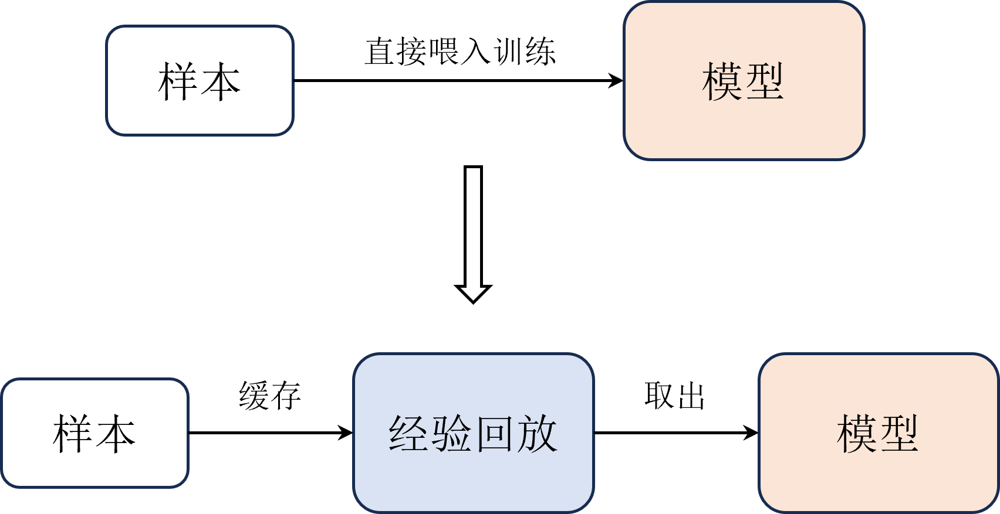
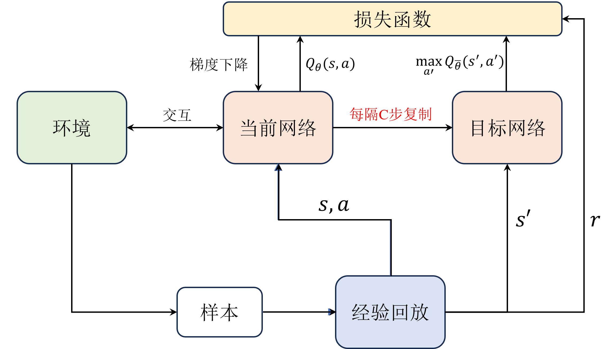
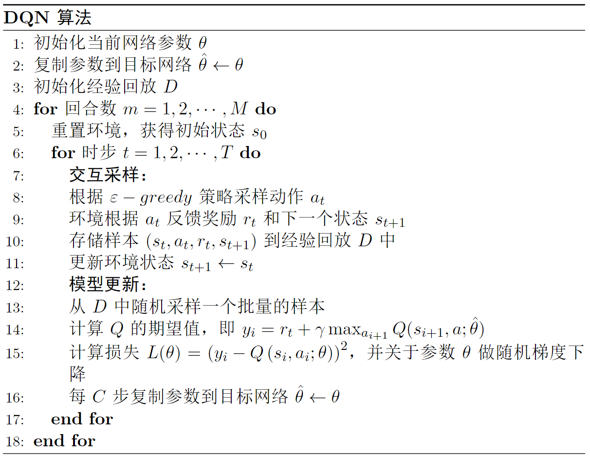

# DQN 算法

$\text{DQN}$ 算法的核心思想是在 $\text{Q-learning}$ 算法的基础上引入深度神经网络来近似动作价值函数 $Q(\boldsymbol{s},\boldsymbol{a})$，从而能够处理高维的状态空间。此外，$\text{DQN}$ 算法还引入了一些技巧，如经验回放和目标网络等，来提高训练的稳定性和效果。

## Q 网络

在深度学习基础章节中，我们演示了如何使用神经网络来近似状态价值函数 $V(\boldsymbol{s})$ 并使用梯度下降和 $\text{TD}$ 误差来更新网络参数。类似地，我们也可以使用神经网络来近似动作价值函数 $Q(\boldsymbol{s},\boldsymbol{a})$，回顾 $\text{Q-learning}$ 算法的更新公式，如式 $eqref{eq:ql_update}$ 所示。

$$
\begin{equation}\label{eq:ql_update}
Q(s_t,a_t) \leftarrow Q(s_t,a_t)+\alpha[r_t+\gamma\max _{a}Q^{\prime}(s_{t+1},a)-Q(s_t,a_t)]
\end{equation}
$$

其中 $y_t = r_t+\gamma\max _{a}Q^{\prime}(s_{t+1},a)$ 表示期望或目标的 $Q$ 值，$Q(s_t,a_t)$ 表示实际的 $Q$ 值，$\alpha$ 是学习率。引入神经网络近似 $Q$ 函数后，如式 $eqref{eq:dqn_update}$ 所示。

$$
\begin{equation}\label{eq:dqn_update}
Q_{\theta}(s_t,a_t) \leftarrow Q_{\theta}(s_t,a_t)+\alpha[y_t-Q_{\theta}(s_t,a_t)]
\end{equation}
$$

其中参数 $\theta$ 是神经网络的参数，可以通过梯度下降的方式来优化。具体来说，可以以最小化 $\text{TD}$ 误差为目标，即最小化目标 $Q$ 值和实际 $Q$ 值之间的差距，如式 $\eqref{eq:dqn_loss}$ 所示。

$$
\begin{equation}\label{eq:dqn_loss}
\begin{aligned}
L(\theta) &= (y_t - Q_{\theta}(s_t,a_t))^2 \\
\theta &\leftarrow \theta - \alpha \nabla_{\theta} L(\theta)
\end{aligned}
\end{equation}
$$

注意，由于是基于 $\text{TD}$ 更新的，因此依然需要判断终止状态，如式 $\eqref{eq:dqn_target}$ 所示。

$$
\begin{equation}\label{eq:dqn_target}
y_t = \begin{cases}r_t & \text {对于终止状态} s_{t} \\ r_{t}+\gamma \max _{a^{\prime}} Q_{\theta}(s_{t+1}, a^{\prime}) & \text {对于非终止状态} s_{t}\end{cases}
\end{equation}
$$

## 经验回放

在 $\text{Q-learning}$ 算法中，我们每次执行一步交互得到一个样本之后，就立即用这个最新的样本去更新 $Q$ 函数，如式 $\eqref{eq:ql_update_sample}$ 所示。

$$
\begin{equation}\label{eq:ql_update_sample}
(s_t,a_t,s_{t+1},r_{t+1}) \rightarrow \text{update } Q(s_t,a_t)
\end{equation}
$$

这种更新方式在引入神经网络后会带来一些问题。首先，每次用单个样本去迭代网络参数很容易导致训练的不稳定，从而影响模型的收敛。其次，每次迭代的样本都是从环境中实时交互得到的，这样的样本是在时间上是连续的，即是有关联的，这与梯度下降法的数据假设不符，即**训练集中的样本必须是独立同分布的**。此外，每个样本只被使用一次就被丢弃，数据使用率较低，而在强化学习中与环境交互产生样本的成本往往较高，**较低的数据使用率会严重影响训练效率**。

为了解决这些问题，$\text{DQN}$ 算法引入了经验回放机制。具体来说，我们会将每次与环境交互得到的样本 $(s_t,a_t,s_{t+1},r_{t+1})$ 存储在一个经验回放池（ $\text{Replay Buffer}$ ）中，如式 $\eqref{eq:replay_store}$ 所示。

$$
\begin{equation}\label{eq:replay_store}
(s_t,a_t,s_{t+1},r_{t+1}) \rightarrow D
\end{equation}
$$

然后在每次更新网络参数时，我们会从经验回放池中随机抽取一个小批量的样本进行训练，如式 $\eqref{eq:replay_sample}$ 所示。

$$
\begin{equation}\label{eq:replay_sample}
D \rightarrow \{(s_i,a_i,s_{i+1},r_{i+1})\}_{i=1}^{N}
\end{equation}
$$

其中下标 $i$ 表示从经验回放池中随机抽取的样本，表示不再跟时间相关，$N$ 是小批量的样本数量。利用这些样本，我们可以计算对应的目标 $Q$ 值 $y_i$，并使用梯度下降的方法来更新网络参数 $\theta$，如式 $\eqref{eq:dqn_replay_loss}$ 所示。

$$
\begin{equation}\label{eq:dqn_replay_loss}
\begin{aligned}
L(\theta) &= \mathbb{E}_{(s_i,a_i,s_{i+1},r_{i+1}) \sim D} \left[ (y_i - Q_{\theta}(s_i,a_i))^2 \right] \\
\theta &\leftarrow \theta - \alpha \nabla_{\theta} L(\theta)
\end{aligned}
\end{equation}
$$

如图 1 所示，不同于 $\text{Q-learning}$ 算法每次用最新的样本直接喂入神经网络去更新网络模型，$\text{DQN}$ 算法会把每次与环境交互得到的样本都存储在一个经验回放中，然后每次从经验池中随机抽取一批样本来训练网络。

图 1 $\:$ 经验回放示例

## 目标网络

注意到在式 $\eqref{eq:dqn_target}$ 中，目标值 $y_t$ 的参数 $\theta$ 与 实际值即当前网络 $Q_{\theta}$ 的参数是相同的。这意味着网络要学习的目标会在每次更新时发生变化，等价于我们在追逐一个不断移动的目标，这很容易造成训练的不稳定，甚至损失发散导致无法收敛（即训练失败）。

为了解决这个问题，$\text{DQN}$ 算法引入了目标网络（ $\text{Target Network}$ ）的概念。具体来说，我们会维护一个与当前网络结构相同但参数不同的目标网络 $Q_{\bar{\theta}}$，并使用目标网络来计算目标 $Q$ 值，如式 $\eqref{eq:dqn_target_network}$ 所示。

$$
\begin{equation}\label{eq:dqn_target_network}
y_t = \begin{cases}r_t & \text {对于终止状态} s_{t} \\ r_{t}+\gamma \max _{a^{\prime}} Q_{\bar{\theta}}(s_{t+1}, a^{\prime}) & \text {对于非终止状态} s_{t}\end{cases}
\end{equation}
$$

目标网络的参数 $\bar{\theta}$ 会定期地从当前网络的参数 $\theta$ 复制过来，如式 $\eqref{eq:target_update}$ 所示。

$$
\begin{equation}\label{eq:target_update}
\bar{\theta} \leftarrow \theta \quad \text{Update every C steps}
\end{equation}
$$

其中 $C$ 是一个超参数，表示每隔多少步更新一次目标网络的参数。这样一来，目标网络的参数在会在一定时间内保持不变，从而使得目标 $Q$ 值相对稳定，避免了追逐不断移动的目标的问题，提高了训练的稳定性和收敛性，如图 2 所示。

图 2 $\:$ 目标网络示例

另外，式 $\eqref{eq:target_update}$ 中的更新方式被称为硬更新（ $\text{Hard Update}$ ），即每隔 $C$ 步直接将当前网络的参数复制给目标网络。除此之外，还有一种软更新（ $\text{Soft Update}$ ）的方式，即每次更新时将目标网络的参数向当前网络的参数靠近一点，如式 $\eqref{eq:soft_update}$ 所示。

$$
\begin{equation}\label{eq:soft_update}
\bar{\theta} \leftarrow \tau \theta + (1 - \tau) \bar{\theta}
\end{equation}
$$

其中 $\tau$ 是一个超参数，通常取值很小（如 $0.001$），表示每次更新时目标网络参数向当前网络参数靠近的比例。注意，软更新的方式在 $DQN$ 算法中并不常用，原因是硬更新已经能够很好地解决目标不稳定的问题，但在一些后续的强化学习算法例如 $\text{DDPG}$ 和 $\text{TD3}$ 中被广泛采用。

## 算法流程

$\text{DQN}$ 算法的完整流程如图 3 所示，包括初始化网络和经验回放池、与环境交互采样、存储样本到经验回放池、从经验回放池中随机采样小批量样本、计算目标 $Q$ 值和损失函数、更新网络参数以及定期更新目标网络参数等步骤，**完整的代码实现可参考实战部分的内容**。

图 3 $\:$ $\text{DQN}$ 算法流程

## 思考

**相比于 $\text{Q-learning}$ 算法，$\text{DQN}$ 算法做了哪些改进？**

答：主要包括：**引入深度神经网络**：$\text{Q-learning}$ 算法中使用的是表格法来存储动作价值函数，但对于状态空间较大的问题，表格法会变得不可行。$\text{DQN}$ 通过引入深度神经网络来近似动作价值函数，能够处理高维连续状态空间的问题。**经验回放**：传统的 $\text{Q-learning}$ 算法每次更新时只使用当前状态和动作的信息，但这种方式可能会导致样本之间的相关性和不稳定性。$\text{DQN}$ 采用经验回放机制，将所有的状态、动作、奖励、下一状态组成的经验存储在经验池中，然后从经验池中随机取样进行训练，可以缓解样本相关性和不稳定性的问题。**目标网络**：$\text{DQN}$ 还引入了目标网络来解决动作价值函数的不稳定性问题。目标网络是一个与当前神经网络结构相同的网络，但其参数被固定一段时间。在训练时，使用目标网络来计算目标Q值，从而减少当前神经网络参数对目标Q值的影响，提高训练稳定性。**奖励裁剪**：在某些情况下，奖励值可能非常大或非常小，这可能会导致训练不稳定。DQN采用奖励裁剪，将奖励值限制在一个较小的范围内，从而在一定程度上提高了训练稳定性。

**为什么要在 $\text{DQN}$ 算法中引入 $\varepsilon-\text{greedy}$ 策略？**

答：目的是为了平衡探索和利用的关系。具体来说，$\varepsilon-\text{greedy}$ 策略会以一定的概率 $\varepsilon$ 随机选择动作，以一定的概率 $1-\varepsilon$ 选择当前状态下具有最大 $Q$ 值的动作，从而在训练过程中保证一定的探索性，使得智能体能够尝试一些未知的状态和动作，从而获得更多的奖励。如果在训练过程中完全按照当前状态下的最大Q值选择动作，可能会导致智能体过于保守，无法获得更多的奖励。而如果完全随机选择动作，可能会导致智能体无法学习到更优的策略，从而影响学习效果。因此，引入 $\varepsilon-\text{greedy}$ 策略可以在探索和利用之间进行平衡，从而在训练过程中获得更好的性能。需要注意的是，$\varepsilon-\text{greedy}$ 策略中的 $\varepsilon$ 值是一个重要的超参数，需要根据具体问题进行调整。如果 $\varepsilon$ 值过小，可能会导致智能体无法充分探索环境；如果 $\varepsilon$ 值过大，可能会导致智能体无法有效地利用已有的经验。因此，需要根据具体问题进行调参。

**$\text{DQN}$ 算法为什么要多加一个目标网络**？

答：目标网络的作用是为了解决动作价值函数的不稳定性问题。目标网络是一个与当前神经网络结构相同的网络，但其参数被固定一段时间。在训练时，使用目标网络来计算目标 $Q$ 值，从而减少当前神经网络参数对目标 $Q$ 值的影响，提高训练稳定性。具体来说，当使用当前神经网络来计算目标 $Q$ 值时，当前神经网络的参数和目标 $Q$ 值的计算都是基于同一批数据的，这可能导致训练过程中出现不稳定的情况。而使用目标网络来计算目标 $Q$ 值时，目标网络的参数是固定的，不会受到当前神经网络的训练过程的影响，因此可以提高训练的稳定性。同时，目标网络的更新也是基于一定的规则进行的。在每个训练步骤中，目标网络的参数被更新为当前网络的参数的加权平均值，其权重由一个超参数$\tau$ 控制。通过这种方式，目标网络的更新过程可以更加平稳，避免了训练过程中出现剧烈的波动，从而提高了训练的效率和稳定性。因此，引入目标网络是 $\text{DQN}$ 算法的一个重要改进，可以显著提高算法的性能和稳定性。

**经验回放的作用是什么？**

答：经验回放主要作用在于缓解样本相关性和不稳定性问题，提高算法的训练效率和稳定性。**缓解样本相关性问题**：在深度强化学习中，每个样本通常都是与前几个样本高度相关的。如果直接使用当前样本进行训练，可能会导致样本之间的相关性过高，从而影响算法的训练效果。经验回放机制通过从经验池中随机取样，可以打破样本之间的相关性，提高训练的效果。**缓解不稳定性问题**：在深度强化学习中，每个样本的值函数都是基于当前神经网络的参数计算的。由于神经网络的参数在每个训练步骤中都会发生变化，因此每个样本的值函数也会随之变化。这可能会导致算法的训练过程不稳定，经验回放机制可以通过随机取样的方式，减少每个训练步骤中样本值函数的变化，从而提高训练的稳定性。