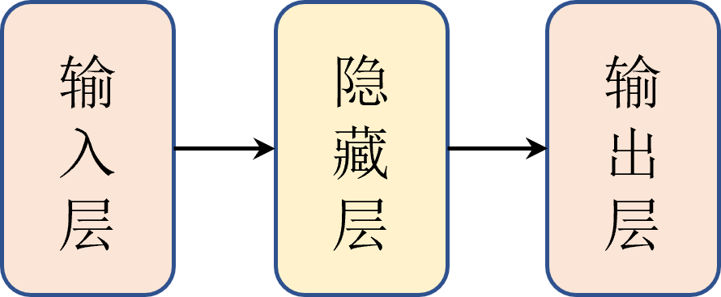
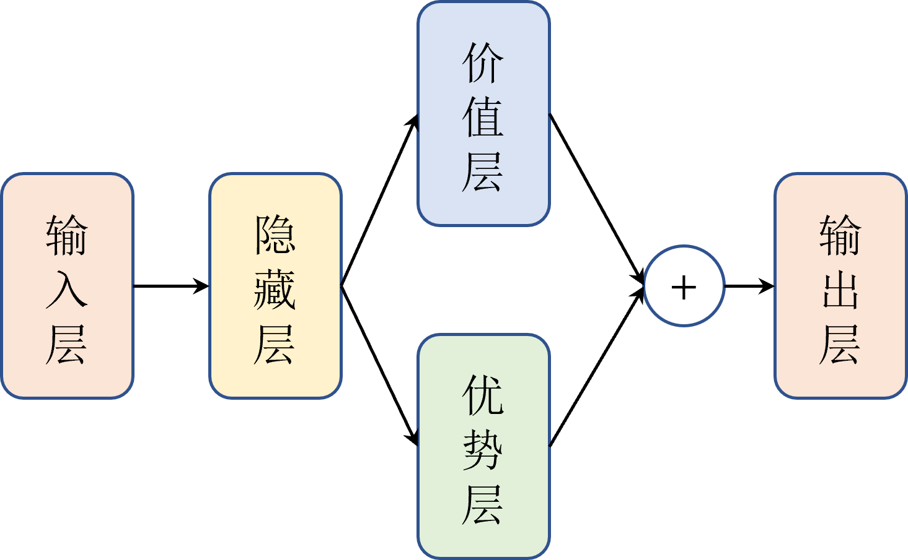
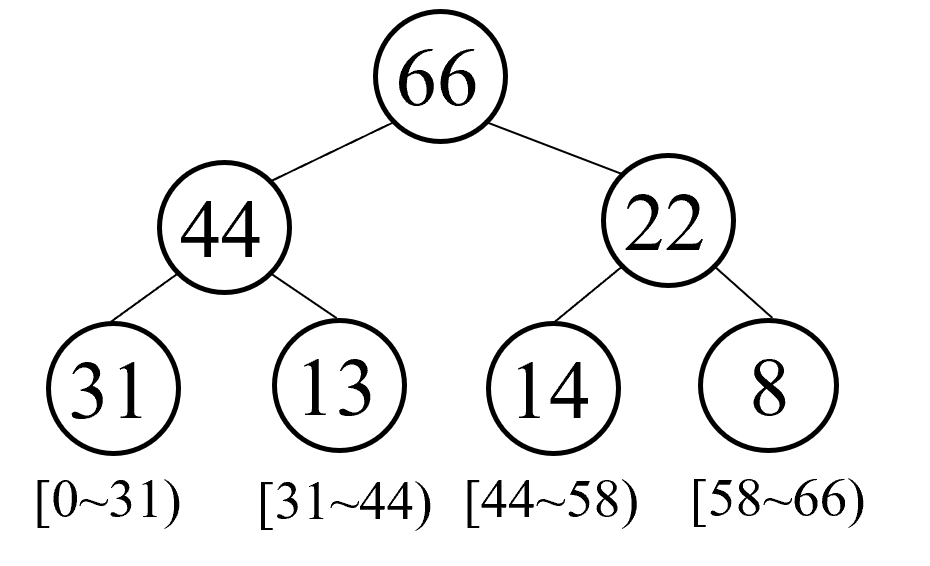

# DQN算法进阶

$\text{DQN}$ 算法虽然在很多任务中取得了不错的效果，但它仍然存在一些问题，例如 $Q$ 值的过估计、探索效率低下等。为了解决这些问题，研究人员提出了许多改进的 $\text{DQN}$ 算法。本章将介绍其中的一些重要改进方法，包括 $\text{Double DQN}$、$\text{Noisy DQN}$、$\text{Dueling DQN}$、$\text{PER DQN}$、$\text{C51}$ 以及 $\text{Rainbow DQN}$ 等。

## Double DQN 算法

回顾 $\text{DQN}$ 算法的更新公式，如式 $\eqref{eq:dqn_update}$ 所示。

$$
\begin{equation}\label{eq:dqn_update}
\begin{aligned}
Q_{\theta}(s_i,a_i) \leftarrow Q_{\theta}(s_i,a_i)+\alpha[y_i-Q_{\theta}(s_i,a_i)] \\
y_i = r_i+\gamma\max _{a^{\prime}} Q_{\theta^-}(s_{i+1}, a^{\prime})
\end{aligned}
\end{equation}
$$

注意到目标值 $y_i$ 中的最大化操作用来同时选择动作和评估价值，如果目标网络对部分动作的价值估计偏高，在选择动作时会进一步放大这种偏差，导致 $Q$ 值的过估计问题。这种过估计会影响策略的学习效果，甚至导致训练不稳定。

为了解决这个问题，$\text{Double DQN}$ 算法提出了将动作选择和动作评估分离的思路。具体来说，$\text{Double DQN}$ 使用当前网络来选择动作，而使用目标网络来评估该动作的价值，如式 $\eqref{eq:double_dqn_target}$ 所示。

$$
\begin{equation}\label{eq:double_dqn_target}
y_i = r_i+\gamma Q_{\theta^-}(s_{i+1}, \arg \max _{a} Q_{\theta}(s_{i+1}, a))
\end{equation}
$$

通过这种方式，避免了同一个网络既当“裁判”又当“选手”，从而减轻了过估计的问题。

在算法流程上，$\text{Double DQN}$ 与 $\text{DQN}$ 基本相同，只是在计算目标 $Q$ 值时采用了不同的方式，**完整的代码实现可参考实战部分的内容**。

## Dueling DQN 算法

在强化学习中的很多状态下，某些动作的选择对最终的回报影响并不大，或者说某些动作之间的回报差异并不显著，例如等红灯时由于无法前进，无论选择等待还是尝试向左或右转，最终的回报都不会有太大差别。基础的 $\text{DQN}$ 算法由于直接学习 $Q(s,a)$ 函数，可能无法有效地捕捉这种状态下动作之间的差异，从而影响学习效率和策略质量。

为了解决这个问题，$\text{Dueling DQN}$ 算法的核心思路是将 $Q$ 函数分解为两个独立的部分：状态价值函数 $V(s)$ 和优势函数 $A(s,a)$，即式 $\eqref{eq:dueling_dqn}$ 所示。

$$
\begin{equation}\label{eq:dueling_dqn}
Q(s,a) = V(s) + A(s,a)
\end{equation}
$$

其中，$V(s)$ 表示在状态 $s$ 下的整体价值，而 $A(s,a)$ 则表示在状态 $s$ 下选择动作 $a$ 相对于其他动作的优势。通过这种分解，即使某些动作的选择对回报影响不大，网络仍然可以通过 $V(s)$ 来学习状态的整体价值，从而提高学习效率。

具体如何实现呢？首先回顾一下 $\text{DQN}$ 算法中的 $Q$ 网络结构。如图 $\text{1}$ 所示，它通常是一个基础的多层感知机，接受状态作为输入，经过若干隐藏层后输出每个动作对应的 $Q$ 值，输出维度等于动作数。

图 1 $\:$ $\text{DQN}$ 网络结构

在 $\text{Dueling DQN}$ 算法中，我们对网络结构进行了修改。如图 2 所示，在输出层之前，网络被分为两个分支：一个用于计算状态价值 $V(s)$，另一个用于计算优势函数 $A(s,a)$，并且网络的前几层依然是是共享的。这样，网络可以同时学习状态的整体价值和各个动作的优势，从而更好地捕捉状态下动作之间的差异。

图 2 $\:$ $\text{Dueling DQN}$ 网络结构

相应地，式 $\eqref{eq:dueling_dqn}$ 可以改写为式 $\eqref{eq:dueling_dqn_network}$ 。

$$
\begin{equation}\label{eq:dueling_dqn_network}
Q_{\theta,\alpha,\beta}(\boldsymbol{s},\boldsymbol{a}) = A_{\theta,\alpha}(\boldsymbol{s},\boldsymbol{a}) + V_{\theta,\beta}(\boldsymbol{s})
\end{equation}
$$

其中，$A_{\theta,\alpha}(\boldsymbol{s},\boldsymbol{a})$ 表示优势层的输出，$V_{\theta,\beta}(\boldsymbol{s})$ 表示价值层的输出，$\theta$ 表示共享隐藏层的参数，$\alpha$ 和 $\beta$ 分别表示优势层和价值层的参数。

此外，为了解决不可识别性（$\text{identifiability}$）问题，$\text{Dueling DQN}$ 通常会对优势函数进行中心化处理，即减去优势函数的均值，如式 $\eqref{eq:dueling_dqn_centered}$ 所示。

$$
\begin{equation}\label{eq:dueling_dqn_centered}
Q_{\theta,\alpha,\beta}(\boldsymbol{s},\boldsymbol{a}) = \left(A_{\theta,\alpha}(\boldsymbol{s},\boldsymbol{a}) - \frac{1}{\mathcal{A}} \sum_{a' \in \mathcal{A}} A_{\theta,\alpha}(\boldsymbol{s}, a')\right) + V_{\theta,\beta}(\boldsymbol{s})
\end{equation}
$$

同样地，在算法流程中，$\text{Dueling DQN}$ 与 $\text{DQN}$ 基本相同，只是在计算 $Q$ 值时采用了不同的网络结构，**完整的代码实现可参考实战部分的内容**。

## Noisy DQN 算法

为了平衡探索与利用的问题，$\text{DQN}$ 算法通常采用 $\varepsilon-\text{greedy}$ 策略来增加探索能力，即以一定概率选择随机动作，如式 $\eqref{eq:epsilon_greedy}$ 所示。

$$
\begin{equation}\label{eq:epsilon_greedy}
a = \left\{\begin{array}{ll}
\text{random action} & \text{with probability } \varepsilon \\
\arg \max _{a} Q(s, a) & \text{with probability } 1-\varepsilon
\end{array}\right.
\end{equation}
$$

然而，这种方式一方面需要人为设定和退火（$\text{annealing}$） $\varepsilon$ 的值，另一方面所有状态都共用一个 $\varepsilon$ 值，而实际上不同状态下的探索需求可能是不同的。

为了解决这些问题，$\text{Noisy DQN}$ 算法直接在网络结构中引入了噪声层，使得网络本身具备探索能力，从而无需单纯依赖 $\varepsilon-\text{greedy}$ 策略来增加探索性。

具体来说，$\text{Noisy DQN}$ 的关键是使用带有噪声的线性层（$\text{Noisy Linear Layer}$）来替换传统的线性层，如式 $\eqref{eq:noisy_linear}$ 所示。

$$
\begin{equation}\label{eq:noisy_linear}
y = (W + \Sigma_W \odot \epsilon_W) x + b + \Sigma_b \odot \epsilon_b
\end{equation}
$$

其中，，$W$ 和 $b$ 分别是线性层可学习的权重和偏置，$\Sigma_W$ 和 $\Sigma_b$ 是对应的噪声标准差参数，也是可学习的，$\epsilon_W$ 和 $\epsilon_b$ 是从某个分布（通常是高斯分布）中采样的噪声，$\odot$ 表示逐元素乘法。因此，网络不再是一个确定性的函数，而是一个随机性的，如式 $\eqref{eq:noisy_q}$ 所示。

$$
\begin{equation}\label{eq:noisy_q}
Q_{\theta+\epsilon}(s,a)
\end{equation}
$$

同样在算法流程中，$\text{Noisy DQN}$ 与 $\text{DQN}$ 相同，只是在网络结构中引入了噪声层，**完整的代码实现可参考实战部分的内容**。

## PER DQN 算法

在标准 $\text{DQN}$ 算法中，我们使用经验回放（$\text{experience replay}$）来存储智能体与环境交互的经验。在训练时，我们会从经验回放中均匀随机采样一批样本来进行更新策略。

然而，实际上对于强化学习训练来说，不同样本的重要性是不同的，均匀随机采样的方法无法有效利用这些差异，可能会导致一些特别少但是价值可能特别高的经验或者样本没有被高效地利用到，从而影响算法的收敛性。

为此，$\text{PER DQN}$ 算法通过引入优先经验回放（$\text{prioritized experience replay}$）的机制，使得经验回放中的样本可以根据其重要性来进行采样，例如价值越高的样本被采样的概率越大，从而提升算法的效果并加快学习速度。

最自然的衡量样本重要性的方法是使用 $\text{TD}$ 误差（$\text{temporal-difference error}$），如式 $\eqref{eq:td_error}$ 所示。

$$
\begin{equation}\label{eq:td_error}
\delta_i = \lvert y_i - Q_{\theta}(s_i,a_i) \rvert
\end{equation}
$$

在此基础上，定义样本 $i$ 的优先级 $p_i$ 如式 $\eqref{eq:priority}$ 所示。

$$
\begin{equation}\label{eq:priority}
p_i = (\delta_i + \epsilon)^\alpha
\end{equation}
$$

其中，$\epsilon$ 是一个小的常数，防止优先级为零而无法被采样导致样本丢失，$\alpha$ 是一个超参数，用于控制优先程度，通常在 $(0,1)$ 的区间内。当 $\alpha=0$ 时，采样概率为均匀分布，退化为标准 $\text{DQN}$ 算法。当 $\alpha=1$ 时，完全按照 $\text{TD}$ 误差进行优先采样。

这样一来，样本被采样的概率 $P(i)$ 如式 $\eqref{eq:sampling_probability}$ 所示。

$$
\begin{equation}\label{eq:sampling_probability}
P(i) = \frac{p_i^\alpha}{\sum_k p_k^\alpha}
\end{equation}
$$

### 重要性采样权重

尽管优先经验回放能够提升采样效率，但由于采样概率不再是均匀分布，这会引入采样偏差，影响估计的无偏性。为了解决这个问题，$\text{PER DQN}$ 引入了重要性采样权重（$\text{importance-sampling weight}$），如式 $\eqref{eq:importance_sampling}$ 所示。

$$
\begin{equation}\label{eq:importance_sampling}
w_i = \left(\frac{1}{N} \cdot \frac{1}{P(i)}\right)^\beta
\end{equation}
$$

其中，$N$ 是经验回放中的样本总数，$P(i)$ 是样本 $i$ 的采样概率，$\beta$ 是一个超参数，用于控制重要性采样的程度，通常在 $(0,1)$ 的区间内。当 $\beta=0$ 时，不使用重要性采样权重；当 $\beta=1$ 时，完全按照采样概率进行重要性采样。

归一化后，重要性采样权重如式 $\eqref{eq:normalized_weight}$ 所示。

$$
\begin{equation}\label{eq:normalized_weight}
\tilde{w}_i = \frac{w_i}{\max_j w_j}
\end{equation}
$$

并且在更新网络参数时，使用重要性采样权重来调整损失函数，如式 $\eqref{eq:weighted_loss}$ 所示。

$$
\begin{equation}\label{eq:weighted_loss}
L = \frac{1}{B} \sum_{i=1}^{B} \tilde{w}_i \cdot (y_i - Q_{\theta}(s_i,a_i))^2
\end{equation}
$$

### 实现优先经验回放

虽然优先经验回放的思想原理比较简单，但在实际实现中存在一些挑战，通常有两种主要的数据结构可以用来实现优先经验回放，分别是基于堆（$\text{heap}$）的数据结构和基于树（$\text{tree}$）的数据结构。

基于堆的数据结构实现相对简单，但是在采样和更新优先级时的时间复杂度较高，通常接近 $O(N)$。而基于树的数据结构，例如 $\text{SumTree}$，基本上能在 $O(\log N)$ 的时间复杂度内完成采样和更新操作，更加高效。

如图 3 所示，每个父节点的值等于左右两个子节点值之和。在强化学习中，所有的样本只保存在最下面的叶子节点中，并且除了保存样本数据之外，还会保存对应的优先级，即对应叶子节点中的值（例如图中的 $\text{31,13,14}$ 以及 $8$ 等，也对应样本的 $\text{TD}$ 误差）。并且根据叶子节点的值，我们从 $0$ 开始依次划分采样区间。然后在采样中，例如这里根节点值为 $66$ ，那么我们就可以在 $[0,66)$ 这个区间均匀采样，采样到的值落在哪个区间中，就说明对应的样本就是我们要采样的样本。例如我们采样到了 $25$ 这个值，即对应区间 $[0,31)$，那么我们就采样到了第一个叶子节点对应的样本。

注意到，第一个样本对应的区间也是最长的，这意味着第一个样本的优先级最高，也就是 $\text{TD}$ 误差最大，反之第四个样本的区间最短，优先级也最低。这样一来，我们就可以通过采样来实现优先经验回放的功能。

图 3 $\:$ $\text{SumTree}$ 结构

每个叶子节点保存一个样本以及对应的优先级值，而每个非叶子节点保存其两个子节点的优先级之和。这样，在采样时，我们可以通过从根节点开始，根据采样值递归地选择左子节点或右子节点，直到到达叶子节点，从而高效地实现优先经验回放。

同样在算法流程中，$\text{PER DQN}$ 与 $\text{DQN}$ 是相似的，只是在经验回放时采用了优先经验回放的机制，**完整的代码实现可参考实战部分的内容**。

##  C51 算法

$\text{C51}$ 算法，又称 $\text{Categorical DQN}$，是一种值分布强化学习($\text{Distributed RL}$)算法。经典基于值的强化学习算法如 $\text{DQN}$ 等使用期望值对累计回报进行建模，表示为状态价值函数 $V(s)$ 或 动作价值函数 $Q(s,a)$。 然而，这种建模方式丢失了完整的分布信息，**降低了价值估计的精度和稳定性**。为了解决这个问题，$\text{C51}$ 的使用值分布 $Z(x,a)$ 来替代原有的值函数 $Q(s,a)$，这样就能更好地处理值函数估计不准确以及离散动作空间的问题。

> ⑤ 论文链接：https://arxiv.org/abs/1707.06887

在之前讲到的经典强化学习算法中我们优化的其实是值分布的均值，也就是 $Q$ 函数，但实际上由于状态转移的随机性、函数近似等原因，智能体与环境之间也存在着随机性，这也导致了最终累积的回报也会是一个随机变量，使用一个确定的均值会忽略整个分布所提供的信息。。因此，我们可以将值函数 $Q$ 看成是一个随机变量，它的期望值就是 $Q$ 函数，而它的方差就是 $Q$ 函数的不确定性，公式表示如下：

$$
Q^\pi(x, a):=\mathbb{E} Z^\pi(x, a)=\mathbb{E}\left[\sum_{t=0}^{\infty} \gamma^t R\left(x_t, a_t\right)\right]
$$

其中状态分布 $x_t \sim P\left(\cdot \mid x_{t-1}, a_{t-1}\right), a_t \sim \pi\left(\cdot \mid x_t\right), x_0=x, a_0=a \text {. }$

### 优缺点

$\text{C51}$ 算法的主要优点是：

* **提高价值估计的准确性**：通过建模值函数的分布而非单一 $Q$ 值，能够捕捉回报的波动性和不确定性，从而提高估计的精度
* **提高算法的鲁棒性**：值分布建模能够让算法对噪声和环境变化更具鲁棒性，有助于减少过拟合和提高泛化能力。

$\text{C51}$ 算法的主要缺点是：
* **计算复杂度增加**：由于需要维护和更新每个状态-动作对的完整概率分布，因此增加了算法的计算复杂度和内存开销。
* **参数调优困难**：原子分布的数量 $N$ 需要事先确定，这个数量的选择对算法的性能有很大影响，但很难事先确定一个合适的值。
* **实践性困难**：理论上值分布是能够有效学习回报分布，但实际上由于环境的复杂性和神经网络的局限性，值分布的学习往往并不理想。

## 练习题

1. $\text{DQN}$ 算法为什么会产生 $Q$ 值的过估计问题？
2. 同样是提高探索，$\text{Noisy DQN}$ 和  $\varepsilon-\text{greedy}$ 策略 有什么区别？