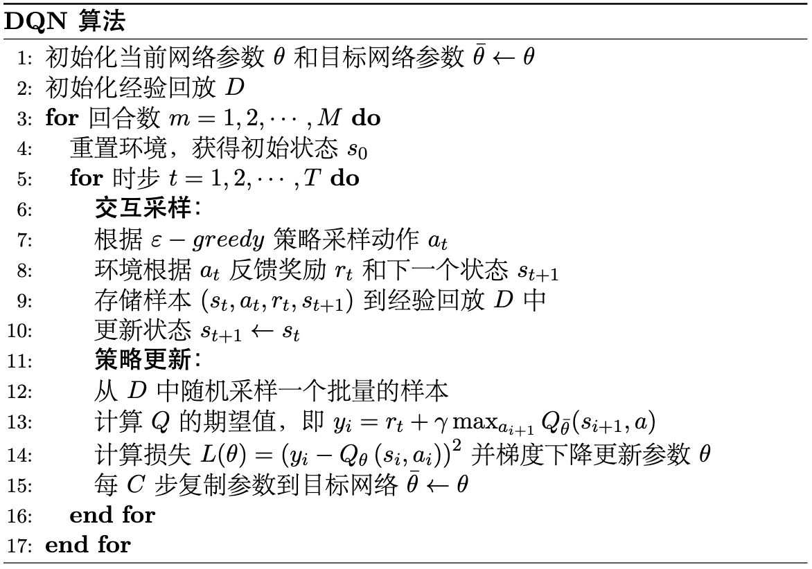

# DQN 算法实战

请读者再次注意，本书中所有的实战仅提供核心内容的代码以及说明，完整的代码请读者参考本书对应的 $\text{GitHub}$ 仓库。并且正如所有代码实战那样，读者须养成先写出伪代码再编程的习惯，这样更有助于提高对算法的理解。

## 算法流程

如图 1 所示，$\text{DQN}$ 算法的完整流程包括初始化网络和经验回放池、与环境交互采样、存储样本到经验回放池、从经验回放池中随机采样小批量样本、计算目标 $Q$ 值和损失函数、更新网络参数以及定期更新目标网络参数等步骤。

<div align=center>

</div>
<div align=center>图 1 $\text{DQN}$ 算法流程</div>


## 定义模型

首先是定义模型，就是定义两个神经网路，即当前网络和目标网络，由于这两个网络结构相同，这里我们只用一个 $\text{Python}$ 类来定义，如代码清单 $\text{7-1}$ 所示。

<div style="text-align: center;">
    <figcaption> 代码清单 $\text{7-1}$ 定义一个全连接网络</figcaption>
</div>

```python
class MLP(nn.Module): # 所有网络必须继承 nn.Module 类，这是 PyTorch 的特性
    def __init__(self, input_dim,output_dim,hidden_dim=128):
        super(MLP, self).__init__() 
        # 定义网络的层，这里都是线性层
        self.fc1 = nn.Linear(input_dim, hidden_dim) # 输入层
        self.fc2 = nn.Linear(hidden_dim,hidden_dim) # 隐藏层
        self.fc3 = nn.Linear(hidden_dim, output_dim) # 输出层
        
    def forward(self, x):
        # 各层对应的激活函数
        x = F.relu(self.fc1(x)) 
        x = F.relu(self.fc2(x))
        return self.fc3(x) # 输出层不需要激活函数
```

这里我们定义了一个三层的全连接网络，输入维度就是状态数，输出维度就是动作数，中间的隐藏层采用最常用的 $\text{ReLU}$ 激活函数。这里我们用 $\text{PyTorch}$ 的 $\text{Module}$ 类来定义网络，这是 $\text{PyTorch}$ 的特性，所有网络都必须继承这个类。在 $\text{PyTorch}$ 中，我们只需要定义网络的前向传播，即 $\text{forward}$ 函数，反向传播的过程 $\text{PyTorch}$ 会自动完成，这也是 $\text{PyTorch}$ 的特性。注意，由于我们在本次实战中要解决的问题并不复杂，因此定义的网络模型也比较简单，读者可以根据自己的需求定义更复杂的网络结构，例如增加网络的层数和隐藏层的维度等。

## 经验回放

经验回放的功能比较简单，主要实现缓存样本和取出样本等两个功能，如代码清单 $\text{7-2}$ 所示。

<div style="text-align: center;">
    <figcaption> 代码清单 $\text{7-2}$ 定义经验回放</figcaption>
</div>

```python
class ReplayBuffer:
    def __init__(self, capacity):
        self.capacity = capacity # 经验回放的容量
        self.buffer = [] # 用列表存放样本
        self.position = 0 # 样本下标，便于覆盖旧样本
    
    def push(self, state, action, reward, next_state, done):
        ''' 缓存样本
        '''
        if len(self.buffer) < self.capacity: # 如果样本数小于容量
            self.buffer.append(None)
        self.buffer[self.position] = (state, action, reward, next_state, done)
        self.position = (self.position + 1) % self.capacity 
    
    def sample(self, batch_size):
        ''' 取出样本，即采样
        '''
        batch = random.sample(self.buffer, batch_size) # 随机采出小批量转移
        state, action, reward, next_state, done =  zip(*batch) # 解压成状态，动作等
        return state, action, reward, next_state, done
    
    def __len__(self):
        ''' 返回当前样本数
        '''
        return len(self.buffer)
```

当然，经验回放的实现方式其实有很多，这里只是一个参考。在 $\text{JoyRL}$ 中，我们也提供了一个使用 $\text{Python}$ 队列实现的经验回放，读者可以参考相关源码。

## 定义智能体

智能体即策略的载体，因此有的时候也会称为策略。智能体的主要功能就是根据当前状态输出动作和更新策略，分别跟伪代码中的交互采样和模型更新过程相对应。我们会把所有的模块比如网络模型等都封装到智能体中，这样更符合伪代码的逻辑。而在 $\text{JoyRL}$ 线上代码中，会有更泛用的代码架构，感兴趣的读者可以参考相关源码。

如代码清单 $\text{7-3}$ 所示，两个网络就是前面所定义的全连接网络，输入为状态维度，输出则是动作维度。这里我们还定义了一个优化器，用来更新网络参数。在 $\text{DQN}$ 算法中采样动作和预测动作跟 $\text{Q-learning}$ 是一样的，其中采样动作使用的是 $\varepsilon-\text{greedy}$ 策略，便于在训练过程中探索，而测试只需要检验模型的性能，因此不需要探索，只需要单纯的进行 $\text{argmax}$ 预测即可，即选择最大值对应的动作。

<div style="text-align: center;">
    <figcaption> 代码清单 $\text{7-3}$ 定义智能体</figcaption>
</div>

```python
class Agent:
    def __init__(self):
        # 定义当前网络
        self.policy_net = MLP(state_dim,action_dim).to(device) 
        # 定义目标网络
        self.target_net = MLP(state_dim,action_dim).to(device)
        # 将当前网络参数复制到目标网络中
        self.target_net.load_state_dict(self.policy_net.state_dict())
        # 定义优化器
        self.optimizer = optim.Adam(self.policy_net.parameters(), lr=learning_rate) 
        # 经验回放
        self.memory = ReplayBuffer(buffer_size)
        self.sample_count = 0  # 记录采样步数
    def sample_action(self,state):
        ''' 采样动作，主要用于训练
        '''
        self.sample_count += 1
        # epsilon 随着采样步数衰减
        self.epsilon = self.epsilon_end + (self.epsilon_start - self.epsilon_end) * math.exp(-1. * self.sample_count / self.epsilon_decay) 
        if random.random() > self.epsilon:
            with torch.no_grad(): # 不使用梯度
                state = torch.tensor(np.array(state), device=self.device, dtype=torch.float32).unsqueeze(dim=0)
                q_values = self.policy_net(state)
                action = q_values.max(1)[1].item() # choose action corresponding to the maximum q value
        else:
            action = random.randrange(self.action_dim)
    def predict_action(self,state):
        ''' 预测动作，主要用于测试
        '''
        with torch.no_grad():
            state = torch.tensor(np.array(state), device=self.device, dtype=torch.float32).unsqueeze(dim=0)
            q_values = self.policy_net(state)
            action = q_values.max(1)[1].item() # choose action corresponding to the maximum q value
        return action
    def update(self):
        pass
```

$\text{DQN}$ 算法更新本质上跟 $\text{Q-learning}$ 区别不大，但由于读者可能第一次接触深度学习的实现方式，这里单独拎出来分析 $\text{DQN}$ 算法的更新方式，如代码清单 $\text{7-4}$ 所示。

<div style="text-align: center;">
    <figcaption> 代码清单 $\text{7-4}$ $\text{DQN}$ 算法更新</figcaption>
</div>

```python
def update(self, share_agent=None):
    # 当经验回放中样本数小于更新的批大小时，不更新算法
    if len(self.memory) < self.batch_size: # when transitions in memory donot meet a batch, not update
        return
    # 从经验回放中采样
    state_batch, action_batch, reward_batch, next_state_batch, done_batch = self.memory.sample(
        self.batch_size)
    # 转换成张量（便于GPU计算）
    state_batch = torch.tensor(np.array(state_batch), device=self.device, dtype=torch.float) 
    action_batch = torch.tensor(action_batch, device=self.device).unsqueeze(1) 
    reward_batch = torch.tensor(reward_batch, device=self.device, dtype=torch.float).unsqueeze(1) 
    next_state_batch = torch.tensor(np.array(next_state_batch), device=self.device, dtype=torch.float) 
    done_batch = torch.tensor(np.float32(done_batch), device=self.device).unsqueeze(1) 
    # 计算 Q 的实际值
    q_value_batch = self.policy_net(state_batch).gather(dim=1, index=action_batch) # shape(batchsize,1),requires_grad=True
    # 计算 Q 的估计值，即 r+\gamma Q_max
    next_max_q_value_batch = self.target_net(next_state_batch).max(1)[0].detach().unsqueeze(1) 
    expected_q_value_batch = reward_batch + self.gamma * next_max_q_value_batch* (1-done_batch)
    # 计算损失
    loss = nn.MSELoss()(q_value_batch, expected_q_value_batch)  
    # 梯度清零，避免在下一次反向传播时重复累加梯度而出现错误。
    self.optimizer.zero_grad()  
    # 反向传播
    loss.backward()
    # clip避免梯度爆炸
    for param in self.policy_net.parameters():  
        param.grad.data.clamp_(-1, 1)
    # 更新优化器
    self.optimizer.step() 
    # 每C(target_update)步更新目标网络
    if self.sample_count % self.target_update == 0: 
        self.target_net.load_state_dict(self.policy_net.state_dict())   
```

首先由于我们是小批量随机梯度下降，所以当经验回放不满足批大小时选择不更新，这实际上是工程性问题。然后在更新时我们取出样本，并转换成 $\text{Torch}$ 的张量，便于我们用 $\text{GPU}$ 计算。接着计算 $Q$ 值的估计值和实际值，并得到损失函数。在得到损失函数并更新参数时，我们在代码上会有一个固定的写法，即梯度清零，反向传播和更新优化器的过程，跟在深度学习中的写法是一样的，最后我们需要定期更新一下目标网络，即每隔 $\text{C}$ 步复制参数到目标网络。

## 定义环境

由于我们在 $\text{Q-learning}$ 算法中已经讲过怎么定义训练和测试过程了，所有强化学习算法的训练过程基本上都是通用的，因此我们在这里及之后的章节中不再赘述。但由于我们在 $\text{DQN}$ 算法中使用了跟 $\text{Q-learning}$ 算法 中不一样的环境，但都是 $\text{OpenAI Gym}$ 平台的，所以我们简单介绍一下该环境。环境名称叫做 $\text{Cart Pole}$ <sup>①</sup> ，中文译为推车杆游戏。如图 $\text{7-5}$ 所示，我们的目标是持续左右推动保持倒立的杆一直不倒。

<div align=center>

</div>
<div align=center>图 $\text{7-5}$ $\text{Cart-Pole}$ 游戏</div>

>① 官网环境介绍：https://gymnasium.farama.org/environments/classic_control/cart_pole/

环境的状态数是 $4$, 动作数是 $2$。有读者可能会奇怪，这不是比 $\text{Q-learning}$ 算法中的 `CliffWalking-v0` 环境（状态数是 $48$, 动作数是 $2$）更简单吗，应该直接用 $\text{Q-learning}$ 算法就能解决？实际上是不能的，因为 `Cart Pole` 的状态包括推车的位置（范围是 $-4.8$ 到 $4.8$ ）、速度（范围是负无穷大到正无穷大）、杆的角度（范围是 $-24$ 度 到 $24$ 度）和角速度（范围是负无穷大到正无穷大）,这几个状态都是连续的值，也就是前面所说的连续状态空间，因此用 $\text{Q-learning}$ 算法是很难解出来的。

环境的奖励设置是每个时步下能维持杆不到就给一个 $+1$ 的奖励，因此理论上在最优策略下这个环境是没有终止状态的，因为最优策略下可以一直保持杆不倒。回忆前面讲到基于 $\text{TD}$ 的算法都必须要求环境有一个终止状态，所以在这里我们可以设置一个环境的最大步数，比如我们认为如果能在两百个时步以内坚持杆不到就近似说明学到了一个不错的策略。

## 设置参数

定义好智能体和环境之后就可以开始设置参数了，如代码清单 $\text{7-5}$ 所示。

<div style="text-align: center;">
    <figcaption> 代码清单 $\text{7-5}$ 参数设置</figcaption>
</div>

```python
self.epsilon_start = 0.95  # epsilon 起始值
self.epsilon_end = 0.01  # epsilon 终止值
self.epsilon_decay = 500  # epsilon 衰减率
self.gamma = 0.95  # 折扣因子
self.lr = 0.0001  # 学习率
self.buffer_size = 100000  # 经验回放容量
self.batch_size = 64  # 批大小
self.target_update = 4  # 目标网络更新频率
```

与 $\text{Q-learning}$ 算法相比，除了 $varepsilon$, 折扣因子以及学习率之外多了三个超参数，即经验回放的容量、批大小和目标网络更新频率。注意这里学习率在更复杂的环境中一般会设置得比较小，经验回放的容量是一个比较经验性的参数，根据实际情况适当调大即可，不需要额外花太多时间调。批大小也比较固定，一般都在 $64$，$128$，$256$，$512$ 中间取值，目标网络更新频率会影响智能体学得快慢，但一般不会导致学不出来。总之，DQN 算法相对来说是深度强化学习的一个稳定且基础的算法，只要适当调整学习率都能让智能体学出一定的策略。

最后展示一下我们的训练曲线和测试曲线，分别如图 $\text{7-6}$ 和 $\text{7-7}$ 所示。

<div align=center>

</div>
<div align=center>图 $\text{7-6}$ $\text{CartPole-v1}$ 环境 $\text{DQN}$ 算法训练曲线</div>

<div align=center>

</div>
<div align=center>图 $\text{7-7}$ $\text{CartPole-v1}$ 环境 $\text{DQN}$ 算法测试曲线</div>

其中我们该环境每回合的最大步数是 $200$，对应的最大奖励也为 $200$，从图中可以看出，智能体确实学到了一个最优的策略，即达到收敛。