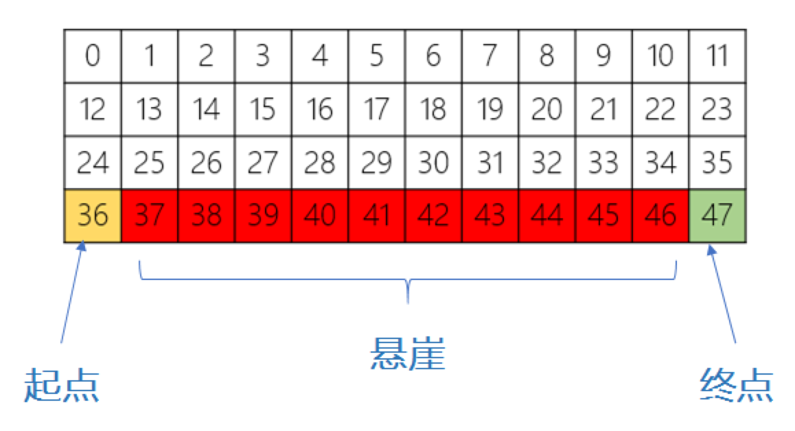
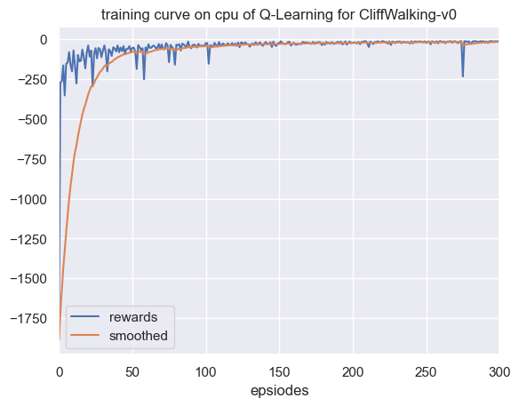
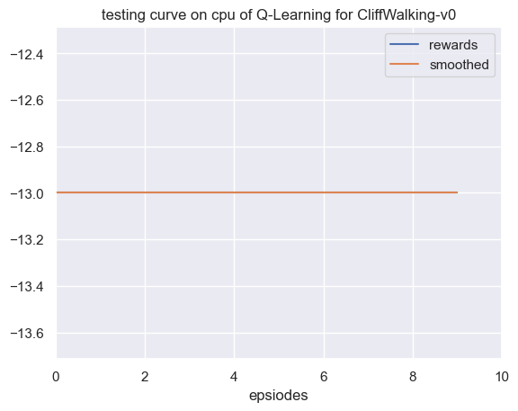
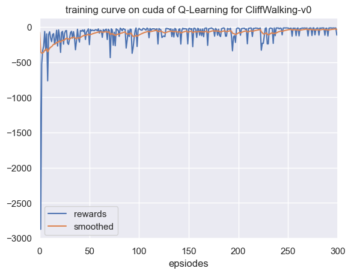
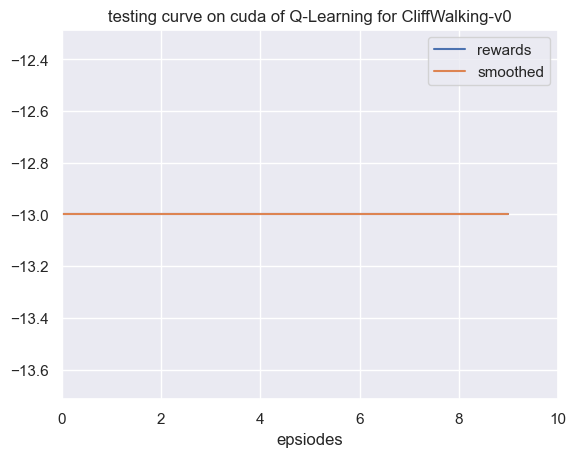

## Q-learning 算法实战

本节开始我们的第一个算法实战，由于是第一个实战，所以会讲得偏详细一些，后面的算法实战部分可能会讲得越来越粗，如果读者们有不明白的地方，欢迎随时交流讨论。实战的思路会跟理论学习有所区别，并且因人而异，因此读者们在学习实战的时候做个参考即可，最重要的是有自己的想法。

此外，笔者认为**对于实战来说最重要的一点就是写好伪代码**。如果说理论部分是数学语言，实战部分就是编程语言，而伪代码则是从数学语言到编程语言之间的一个过渡，这也是笔者为什么在讲解每个算法的时候尽可能贴出伪代码的原因。在每个算法实战的内容中，笔者基本会按照定义算法，定义训练，定义环境，设置参数以及开始训练等步骤为读者们展开，这是笔者个人的编程习惯。由于这次我们是第一次讲到实战，所以会先讲一下定义训练，因为其中涉及到一个所有强化学习通用的训练模式。

### 5.4.1 定义训练

回顾一下伪代码的第二行到最后一行，我们会发现一个强化学习训练的通用模式，首先我们会迭代很多个（$M$）回合，在每回合中，首先重置环境回到初始化的状态，智能体根据状态选择动作，然后环境反馈中下一个状态和对应的奖励，同时智能体会更新策略，直到回合结束。这其实就是马尔可夫决策过程中智能体与环境互动的过程，写成一段通用的代码如下：

```python
for i_ep in range(train_eps): # 遍历每个回合
    # 重置环境，获取初始状态
    state = env.reset()  # 重置环境,即开始新的回合
    while True: # 对于比较复杂的游戏可以设置每回合最大的步长，例如while ep_step<100，即最大步长为100。
        # 智能体根据策略采样动作
        action = agent.sample_action(state)  # 根据算法采样一个动作
        # 与环境进行一次交互，得到下一个状态和奖励
        next_state, reward, terminated, _ = env.step(action)  # 智能体将样本记录到经验池中
        agent.memory.push(state, action, reward, next_state, terminated) 
        # 智能体更新策略
        agent.update(state, action, reward, next_state, terminated)  
        # 更新状态
        state = next_state  
        # 如果终止则本回合结束
        if terminated:
            break
```

### 5.4.2 定义算法

强化学习中有几个要素，智能体、环境、经验池（经验回放），在实践中也需要逐一定义这些要素。我们一般首先定义智能体，或者说算法，在 $\text{Python}$ 中一般定义为类即可。再考虑一下智能体在强化学习中主要负责哪些工作。

#### 5.4.2.1 采样动作

首先在训练中我需要采样动作与环境交互，于是我们可以定义一个类方法，命名为 `sample_action` ，如下：

```python
class Agent:
    def __init__():
        pass
    def sample_action(self, state):
        ''' 采样动作，训练时用
        '''
        self.sample_count += 1
        # epsilon是会递减的，这里选择指数递减
        self.epsilon = self.epsilon_end + (self.epsilon_start - self.epsilon_end) * math.exp(- self.sample_count / self.epsilon_decay) 
        # e-greedy 策略
        if np.random.uniform(0, 1) > self.epsilon:
            action = np.argmax(self.Q_table[str(state)]) # 选择Q(s,a)最大对应的动作
        else:
            action = np.random.choice(self.n_actions) # 随机选择动作
        return action     
```

在这里我们用了 $\varepsilon-greedy$ 策略，其中 $\varepsilon$ 会随着采样的步数指数衰减，感兴趣的读者也可以直接设置固定的 $\varepsilon=0.1$ 试试。
在 $\text{Q-learning}$ 算法中还有一个重要的元素，即 $Q$ 表，$Q$ 表的作用是输入状态和动作，输出一个即可，这样一来我们可以用一个二维的数组来表示，比如 `Q_table[0][1] = 0.1`可以表示 $Q(s_0,a_1)=0.1$ （注意 $\text{Python}$ 中下标是从 $\text{0}$ 开始）。而在我们的示例代码中用了一个默认字典来表示，如下：

```python
self.Q_table  = defaultdict(lambda: np.zeros(n_actions))
```

这样的好处是从数据结构上来说，默认字典是哈希表结构，二维数组是线性表结构，从哈希表拿出数据的速度会比线性表快。

#### 5.4.2.2 预测动作

此外对于每个智能体在训练中和在测试中采取动作的方式一般是不一样的，因为在训练中需要增加额外的探索策略，而在测试中只需要输出 $Q$ 值对应最大的动作即可，如下：

```python
class Agent:
    def __init__():
        pass
    def predict_action(self,state):
        ''' 预测或选择动作，测试时用
        '''
        action = np.argmax(self.Q_table[str(state)])
        return action
```

#### 5.4.2.3 更新方法

所有强化学习算法的采样动作和预测动作方式几乎是比较固定的，对于每个智能体来说最核心的还是更新网络的方式，在 $\text{Q-learning}$ 算法中的更新方式较为简单，而且不需要经验回放（具体会在 $\text{DQN}$ 算法中展开），如下：

```python
def update(self, state, action, reward, next_state, terminated):
    Q_predict = self.Q_table[str(state)][action] 
    if terminated: # 终止状态
        Q_target = reward  
    else:
        Q_target = reward + self.gamma * np.max(self.Q_table[str(next_state)]) 
    self.Q_table[str(state)][action] += self.lr * (Q_target - Q_predict)
```

其中 `self.lr` 就是更新公式中的 $alpha$（学习率），到这里我们就定义好了智能体，完整的内容可参考附书代码。

### 5.4.3 定义环境

在本节中我们选择了一个叫做 $\text{CliffWalking-v0}$ 的环境（中文名叫 “悬崖寻路” ），跟前面动态规划章节中举的机器人最短路径是类似的，只是要更加复杂一些。

如图 $\text{5.5}$ 所示，整个环境中共有 $\text{48}$ 个网格，其中黄色网格（标号为 $\text{36}$ ）为起点，绿色网格（标号为 $\text{47}$ ）为终点，红色的网格表示悬崖，智能体的目标是以最短的路径从起点到终点，并且避开悬崖。由于这个环境比较简单，我们一眼就能看出来最优的策略应当是从起点向上沿着 $\text{24}$ 号网格直线走到 $\text{35}$ 号网格最后到达终点，后面我们看看强化学习智能体能不能学出来。

<div align=center>

</div>
<div align=center>图 $\text{5.5}$ $\text{CliffWalking-v0}$ 环境示意图</div>

此外，我们做强化学习算法的时候更重要的还是要对环境本身的状态、动作和奖励了解，以便指导我们优化算法。在这个环境中，状态比较简单，就是当前智能体所处的网格位置或者说编号，动作就是上右下左（分别是 $0,1,2,3$ ，顺序可能有点奇怪，但官方环境是这么设置的），奖励的话分几种情况，一个是每走一个白色网格（包括起点）是会给一个 $-1$ 的奖励，到达终点的时候得到的奖励为 $0$，走到边沿、悬崖或者终点的时候本回合游戏结束，这些设置在官方源码中都能找到<sup>①</sup>。这里之所以每走一个网格会给一个负的奖励，是因为我们的目标是最短路径，换句话说每走一步都是有代价的，所以需要设置一个负的奖励或者说惩罚，设置正的奖励会容易误导智能体在训练过程中一直走网格，设置 $0$ 的话也是一样的，会让智能体找不到目标。奖励就相当于我们给智能体设置的目标，因此如何合理地设置奖励其实也是一项复杂的工程，具体后面我们会再展开。

> ① CliffWalking-v0 源码链接：https://github.com/openai/gym/blob/master/gym/envs/toy_text/cliffwalking.py


我们选择的环境是 $\text{OpenAI Gym}$ 开发的，它提供了一套标准化的环境，包括经典的控制理论问题和游戏，代码封装得也比较好，只需要一行代码就能定义好环境，如下：

```python
env = gym.make('CliffWalking-v0')  
```

当然大多数情况下需要根据需求建立我们自己的环境，这时我们也可以仿照 $\text{Gym}$ 的模式来做，具体教程会在后面的章节中单独讲到。

在 $\text{Gym}$ 中我们可以通过以下方式获取环境的状态数和动作数：

```python
n_states = env.observation_space.n # 状态数
n_actions = env.action_space.n # 动作数
print(f"状态数：{n_states}， 动作数：{n_actions}")
```

打印的结果如下：

```bash
状态数：48， 动作数：4
```

符合我们前面的分析结果。

### 5.4.4 设置参数

智能体、环境和训练的代码都写好之后，就是设置参数了，由于 $\text{Q-learning}$ 算法的超参数（需要人工调整的参数）比较少，其中 $\gamma$ （折扣因子）比较固定，设置在 $0.9$ 到 $0.999$ 之间，一般设置成 $0.99$ 即可。而学习率 $alpha$ 在本章节中设置的比较大，为 $0.1$，实际更复杂的环境和算法中学习率是小于 $0.01$，因为太大很容易发生过拟和的问题，只是本节的环境和算法都比较简单，为了收敛得更快点所以设置得比较大。此外由于我们探索策略中的 $\varepsilon$ 是会随着采样步数衰减的，在实践过程中既不能让它衰减得太快也不能让它衰减得太慢，因此需要合理设置如下参数：

```python
self.epsilon_start = 0.95 #  e-greedy策略中epsilon的初始值
self.epsilon_end = 0.01 #  e-greedy策略中epsilon的最终值
self.epsilon_decay = 200 #  e-greedy策略中epsilon的衰减率
```

### 5.4.5 开始训练

准备工作做好之后，就可以开始训练了，得到的训练曲线如图 $\text{5.6}$ 所示，曲线横坐标表示回合数（$\text{episode}$），纵坐标表示每回合获得的总奖励，可以看出曲线其实从大约 $\text{50}$ 个回合的时候就开始收敛了，也就是我们的智能体学到了一个最优策略。

<div align=center>

</div>
<div align=center>图 $\text{5.6}$ $\text{CliffWalking-v0}$ 环境 $\text{Q-learning}$ 算法训练曲线</div>

在训练过程中我们打印出每回合的奖励，总共训练了 $300$ 个回合，结果如下：

```bash
...
回合：200/300，奖励：-22.0，Epsilon：0.010
回合：220/300，奖励：-20.0，Epsilon：0.010
回合：240/300，奖励：-15.0，Epsilon：0.010
回合：260/300，奖励：-20.0，Epsilon：0.010
回合：280/300，奖励：-13.0，Epsilon：0.010
回合：300/300，奖励：-13.0，Epsilon：0.010
```
我们发现收敛值约在 $-13$ 左右波动，波动的原因是因为此时还存在 $0.01$ 的概率做随机探索。

为了确保我们训练出来的策略是有效的，可以拿训好的策略去测试，测试的过程跟训练的过程差别不大，其一是智能体在测试的时候直接用模型预测的动作输出就行，即在训练中是采样动作（带探索），测试中就是预测动作，其二是训练过程中不需要更新策略，因为已经收敛了。

如图 $\text{5.7}$ 所示，我们测试了 $10$ 个回合，发现每回合获得的奖励都是 $-13$ 左右，说明我们学到的策略是比较稳定的。

<div align=center>

</div>
<div align=center>图 $\text{5.7}$ $\text{CliffWalking-v0}$ 环境 $\text{Q-learning}$ 算法测试曲线</div>


### 5.4.6 结果分析

那么问题来了,为什么学到的策略每回合的奖励是 $-13$ 呢？回顾一下我们在前面介绍环境的时候讲到，我们一眼就能看出来最优的策略应当是从起点向上沿着 $24$ 号网格直线走到 $35$ 号网格最后到达终点，而这中间要走多少个网格呢？读者们可以数一下，不包括终点（走到终点得到的奖励是 $0$）的话正好就是 $13$ 步，每一步会得到 $-1$ 的奖励，总共加起来正好也是 $-13$ ，这说明智能体学到的策略很有可能就是最优的。具体我们还需要把智能体在测试的时候每回合每步的动作打印出来验证一下，打印结果如下：

```bash
测试的动作列表：[0, 1, 1, 1, 1, 1, 1, 1, 1, 1, 1, 1, 2]
```

可以看到智能体学到的策略是先往上（即动作 $0$），然后一直往右（即动作 $1$）走十二格，最后再往下（即动作 $2$），这其实就是我们肉眼就能看出来的最优策略！


### 5.4.7 消融实验

为了进一步探究 $\varepsilon$ 是随着采样步数衰减更好些，还是恒定不变更好，我们做了一个消融（ $\text{Ablation}$ ）实验，即将 $\varepsilon$ 设置为恒定的 $0.1$，如下：

```python
# 将初始值和最终值设置为一样，这样 epsilon 就不会衰减
self.epsilon_start = 0.1 #  e-greedy策略中epsilon的初始值
self.epsilon_end = 0.1 #  e-greedy策略中epsilon的最终值
self.epsilon_decay = 200 #  e-greedy策略中epsilon的衰减率
```

然后重新训练和测试，得到的训练曲线如图 $\text{5.8}$ 所示：

<div align=center>

</div>
<div align=center>图 $\text{5.8}$ $\text{Q-learning}$ 算法消融实验训练曲线 </div>

测试曲线如图 $\text{5.9}$ 所示：

<div align=center>

</div>
<div align=center>图 $\text{5.9}$ $\text{Q-learning}$ 算法消融实验训练曲线 </div>

不难发现，虽然最后也能收敛，但是相对来说没有那么稳定，在更复杂的环境中 $\varepsilon$ 随着采样步数衰减的好处会体现得更加明显。