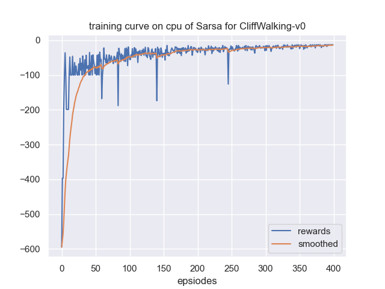
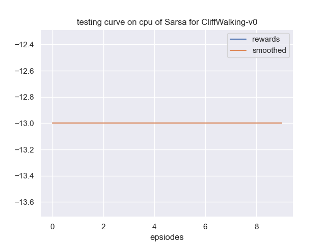

## 实战：Sarsa 算法

$\qquad$ 由于 $\text{Sarsa}$ 算法与 $\text{Q-learning}$ 算法在实现上区别很小，感兴趣的读者可以直接阅读 $\text{JoyRL}$ 上的代码。

$\qquad$ 在相同环境和参数设置下，得到的实验结果如图 $\text{5.10}$ 所示：

图 $\text{5.10}$ $\text{Sarsa}$ 算法训练曲线 

$\qquad$ 测试曲线如图 $\text{5.11}$ 所示：

图 $\text{5.11}$ $\text{Sarsa}$ 算法测试曲线 

$\qquad$ 我们发现相比于 $\text{Q-learning}$ 算法的 $300$ 回合收敛，$\text{Sarsa}$ 算法需要额外的 $100$ 个回合收敛，但是收敛之后会更稳定，没有一些波动过大的值。